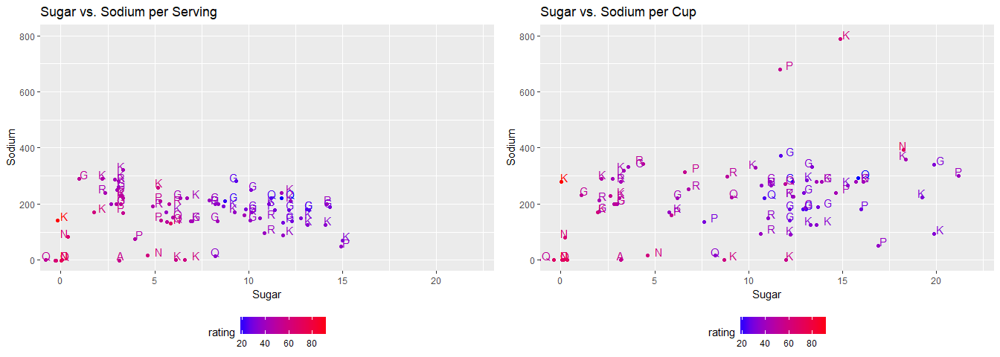

If you like to eat cereal and pay attention to the nutrition facts, you probably already have been misled. Manufacturers measure cereal nutrition by serving. However, most people in real life measure cereal by volume, for example, by cup. A serving can mean different volume or weight depending on manufacturers and the type of cereal. They are not directly compariable. This makes nutrition facts on cereal boxes hard to understand, and ever misleading. This analysis compares cereal nutrition measured by serving and by cup, and attempt to work out a meaningful way to compare difference cereal nutrition.


```r
library(RCurl)
library(ggplot2)
library(gridExtra)
library(formattable)
```

## Context Notation

**mfr: Manufacturer of cereal**

A = American Home Food Products

G = General Mills

K = Kelloggs

N = Nabisco

P = Post

Q = Quaker Oats

R = Ralston Purina


**type:**

C = Cold

H = Hot

For full notation, see https://www.kaggle.com/crawford/80-cereals

## Loading data


```r
url <- getURL('https://raw.githubusercontent.com/frankwwu/R-Knots/master/80%20Cereals/cereal.csv')
cereals <- read.csv(text = url) 
```

## Display data columns and data types


```r
strings <- cereals[1, ]
head(strings)
```

```
##     name         mfr        type calories protein fat sodium fiber carbo
## 1 String Categorical Categorical      Int     Int Int    Int Float Float
##   sugars potass vitamins shelf weight  cups rating
## 1    Int    Int      Int   Int  Float Float  Float
```

```r
cereals = cereals[-1,]
head(cereals)
```

```
##                        name mfr type calories protein fat sodium fiber
## 2                 100% Bran   N    C       70       4   1    130    10
## 3         100% Natural Bran   Q    C      120       3   5     15     2
## 4                  All-Bran   K    C       70       4   1    260     9
## 5 All-Bran with Extra Fiber   K    C       50       4   0    140    14
## 6            Almond Delight   R    C      110       2   2    200     1
## 7   Apple Cinnamon Cheerios   G    C      110       2   2    180   1.5
##   carbo sugars potass vitamins shelf weight cups    rating
## 2     5      6    280       25     3      1 0.33 68.402973
## 3     8      8    135        0     3      1    1 33.983679
## 4     7      5    320       25     3      1 0.33 59.425505
## 5     8      0    330       25     3      1  0.5 93.704912
## 6    14      8     -1       25     3      1 0.75 34.384843
## 7  10.5     10     70       25     1      1 0.75 29.509541
```

## How do manufacturers measure nutrition?

In 7 cereal manufacturers, a serving can mean 7 different weight, or 12 different cups. What a mess! Comparing nutrition by serving alone is pointless!


```r
mfr <- unique(cereals$mfr)
print(paste(length(mfr), 'manufacturers'))
```

```
## [1] "7 manufacturers"
```

```r
print(mfr)
```

```
## [1] N Q K R G P A
## Levels: A Categorical G K N P Q R
```

```r
weight <- unique(cereals$weight)
print(paste(length(weight), 'weight'))
```

```
## [1] "7 weight"
```

```r
print(weight)
```

```
## [1] 1    1.33 1.25 1.3  1.5  0.5  0.83
## Levels: 0.5 0.83 1 1.25 1.3 1.33 1.5 Float
```

```r
cups <- unique(cereals$cups)
print(paste(length(cups), 'cups'))
```

```
## [1] "12 cups"
```

```r
print(cups)
```

```
##  [1] 0.33 1    0.5  0.75 0.67 1.25 0.8  0.88 0.25 1.33 1.5  1.13
## Levels: 0.25 0.33 0.5 0.67 0.75 0.8 0.88 1 1.13 1.25 1.33 1.5 Float
```

## Measure nutrition by serving

Manufacturers like to measure nutrition with serving. Every manufacturer chaotically defines the serving with different weights and cups. Thus, for consumers, comparing nutrition measured with different serving is very confusing in practice. Imagine you are comparing nutrition facts of different cereals in a grocery store and they are measured with different serving, you definitely need a calculator and a piece of paper.


```r
cereals$calories <- as.integer(as.character(cereals$calories))
cereals$protein <- as.integer(as.character(cereals$protein))
cereals$fat <- as.integer(as.character(cereals$fat))
cereals$sodium <- as.integer(as.character(cereals$sodium))
cereals$fiber <- as.numeric(as.character(cereals$fiber))
cereals$carbo <- as.numeric(as.character(cereals$carbo))
cereals$sugars <- as.integer(as.character(cereals$sugars))
cereals$potass <- as.integer(as.character(cereals$potass))
cereals$vitamins <- as.integer(as.character(cereals$vitamins))
cereals$shelf <- as.integer(as.character(cereals$shelf))
cereals$weight <- as.numeric(as.character(cereals$weight))
cereals$cups <- as.numeric(as.character(cereals$cups))
cereals$rating <- as.numeric(as.character(cereals$rating))
```


```r
ggplot() + 
  geom_point(cereals, mapping=aes(x=mfr, y=weight, color=mfr, size=3)) +
  labs(x="Manufacturer", y="Ounce") +
  ggtitle("Manufacturers use Different Weights for One Serving")
```

<!-- -->


```r
ggplot() + 
  geom_point(cereals, mapping=aes(x=mfr, y=cups, color=mfr, size=3)) +
  labs(x="Manufacturer", y="Cup") +
  ggtitle("Manufacturers use Different Cups for One Serving")
```

<!-- -->

What the heck does "serving" mean?

## Measure nutrition by cup

Let's prepare the data to compare some nutrition per serving and per cup.

Convert nutrition to per cup.


```r
# Normalize with cup
cereals.cup <- data.frame( 
  name = cereals$name,
  mfr = cereals$mfr,
  type = cereals$type,
  calories= round(as.numeric(cereals$calories) / as.numeric(cereals$cups)),
  protein= round(as.numeric(cereals$protein) / as.numeric(cereals$cups)),
  fat= round(as.numeric(cereals$fat) / as.numeric(cereals$cups)),
  sodium = round(as.numeric(cereals$sodium) / as.numeric(cereals$cups)),
  fiber = round(as.numeric(cereals$fiber) / as.numeric(cereals$cups)),
  carbo = round(as.numeric(cereals$carbo) / as.numeric(cereals$cups)),
  sugars = round(as.numeric(cereals$sugars) / as.numeric(cereals$cups)),
  potass = round(as.numeric(cereals$potass) / as.numeric(cereals$cups)),
  vitamins = round(as.numeric(cereals$vitamins) / as.numeric(cereals$cups)),
  shelf = round(as.numeric(cereals$shelf) / as.numeric(cereals$cups)),
  weight = as.numeric(cereals$weight) / as.numeric(cereals$cups),
  rating = cereals$rating)
```

Comparing nutrition per serving and per cup.


```r
plot_protein_fiber <- function(cereals, xlim, ylim, title){
  ggplot() + 
    geom_point(cereals, mapping=aes(x=protein, y=fiber, color=mfr, size=fat, shape=type)) +
    coord_cartesian(xlim=xlim, ylim=ylim) +
    labs(x="Protein", y="Fiber") +
    ggtitle(title) +
    theme(legend.position="bottom")
}

plot1 <- plot_protein_fiber(cereals, c(0, 12), c(0, 30), "Protein vs. Fiber vs. Types per Serving")
plot2 <- plot_protein_fiber(cereals.cup, c(0, 12), c(0, 30), "Protein vs. Fiber vs. Types per Cup")
grid.arrange(plot1, plot2, ncol=2)
```

<!-- -->

Calories per serving and per cup are obviously different.


```r
cat("Range of calories per weight:", min(cereals$calories, na.rm = TRUE), "-", max(cereals$calories, na.rm = TRUE), "\n")
```

```
## Range of calories per weight: 50 - 160
```

```r
cat("Range of calories per cup:", min(cereals.cup$calories, na.rm = TRUE), "-", max(cereals.cup$calories, na.rm = TRUE), "\n")
```

```
## Range of calories per cup: 50 - 440
```

Sugar and calories per serving and per cup are very different.


```r
plot_sugars_calories <- function(cereals, xlim, ylim, title){
  ggplot(data=cereals, aes(x=sugars, y=calories, col=rating)) +
    geom_jitter() +
    geom_text(aes(label=mfr),hjust=0, vjust=0) +
    labs(x="Sugar", y="Calories") +
    coord_cartesian(xlim=xlim, ylim=ylim) +
    geom_smooth(method="lm", se=FALSE, col="grey") +
    scale_color_gradient(low="blue", high="red") +
    ggtitle(title) +
    theme(legend.position="bottom")
}

plot1 <- plot_sugars_calories(cereals, c(0, 22), c(0, 450), "Sugar vs. Calories per Serving")
plot2 <- plot_sugars_calories(cereals.cup, c(0, 22), c(0, 450), "Sugar vs. Calories per Cup")
grid.arrange(plot1, plot2, ncol=2)
```

<!-- -->

Sugar and sodium per serving and per cup are also different.


```r
plot_sugars_sodium <- function(cereals, xlim, ylim, title){
  ggplot(data=cereals, aes(x=sugars, y=sodium, col=rating)) +
    geom_jitter() +
    geom_text(aes(label=mfr),hjust=0, vjust=0) +
    labs(x="Sugar", y="Sodium") +
    coord_cartesian(xlim=xlim, ylim=ylim) +
    scale_color_gradient(low="blue", high="red") +
    ggtitle(title) +
    theme(legend.position="bottom")
}

plot1 <- plot_sugars_sodium(cereals, c(0, 22), c(0, 800), "Sugar vs. Sodium per Serving")
plot2 <- plot_sugars_sodium(cereals.cup, c(0, 22), c(0, 800), "Sugar vs. Sodium per Cup")
grid.arrange(plot1, plot2, ncol=2)
```

<!-- -->

## Combined nutrition

Let's combine good and bad nutrition, and examine the difference. For simplicity, no weight is applied to each component.


```r
cereals.per.serving <- data.frame( 
  name = cereals$name,
  mfr = cereals$mfr,
  good = cereals$protein + cereals$fiber + cereals$vitamins,
  bad = cereals$fat + cereals$sodium + cereals$potass + cereals$sugars,
  rating = cereals$rating
)

cereals.per.cup <- data.frame( 
  name = cereals.cup$name,
  mfr = cereals.cup$mfr,
  good = cereals.cup$protein + cereals.cup$fiber + cereals.cup$vitamins,
  bad = cereals.cup$fat + cereals.cup$sodium + cereals.cup$potass + cereals.cup$sugars,
  rating = cereals$rating
)
```


```r
plot_combined <- function(cereals, xlim, ylim, title){
  ggplot(data=cereals, aes(x=bad, y=good, col=rating)) +
    geom_jitter() +
    geom_text(aes(label=mfr),hjust=0, vjust=0) +
    labs(x="Bad (fat, sodium, potass, sugars)", y="Good (protein, fiber, vitamins)") +
    coord_cartesian(xlim=xlim, ylim=ylim) +
    scale_color_gradient(low="blue", high="red") +
    ggtitle(title) +
    theme(legend.position="bottom")
}

plot1 <- plot_combined(cereals.per.serving, c(0, 1300), c(0, 150), "Combined Nutrition per Serving")
plot2 <- plot_combined(cereals.per.cup, c(0, 1300), c(0, 150), "Combined Nutrition per Cup")
grid.arrange(plot1, plot2, ncol=2)
```

<!-- -->

## Ranking by combined good nutrition per cup (the higher, the better)


```r
formattable(cereals.per.cup[order(-cereals.per.cup$good),], list(
  good = color_bar("springgreen"),
  bad = color_bar("coral")))
```


<table class="table table-condensed">
 <thead>
  <tr>
   <th style="text-align:left;">   </th>
   <th style="text-align:right;"> name </th>
   <th style="text-align:right;"> mfr </th>
   <th style="text-align:right;"> good </th>
   <th style="text-align:right;"> bad </th>
   <th style="text-align:right;"> rating </th>
  </tr>
 </thead>
<tbody>
  <tr>
   <td style="text-align:left;"> 40 </td>
   <td style="text-align:right;"> Just Right Fruit & Nut </td>
   <td style="text-align:right;"> K </td>
   <td style="text-align:right;"> <span style="display: inline-block; direction: rtl; border-radius: 4px; padding-right: 2px; background-color: springgreen; width: 100.00%">140</span> </td>
   <td style="text-align:right;"> <span style="display: inline-block; direction: rtl; border-radius: 4px; padding-right: 2px; background-color: coral; width: 20.66%">367</span> </td>
   <td style="text-align:right;"> 36.47151 </td>
  </tr>
  <tr>
   <td style="text-align:left;"> 34 </td>
   <td style="text-align:right;"> Grape-Nuts </td>
   <td style="text-align:right;"> P </td>
   <td style="text-align:right;"> <span style="display: inline-block; direction: rtl; border-radius: 4px; padding-right: 2px; background-color: springgreen; width: 88.57%">124</span> </td>
   <td style="text-align:right;"> <span style="display: inline-block; direction: rtl; border-radius: 4px; padding-right: 2px; background-color: coral; width: 59.23%">1052</span> </td>
   <td style="text-align:right;"> 53.37101 </td>
  </tr>
  <tr>
   <td style="text-align:left;"> 1 </td>
   <td style="text-align:right;"> 100% Bran </td>
   <td style="text-align:right;"> N </td>
   <td style="text-align:right;"> <span style="display: inline-block; direction: rtl; border-radius: 4px; padding-right: 2px; background-color: springgreen; width: 84.29%">118</span> </td>
   <td style="text-align:right;"> <span style="display: inline-block; direction: rtl; border-radius: 4px; padding-right: 2px; background-color: coral; width: 71.11%">1263</span> </td>
   <td style="text-align:right;"> 68.40297 </td>
  </tr>
  <tr>
   <td style="text-align:left;"> 3 </td>
   <td style="text-align:right;"> All-Bran </td>
   <td style="text-align:right;"> K </td>
   <td style="text-align:right;"> <span style="display: inline-block; direction: rtl; border-radius: 4px; padding-right: 2px; background-color: springgreen; width: 82.14%">115</span> </td>
   <td style="text-align:right;"> <span style="display: inline-block; direction: rtl; border-radius: 4px; padding-right: 2px; background-color: coral; width: 100.00%">1776</span> </td>
   <td style="text-align:right;"> 59.42551 </td>
  </tr>
  <tr>
   <td style="text-align:left;"> 71 </td>
   <td style="text-align:right;"> Total Raisin Bran </td>
   <td style="text-align:right;"> G </td>
   <td style="text-align:right;"> <span style="display: inline-block; direction: rtl; border-radius: 4px; padding-right: 2px; background-color: springgreen; width: 76.43%">107</span> </td>
   <td style="text-align:right;"> <span style="display: inline-block; direction: rtl; border-radius: 4px; padding-right: 2px; background-color: coral; width: 24.49%">435</span> </td>
   <td style="text-align:right;"> 28.59278 </td>
  </tr>
  <tr>
   <td style="text-align:left;"> 72 </td>
   <td style="text-align:right;"> Total Whole Grain </td>
   <td style="text-align:right;"> G </td>
   <td style="text-align:right;"> <span style="display: inline-block; direction: rtl; border-radius: 4px; padding-right: 2px; background-color: springgreen; width: 75.71%">106</span> </td>
   <td style="text-align:right;"> <span style="display: inline-block; direction: rtl; border-radius: 4px; padding-right: 2px; background-color: coral; width: 17.68%">314</span> </td>
   <td style="text-align:right;"> 46.65884 </td>
  </tr>
  <tr>
   <td style="text-align:left;"> 54 </td>
   <td style="text-align:right;"> Product 19 </td>
   <td style="text-align:right;"> K </td>
   <td style="text-align:right;"> <span style="display: inline-block; direction: rtl; border-radius: 4px; padding-right: 2px; background-color: springgreen; width: 74.29%">104</span> </td>
   <td style="text-align:right;"> <span style="display: inline-block; direction: rtl; border-radius: 4px; padding-right: 2px; background-color: coral; width: 20.72%">368</span> </td>
   <td style="text-align:right;"> 41.50354 </td>
  </tr>
  <tr>
   <td style="text-align:left;"> 39 </td>
   <td style="text-align:right;"> Just Right Crunchy  Nuggets </td>
   <td style="text-align:right;"> K </td>
   <td style="text-align:right;"> <span style="display: inline-block; direction: rtl; border-radius: 4px; padding-right: 2px; background-color: springgreen; width: 73.57%">103</span> </td>
   <td style="text-align:right;"> <span style="display: inline-block; direction: rtl; border-radius: 4px; padding-right: 2px; background-color: coral; width: 13.34%">237</span> </td>
   <td style="text-align:right;"> 36.52368 </td>
  </tr>
  <tr>
   <td style="text-align:left;"> 70 </td>
   <td style="text-align:right;"> Total Corn Flakes </td>
   <td style="text-align:right;"> G </td>
   <td style="text-align:right;"> <span style="display: inline-block; direction: rtl; border-radius: 4px; padding-right: 2px; background-color: springgreen; width: 72.86%">102</span> </td>
   <td style="text-align:right;"> <span style="display: inline-block; direction: rtl; border-radius: 4px; padding-right: 2px; background-color: coral; width: 13.46%">239</span> </td>
   <td style="text-align:right;"> 38.83975 </td>
  </tr>
  <tr>
   <td style="text-align:left;"> 35 </td>
   <td style="text-align:right;"> Great Grains Pecan </td>
   <td style="text-align:right;"> P </td>
   <td style="text-align:right;"> <span style="display: inline-block; direction: rtl; border-radius: 4px; padding-right: 2px; background-color: springgreen; width: 67.14%">94</span> </td>
   <td style="text-align:right;"> <span style="display: inline-block; direction: rtl; border-radius: 4px; padding-right: 2px; background-color: coral; width: 31.02%">551</span> </td>
   <td style="text-align:right;"> 45.81172 </td>
  </tr>
  <tr>
   <td style="text-align:left;"> 4 </td>
   <td style="text-align:right;"> All-Bran with Extra Fiber </td>
   <td style="text-align:right;"> K </td>
   <td style="text-align:right;"> <span style="display: inline-block; direction: rtl; border-radius: 4px; padding-right: 2px; background-color: springgreen; width: 61.43%">86</span> </td>
   <td style="text-align:right;"> <span style="display: inline-block; direction: rtl; border-radius: 4px; padding-right: 2px; background-color: coral; width: 52.93%">940</span> </td>
   <td style="text-align:right;"> 93.70491 </td>
  </tr>
  <tr>
   <td style="text-align:left;"> 20 </td>
   <td style="text-align:right;"> Cracklin' Oat Bran </td>
   <td style="text-align:right;"> K </td>
   <td style="text-align:right;"> <span style="display: inline-block; direction: rtl; border-radius: 4px; padding-right: 2px; background-color: springgreen; width: 45.71%">64</span> </td>
   <td style="text-align:right;"> <span style="display: inline-block; direction: rtl; border-radius: 4px; padding-right: 2px; background-color: coral; width: 34.91%">620</span> </td>
   <td style="text-align:right;"> 40.44877 </td>
  </tr>
  <tr>
   <td style="text-align:left;"> 57 </td>
   <td style="text-align:right;"> Quaker Oat Squares </td>
   <td style="text-align:right;"> Q </td>
   <td style="text-align:right;"> <span style="display: inline-block; direction: rtl; border-radius: 4px; padding-right: 2px; background-color: springgreen; width: 44.29%">62</span> </td>
   <td style="text-align:right;"> <span style="display: inline-block; direction: rtl; border-radius: 4px; padding-right: 2px; background-color: coral; width: 28.38%">504</span> </td>
   <td style="text-align:right;"> 49.51187 </td>
  </tr>
  <tr>
   <td style="text-align:left;"> 60 </td>
   <td style="text-align:right;"> Raisin Nut Bran </td>
   <td style="text-align:right;"> G </td>
   <td style="text-align:right;"> <span style="display: inline-block; direction: rtl; border-radius: 4px; padding-right: 2px; background-color: springgreen; width: 43.57%">61</span> </td>
   <td style="text-align:right;"> <span style="display: inline-block; direction: rtl; border-radius: 4px; padding-right: 2px; background-color: coral; width: 32.66%">580</span> </td>
   <td style="text-align:right;"> 39.70340 </td>
  </tr>
  <tr>
   <td style="text-align:left;"> 14 </td>
   <td style="text-align:right;"> Clusters </td>
   <td style="text-align:right;"> G </td>
   <td style="text-align:right;"> <span style="display: inline-block; direction: rtl; border-radius: 4px; padding-right: 2px; background-color: springgreen; width: 42.86%">60</span> </td>
   <td style="text-align:right;"> <span style="display: inline-block; direction: rtl; border-radius: 4px; padding-right: 2px; background-color: coral; width: 28.60%">508</span> </td>
   <td style="text-align:right;"> 40.40021 </td>
  </tr>
  <tr>
   <td style="text-align:left;"> 52 </td>
   <td style="text-align:right;"> Oatmeal Raisin Crisp </td>
   <td style="text-align:right;"> G </td>
   <td style="text-align:right;"> <span style="display: inline-block; direction: rtl; border-radius: 4px; padding-right: 2px; background-color: springgreen; width: 42.14%">59</span> </td>
   <td style="text-align:right;"> <span style="display: inline-block; direction: rtl; border-radius: 4px; padding-right: 2px; background-color: coral; width: 34.01%">604</span> </td>
   <td style="text-align:right;"> 30.45084 </td>
  </tr>
  <tr>
   <td style="text-align:left;"> 61 </td>
   <td style="text-align:right;"> Raisin Squares </td>
   <td style="text-align:right;"> K </td>
   <td style="text-align:right;"> <span style="display: inline-block; direction: rtl; border-radius: 4px; padding-right: 2px; background-color: springgreen; width: 41.43%">58</span> </td>
   <td style="text-align:right;"> <span style="display: inline-block; direction: rtl; border-radius: 4px; padding-right: 2px; background-color: coral; width: 13.06%">232</span> </td>
   <td style="text-align:right;"> 55.33314 </td>
  </tr>
  <tr>
   <td style="text-align:left;"> 53 </td>
   <td style="text-align:right;"> Post Nat. Raisin Bran </td>
   <td style="text-align:right;"> P </td>
   <td style="text-align:right;"> <span style="display: inline-block; direction: rtl; border-radius: 4px; padding-right: 2px; background-color: springgreen; width: 35.71%">50</span> </td>
   <td style="text-align:right;"> <span style="display: inline-block; direction: rtl; border-radius: 4px; padding-right: 2px; background-color: coral; width: 39.92%">709</span> </td>
   <td style="text-align:right;"> 37.84059 </td>
  </tr>
  <tr>
   <td style="text-align:left;"> 10 </td>
   <td style="text-align:right;"> Bran Flakes </td>
   <td style="text-align:right;"> P </td>
   <td style="text-align:right;"> <span style="display: inline-block; direction: rtl; border-radius: 4px; padding-right: 2px; background-color: springgreen; width: 34.29%">48</span> </td>
   <td style="text-align:right;"> <span style="display: inline-block; direction: rtl; border-radius: 4px; padding-right: 2px; background-color: coral; width: 34.01%">604</span> </td>
   <td style="text-align:right;"> 53.31381 </td>
  </tr>
  <tr>
   <td style="text-align:left;"> 28 </td>
   <td style="text-align:right;"> Fruit & Fibre Dates; Walnuts; and Oats </td>
   <td style="text-align:right;"> P </td>
   <td style="text-align:right;"> <span style="display: inline-block; direction: rtl; border-radius: 4px; padding-right: 2px; background-color: springgreen; width: 34.29%">48</span> </td>
   <td style="text-align:right;"> <span style="display: inline-block; direction: rtl; border-radius: 4px; padding-right: 2px; background-color: coral; width: 31.31%">556</span> </td>
   <td style="text-align:right;"> 40.91705 </td>
  </tr>
  <tr>
   <td style="text-align:left;"> 29 </td>
   <td style="text-align:right;"> Fruitful Bran </td>
   <td style="text-align:right;"> K </td>
   <td style="text-align:right;"> <span style="display: inline-block; direction: rtl; border-radius: 4px; padding-right: 2px; background-color: springgreen; width: 34.29%">48</span> </td>
   <td style="text-align:right;"> <span style="display: inline-block; direction: rtl; border-radius: 4px; padding-right: 2px; background-color: coral; width: 37.16%">660</span> </td>
   <td style="text-align:right;"> 41.01549 </td>
  </tr>
  <tr>
   <td style="text-align:left;"> 9 </td>
   <td style="text-align:right;"> Bran Chex </td>
   <td style="text-align:right;"> R </td>
   <td style="text-align:right;"> <span style="display: inline-block; direction: rtl; border-radius: 4px; padding-right: 2px; background-color: springgreen; width: 32.86%">46</span> </td>
   <td style="text-align:right;"> <span style="display: inline-block; direction: rtl; border-radius: 4px; padding-right: 2px; background-color: coral; width: 27.93%">496</span> </td>
   <td style="text-align:right;"> 49.12025 </td>
  </tr>
  <tr>
   <td style="text-align:left;"> 42 </td>
   <td style="text-align:right;"> Life </td>
   <td style="text-align:right;"> Q </td>
   <td style="text-align:right;"> <span style="display: inline-block; direction: rtl; border-radius: 4px; padding-right: 2px; background-color: springgreen; width: 32.86%">46</span> </td>
   <td style="text-align:right;"> <span style="display: inline-block; direction: rtl; border-radius: 4px; padding-right: 2px; background-color: coral; width: 21.28%">378</span> </td>
   <td style="text-align:right;"> 45.32807 </td>
  </tr>
  <tr>
   <td style="text-align:left;"> 47 </td>
   <td style="text-align:right;"> Mueslix Crispy Blend </td>
   <td style="text-align:right;"> K </td>
   <td style="text-align:right;"> <span style="display: inline-block; direction: rtl; border-radius: 4px; padding-right: 2px; background-color: springgreen; width: 32.14%">45</span> </td>
   <td style="text-align:right;"> <span style="display: inline-block; direction: rtl; border-radius: 4px; padding-right: 2px; background-color: coral; width: 27.31%">485</span> </td>
   <td style="text-align:right;"> 30.31335 </td>
  </tr>
  <tr>
   <td style="text-align:left;"> 50 </td>
   <td style="text-align:right;"> Nutri-Grain Almond-Raisin </td>
   <td style="text-align:right;"> K </td>
   <td style="text-align:right;"> <span style="display: inline-block; direction: rtl; border-radius: 4px; padding-right: 2px; background-color: springgreen; width: 32.14%">45</span> </td>
   <td style="text-align:right;"> <span style="display: inline-block; direction: rtl; border-radius: 4px; padding-right: 2px; background-color: coral; width: 30.12%">535</span> </td>
   <td style="text-align:right;"> 40.69232 </td>
  </tr>
  <tr>
   <td style="text-align:left;"> 75 </td>
   <td style="text-align:right;"> Wheat Chex </td>
   <td style="text-align:right;"> R </td>
   <td style="text-align:right;"> <span style="display: inline-block; direction: rtl; border-radius: 4px; padding-right: 2px; background-color: springgreen; width: 32.14%">45</span> </td>
   <td style="text-align:right;"> <span style="display: inline-block; direction: rtl; border-radius: 4px; padding-right: 2px; background-color: coral; width: 29.28%">520</span> </td>
   <td style="text-align:right;"> 49.78744 </td>
  </tr>
  <tr>
   <td style="text-align:left;"> 59 </td>
   <td style="text-align:right;"> Raisin Bran </td>
   <td style="text-align:right;"> K </td>
   <td style="text-align:right;"> <span style="display: inline-block; direction: rtl; border-radius: 4px; padding-right: 2px; background-color: springgreen; width: 31.43%">44</span> </td>
   <td style="text-align:right;"> <span style="display: inline-block; direction: rtl; border-radius: 4px; padding-right: 2px; background-color: coral; width: 34.74%">617</span> </td>
   <td style="text-align:right;"> 39.25920 </td>
  </tr>
  <tr>
   <td style="text-align:left;"> 8 </td>
   <td style="text-align:right;"> Basic 4 </td>
   <td style="text-align:right;"> G </td>
   <td style="text-align:right;"> <span style="display: inline-block; direction: rtl; border-radius: 4px; padding-right: 2px; background-color: springgreen; width: 28.57%">40</span> </td>
   <td style="text-align:right;"> <span style="display: inline-block; direction: rtl; border-radius: 4px; padding-right: 2px; background-color: coral; width: 24.04%">427</span> </td>
   <td style="text-align:right;"> 37.03856 </td>
  </tr>
  <tr>
   <td style="text-align:left;"> 49 </td>
   <td style="text-align:right;"> Nut&Honey Crunch </td>
   <td style="text-align:right;"> K </td>
   <td style="text-align:right;"> <span style="display: inline-block; direction: rtl; border-radius: 4px; padding-right: 2px; background-color: springgreen; width: 28.57%">40</span> </td>
   <td style="text-align:right;"> <span style="display: inline-block; direction: rtl; border-radius: 4px; padding-right: 2px; background-color: coral; width: 20.16%">358</span> </td>
   <td style="text-align:right;"> 29.92429 </td>
  </tr>
  <tr>
   <td style="text-align:left;"> 23 </td>
   <td style="text-align:right;"> Crispy Wheat & Raisins </td>
   <td style="text-align:right;"> G </td>
   <td style="text-align:right;"> <span style="display: inline-block; direction: rtl; border-radius: 4px; padding-right: 2px; background-color: springgreen; width: 27.86%">39</span> </td>
   <td style="text-align:right;"> <span style="display: inline-block; direction: rtl; border-radius: 4px; padding-right: 2px; background-color: coral; width: 20.33%">361</span> </td>
   <td style="text-align:right;"> 36.17620 </td>
  </tr>
  <tr>
   <td style="text-align:left;"> 27 </td>
   <td style="text-align:right;"> Frosted Mini-Wheats </td>
   <td style="text-align:right;"> K </td>
   <td style="text-align:right;"> <span style="display: inline-block; direction: rtl; border-radius: 4px; padding-right: 2px; background-color: springgreen; width: 27.86%">39</span> </td>
   <td style="text-align:right;"> <span style="display: inline-block; direction: rtl; border-radius: 4px; padding-right: 2px; background-color: coral; width: 7.55%">134</span> </td>
   <td style="text-align:right;"> 58.34514 </td>
  </tr>
  <tr>
   <td style="text-align:left;"> 37 </td>
   <td style="text-align:right;"> Honey Nut Cheerios </td>
   <td style="text-align:right;"> G </td>
   <td style="text-align:right;"> <span style="display: inline-block; direction: rtl; border-radius: 4px; padding-right: 2px; background-color: springgreen; width: 27.86%">39</span> </td>
   <td style="text-align:right;"> <span style="display: inline-block; direction: rtl; border-radius: 4px; padding-right: 2px; background-color: coral; width: 26.30%">467</span> </td>
   <td style="text-align:right;"> 31.07222 </td>
  </tr>
  <tr>
   <td style="text-align:left;"> 6 </td>
   <td style="text-align:right;"> Apple Cinnamon Cheerios </td>
   <td style="text-align:right;"> G </td>
   <td style="text-align:right;"> <span style="display: inline-block; direction: rtl; border-radius: 4px; padding-right: 2px; background-color: springgreen; width: 27.14%">38</span> </td>
   <td style="text-align:right;"> <span style="display: inline-block; direction: rtl; border-radius: 4px; padding-right: 2px; background-color: coral; width: 19.65%">349</span> </td>
   <td style="text-align:right;"> 29.50954 </td>
  </tr>
  <tr>
   <td style="text-align:left;"> 5 </td>
   <td style="text-align:right;"> Almond Delight </td>
   <td style="text-align:right;"> R </td>
   <td style="text-align:right;"> <span style="display: inline-block; direction: rtl; border-radius: 4px; padding-right: 2px; background-color: springgreen; width: 26.43%">37</span> </td>
   <td style="text-align:right;"> <span style="display: inline-block; direction: rtl; border-radius: 4px; padding-right: 2px; background-color: coral; width: 15.77%">280</span> </td>
   <td style="text-align:right;"> 34.38484 </td>
  </tr>
  <tr>
   <td style="text-align:left;"> 24 </td>
   <td style="text-align:right;"> Double Chex </td>
   <td style="text-align:right;"> R </td>
   <td style="text-align:right;"> <span style="display: inline-block; direction: rtl; border-radius: 4px; padding-right: 2px; background-color: springgreen; width: 26.43%">37</span> </td>
   <td style="text-align:right;"> <span style="display: inline-block; direction: rtl; border-radius: 4px; padding-right: 2px; background-color: coral; width: 20.66%">367</span> </td>
   <td style="text-align:right;"> 44.33086 </td>
  </tr>
  <tr>
   <td style="text-align:left;"> 67 </td>
   <td style="text-align:right;"> Smacks </td>
   <td style="text-align:right;"> K </td>
   <td style="text-align:right;"> <span style="display: inline-block; direction: rtl; border-radius: 4px; padding-right: 2px; background-color: springgreen; width: 26.43%">37</span> </td>
   <td style="text-align:right;"> <span style="display: inline-block; direction: rtl; border-radius: 4px; padding-right: 2px; background-color: coral; width: 9.40%">167</span> </td>
   <td style="text-align:right;"> 31.23005 </td>
  </tr>
  <tr>
   <td style="text-align:left;"> 77 </td>
   <td style="text-align:right;"> Wheaties Honey Gold </td>
   <td style="text-align:right;"> G </td>
   <td style="text-align:right;"> <span style="display: inline-block; direction: rtl; border-radius: 4px; padding-right: 2px; background-color: springgreen; width: 26.43%">37</span> </td>
   <td style="text-align:right;"> <span style="display: inline-block; direction: rtl; border-radius: 4px; padding-right: 2px; background-color: coral; width: 20.21%">359</span> </td>
   <td style="text-align:right;"> 36.18756 </td>
  </tr>
  <tr>
   <td style="text-align:left;"> 73 </td>
   <td style="text-align:right;"> Triples </td>
   <td style="text-align:right;"> G </td>
   <td style="text-align:right;"> <span style="display: inline-block; direction: rtl; border-radius: 4px; padding-right: 2px; background-color: springgreen; width: 25.71%">36</span> </td>
   <td style="text-align:right;"> <span style="display: inline-block; direction: rtl; border-radius: 4px; padding-right: 2px; background-color: coral; width: 23.54%">418</span> </td>
   <td style="text-align:right;"> 39.10617 </td>
  </tr>
  <tr>
   <td style="text-align:left;"> 26 </td>
   <td style="text-align:right;"> Frosted Flakes </td>
   <td style="text-align:right;"> K </td>
   <td style="text-align:right;"> <span style="display: inline-block; direction: rtl; border-radius: 4px; padding-right: 2px; background-color: springgreen; width: 25.00%">35</span> </td>
   <td style="text-align:right;"> <span style="display: inline-block; direction: rtl; border-radius: 4px; padding-right: 2px; background-color: coral; width: 17.74%">315</span> </td>
   <td style="text-align:right;"> 31.43597 </td>
  </tr>
  <tr>
   <td style="text-align:left;"> 11 </td>
   <td style="text-align:right;"> Cap'n'Crunch </td>
   <td style="text-align:right;"> Q </td>
   <td style="text-align:right;"> <span style="display: inline-block; direction: rtl; border-radius: 4px; padding-right: 2px; background-color: springgreen; width: 24.29%">34</span> </td>
   <td style="text-align:right;"> <span style="display: inline-block; direction: rtl; border-radius: 4px; padding-right: 2px; background-color: coral; width: 20.21%">359</span> </td>
   <td style="text-align:right;"> 18.04285 </td>
  </tr>
  <tr>
   <td style="text-align:left;"> 13 </td>
   <td style="text-align:right;"> Cinnamon Toast Crunch </td>
   <td style="text-align:right;"> G </td>
   <td style="text-align:right;"> <span style="display: inline-block; direction: rtl; border-radius: 4px; padding-right: 2px; background-color: springgreen; width: 24.29%">34</span> </td>
   <td style="text-align:right;"> <span style="display: inline-block; direction: rtl; border-radius: 4px; padding-right: 2px; background-color: coral; width: 20.05%">356</span> </td>
   <td style="text-align:right;"> 19.82357 </td>
  </tr>
  <tr>
   <td style="text-align:left;"> 30 </td>
   <td style="text-align:right;"> Fruity Pebbles </td>
   <td style="text-align:right;"> P </td>
   <td style="text-align:right;"> <span style="display: inline-block; direction: rtl; border-radius: 4px; padding-right: 2px; background-color: springgreen; width: 24.29%">34</span> </td>
   <td style="text-align:right;"> <span style="display: inline-block; direction: rtl; border-radius: 4px; padding-right: 2px; background-color: coral; width: 12.95%">230</span> </td>
   <td style="text-align:right;"> 28.02576 </td>
  </tr>
  <tr>
   <td style="text-align:left;"> 32 </td>
   <td style="text-align:right;"> Golden Grahams </td>
   <td style="text-align:right;"> G </td>
   <td style="text-align:right;"> <span style="display: inline-block; direction: rtl; border-radius: 4px; padding-right: 2px; background-color: springgreen; width: 24.29%">34</span> </td>
   <td style="text-align:right;"> <span style="display: inline-block; direction: rtl; border-radius: 4px; padding-right: 2px; background-color: coral; width: 25.11%">446</span> </td>
   <td style="text-align:right;"> 23.80404 </td>
  </tr>
  <tr>
   <td style="text-align:left;"> 33 </td>
   <td style="text-align:right;"> Grape Nuts Flakes </td>
   <td style="text-align:right;"> P </td>
   <td style="text-align:right;"> <span style="display: inline-block; direction: rtl; border-radius: 4px; padding-right: 2px; background-color: springgreen; width: 24.29%">34</span> </td>
   <td style="text-align:right;"> <span style="display: inline-block; direction: rtl; border-radius: 4px; padding-right: 2px; background-color: coral; width: 14.81%">263</span> </td>
   <td style="text-align:right;"> 52.07690 </td>
  </tr>
  <tr>
   <td style="text-align:left;"> 45 </td>
   <td style="text-align:right;"> Muesli Raisins; Dates; & Almonds </td>
   <td style="text-align:right;"> R </td>
   <td style="text-align:right;"> <span style="display: inline-block; direction: rtl; border-radius: 4px; padding-right: 2px; background-color: springgreen; width: 22.86%">32</span> </td>
   <td style="text-align:right;"> <span style="display: inline-block; direction: rtl; border-radius: 4px; padding-right: 2px; background-color: coral; width: 15.71%">279</span> </td>
   <td style="text-align:right;"> 37.13686 </td>
  </tr>
  <tr>
   <td style="text-align:left;"> 46 </td>
   <td style="text-align:right;"> Muesli Raisins; Peaches; & Pecans </td>
   <td style="text-align:right;"> R </td>
   <td style="text-align:right;"> <span style="display: inline-block; direction: rtl; border-radius: 4px; padding-right: 2px; background-color: springgreen; width: 22.86%">32</span> </td>
   <td style="text-align:right;"> <span style="display: inline-block; direction: rtl; border-radius: 4px; padding-right: 2px; background-color: coral; width: 18.81%">334</span> </td>
   <td style="text-align:right;"> 34.13976 </td>
  </tr>
  <tr>
   <td style="text-align:left;"> 68 </td>
   <td style="text-align:right;"> Special K </td>
   <td style="text-align:right;"> K </td>
   <td style="text-align:right;"> <span style="display: inline-block; direction: rtl; border-radius: 4px; padding-right: 2px; background-color: springgreen; width: 22.86%">32</span> </td>
   <td style="text-align:right;"> <span style="display: inline-block; direction: rtl; border-radius: 4px; padding-right: 2px; background-color: coral; width: 16.22%">288</span> </td>
   <td style="text-align:right;"> 53.13132 </td>
  </tr>
  <tr>
   <td style="text-align:left;"> 51 </td>
   <td style="text-align:right;"> Nutri-grain Wheat </td>
   <td style="text-align:right;"> K </td>
   <td style="text-align:right;"> <span style="display: inline-block; direction: rtl; border-radius: 4px; padding-right: 2px; background-color: springgreen; width: 22.14%">31</span> </td>
   <td style="text-align:right;"> <span style="display: inline-block; direction: rtl; border-radius: 4px; padding-right: 2px; background-color: coral; width: 14.75%">262</span> </td>
   <td style="text-align:right;"> 59.64284 </td>
  </tr>
  <tr>
   <td style="text-align:left;"> 76 </td>
   <td style="text-align:right;"> Wheaties </td>
   <td style="text-align:right;"> G </td>
   <td style="text-align:right;"> <span style="display: inline-block; direction: rtl; border-radius: 4px; padding-right: 2px; background-color: springgreen; width: 22.14%">31</span> </td>
   <td style="text-align:right;"> <span style="display: inline-block; direction: rtl; border-radius: 4px; padding-right: 2px; background-color: coral; width: 17.68%">314</span> </td>
   <td style="text-align:right;"> 51.59219 </td>
  </tr>
  <tr>
   <td style="text-align:left;"> 31 </td>
   <td style="text-align:right;"> Golden Crisp </td>
   <td style="text-align:right;"> P </td>
   <td style="text-align:right;"> <span style="display: inline-block; direction: rtl; border-radius: 4px; padding-right: 2px; background-color: springgreen; width: 21.43%">30</span> </td>
   <td style="text-align:right;"> <span style="display: inline-block; direction: rtl; border-radius: 4px; padding-right: 2px; background-color: coral; width: 6.36%">113</span> </td>
   <td style="text-align:right;"> 35.25244 </td>
  </tr>
  <tr>
   <td style="text-align:left;"> 69 </td>
   <td style="text-align:right;"> Strawberry Fruit Wheats </td>
   <td style="text-align:right;"> N </td>
   <td style="text-align:right;"> <span style="display: inline-block; direction: rtl; border-radius: 4px; padding-right: 2px; background-color: springgreen; width: 21.43%">30</span> </td>
   <td style="text-align:right;"> <span style="display: inline-block; direction: rtl; border-radius: 4px; padding-right: 2px; background-color: coral; width: 6.19%">110</span> </td>
   <td style="text-align:right;"> 59.36399 </td>
  </tr>
  <tr>
   <td style="text-align:left;"> 44 </td>
   <td style="text-align:right;"> Maypo </td>
   <td style="text-align:right;"> A </td>
   <td style="text-align:right;"> <span style="display: inline-block; direction: rtl; border-radius: 4px; padding-right: 2px; background-color: springgreen; width: 20.71%">29</span> </td>
   <td style="text-align:right;"> <span style="display: inline-block; direction: rtl; border-radius: 4px; padding-right: 2px; background-color: coral; width: 5.57%">99</span> </td>
   <td style="text-align:right;"> 54.85092 </td>
  </tr>
  <tr>
   <td style="text-align:left;"> 48 </td>
   <td style="text-align:right;"> Multi-Grain Cheerios </td>
   <td style="text-align:right;"> G </td>
   <td style="text-align:right;"> <span style="display: inline-block; direction: rtl; border-radius: 4px; padding-right: 2px; background-color: springgreen; width: 20.71%">29</span> </td>
   <td style="text-align:right;"> <span style="display: inline-block; direction: rtl; border-radius: 4px; padding-right: 2px; background-color: coral; width: 17.85%">317</span> </td>
   <td style="text-align:right;"> 40.10596 </td>
  </tr>
  <tr>
   <td style="text-align:left;"> 7 </td>
   <td style="text-align:right;"> Apple Jacks </td>
   <td style="text-align:right;"> K </td>
   <td style="text-align:right;"> <span style="display: inline-block; direction: rtl; border-radius: 4px; padding-right: 2px; background-color: springgreen; width: 20.00%">28</span> </td>
   <td style="text-align:right;"> <span style="display: inline-block; direction: rtl; border-radius: 4px; padding-right: 2px; background-color: coral; width: 9.52%">169</span> </td>
   <td style="text-align:right;"> 33.17409 </td>
  </tr>
  <tr>
   <td style="text-align:left;"> 17 </td>
   <td style="text-align:right;"> Corn Flakes </td>
   <td style="text-align:right;"> K </td>
   <td style="text-align:right;"> <span style="display: inline-block; direction: rtl; border-radius: 4px; padding-right: 2px; background-color: springgreen; width: 20.00%">28</span> </td>
   <td style="text-align:right;"> <span style="display: inline-block; direction: rtl; border-radius: 4px; padding-right: 2px; background-color: coral; width: 18.41%">327</span> </td>
   <td style="text-align:right;"> 45.86332 </td>
  </tr>
  <tr>
   <td style="text-align:left;"> 22 </td>
   <td style="text-align:right;"> Crispix </td>
   <td style="text-align:right;"> K </td>
   <td style="text-align:right;"> <span style="display: inline-block; direction: rtl; border-radius: 4px; padding-right: 2px; background-color: springgreen; width: 20.00%">28</span> </td>
   <td style="text-align:right;"> <span style="display: inline-block; direction: rtl; border-radius: 4px; padding-right: 2px; background-color: coral; width: 14.25%">253</span> </td>
   <td style="text-align:right;"> 46.89564 </td>
  </tr>
  <tr>
   <td style="text-align:left;"> 25 </td>
   <td style="text-align:right;"> Froot Loops </td>
   <td style="text-align:right;"> K </td>
   <td style="text-align:right;"> <span style="display: inline-block; direction: rtl; border-radius: 4px; padding-right: 2px; background-color: springgreen; width: 20.00%">28</span> </td>
   <td style="text-align:right;"> <span style="display: inline-block; direction: rtl; border-radius: 4px; padding-right: 2px; background-color: coral; width: 9.52%">169</span> </td>
   <td style="text-align:right;"> 32.20758 </td>
  </tr>
  <tr>
   <td style="text-align:left;"> 12 </td>
   <td style="text-align:right;"> Cheerios </td>
   <td style="text-align:right;"> G </td>
   <td style="text-align:right;"> <span style="display: inline-block; direction: rtl; border-radius: 4px; padding-right: 2px; background-color: springgreen; width: 19.29%">27</span> </td>
   <td style="text-align:right;"> <span style="display: inline-block; direction: rtl; border-radius: 4px; padding-right: 2px; background-color: coral; width: 17.96%">319</span> </td>
   <td style="text-align:right;"> 50.76500 </td>
  </tr>
  <tr>
   <td style="text-align:left;"> 16 </td>
   <td style="text-align:right;"> Corn Chex </td>
   <td style="text-align:right;"> R </td>
   <td style="text-align:right;"> <span style="display: inline-block; direction: rtl; border-radius: 4px; padding-right: 2px; background-color: springgreen; width: 19.29%">27</span> </td>
   <td style="text-align:right;"> <span style="display: inline-block; direction: rtl; border-radius: 4px; padding-right: 2px; background-color: coral; width: 17.34%">308</span> </td>
   <td style="text-align:right;"> 41.44502 </td>
  </tr>
  <tr>
   <td style="text-align:left;"> 18 </td>
   <td style="text-align:right;"> Corn Pops </td>
   <td style="text-align:right;"> K </td>
   <td style="text-align:right;"> <span style="display: inline-block; direction: rtl; border-radius: 4px; padding-right: 2px; background-color: springgreen; width: 19.29%">27</span> </td>
   <td style="text-align:right;"> <span style="display: inline-block; direction: rtl; border-radius: 4px; padding-right: 2px; background-color: coral; width: 6.87%">122</span> </td>
   <td style="text-align:right;"> 35.78279 </td>
  </tr>
  <tr>
   <td style="text-align:left;"> 36 </td>
   <td style="text-align:right;"> Honey Graham Ohs </td>
   <td style="text-align:right;"> Q </td>
   <td style="text-align:right;"> <span style="display: inline-block; direction: rtl; border-radius: 4px; padding-right: 2px; background-color: springgreen; width: 19.29%">27</span> </td>
   <td style="text-align:right;"> <span style="display: inline-block; direction: rtl; border-radius: 4px; padding-right: 2px; background-color: coral; width: 15.65%">278</span> </td>
   <td style="text-align:right;"> 21.87129 </td>
  </tr>
  <tr>
   <td style="text-align:left;"> 43 </td>
   <td style="text-align:right;"> Lucky Charms </td>
   <td style="text-align:right;"> G </td>
   <td style="text-align:right;"> <span style="display: inline-block; direction: rtl; border-radius: 4px; padding-right: 2px; background-color: springgreen; width: 19.29%">27</span> </td>
   <td style="text-align:right;"> <span style="display: inline-block; direction: rtl; border-radius: 4px; padding-right: 2px; background-color: coral; width: 13.96%">248</span> </td>
   <td style="text-align:right;"> 26.73451 </td>
  </tr>
  <tr>
   <td style="text-align:left;"> 63 </td>
   <td style="text-align:right;"> Rice Krispies </td>
   <td style="text-align:right;"> K </td>
   <td style="text-align:right;"> <span style="display: inline-block; direction: rtl; border-radius: 4px; padding-right: 2px; background-color: springgreen; width: 19.29%">27</span> </td>
   <td style="text-align:right;"> <span style="display: inline-block; direction: rtl; border-radius: 4px; padding-right: 2px; background-color: coral; width: 18.47%">328</span> </td>
   <td style="text-align:right;"> 40.56016 </td>
  </tr>
  <tr>
   <td style="text-align:left;"> 15 </td>
   <td style="text-align:right;"> Cocoa Puffs </td>
   <td style="text-align:right;"> G </td>
   <td style="text-align:right;"> <span style="display: inline-block; direction: rtl; border-radius: 4px; padding-right: 2px; background-color: springgreen; width: 18.57%">26</span> </td>
   <td style="text-align:right;"> <span style="display: inline-block; direction: rtl; border-radius: 4px; padding-right: 2px; background-color: coral; width: 14.02%">249</span> </td>
   <td style="text-align:right;"> 22.73645 </td>
  </tr>
  <tr>
   <td style="text-align:left;"> 19 </td>
   <td style="text-align:right;"> Count Chocula </td>
   <td style="text-align:right;"> G </td>
   <td style="text-align:right;"> <span style="display: inline-block; direction: rtl; border-radius: 4px; padding-right: 2px; background-color: springgreen; width: 18.57%">26</span> </td>
   <td style="text-align:right;"> <span style="display: inline-block; direction: rtl; border-radius: 4px; padding-right: 2px; background-color: coral; width: 14.58%">259</span> </td>
   <td style="text-align:right;"> 22.39651 </td>
  </tr>
  <tr>
   <td style="text-align:left;"> 74 </td>
   <td style="text-align:right;"> Trix </td>
   <td style="text-align:right;"> G </td>
   <td style="text-align:right;"> <span style="display: inline-block; direction: rtl; border-radius: 4px; padding-right: 2px; background-color: springgreen; width: 18.57%">26</span> </td>
   <td style="text-align:right;"> <span style="display: inline-block; direction: rtl; border-radius: 4px; padding-right: 2px; background-color: coral; width: 10.02%">178</span> </td>
   <td style="text-align:right;"> 27.75330 </td>
  </tr>
  <tr>
   <td style="text-align:left;"> 62 </td>
   <td style="text-align:right;"> Rice Chex </td>
   <td style="text-align:right;"> R </td>
   <td style="text-align:right;"> <span style="display: inline-block; direction: rtl; border-radius: 4px; padding-right: 2px; background-color: springgreen; width: 16.43%">23</span> </td>
   <td style="text-align:right;"> <span style="display: inline-block; direction: rtl; border-radius: 4px; padding-right: 2px; background-color: coral; width: 13.57%">241</span> </td>
   <td style="text-align:right;"> 41.99893 </td>
  </tr>
  <tr>
   <td style="text-align:left;"> 38 </td>
   <td style="text-align:right;"> Honey-comb </td>
   <td style="text-align:right;"> P </td>
   <td style="text-align:right;"> <span style="display: inline-block; direction: rtl; border-radius: 4px; padding-right: 2px; background-color: springgreen; width: 14.29%">20</span> </td>
   <td style="text-align:right;"> <span style="display: inline-block; direction: rtl; border-radius: 4px; padding-right: 2px; background-color: coral; width: 9.52%">169</span> </td>
   <td style="text-align:right;"> 28.74241 </td>
  </tr>
  <tr>
   <td style="text-align:left;"> 41 </td>
   <td style="text-align:right;"> Kix </td>
   <td style="text-align:right;"> G </td>
   <td style="text-align:right;"> <span style="display: inline-block; direction: rtl; border-radius: 4px; padding-right: 2px; background-color: springgreen; width: 12.86%">18</span> </td>
   <td style="text-align:right;"> <span style="display: inline-block; direction: rtl; border-radius: 4px; padding-right: 2px; background-color: coral; width: 11.43%">203</span> </td>
   <td style="text-align:right;"> 39.24111 </td>
  </tr>
  <tr>
   <td style="text-align:left;"> 58 </td>
   <td style="text-align:right;"> Quaker Oatmeal </td>
   <td style="text-align:right;"> Q </td>
   <td style="text-align:right;"> <span style="display: inline-block; direction: rtl; border-radius: 4px; padding-right: 2px; background-color: springgreen; width: 7.86%">11</span> </td>
   <td style="text-align:right;"> <span style="display: inline-block; direction: rtl; border-radius: 4px; padding-right: 2px; background-color: coral; width: 9.35%">166</span> </td>
   <td style="text-align:right;"> 50.82839 </td>
  </tr>
  <tr>
   <td style="text-align:left;"> 65 </td>
   <td style="text-align:right;"> Shredded Wheat 'n'Bran </td>
   <td style="text-align:right;"> N </td>
   <td style="text-align:right;"> <span style="display: inline-block; direction: rtl; border-radius: 4px; padding-right: 2px; background-color: springgreen; width: 7.14%">10</span> </td>
   <td style="text-align:right;"> <span style="display: inline-block; direction: rtl; border-radius: 4px; padding-right: 2px; background-color: coral; width: 11.77%">209</span> </td>
   <td style="text-align:right;"> 74.47295 </td>
  </tr>
  <tr>
   <td style="text-align:left;"> 66 </td>
   <td style="text-align:right;"> Shredded Wheat spoon size </td>
   <td style="text-align:right;"> N </td>
   <td style="text-align:right;"> <span style="display: inline-block; direction: rtl; border-radius: 4px; padding-right: 2px; background-color: springgreen; width: 5.71%">8</span> </td>
   <td style="text-align:right;"> <span style="display: inline-block; direction: rtl; border-radius: 4px; padding-right: 2px; background-color: coral; width: 10.08%">179</span> </td>
   <td style="text-align:right;"> 72.80179 </td>
  </tr>
  <tr>
   <td style="text-align:left;"> 2 </td>
   <td style="text-align:right;"> 100% Natural Bran </td>
   <td style="text-align:right;"> Q </td>
   <td style="text-align:right;"> <span style="display: inline-block; direction: rtl; border-radius: 4px; padding-right: 2px; background-color: springgreen; width: 3.57%">5</span> </td>
   <td style="text-align:right;"> <span style="display: inline-block; direction: rtl; border-radius: 4px; padding-right: 2px; background-color: coral; width: 9.18%">163</span> </td>
   <td style="text-align:right;"> 33.98368 </td>
  </tr>
  <tr>
   <td style="text-align:left;"> 64 </td>
   <td style="text-align:right;"> Shredded Wheat </td>
   <td style="text-align:right;"> N </td>
   <td style="text-align:right;"> <span style="display: inline-block; direction: rtl; border-radius: 4px; padding-right: 2px; background-color: springgreen; width: 3.57%">5</span> </td>
   <td style="text-align:right;"> <span style="display: inline-block; direction: rtl; border-radius: 4px; padding-right: 2px; background-color: coral; width: 5.35%">95</span> </td>
   <td style="text-align:right;"> 68.23588 </td>
  </tr>
  <tr>
   <td style="text-align:left;"> 21 </td>
   <td style="text-align:right;"> Cream of Wheat (Quick) </td>
   <td style="text-align:right;"> N </td>
   <td style="text-align:right;"> <span style="display: inline-block; direction: rtl; border-radius: 4px; padding-right: 2px; background-color: springgreen; width: 2.86%">4</span> </td>
   <td style="text-align:right;"> <span style="display: inline-block; direction: rtl; border-radius: 4px; padding-right: 2px; background-color: coral; width: 4.45%">79</span> </td>
   <td style="text-align:right;"> 64.53382 </td>
  </tr>
  <tr>
   <td style="text-align:left;"> 56 </td>
   <td style="text-align:right;"> Puffed Wheat </td>
   <td style="text-align:right;"> Q </td>
   <td style="text-align:right;"> <span style="display: inline-block; direction: rtl; border-radius: 4px; padding-right: 2px; background-color: springgreen; width: 2.14%">3</span> </td>
   <td style="text-align:right;"> <span style="display: inline-block; direction: rtl; border-radius: 4px; padding-right: 2px; background-color: coral; width: 2.82%">50</span> </td>
   <td style="text-align:right;"> 63.00565 </td>
  </tr>
  <tr>
   <td style="text-align:left;"> 55 </td>
   <td style="text-align:right;"> Puffed Rice </td>
   <td style="text-align:right;"> Q </td>
   <td style="text-align:right;"> <span style="display: inline-block; direction: rtl; border-radius: 4px; padding-right: 2px; background-color: springgreen; width: 0.71%">1</span> </td>
   <td style="text-align:right;"> <span style="display: inline-block; direction: rtl; border-radius: 4px; padding-right: 2px; background-color: coral; width: 0.84%">15</span> </td>
   <td style="text-align:right;"> 60.75611 </td>
  </tr>
</tbody>
</table>

## Ranking by combined bad nutrition per cup (the higher, the worse)


```r
formattable(cereals.per.cup[order(-cereals.per.cup$bad),], list(
  good = color_bar("springgreen"),
  bad = color_bar("coral")))
```


<table class="table table-condensed">
 <thead>
  <tr>
   <th style="text-align:left;">   </th>
   <th style="text-align:right;"> name </th>
   <th style="text-align:right;"> mfr </th>
   <th style="text-align:right;"> good </th>
   <th style="text-align:right;"> bad </th>
   <th style="text-align:right;"> rating </th>
  </tr>
 </thead>
<tbody>
  <tr>
   <td style="text-align:left;"> 3 </td>
   <td style="text-align:right;"> All-Bran </td>
   <td style="text-align:right;"> K </td>
   <td style="text-align:right;"> <span style="display: inline-block; direction: rtl; border-radius: 4px; padding-right: 2px; background-color: springgreen; width: 82.14%">115</span> </td>
   <td style="text-align:right;"> <span style="display: inline-block; direction: rtl; border-radius: 4px; padding-right: 2px; background-color: coral; width: 100.00%">1776</span> </td>
   <td style="text-align:right;"> 59.42551 </td>
  </tr>
  <tr>
   <td style="text-align:left;"> 1 </td>
   <td style="text-align:right;"> 100% Bran </td>
   <td style="text-align:right;"> N </td>
   <td style="text-align:right;"> <span style="display: inline-block; direction: rtl; border-radius: 4px; padding-right: 2px; background-color: springgreen; width: 84.29%">118</span> </td>
   <td style="text-align:right;"> <span style="display: inline-block; direction: rtl; border-radius: 4px; padding-right: 2px; background-color: coral; width: 71.11%">1263</span> </td>
   <td style="text-align:right;"> 68.40297 </td>
  </tr>
  <tr>
   <td style="text-align:left;"> 34 </td>
   <td style="text-align:right;"> Grape-Nuts </td>
   <td style="text-align:right;"> P </td>
   <td style="text-align:right;"> <span style="display: inline-block; direction: rtl; border-radius: 4px; padding-right: 2px; background-color: springgreen; width: 88.57%">124</span> </td>
   <td style="text-align:right;"> <span style="display: inline-block; direction: rtl; border-radius: 4px; padding-right: 2px; background-color: coral; width: 59.23%">1052</span> </td>
   <td style="text-align:right;"> 53.37101 </td>
  </tr>
  <tr>
   <td style="text-align:left;"> 4 </td>
   <td style="text-align:right;"> All-Bran with Extra Fiber </td>
   <td style="text-align:right;"> K </td>
   <td style="text-align:right;"> <span style="display: inline-block; direction: rtl; border-radius: 4px; padding-right: 2px; background-color: springgreen; width: 61.43%">86</span> </td>
   <td style="text-align:right;"> <span style="display: inline-block; direction: rtl; border-radius: 4px; padding-right: 2px; background-color: coral; width: 52.93%">940</span> </td>
   <td style="text-align:right;"> 93.70491 </td>
  </tr>
  <tr>
   <td style="text-align:left;"> 53 </td>
   <td style="text-align:right;"> Post Nat. Raisin Bran </td>
   <td style="text-align:right;"> P </td>
   <td style="text-align:right;"> <span style="display: inline-block; direction: rtl; border-radius: 4px; padding-right: 2px; background-color: springgreen; width: 35.71%">50</span> </td>
   <td style="text-align:right;"> <span style="display: inline-block; direction: rtl; border-radius: 4px; padding-right: 2px; background-color: coral; width: 39.92%">709</span> </td>
   <td style="text-align:right;"> 37.84059 </td>
  </tr>
  <tr>
   <td style="text-align:left;"> 29 </td>
   <td style="text-align:right;"> Fruitful Bran </td>
   <td style="text-align:right;"> K </td>
   <td style="text-align:right;"> <span style="display: inline-block; direction: rtl; border-radius: 4px; padding-right: 2px; background-color: springgreen; width: 34.29%">48</span> </td>
   <td style="text-align:right;"> <span style="display: inline-block; direction: rtl; border-radius: 4px; padding-right: 2px; background-color: coral; width: 37.16%">660</span> </td>
   <td style="text-align:right;"> 41.01549 </td>
  </tr>
  <tr>
   <td style="text-align:left;"> 20 </td>
   <td style="text-align:right;"> Cracklin' Oat Bran </td>
   <td style="text-align:right;"> K </td>
   <td style="text-align:right;"> <span style="display: inline-block; direction: rtl; border-radius: 4px; padding-right: 2px; background-color: springgreen; width: 45.71%">64</span> </td>
   <td style="text-align:right;"> <span style="display: inline-block; direction: rtl; border-radius: 4px; padding-right: 2px; background-color: coral; width: 34.91%">620</span> </td>
   <td style="text-align:right;"> 40.44877 </td>
  </tr>
  <tr>
   <td style="text-align:left;"> 59 </td>
   <td style="text-align:right;"> Raisin Bran </td>
   <td style="text-align:right;"> K </td>
   <td style="text-align:right;"> <span style="display: inline-block; direction: rtl; border-radius: 4px; padding-right: 2px; background-color: springgreen; width: 31.43%">44</span> </td>
   <td style="text-align:right;"> <span style="display: inline-block; direction: rtl; border-radius: 4px; padding-right: 2px; background-color: coral; width: 34.74%">617</span> </td>
   <td style="text-align:right;"> 39.25920 </td>
  </tr>
  <tr>
   <td style="text-align:left;"> 10 </td>
   <td style="text-align:right;"> Bran Flakes </td>
   <td style="text-align:right;"> P </td>
   <td style="text-align:right;"> <span style="display: inline-block; direction: rtl; border-radius: 4px; padding-right: 2px; background-color: springgreen; width: 34.29%">48</span> </td>
   <td style="text-align:right;"> <span style="display: inline-block; direction: rtl; border-radius: 4px; padding-right: 2px; background-color: coral; width: 34.01%">604</span> </td>
   <td style="text-align:right;"> 53.31381 </td>
  </tr>
  <tr>
   <td style="text-align:left;"> 52 </td>
   <td style="text-align:right;"> Oatmeal Raisin Crisp </td>
   <td style="text-align:right;"> G </td>
   <td style="text-align:right;"> <span style="display: inline-block; direction: rtl; border-radius: 4px; padding-right: 2px; background-color: springgreen; width: 42.14%">59</span> </td>
   <td style="text-align:right;"> <span style="display: inline-block; direction: rtl; border-radius: 4px; padding-right: 2px; background-color: coral; width: 34.01%">604</span> </td>
   <td style="text-align:right;"> 30.45084 </td>
  </tr>
  <tr>
   <td style="text-align:left;"> 60 </td>
   <td style="text-align:right;"> Raisin Nut Bran </td>
   <td style="text-align:right;"> G </td>
   <td style="text-align:right;"> <span style="display: inline-block; direction: rtl; border-radius: 4px; padding-right: 2px; background-color: springgreen; width: 43.57%">61</span> </td>
   <td style="text-align:right;"> <span style="display: inline-block; direction: rtl; border-radius: 4px; padding-right: 2px; background-color: coral; width: 32.66%">580</span> </td>
   <td style="text-align:right;"> 39.70340 </td>
  </tr>
  <tr>
   <td style="text-align:left;"> 28 </td>
   <td style="text-align:right;"> Fruit & Fibre Dates; Walnuts; and Oats </td>
   <td style="text-align:right;"> P </td>
   <td style="text-align:right;"> <span style="display: inline-block; direction: rtl; border-radius: 4px; padding-right: 2px; background-color: springgreen; width: 34.29%">48</span> </td>
   <td style="text-align:right;"> <span style="display: inline-block; direction: rtl; border-radius: 4px; padding-right: 2px; background-color: coral; width: 31.31%">556</span> </td>
   <td style="text-align:right;"> 40.91705 </td>
  </tr>
  <tr>
   <td style="text-align:left;"> 35 </td>
   <td style="text-align:right;"> Great Grains Pecan </td>
   <td style="text-align:right;"> P </td>
   <td style="text-align:right;"> <span style="display: inline-block; direction: rtl; border-radius: 4px; padding-right: 2px; background-color: springgreen; width: 67.14%">94</span> </td>
   <td style="text-align:right;"> <span style="display: inline-block; direction: rtl; border-radius: 4px; padding-right: 2px; background-color: coral; width: 31.02%">551</span> </td>
   <td style="text-align:right;"> 45.81172 </td>
  </tr>
  <tr>
   <td style="text-align:left;"> 50 </td>
   <td style="text-align:right;"> Nutri-Grain Almond-Raisin </td>
   <td style="text-align:right;"> K </td>
   <td style="text-align:right;"> <span style="display: inline-block; direction: rtl; border-radius: 4px; padding-right: 2px; background-color: springgreen; width: 32.14%">45</span> </td>
   <td style="text-align:right;"> <span style="display: inline-block; direction: rtl; border-radius: 4px; padding-right: 2px; background-color: coral; width: 30.12%">535</span> </td>
   <td style="text-align:right;"> 40.69232 </td>
  </tr>
  <tr>
   <td style="text-align:left;"> 75 </td>
   <td style="text-align:right;"> Wheat Chex </td>
   <td style="text-align:right;"> R </td>
   <td style="text-align:right;"> <span style="display: inline-block; direction: rtl; border-radius: 4px; padding-right: 2px; background-color: springgreen; width: 32.14%">45</span> </td>
   <td style="text-align:right;"> <span style="display: inline-block; direction: rtl; border-radius: 4px; padding-right: 2px; background-color: coral; width: 29.28%">520</span> </td>
   <td style="text-align:right;"> 49.78744 </td>
  </tr>
  <tr>
   <td style="text-align:left;"> 14 </td>
   <td style="text-align:right;"> Clusters </td>
   <td style="text-align:right;"> G </td>
   <td style="text-align:right;"> <span style="display: inline-block; direction: rtl; border-radius: 4px; padding-right: 2px; background-color: springgreen; width: 42.86%">60</span> </td>
   <td style="text-align:right;"> <span style="display: inline-block; direction: rtl; border-radius: 4px; padding-right: 2px; background-color: coral; width: 28.60%">508</span> </td>
   <td style="text-align:right;"> 40.40021 </td>
  </tr>
  <tr>
   <td style="text-align:left;"> 57 </td>
   <td style="text-align:right;"> Quaker Oat Squares </td>
   <td style="text-align:right;"> Q </td>
   <td style="text-align:right;"> <span style="display: inline-block; direction: rtl; border-radius: 4px; padding-right: 2px; background-color: springgreen; width: 44.29%">62</span> </td>
   <td style="text-align:right;"> <span style="display: inline-block; direction: rtl; border-radius: 4px; padding-right: 2px; background-color: coral; width: 28.38%">504</span> </td>
   <td style="text-align:right;"> 49.51187 </td>
  </tr>
  <tr>
   <td style="text-align:left;"> 9 </td>
   <td style="text-align:right;"> Bran Chex </td>
   <td style="text-align:right;"> R </td>
   <td style="text-align:right;"> <span style="display: inline-block; direction: rtl; border-radius: 4px; padding-right: 2px; background-color: springgreen; width: 32.86%">46</span> </td>
   <td style="text-align:right;"> <span style="display: inline-block; direction: rtl; border-radius: 4px; padding-right: 2px; background-color: coral; width: 27.93%">496</span> </td>
   <td style="text-align:right;"> 49.12025 </td>
  </tr>
  <tr>
   <td style="text-align:left;"> 47 </td>
   <td style="text-align:right;"> Mueslix Crispy Blend </td>
   <td style="text-align:right;"> K </td>
   <td style="text-align:right;"> <span style="display: inline-block; direction: rtl; border-radius: 4px; padding-right: 2px; background-color: springgreen; width: 32.14%">45</span> </td>
   <td style="text-align:right;"> <span style="display: inline-block; direction: rtl; border-radius: 4px; padding-right: 2px; background-color: coral; width: 27.31%">485</span> </td>
   <td style="text-align:right;"> 30.31335 </td>
  </tr>
  <tr>
   <td style="text-align:left;"> 37 </td>
   <td style="text-align:right;"> Honey Nut Cheerios </td>
   <td style="text-align:right;"> G </td>
   <td style="text-align:right;"> <span style="display: inline-block; direction: rtl; border-radius: 4px; padding-right: 2px; background-color: springgreen; width: 27.86%">39</span> </td>
   <td style="text-align:right;"> <span style="display: inline-block; direction: rtl; border-radius: 4px; padding-right: 2px; background-color: coral; width: 26.30%">467</span> </td>
   <td style="text-align:right;"> 31.07222 </td>
  </tr>
  <tr>
   <td style="text-align:left;"> 32 </td>
   <td style="text-align:right;"> Golden Grahams </td>
   <td style="text-align:right;"> G </td>
   <td style="text-align:right;"> <span style="display: inline-block; direction: rtl; border-radius: 4px; padding-right: 2px; background-color: springgreen; width: 24.29%">34</span> </td>
   <td style="text-align:right;"> <span style="display: inline-block; direction: rtl; border-radius: 4px; padding-right: 2px; background-color: coral; width: 25.11%">446</span> </td>
   <td style="text-align:right;"> 23.80404 </td>
  </tr>
  <tr>
   <td style="text-align:left;"> 71 </td>
   <td style="text-align:right;"> Total Raisin Bran </td>
   <td style="text-align:right;"> G </td>
   <td style="text-align:right;"> <span style="display: inline-block; direction: rtl; border-radius: 4px; padding-right: 2px; background-color: springgreen; width: 76.43%">107</span> </td>
   <td style="text-align:right;"> <span style="display: inline-block; direction: rtl; border-radius: 4px; padding-right: 2px; background-color: coral; width: 24.49%">435</span> </td>
   <td style="text-align:right;"> 28.59278 </td>
  </tr>
  <tr>
   <td style="text-align:left;"> 8 </td>
   <td style="text-align:right;"> Basic 4 </td>
   <td style="text-align:right;"> G </td>
   <td style="text-align:right;"> <span style="display: inline-block; direction: rtl; border-radius: 4px; padding-right: 2px; background-color: springgreen; width: 28.57%">40</span> </td>
   <td style="text-align:right;"> <span style="display: inline-block; direction: rtl; border-radius: 4px; padding-right: 2px; background-color: coral; width: 24.04%">427</span> </td>
   <td style="text-align:right;"> 37.03856 </td>
  </tr>
  <tr>
   <td style="text-align:left;"> 73 </td>
   <td style="text-align:right;"> Triples </td>
   <td style="text-align:right;"> G </td>
   <td style="text-align:right;"> <span style="display: inline-block; direction: rtl; border-radius: 4px; padding-right: 2px; background-color: springgreen; width: 25.71%">36</span> </td>
   <td style="text-align:right;"> <span style="display: inline-block; direction: rtl; border-radius: 4px; padding-right: 2px; background-color: coral; width: 23.54%">418</span> </td>
   <td style="text-align:right;"> 39.10617 </td>
  </tr>
  <tr>
   <td style="text-align:left;"> 42 </td>
   <td style="text-align:right;"> Life </td>
   <td style="text-align:right;"> Q </td>
   <td style="text-align:right;"> <span style="display: inline-block; direction: rtl; border-radius: 4px; padding-right: 2px; background-color: springgreen; width: 32.86%">46</span> </td>
   <td style="text-align:right;"> <span style="display: inline-block; direction: rtl; border-radius: 4px; padding-right: 2px; background-color: coral; width: 21.28%">378</span> </td>
   <td style="text-align:right;"> 45.32807 </td>
  </tr>
  <tr>
   <td style="text-align:left;"> 54 </td>
   <td style="text-align:right;"> Product 19 </td>
   <td style="text-align:right;"> K </td>
   <td style="text-align:right;"> <span style="display: inline-block; direction: rtl; border-radius: 4px; padding-right: 2px; background-color: springgreen; width: 74.29%">104</span> </td>
   <td style="text-align:right;"> <span style="display: inline-block; direction: rtl; border-radius: 4px; padding-right: 2px; background-color: coral; width: 20.72%">368</span> </td>
   <td style="text-align:right;"> 41.50354 </td>
  </tr>
  <tr>
   <td style="text-align:left;"> 24 </td>
   <td style="text-align:right;"> Double Chex </td>
   <td style="text-align:right;"> R </td>
   <td style="text-align:right;"> <span style="display: inline-block; direction: rtl; border-radius: 4px; padding-right: 2px; background-color: springgreen; width: 26.43%">37</span> </td>
   <td style="text-align:right;"> <span style="display: inline-block; direction: rtl; border-radius: 4px; padding-right: 2px; background-color: coral; width: 20.66%">367</span> </td>
   <td style="text-align:right;"> 44.33086 </td>
  </tr>
  <tr>
   <td style="text-align:left;"> 40 </td>
   <td style="text-align:right;"> Just Right Fruit & Nut </td>
   <td style="text-align:right;"> K </td>
   <td style="text-align:right;"> <span style="display: inline-block; direction: rtl; border-radius: 4px; padding-right: 2px; background-color: springgreen; width: 100.00%">140</span> </td>
   <td style="text-align:right;"> <span style="display: inline-block; direction: rtl; border-radius: 4px; padding-right: 2px; background-color: coral; width: 20.66%">367</span> </td>
   <td style="text-align:right;"> 36.47151 </td>
  </tr>
  <tr>
   <td style="text-align:left;"> 23 </td>
   <td style="text-align:right;"> Crispy Wheat & Raisins </td>
   <td style="text-align:right;"> G </td>
   <td style="text-align:right;"> <span style="display: inline-block; direction: rtl; border-radius: 4px; padding-right: 2px; background-color: springgreen; width: 27.86%">39</span> </td>
   <td style="text-align:right;"> <span style="display: inline-block; direction: rtl; border-radius: 4px; padding-right: 2px; background-color: coral; width: 20.33%">361</span> </td>
   <td style="text-align:right;"> 36.17620 </td>
  </tr>
  <tr>
   <td style="text-align:left;"> 11 </td>
   <td style="text-align:right;"> Cap'n'Crunch </td>
   <td style="text-align:right;"> Q </td>
   <td style="text-align:right;"> <span style="display: inline-block; direction: rtl; border-radius: 4px; padding-right: 2px; background-color: springgreen; width: 24.29%">34</span> </td>
   <td style="text-align:right;"> <span style="display: inline-block; direction: rtl; border-radius: 4px; padding-right: 2px; background-color: coral; width: 20.21%">359</span> </td>
   <td style="text-align:right;"> 18.04285 </td>
  </tr>
  <tr>
   <td style="text-align:left;"> 77 </td>
   <td style="text-align:right;"> Wheaties Honey Gold </td>
   <td style="text-align:right;"> G </td>
   <td style="text-align:right;"> <span style="display: inline-block; direction: rtl; border-radius: 4px; padding-right: 2px; background-color: springgreen; width: 26.43%">37</span> </td>
   <td style="text-align:right;"> <span style="display: inline-block; direction: rtl; border-radius: 4px; padding-right: 2px; background-color: coral; width: 20.21%">359</span> </td>
   <td style="text-align:right;"> 36.18756 </td>
  </tr>
  <tr>
   <td style="text-align:left;"> 49 </td>
   <td style="text-align:right;"> Nut&Honey Crunch </td>
   <td style="text-align:right;"> K </td>
   <td style="text-align:right;"> <span style="display: inline-block; direction: rtl; border-radius: 4px; padding-right: 2px; background-color: springgreen; width: 28.57%">40</span> </td>
   <td style="text-align:right;"> <span style="display: inline-block; direction: rtl; border-radius: 4px; padding-right: 2px; background-color: coral; width: 20.16%">358</span> </td>
   <td style="text-align:right;"> 29.92429 </td>
  </tr>
  <tr>
   <td style="text-align:left;"> 13 </td>
   <td style="text-align:right;"> Cinnamon Toast Crunch </td>
   <td style="text-align:right;"> G </td>
   <td style="text-align:right;"> <span style="display: inline-block; direction: rtl; border-radius: 4px; padding-right: 2px; background-color: springgreen; width: 24.29%">34</span> </td>
   <td style="text-align:right;"> <span style="display: inline-block; direction: rtl; border-radius: 4px; padding-right: 2px; background-color: coral; width: 20.05%">356</span> </td>
   <td style="text-align:right;"> 19.82357 </td>
  </tr>
  <tr>
   <td style="text-align:left;"> 6 </td>
   <td style="text-align:right;"> Apple Cinnamon Cheerios </td>
   <td style="text-align:right;"> G </td>
   <td style="text-align:right;"> <span style="display: inline-block; direction: rtl; border-radius: 4px; padding-right: 2px; background-color: springgreen; width: 27.14%">38</span> </td>
   <td style="text-align:right;"> <span style="display: inline-block; direction: rtl; border-radius: 4px; padding-right: 2px; background-color: coral; width: 19.65%">349</span> </td>
   <td style="text-align:right;"> 29.50954 </td>
  </tr>
  <tr>
   <td style="text-align:left;"> 46 </td>
   <td style="text-align:right;"> Muesli Raisins; Peaches; & Pecans </td>
   <td style="text-align:right;"> R </td>
   <td style="text-align:right;"> <span style="display: inline-block; direction: rtl; border-radius: 4px; padding-right: 2px; background-color: springgreen; width: 22.86%">32</span> </td>
   <td style="text-align:right;"> <span style="display: inline-block; direction: rtl; border-radius: 4px; padding-right: 2px; background-color: coral; width: 18.81%">334</span> </td>
   <td style="text-align:right;"> 34.13976 </td>
  </tr>
  <tr>
   <td style="text-align:left;"> 63 </td>
   <td style="text-align:right;"> Rice Krispies </td>
   <td style="text-align:right;"> K </td>
   <td style="text-align:right;"> <span style="display: inline-block; direction: rtl; border-radius: 4px; padding-right: 2px; background-color: springgreen; width: 19.29%">27</span> </td>
   <td style="text-align:right;"> <span style="display: inline-block; direction: rtl; border-radius: 4px; padding-right: 2px; background-color: coral; width: 18.47%">328</span> </td>
   <td style="text-align:right;"> 40.56016 </td>
  </tr>
  <tr>
   <td style="text-align:left;"> 17 </td>
   <td style="text-align:right;"> Corn Flakes </td>
   <td style="text-align:right;"> K </td>
   <td style="text-align:right;"> <span style="display: inline-block; direction: rtl; border-radius: 4px; padding-right: 2px; background-color: springgreen; width: 20.00%">28</span> </td>
   <td style="text-align:right;"> <span style="display: inline-block; direction: rtl; border-radius: 4px; padding-right: 2px; background-color: coral; width: 18.41%">327</span> </td>
   <td style="text-align:right;"> 45.86332 </td>
  </tr>
  <tr>
   <td style="text-align:left;"> 12 </td>
   <td style="text-align:right;"> Cheerios </td>
   <td style="text-align:right;"> G </td>
   <td style="text-align:right;"> <span style="display: inline-block; direction: rtl; border-radius: 4px; padding-right: 2px; background-color: springgreen; width: 19.29%">27</span> </td>
   <td style="text-align:right;"> <span style="display: inline-block; direction: rtl; border-radius: 4px; padding-right: 2px; background-color: coral; width: 17.96%">319</span> </td>
   <td style="text-align:right;"> 50.76500 </td>
  </tr>
  <tr>
   <td style="text-align:left;"> 48 </td>
   <td style="text-align:right;"> Multi-Grain Cheerios </td>
   <td style="text-align:right;"> G </td>
   <td style="text-align:right;"> <span style="display: inline-block; direction: rtl; border-radius: 4px; padding-right: 2px; background-color: springgreen; width: 20.71%">29</span> </td>
   <td style="text-align:right;"> <span style="display: inline-block; direction: rtl; border-radius: 4px; padding-right: 2px; background-color: coral; width: 17.85%">317</span> </td>
   <td style="text-align:right;"> 40.10596 </td>
  </tr>
  <tr>
   <td style="text-align:left;"> 26 </td>
   <td style="text-align:right;"> Frosted Flakes </td>
   <td style="text-align:right;"> K </td>
   <td style="text-align:right;"> <span style="display: inline-block; direction: rtl; border-radius: 4px; padding-right: 2px; background-color: springgreen; width: 25.00%">35</span> </td>
   <td style="text-align:right;"> <span style="display: inline-block; direction: rtl; border-radius: 4px; padding-right: 2px; background-color: coral; width: 17.74%">315</span> </td>
   <td style="text-align:right;"> 31.43597 </td>
  </tr>
  <tr>
   <td style="text-align:left;"> 72 </td>
   <td style="text-align:right;"> Total Whole Grain </td>
   <td style="text-align:right;"> G </td>
   <td style="text-align:right;"> <span style="display: inline-block; direction: rtl; border-radius: 4px; padding-right: 2px; background-color: springgreen; width: 75.71%">106</span> </td>
   <td style="text-align:right;"> <span style="display: inline-block; direction: rtl; border-radius: 4px; padding-right: 2px; background-color: coral; width: 17.68%">314</span> </td>
   <td style="text-align:right;"> 46.65884 </td>
  </tr>
  <tr>
   <td style="text-align:left;"> 76 </td>
   <td style="text-align:right;"> Wheaties </td>
   <td style="text-align:right;"> G </td>
   <td style="text-align:right;"> <span style="display: inline-block; direction: rtl; border-radius: 4px; padding-right: 2px; background-color: springgreen; width: 22.14%">31</span> </td>
   <td style="text-align:right;"> <span style="display: inline-block; direction: rtl; border-radius: 4px; padding-right: 2px; background-color: coral; width: 17.68%">314</span> </td>
   <td style="text-align:right;"> 51.59219 </td>
  </tr>
  <tr>
   <td style="text-align:left;"> 16 </td>
   <td style="text-align:right;"> Corn Chex </td>
   <td style="text-align:right;"> R </td>
   <td style="text-align:right;"> <span style="display: inline-block; direction: rtl; border-radius: 4px; padding-right: 2px; background-color: springgreen; width: 19.29%">27</span> </td>
   <td style="text-align:right;"> <span style="display: inline-block; direction: rtl; border-radius: 4px; padding-right: 2px; background-color: coral; width: 17.34%">308</span> </td>
   <td style="text-align:right;"> 41.44502 </td>
  </tr>
  <tr>
   <td style="text-align:left;"> 68 </td>
   <td style="text-align:right;"> Special K </td>
   <td style="text-align:right;"> K </td>
   <td style="text-align:right;"> <span style="display: inline-block; direction: rtl; border-radius: 4px; padding-right: 2px; background-color: springgreen; width: 22.86%">32</span> </td>
   <td style="text-align:right;"> <span style="display: inline-block; direction: rtl; border-radius: 4px; padding-right: 2px; background-color: coral; width: 16.22%">288</span> </td>
   <td style="text-align:right;"> 53.13132 </td>
  </tr>
  <tr>
   <td style="text-align:left;"> 5 </td>
   <td style="text-align:right;"> Almond Delight </td>
   <td style="text-align:right;"> R </td>
   <td style="text-align:right;"> <span style="display: inline-block; direction: rtl; border-radius: 4px; padding-right: 2px; background-color: springgreen; width: 26.43%">37</span> </td>
   <td style="text-align:right;"> <span style="display: inline-block; direction: rtl; border-radius: 4px; padding-right: 2px; background-color: coral; width: 15.77%">280</span> </td>
   <td style="text-align:right;"> 34.38484 </td>
  </tr>
  <tr>
   <td style="text-align:left;"> 45 </td>
   <td style="text-align:right;"> Muesli Raisins; Dates; & Almonds </td>
   <td style="text-align:right;"> R </td>
   <td style="text-align:right;"> <span style="display: inline-block; direction: rtl; border-radius: 4px; padding-right: 2px; background-color: springgreen; width: 22.86%">32</span> </td>
   <td style="text-align:right;"> <span style="display: inline-block; direction: rtl; border-radius: 4px; padding-right: 2px; background-color: coral; width: 15.71%">279</span> </td>
   <td style="text-align:right;"> 37.13686 </td>
  </tr>
  <tr>
   <td style="text-align:left;"> 36 </td>
   <td style="text-align:right;"> Honey Graham Ohs </td>
   <td style="text-align:right;"> Q </td>
   <td style="text-align:right;"> <span style="display: inline-block; direction: rtl; border-radius: 4px; padding-right: 2px; background-color: springgreen; width: 19.29%">27</span> </td>
   <td style="text-align:right;"> <span style="display: inline-block; direction: rtl; border-radius: 4px; padding-right: 2px; background-color: coral; width: 15.65%">278</span> </td>
   <td style="text-align:right;"> 21.87129 </td>
  </tr>
  <tr>
   <td style="text-align:left;"> 33 </td>
   <td style="text-align:right;"> Grape Nuts Flakes </td>
   <td style="text-align:right;"> P </td>
   <td style="text-align:right;"> <span style="display: inline-block; direction: rtl; border-radius: 4px; padding-right: 2px; background-color: springgreen; width: 24.29%">34</span> </td>
   <td style="text-align:right;"> <span style="display: inline-block; direction: rtl; border-radius: 4px; padding-right: 2px; background-color: coral; width: 14.81%">263</span> </td>
   <td style="text-align:right;"> 52.07690 </td>
  </tr>
  <tr>
   <td style="text-align:left;"> 51 </td>
   <td style="text-align:right;"> Nutri-grain Wheat </td>
   <td style="text-align:right;"> K </td>
   <td style="text-align:right;"> <span style="display: inline-block; direction: rtl; border-radius: 4px; padding-right: 2px; background-color: springgreen; width: 22.14%">31</span> </td>
   <td style="text-align:right;"> <span style="display: inline-block; direction: rtl; border-radius: 4px; padding-right: 2px; background-color: coral; width: 14.75%">262</span> </td>
   <td style="text-align:right;"> 59.64284 </td>
  </tr>
  <tr>
   <td style="text-align:left;"> 19 </td>
   <td style="text-align:right;"> Count Chocula </td>
   <td style="text-align:right;"> G </td>
   <td style="text-align:right;"> <span style="display: inline-block; direction: rtl; border-radius: 4px; padding-right: 2px; background-color: springgreen; width: 18.57%">26</span> </td>
   <td style="text-align:right;"> <span style="display: inline-block; direction: rtl; border-radius: 4px; padding-right: 2px; background-color: coral; width: 14.58%">259</span> </td>
   <td style="text-align:right;"> 22.39651 </td>
  </tr>
  <tr>
   <td style="text-align:left;"> 22 </td>
   <td style="text-align:right;"> Crispix </td>
   <td style="text-align:right;"> K </td>
   <td style="text-align:right;"> <span style="display: inline-block; direction: rtl; border-radius: 4px; padding-right: 2px; background-color: springgreen; width: 20.00%">28</span> </td>
   <td style="text-align:right;"> <span style="display: inline-block; direction: rtl; border-radius: 4px; padding-right: 2px; background-color: coral; width: 14.25%">253</span> </td>
   <td style="text-align:right;"> 46.89564 </td>
  </tr>
  <tr>
   <td style="text-align:left;"> 15 </td>
   <td style="text-align:right;"> Cocoa Puffs </td>
   <td style="text-align:right;"> G </td>
   <td style="text-align:right;"> <span style="display: inline-block; direction: rtl; border-radius: 4px; padding-right: 2px; background-color: springgreen; width: 18.57%">26</span> </td>
   <td style="text-align:right;"> <span style="display: inline-block; direction: rtl; border-radius: 4px; padding-right: 2px; background-color: coral; width: 14.02%">249</span> </td>
   <td style="text-align:right;"> 22.73645 </td>
  </tr>
  <tr>
   <td style="text-align:left;"> 43 </td>
   <td style="text-align:right;"> Lucky Charms </td>
   <td style="text-align:right;"> G </td>
   <td style="text-align:right;"> <span style="display: inline-block; direction: rtl; border-radius: 4px; padding-right: 2px; background-color: springgreen; width: 19.29%">27</span> </td>
   <td style="text-align:right;"> <span style="display: inline-block; direction: rtl; border-radius: 4px; padding-right: 2px; background-color: coral; width: 13.96%">248</span> </td>
   <td style="text-align:right;"> 26.73451 </td>
  </tr>
  <tr>
   <td style="text-align:left;"> 62 </td>
   <td style="text-align:right;"> Rice Chex </td>
   <td style="text-align:right;"> R </td>
   <td style="text-align:right;"> <span style="display: inline-block; direction: rtl; border-radius: 4px; padding-right: 2px; background-color: springgreen; width: 16.43%">23</span> </td>
   <td style="text-align:right;"> <span style="display: inline-block; direction: rtl; border-radius: 4px; padding-right: 2px; background-color: coral; width: 13.57%">241</span> </td>
   <td style="text-align:right;"> 41.99893 </td>
  </tr>
  <tr>
   <td style="text-align:left;"> 70 </td>
   <td style="text-align:right;"> Total Corn Flakes </td>
   <td style="text-align:right;"> G </td>
   <td style="text-align:right;"> <span style="display: inline-block; direction: rtl; border-radius: 4px; padding-right: 2px; background-color: springgreen; width: 72.86%">102</span> </td>
   <td style="text-align:right;"> <span style="display: inline-block; direction: rtl; border-radius: 4px; padding-right: 2px; background-color: coral; width: 13.46%">239</span> </td>
   <td style="text-align:right;"> 38.83975 </td>
  </tr>
  <tr>
   <td style="text-align:left;"> 39 </td>
   <td style="text-align:right;"> Just Right Crunchy  Nuggets </td>
   <td style="text-align:right;"> K </td>
   <td style="text-align:right;"> <span style="display: inline-block; direction: rtl; border-radius: 4px; padding-right: 2px; background-color: springgreen; width: 73.57%">103</span> </td>
   <td style="text-align:right;"> <span style="display: inline-block; direction: rtl; border-radius: 4px; padding-right: 2px; background-color: coral; width: 13.34%">237</span> </td>
   <td style="text-align:right;"> 36.52368 </td>
  </tr>
  <tr>
   <td style="text-align:left;"> 61 </td>
   <td style="text-align:right;"> Raisin Squares </td>
   <td style="text-align:right;"> K </td>
   <td style="text-align:right;"> <span style="display: inline-block; direction: rtl; border-radius: 4px; padding-right: 2px; background-color: springgreen; width: 41.43%">58</span> </td>
   <td style="text-align:right;"> <span style="display: inline-block; direction: rtl; border-radius: 4px; padding-right: 2px; background-color: coral; width: 13.06%">232</span> </td>
   <td style="text-align:right;"> 55.33314 </td>
  </tr>
  <tr>
   <td style="text-align:left;"> 30 </td>
   <td style="text-align:right;"> Fruity Pebbles </td>
   <td style="text-align:right;"> P </td>
   <td style="text-align:right;"> <span style="display: inline-block; direction: rtl; border-radius: 4px; padding-right: 2px; background-color: springgreen; width: 24.29%">34</span> </td>
   <td style="text-align:right;"> <span style="display: inline-block; direction: rtl; border-radius: 4px; padding-right: 2px; background-color: coral; width: 12.95%">230</span> </td>
   <td style="text-align:right;"> 28.02576 </td>
  </tr>
  <tr>
   <td style="text-align:left;"> 65 </td>
   <td style="text-align:right;"> Shredded Wheat 'n'Bran </td>
   <td style="text-align:right;"> N </td>
   <td style="text-align:right;"> <span style="display: inline-block; direction: rtl; border-radius: 4px; padding-right: 2px; background-color: springgreen; width: 7.14%">10</span> </td>
   <td style="text-align:right;"> <span style="display: inline-block; direction: rtl; border-radius: 4px; padding-right: 2px; background-color: coral; width: 11.77%">209</span> </td>
   <td style="text-align:right;"> 74.47295 </td>
  </tr>
  <tr>
   <td style="text-align:left;"> 41 </td>
   <td style="text-align:right;"> Kix </td>
   <td style="text-align:right;"> G </td>
   <td style="text-align:right;"> <span style="display: inline-block; direction: rtl; border-radius: 4px; padding-right: 2px; background-color: springgreen; width: 12.86%">18</span> </td>
   <td style="text-align:right;"> <span style="display: inline-block; direction: rtl; border-radius: 4px; padding-right: 2px; background-color: coral; width: 11.43%">203</span> </td>
   <td style="text-align:right;"> 39.24111 </td>
  </tr>
  <tr>
   <td style="text-align:left;"> 66 </td>
   <td style="text-align:right;"> Shredded Wheat spoon size </td>
   <td style="text-align:right;"> N </td>
   <td style="text-align:right;"> <span style="display: inline-block; direction: rtl; border-radius: 4px; padding-right: 2px; background-color: springgreen; width: 5.71%">8</span> </td>
   <td style="text-align:right;"> <span style="display: inline-block; direction: rtl; border-radius: 4px; padding-right: 2px; background-color: coral; width: 10.08%">179</span> </td>
   <td style="text-align:right;"> 72.80179 </td>
  </tr>
  <tr>
   <td style="text-align:left;"> 74 </td>
   <td style="text-align:right;"> Trix </td>
   <td style="text-align:right;"> G </td>
   <td style="text-align:right;"> <span style="display: inline-block; direction: rtl; border-radius: 4px; padding-right: 2px; background-color: springgreen; width: 18.57%">26</span> </td>
   <td style="text-align:right;"> <span style="display: inline-block; direction: rtl; border-radius: 4px; padding-right: 2px; background-color: coral; width: 10.02%">178</span> </td>
   <td style="text-align:right;"> 27.75330 </td>
  </tr>
  <tr>
   <td style="text-align:left;"> 7 </td>
   <td style="text-align:right;"> Apple Jacks </td>
   <td style="text-align:right;"> K </td>
   <td style="text-align:right;"> <span style="display: inline-block; direction: rtl; border-radius: 4px; padding-right: 2px; background-color: springgreen; width: 20.00%">28</span> </td>
   <td style="text-align:right;"> <span style="display: inline-block; direction: rtl; border-radius: 4px; padding-right: 2px; background-color: coral; width: 9.52%">169</span> </td>
   <td style="text-align:right;"> 33.17409 </td>
  </tr>
  <tr>
   <td style="text-align:left;"> 25 </td>
   <td style="text-align:right;"> Froot Loops </td>
   <td style="text-align:right;"> K </td>
   <td style="text-align:right;"> <span style="display: inline-block; direction: rtl; border-radius: 4px; padding-right: 2px; background-color: springgreen; width: 20.00%">28</span> </td>
   <td style="text-align:right;"> <span style="display: inline-block; direction: rtl; border-radius: 4px; padding-right: 2px; background-color: coral; width: 9.52%">169</span> </td>
   <td style="text-align:right;"> 32.20758 </td>
  </tr>
  <tr>
   <td style="text-align:left;"> 38 </td>
   <td style="text-align:right;"> Honey-comb </td>
   <td style="text-align:right;"> P </td>
   <td style="text-align:right;"> <span style="display: inline-block; direction: rtl; border-radius: 4px; padding-right: 2px; background-color: springgreen; width: 14.29%">20</span> </td>
   <td style="text-align:right;"> <span style="display: inline-block; direction: rtl; border-radius: 4px; padding-right: 2px; background-color: coral; width: 9.52%">169</span> </td>
   <td style="text-align:right;"> 28.74241 </td>
  </tr>
  <tr>
   <td style="text-align:left;"> 67 </td>
   <td style="text-align:right;"> Smacks </td>
   <td style="text-align:right;"> K </td>
   <td style="text-align:right;"> <span style="display: inline-block; direction: rtl; border-radius: 4px; padding-right: 2px; background-color: springgreen; width: 26.43%">37</span> </td>
   <td style="text-align:right;"> <span style="display: inline-block; direction: rtl; border-radius: 4px; padding-right: 2px; background-color: coral; width: 9.40%">167</span> </td>
   <td style="text-align:right;"> 31.23005 </td>
  </tr>
  <tr>
   <td style="text-align:left;"> 58 </td>
   <td style="text-align:right;"> Quaker Oatmeal </td>
   <td style="text-align:right;"> Q </td>
   <td style="text-align:right;"> <span style="display: inline-block; direction: rtl; border-radius: 4px; padding-right: 2px; background-color: springgreen; width: 7.86%">11</span> </td>
   <td style="text-align:right;"> <span style="display: inline-block; direction: rtl; border-radius: 4px; padding-right: 2px; background-color: coral; width: 9.35%">166</span> </td>
   <td style="text-align:right;"> 50.82839 </td>
  </tr>
  <tr>
   <td style="text-align:left;"> 2 </td>
   <td style="text-align:right;"> 100% Natural Bran </td>
   <td style="text-align:right;"> Q </td>
   <td style="text-align:right;"> <span style="display: inline-block; direction: rtl; border-radius: 4px; padding-right: 2px; background-color: springgreen; width: 3.57%">5</span> </td>
   <td style="text-align:right;"> <span style="display: inline-block; direction: rtl; border-radius: 4px; padding-right: 2px; background-color: coral; width: 9.18%">163</span> </td>
   <td style="text-align:right;"> 33.98368 </td>
  </tr>
  <tr>
   <td style="text-align:left;"> 27 </td>
   <td style="text-align:right;"> Frosted Mini-Wheats </td>
   <td style="text-align:right;"> K </td>
   <td style="text-align:right;"> <span style="display: inline-block; direction: rtl; border-radius: 4px; padding-right: 2px; background-color: springgreen; width: 27.86%">39</span> </td>
   <td style="text-align:right;"> <span style="display: inline-block; direction: rtl; border-radius: 4px; padding-right: 2px; background-color: coral; width: 7.55%">134</span> </td>
   <td style="text-align:right;"> 58.34514 </td>
  </tr>
  <tr>
   <td style="text-align:left;"> 18 </td>
   <td style="text-align:right;"> Corn Pops </td>
   <td style="text-align:right;"> K </td>
   <td style="text-align:right;"> <span style="display: inline-block; direction: rtl; border-radius: 4px; padding-right: 2px; background-color: springgreen; width: 19.29%">27</span> </td>
   <td style="text-align:right;"> <span style="display: inline-block; direction: rtl; border-radius: 4px; padding-right: 2px; background-color: coral; width: 6.87%">122</span> </td>
   <td style="text-align:right;"> 35.78279 </td>
  </tr>
  <tr>
   <td style="text-align:left;"> 31 </td>
   <td style="text-align:right;"> Golden Crisp </td>
   <td style="text-align:right;"> P </td>
   <td style="text-align:right;"> <span style="display: inline-block; direction: rtl; border-radius: 4px; padding-right: 2px; background-color: springgreen; width: 21.43%">30</span> </td>
   <td style="text-align:right;"> <span style="display: inline-block; direction: rtl; border-radius: 4px; padding-right: 2px; background-color: coral; width: 6.36%">113</span> </td>
   <td style="text-align:right;"> 35.25244 </td>
  </tr>
  <tr>
   <td style="text-align:left;"> 69 </td>
   <td style="text-align:right;"> Strawberry Fruit Wheats </td>
   <td style="text-align:right;"> N </td>
   <td style="text-align:right;"> <span style="display: inline-block; direction: rtl; border-radius: 4px; padding-right: 2px; background-color: springgreen; width: 21.43%">30</span> </td>
   <td style="text-align:right;"> <span style="display: inline-block; direction: rtl; border-radius: 4px; padding-right: 2px; background-color: coral; width: 6.19%">110</span> </td>
   <td style="text-align:right;"> 59.36399 </td>
  </tr>
  <tr>
   <td style="text-align:left;"> 44 </td>
   <td style="text-align:right;"> Maypo </td>
   <td style="text-align:right;"> A </td>
   <td style="text-align:right;"> <span style="display: inline-block; direction: rtl; border-radius: 4px; padding-right: 2px; background-color: springgreen; width: 20.71%">29</span> </td>
   <td style="text-align:right;"> <span style="display: inline-block; direction: rtl; border-radius: 4px; padding-right: 2px; background-color: coral; width: 5.57%">99</span> </td>
   <td style="text-align:right;"> 54.85092 </td>
  </tr>
  <tr>
   <td style="text-align:left;"> 64 </td>
   <td style="text-align:right;"> Shredded Wheat </td>
   <td style="text-align:right;"> N </td>
   <td style="text-align:right;"> <span style="display: inline-block; direction: rtl; border-radius: 4px; padding-right: 2px; background-color: springgreen; width: 3.57%">5</span> </td>
   <td style="text-align:right;"> <span style="display: inline-block; direction: rtl; border-radius: 4px; padding-right: 2px; background-color: coral; width: 5.35%">95</span> </td>
   <td style="text-align:right;"> 68.23588 </td>
  </tr>
  <tr>
   <td style="text-align:left;"> 21 </td>
   <td style="text-align:right;"> Cream of Wheat (Quick) </td>
   <td style="text-align:right;"> N </td>
   <td style="text-align:right;"> <span style="display: inline-block; direction: rtl; border-radius: 4px; padding-right: 2px; background-color: springgreen; width: 2.86%">4</span> </td>
   <td style="text-align:right;"> <span style="display: inline-block; direction: rtl; border-radius: 4px; padding-right: 2px; background-color: coral; width: 4.45%">79</span> </td>
   <td style="text-align:right;"> 64.53382 </td>
  </tr>
  <tr>
   <td style="text-align:left;"> 56 </td>
   <td style="text-align:right;"> Puffed Wheat </td>
   <td style="text-align:right;"> Q </td>
   <td style="text-align:right;"> <span style="display: inline-block; direction: rtl; border-radius: 4px; padding-right: 2px; background-color: springgreen; width: 2.14%">3</span> </td>
   <td style="text-align:right;"> <span style="display: inline-block; direction: rtl; border-radius: 4px; padding-right: 2px; background-color: coral; width: 2.82%">50</span> </td>
   <td style="text-align:right;"> 63.00565 </td>
  </tr>
  <tr>
   <td style="text-align:left;"> 55 </td>
   <td style="text-align:right;"> Puffed Rice </td>
   <td style="text-align:right;"> Q </td>
   <td style="text-align:right;"> <span style="display: inline-block; direction: rtl; border-radius: 4px; padding-right: 2px; background-color: springgreen; width: 0.71%">1</span> </td>
   <td style="text-align:right;"> <span style="display: inline-block; direction: rtl; border-radius: 4px; padding-right: 2px; background-color: coral; width: 0.84%">15</span> </td>
   <td style="text-align:right;"> 60.75611 </td>
  </tr>
</tbody>
</table>

## Conclusions

Measuring nutrition by different serving is a mystery. It is almost impossible to quickly compare nutrition facts when you are shopping in a grocery store. Furthermore, the product rating is meaningless for nutrition comparison.
