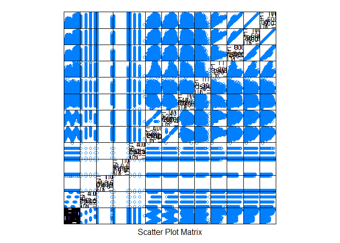
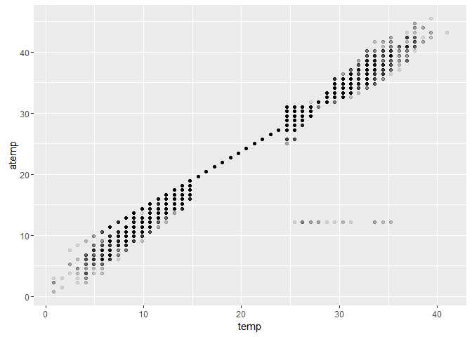
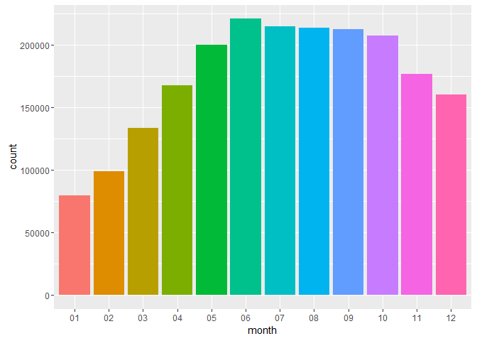
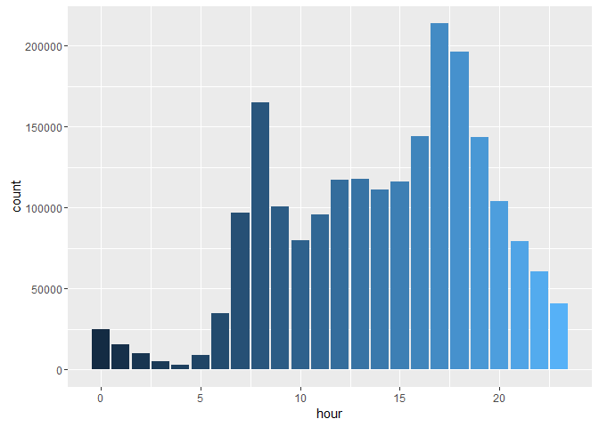
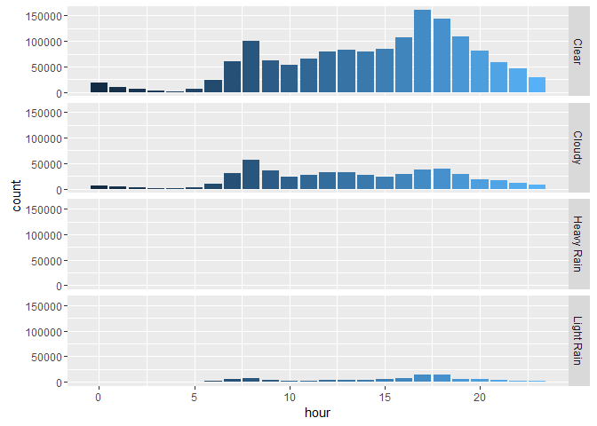
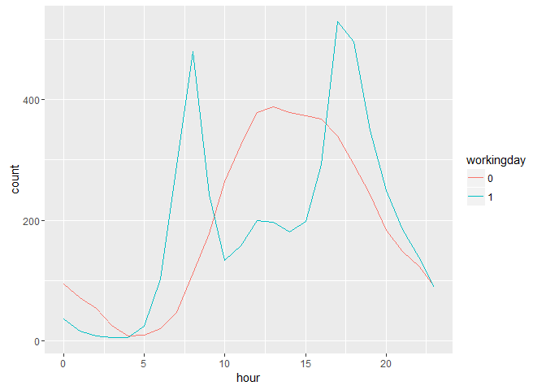
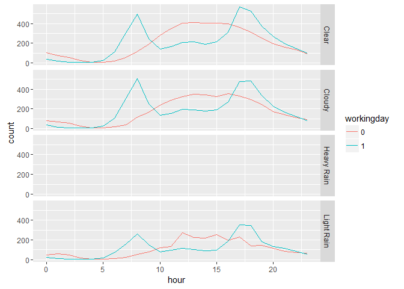
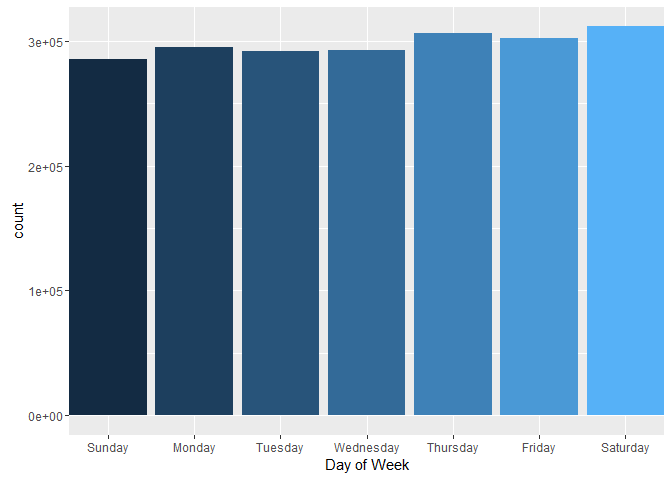
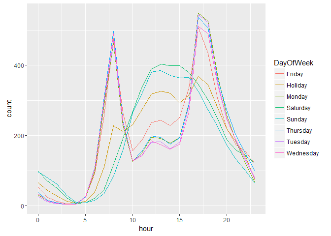
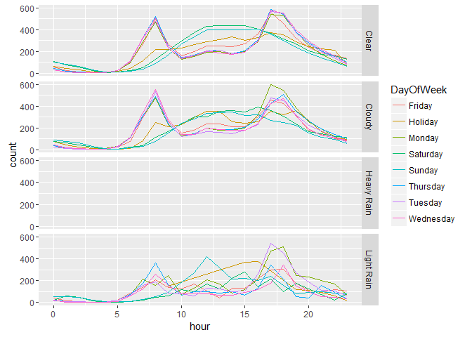

# Bike Sharing - Data Exploration

weather - 
1: Clear, Few clouds, Partly cloudy, Partly cloudy 
2: Mist + Cloudy, Mist + Broken clouds, Mist + Few clouds, Mist 
3: Light Snow, Light Rain + Thunderstorm + Scattered clouds, Light Rain + Scattered clouds 
4: Heavy Rain + Ice Pallets + Thunderstorm + Mist, Snow + Fog 


```r
library(ggplot2)
library(caret) 
library(data.table)
library(dplyr)
library(RCurl)
```

Reading data


```r
url <- getURL('https://raw.githubusercontent.com/frankwwu/R-Knots/master/Bike%20Sharing/train.csv')
train <- read.csv(text = url) 
dim(train)
```

```
## [1] 10886    12
```

### Feature engineering

Following is the training dada's headers, and the adjacency matrix which illustrates the correlation status of components. From the adjacency matrix, we can identify temp and atemp are highly correlated. Therefore, we can remove one of them from the training data. We will remove atemp.
 

```r
head(train)
```

```
##              datetime season holiday workingday weather temp  atemp
## 1 2011-01-01 00:00:00      1       0          0       1 9.84 14.395
## 2 2011-01-01 01:00:00      1       0          0       1 9.02 13.635
## 3 2011-01-01 02:00:00      1       0          0       1 9.02 13.635
## 4 2011-01-01 03:00:00      1       0          0       1 9.84 14.395
## 5 2011-01-01 04:00:00      1       0          0       1 9.84 14.395
## 6 2011-01-01 05:00:00      1       0          0       2 9.84 12.880
##   humidity windspeed casual registered count
## 1       81    0.0000      3         13    16
## 2       80    0.0000      8         32    40
## 3       80    0.0000      5         27    32
## 4       75    0.0000      3         10    13
## 5       75    0.0000      0          1     1
## 6       75    6.0032      0          1     1
```

```r
featurePlot(x=train, y=train$count, plot='pairs')
```



### Temperature

temp - temperature in Celsius

atemp - "feels like" temperature in Celsius

temp and atemp are highly correlated, therefore, atemp can be removed from the feature set.


```r
ggplot(train, aes(temp, atemp)) +     
  geom_point(stat="identity", alpha=0.1)
```



```r
train<-train[, !(colnames(train) %in% c('atemp'))]
```

### Converting weather code to name.


```r
weatherNames<-c('Clear', 'Cloudy', 'Light Rain', 'Heavy Rain')
train$weather <- factor(weatherNames[train$weather])
```

### Extracting hours, and months.


```r
time <- factor(substring(train$datetime, 12, 20))
train$hour<- as.numeric(substr(time, 1, 2))
train$month <- factor(substring(as.Date(train$datetime), 6, 7))
train$workingday <- factor(train$workingday)
```

### Months

Months have significant contribution. Since we will use months, we don't need seasons.


```r
ggplot(train, aes(month, count, fill=month)) +     
  geom_bar(stat="identity") +
  theme(legend.position="none")
```



### Time

Let the algorithms to handle the time. Alternatively, the time can be classified.


```r
ggplot(train, aes(hour, count, fill=hour)) +     
  geom_bar(stat="identity")+ 
  theme(legend.position="none")
```



### Weather


```r
ggplot(train, aes(hour, count, fill=hour)) +     
  geom_bar(stat="identity") +
  facet_grid(weather~.) + 
  theme(legend.position="none")
```



### Workingday vs holidays and weekends

The hour patterns of Workingdays and non-Workingdays are very different. The weather has no noticeable impact to the hour patterns. Further investigation shows holidays fall somewhere between workingdays and weekends. Therefore, workingday holiday are suggested be included in the feature set.


```r
ggplot(train, aes(x = hour, y = count, group = workingday, color = workingday)) +     
  stat_summary(fun.y = mean, geom="line")
```



```r
ggplot(train, aes(x = hour, y = count, group = workingday, color = workingday)) +     
  stat_summary(fun.y = mean, geom="line") +
  facet_grid(weather~.)
```

```
## geom_path: Each group consists of only one observation. Do you need to
## adjust the group aesthetic?
```



```r
train$DayOfWeek <- weekdays(as.Date(train$datetime))
dow = "DayOfWeekOrder,DayOfWeek
1,Sunday 
2,Monday
3,Tuesday
4,Wednesday
5,Thursday
6,Friday
7,Saturday"
dayOrder <- fread(dow)
train <- left_join(train , dayOrder, by.x=c("DayOfWeek")) 
```

```
## Joining by: "DayOfWeek"
```

```r
ggplot(train, aes(DayOfWeekOrder, count, fill=DayOfWeekOrder)) +     
  geom_bar(stat="identity") +
  scale_x_discrete(limits=dayOrder$DayOfWeek)+
  theme(legend.position="none") +
  labs(x="Day of Week")
```



```r
train[train$holiday==1,]$DayOfWeek <-'Holiday'

ggplot(train, aes(x=hour, y=count, group =DayOfWeek, color = DayOfWeek)) +     
  stat_summary(fun.y = mean, geom="line") 
```



```r
ggplot(train, aes(x=hour, y=count, group =DayOfWeek, color = DayOfWeek)) +     
  stat_summary(fun.y = mean, geom="line") +
  facet_grid(weather~.) 
```

```
## geom_path: Each group consists of only one observation. Do you need to
## adjust the group aesthetic?
```



### Formula

Suggested training set formula: <code>count ~ month + weather + temp + humidity + hour + workingday + holiday</code>

