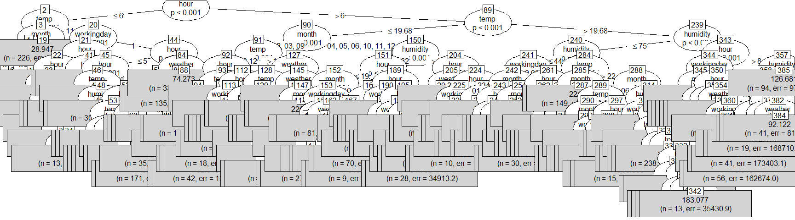
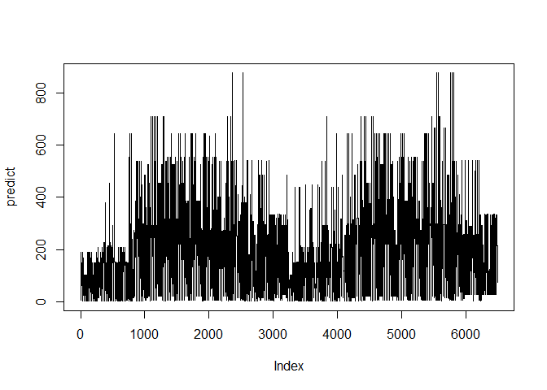

### Data Fields
**datetime** - hourly date + timestamp

**season** -  1 = spring, 2 = summer, 3 = fall, 4 = winter 

**holiday** - whether the day is considered a holiday

**workingday** - whether the day is neither a weekend nor holiday

**weather** - 1: Clear, Few clouds, Partly cloudy, Partly cloudy

2: Mist + Cloudy, Mist + Broken clouds, Mist + Few clouds, Mist 

3: Light Snow, Light Rain + Thunderstorm + Scattered clouds, Light Rain + Scattered clouds 

4: Heavy Rain + Ice Pallets + Thunderstorm + Mist, Snow + Fog 

**temp** - temperature in Celsius

**atemp** - "feels like" temperature in Celsius

**humidity** - relative humidity

**windspeed** - wind speed

**casual** - number of non-registered user rentals initiated

**registered** - number of registered user rentals initiated

**count** - number of total rentals


```r
library(partykit)
library(RCurl)
```

### 1. Reading files


```r
train <- read.csv('https://raw.githubusercontent.com/frankwwu/R-Knots/master/Bike%20Sharing/train.csv') 
test <- read.csv('https://raw.githubusercontent.com/frankwwu/R-Knots/master/Bike%20Sharing/test.csv') 
```

### 2. Feature selection

Since temp and atemp are highly correlated, we can remove one of them from the training data. We will remove atemp in following feature set.


```r
train<-train[, !(colnames(train) %in% c('atemp'))]
time <- factor(substring(train$datetime, 12, 20))
train$hour<- as.numeric(substr(time, 1, 2))
train$month <- factor(substring(as.Date(train$datetime), 6, 7))
train$workingday <- factor(train$workingday)

test<-test[, !(colnames(test) %in% c('atemp'))] 
time <- factor(substring(test$datetime, 12, 20))
test$hour<- as.numeric(substr(time, 1, 2))
test$month <- factor(substring(as.Date(test$datetime), 6, 7))
test$workingday <- factor(test$workingday)
```


```r
formula <- count ~ month + weather + temp + humidity + hour + workingday + holiday
```

### 3. Conditional Inference Trees


```r
set.seed(200)
fit <- ctree(formula, data=train)

# Print the tree
print(fit)
```

```
## 
## Model formula:
## count ~ month + weather + temp + humidity + hour + workingday + 
##     holiday
## 
## Fitted party:
## [1] root
## |   [2] hour <= 6
## |   |   [3] temp <= 11.48
## |   |   |   [4] month in 01, 02, 03, 04
## |   |   |   |   [5] hour <= 5
## |   |   |   |   |   [6] workingday in 0
## |   |   |   |   |   |   [7] hour <= 2: 31.067 (n = 60, err = 15961.7)
## |   |   |   |   |   |   [8] hour > 2
## |   |   |   |   |   |   |   [9] hour <= 3: 14.409 (n = 22, err = 3483.3)
## |   |   |   |   |   |   |   [10] hour > 3: 4.269 (n = 52, err = 662.2)
## |   |   |   |   |   [11] workingday in 1
## |   |   |   |   |   |   [12] temp <= 9.02: 5.460 (n = 189, err = 5197.0)
## |   |   |   |   |   |   [13] temp > 9.02: 8.125 (n = 88, err = 5445.6)
## |   |   |   |   [14] hour > 5
## |   |   |   |   |   [15] workingday in 0
## |   |   |   |   |   |   [16] month in 01, 03, 04: 7.882 (n = 17, err = 987.8)
## |   |   |   |   |   |   [17] month in 02: 4.600 (n = 10, err = 66.4)
## |   |   |   |   |   [18] workingday in 1: 51.618 (n = 55, err = 38367.0)
## |   |   |   [19] month in 11, 12: 28.947 (n = 226, err = 251847.4)
## |   |   [20] temp > 11.48
## |   |   |   [21] workingday in 0
## |   |   |   |   [22] hour <= 2
## |   |   |   |   |   [23] hour <= 0
## |   |   |   |   |   |   [24] temp <= 20.5: 81.935 (n = 62, err = 89819.7)
## |   |   |   |   |   |   [25] temp > 20.5
## |   |   |   |   |   |   |   [26] weather <= 1: 139.195 (n = 41, err = 48208.4)
## |   |   |   |   |   |   |   [27] weather > 1: 104.812 (n = 16, err = 16272.4)
## |   |   |   |   |   [28] hour > 0
## |   |   |   |   |   |   [29] temp <= 19.68
## |   |   |   |   |   |   |   [30] holiday <= 0
## |   |   |   |   |   |   |   |   [31] month in 01, 02, 03, 04, 05: 48.510 (n = 51, err = 23886.7)
## |   |   |   |   |   |   |   |   [32] month in 09, 10, 11, 12
## |   |   |   |   |   |   |   |   |   [33] hour <= 1: 83.087 (n = 23, err = 14161.8)
## |   |   |   |   |   |   |   |   |   [34] hour > 1
## |   |   |   |   |   |   |   |   |   |   [35] month in 09, 11: 56.625 (n = 8, err = 3041.9)
## |   |   |   |   |   |   |   |   |   |   [36] month in 10, 12: 64.154 (n = 13, err = 2645.7)
## |   |   |   |   |   |   |   [37] holiday > 0: 19.750 (n = 12, err = 954.2)
## |   |   |   |   |   |   [38] temp > 19.68
## |   |   |   |   |   |   |   [39] hour <= 1: 93.254 (n = 59, err = 39577.2)
## |   |   |   |   |   |   |   [40] hour > 1: 70.228 (n = 57, err = 23726.0)
## |   |   |   |   [41] hour > 2
## |   |   |   |   |   [42] temp <= 18.86: 15.238 (n = 185, err = 33977.5)
## |   |   |   |   |   [43] temp > 18.86: 21.489 (n = 225, err = 53272.2)
## |   |   |   [44] workingday in 1
## |   |   |   |   [45] hour <= 5
## |   |   |   |   |   [46] hour <= 0
## |   |   |   |   |   |   [47] temp <= 22.96: 37.140 (n = 150, err = 127318.1)
## |   |   |   |   |   |   [48] temp > 22.96
## |   |   |   |   |   |   |   [49] humidity <= 78: 53.194 (n = 67, err = 26838.5)
## |   |   |   |   |   |   |   [50] humidity > 78: 39.467 (n = 30, err = 9533.5)
## |   |   |   |   |   [51] hour > 0
## |   |   |   |   |   |   [52] hour <= 4
## |   |   |   |   |   |   |   [53] hour <= 1
## |   |   |   |   |   |   |   |   [54] temp <= 18.04
## |   |   |   |   |   |   |   |   |   [55] weather <= 2: 14.547 (n = 64, err = 4655.9)
## |   |   |   |   |   |   |   |   |   [56] weather > 2: 7.111 (n = 9, err = 162.9)
## |   |   |   |   |   |   |   |   [57] temp > 18.04
## |   |   |   |   |   |   |   |   |   [58] weather <= 1: 22.191 (n = 110, err = 20795.0)
## |   |   |   |   |   |   |   |   |   [59] weather > 1
## |   |   |   |   |   |   |   |   |   |   [60] humidity <= 73: 19.727 (n = 22, err = 2398.4)
## |   |   |   |   |   |   |   |   |   |   [61] humidity > 73: 13.216 (n = 37, err = 1018.3)
## |   |   |   |   |   |   |   [62] hour > 1
## |   |   |   |   |   |   |   |   [63] hour <= 2
## |   |   |   |   |   |   |   |   |   [64] weather <= 1
## |   |   |   |   |   |   |   |   |   |   [65] temp <= 14.76: 5.808 (n = 26, err = 452.0)
## |   |   |   |   |   |   |   |   |   |   [66] temp > 14.76: 11.083 (n = 132, err = 4608.1)
## |   |   |   |   |   |   |   |   |   [67] weather > 1: 7.549 (n = 82, err = 2332.3)
## |   |   |   |   |   |   |   |   [68] hour > 2
## |   |   |   |   |   |   |   |   |   [69] month in 01, 02, 03, 04
## |   |   |   |   |   |   |   |   |   |   [70] temp <= 16.4: 2.925 (n = 53, err = 235.7)
## |   |   |   |   |   |   |   |   |   |   [71] temp > 16.4: 4.270 (n = 37, err = 263.3)
## |   |   |   |   |   |   |   |   |   [72] month in 05, 06, 07, 08, 09, 10, 11, 12
## |   |   |   |   |   |   |   |   |   |   [73] weather <= 2
## |   |   |   |   |   |   |   |   |   |   |   [74] hour <= 3: 5.959 (n = 169, err = 1550.7)
## |   |   |   |   |   |   |   |   |   |   |   [75] hour > 3: 6.877 (n = 171, err = 1452.4)
## |   |   |   |   |   |   |   |   |   |   [76] weather > 2: 4.029 (n = 35, err = 129.0)
## |   |   |   |   |   |   [77] hour > 4
## |   |   |   |   |   |   |   [78] month in 01, 02, 03, 04, 05
## |   |   |   |   |   |   |   |   [79] temp <= 15.58: 15.679 (n = 28, err = 1902.1)
## |   |   |   |   |   |   |   |   [80] temp > 15.58: 23.061 (n = 49, err = 2978.8)
## |   |   |   |   |   |   |   [81] month in 06, 07, 08, 09, 10, 11, 12
## |   |   |   |   |   |   |   |   [82] humidity <= 93: 31.799 (n = 149, err = 12306.0)
## |   |   |   |   |   |   |   |   [83] humidity > 93: 18.077 (n = 13, err = 1428.9)
## |   |   |   |   [84] hour > 5
## |   |   |   |   |   [85] weather <= 2
## |   |   |   |   |   |   [86] month in 01, 02, 03, 04, 11, 12: 94.985 (n = 67, err = 66775.0)
## |   |   |   |   |   |   [87] month in 05, 06, 07, 08, 09, 10: 134.274 (n = 135, err = 156492.9)
## |   |   |   |   |   [88] weather > 2: 74.273 (n = 33, err = 54972.5)
## |   [89] hour > 6
## |   |   [90] temp <= 19.68
## |   |   |   [91] month in 01, 02, 03, 09
## |   |   |   |   [92] temp <= 13.12
## |   |   |   |   |   [93] hour <= 19
## |   |   |   |   |   |   [94] temp <= 9.02
## |   |   |   |   |   |   |   [95] workingday in 0
## |   |   |   |   |   |   |   |   [96] hour <= 9
## |   |   |   |   |   |   |   |   |   [97] hour <= 7: 15.438 (n = 16, err = 1655.9)
## |   |   |   |   |   |   |   |   |   [98] hour > 7: 54.933 (n = 30, err = 42615.9)
## |   |   |   |   |   |   |   |   [99] hour > 9: 104.269 (n = 78, err = 196879.3)
## |   |   |   |   |   |   |   [100] workingday in 1
## |   |   |   |   |   |   |   |   [101] hour <= 9: 189.717 (n = 113, err = 1261842.9)
## |   |   |   |   |   |   |   |   [102] hour > 9
## |   |   |   |   |   |   |   |   |   [103] hour <= 16
## |   |   |   |   |   |   |   |   |   |   [104] hour <= 15
## |   |   |   |   |   |   |   |   |   |   |   [105] weather <= 1: 63.569 (n = 65, err = 23593.9)
## |   |   |   |   |   |   |   |   |   |   |   [106] weather > 1: 52.810 (n = 42, err = 13520.5)
## |   |   |   |   |   |   |   |   |   |   [107] hour > 15: 84.000 (n = 13, err = 7210.0)
## |   |   |   |   |   |   |   |   |   [108] hour > 16
## |   |   |   |   |   |   |   |   |   |   [109] hour <= 18: 167.100 (n = 30, err = 53072.7)
## |   |   |   |   |   |   |   |   |   |   [110] hour > 18: 118.056 (n = 18, err = 40150.9)
## |   |   |   |   |   |   [111] temp > 9.02: 150.655 (n = 409, err = 4267364.4)
## |   |   |   |   |   [112] hour > 19
## |   |   |   |   |   |   [113] hour <= 21
## |   |   |   |   |   |   |   [114] workingday in 0: 57.958 (n = 48, err = 39901.9)
## |   |   |   |   |   |   |   [115] workingday in 1
## |   |   |   |   |   |   |   |   [116] temp <= 9.84
## |   |   |   |   |   |   |   |   |   [117] hour <= 20: 84.115 (n = 26, err = 25804.7)
## |   |   |   |   |   |   |   |   |   [118] hour > 20: 61.741 (n = 27, err = 17209.2)
## |   |   |   |   |   |   |   |   [119] temp > 9.84: 114.361 (n = 36, err = 91430.3)
## |   |   |   |   |   |   [120] hour > 21
## |   |   |   |   |   |   |   [121] temp <= 9.02
## |   |   |   |   |   |   |   |   [122] hour <= 22: 39.147 (n = 34, err = 8282.3)
## |   |   |   |   |   |   |   |   [123] hour > 22: 26.051 (n = 39, err = 9119.9)
## |   |   |   |   |   |   |   [124] temp > 9.02
## |   |   |   |   |   |   |   |   [125] hour <= 22: 68.525 (n = 40, err = 51628.0)
## |   |   |   |   |   |   |   |   [126] hour > 22: 44.676 (n = 37, err = 14822.1)
## |   |   |   |   [127] temp > 13.12
## |   |   |   |   |   [128] weather <= 1
## |   |   |   |   |   |   [129] temp <= 16.4
## |   |   |   |   |   |   |   [130] humidity <= 43: 207.654 (n = 136, err = 2043058.8)
## |   |   |   |   |   |   |   [131] humidity > 43: 142.047 (n = 107, err = 675116.8)
## |   |   |   |   |   |   [132] temp > 16.4
## |   |   |   |   |   |   |   [133] hour <= 19
## |   |   |   |   |   |   |   |   [134] humidity <= 77
## |   |   |   |   |   |   |   |   |   [135] hour <= 16: 216.452 (n = 93, err = 1284433.0)
## |   |   |   |   |   |   |   |   |   [136] hour > 16
## |   |   |   |   |   |   |   |   |   |   [137] workingday in 0: 202.692 (n = 13, err = 61748.8)
## |   |   |   |   |   |   |   |   |   |   [138] workingday in 1
## |   |   |   |   |   |   |   |   |   |   |   [139] hour <= 18: 439.059 (n = 17, err = 173678.9)
## |   |   |   |   |   |   |   |   |   |   |   [140] hour > 18: 252.286 (n = 7, err = 17729.4)
## |   |   |   |   |   |   |   |   [141] humidity > 77: 455.000 (n = 8, err = 221378.0)
## |   |   |   |   |   |   |   [142] hour > 19
## |   |   |   |   |   |   |   |   [143] hour <= 21: 167.762 (n = 21, err = 31867.8)
## |   |   |   |   |   |   |   |   [144] hour > 21: 93.950 (n = 20, err = 29715.0)
## |   |   |   |   |   [145] weather > 1
## |   |   |   |   |   |   [146] weather <= 2: 154.067 (n = 165, err = 1899636.3)
## |   |   |   |   |   |   [147] weather > 2
## |   |   |   |   |   |   |   [148] month in 01, 03: 66.957 (n = 46, err = 245145.9)
## |   |   |   |   |   |   |   [149] month in 02, 09: 226.500 (n = 14, err = 261191.5)
## |   |   |   [150] month in 04, 05, 06, 10, 11, 12
## |   |   |   |   [151] humidity <= 62
## |   |   |   |   |   [152] hour <= 19
## |   |   |   |   |   |   [153] month in 04, 05, 12
## |   |   |   |   |   |   |   [154] workingday in 0
## |   |   |   |   |   |   |   |   [155] temp <= 15.58
## |   |   |   |   |   |   |   |   |   [156] month in 04: 105.462 (n = 13, err = 51961.2)
## |   |   |   |   |   |   |   |   |   [157] month in 12
## |   |   |   |   |   |   |   |   |   |   [158] temp <= 13.12
## |   |   |   |   |   |   |   |   |   |   |   [159] temp <= 10.66: 139.250 (n = 20, err = 95735.8)
## |   |   |   |   |   |   |   |   |   |   |   [160] temp > 10.66: 218.037 (n = 27, err = 43965.0)
## |   |   |   |   |   |   |   |   |   |   [161] temp > 13.12: 320.000 (n = 15, err = 70344.0)
## |   |   |   |   |   |   |   |   [162] temp > 15.58: 315.694 (n = 36, err = 589205.6)
## |   |   |   |   |   |   |   [163] workingday in 1
## |   |   |   |   |   |   |   |   [164] weather <= 1: 293.516 (n = 213, err = 4365549.2)
## |   |   |   |   |   |   |   |   [165] weather > 1: 240.617 (n = 81, err = 1505601.1)
## |   |   |   |   |   |   [166] month in 10, 11
## |   |   |   |   |   |   |   [167] hour <= 16
## |   |   |   |   |   |   |   |   [168] temp <= 13.94
## |   |   |   |   |   |   |   |   |   [169] workingday in 0
## |   |   |   |   |   |   |   |   |   |   [170] temp <= 12.3: 117.455 (n = 11, err = 40556.7)
## |   |   |   |   |   |   |   |   |   |   [171] temp > 12.3: 206.286 (n = 14, err = 56096.9)
## |   |   |   |   |   |   |   |   |   [172] workingday in 1
## |   |   |   |   |   |   |   |   |   |   [173] hour <= 8: 501.812 (n = 16, err = 520242.4)
## |   |   |   |   |   |   |   |   |   |   [174] hour > 8: 216.333 (n = 48, err = 306812.7)
## |   |   |   |   |   |   |   |   [175] temp > 13.94
## |   |   |   |   |   |   |   |   |   [176] workingday in 0
## |   |   |   |   |   |   |   |   |   |   [177] hour <= 10: 208.545 (n = 11, err = 150506.7)
## |   |   |   |   |   |   |   |   |   |   [178] hour > 10
## |   |   |   |   |   |   |   |   |   |   |   [179] holiday <= 0: 410.564 (n = 55, err = 498461.5)
## |   |   |   |   |   |   |   |   |   |   |   [180] holiday > 0: 313.000 (n = 9, err = 52602.0)
## |   |   |   |   |   |   |   |   |   [181] workingday in 1
## |   |   |   |   |   |   |   |   |   |   [182] month in 10: 443.727 (n = 11, err = 430076.2)
## |   |   |   |   |   |   |   |   |   |   [183] month in 11: 257.771 (n = 70, err = 490190.3)
## |   |   |   |   |   |   |   [184] hour > 16
## |   |   |   |   |   |   |   |   [185] workingday in 0: 289.593 (n = 27, err = 199688.5)
## |   |   |   |   |   |   |   |   [186] workingday in 1
## |   |   |   |   |   |   |   |   |   [187] hour <= 18: 542.051 (n = 39, err = 441789.9)
## |   |   |   |   |   |   |   |   |   [188] hour > 18: 369.900 (n = 20, err = 296099.8)
## |   |   |   |   |   [189] hour > 19
## |   |   |   |   |   |   [190] hour <= 20
## |   |   |   |   |   |   |   [191] workingday in 0: 150.750 (n = 16, err = 49177.0)
## |   |   |   |   |   |   |   [192] workingday in 1
## |   |   |   |   |   |   |   |   [193] month in 04, 05, 12: 213.852 (n = 27, err = 108703.4)
## |   |   |   |   |   |   |   |   [194] month in 10, 11: 253.500 (n = 18, err = 100078.5)
## |   |   |   |   |   |   [195] hour > 20
## |   |   |   |   |   |   |   [196] hour <= 21
## |   |   |   |   |   |   |   |   [197] workingday in 0: 118.667 (n = 15, err = 38071.3)
## |   |   |   |   |   |   |   |   [198] workingday in 1: 168.700 (n = 40, err = 83364.4)
## |   |   |   |   |   |   |   [199] hour > 21
## |   |   |   |   |   |   |   |   [200] hour <= 22
## |   |   |   |   |   |   |   |   |   [201] temp <= 13.12: 106.423 (n = 26, err = 30928.3)
## |   |   |   |   |   |   |   |   |   [202] temp > 13.12: 137.387 (n = 31, err = 49345.4)
## |   |   |   |   |   |   |   |   [203] hour > 22: 94.434 (n = 53, err = 89209.0)
## |   |   |   |   [204] humidity > 62
## |   |   |   |   |   [205] hour <= 19
## |   |   |   |   |   |   [206] weather <= 2
## |   |   |   |   |   |   |   [207] workingday in 0
## |   |   |   |   |   |   |   |   [208] hour <= 9
## |   |   |   |   |   |   |   |   |   [209] holiday <= 0
## |   |   |   |   |   |   |   |   |   |   [210] hour <= 8
## |   |   |   |   |   |   |   |   |   |   |   [211] hour <= 7: 44.129 (n = 31, err = 15509.5)
## |   |   |   |   |   |   |   |   |   |   |   [212] hour > 7: 94.750 (n = 28, err = 34913.2)
## |   |   |   |   |   |   |   |   |   |   [213] hour > 8: 162.350 (n = 20, err = 77148.6)
## |   |   |   |   |   |   |   |   |   [214] holiday > 0: 293.375 (n = 8, err = 157099.9)
## |   |   |   |   |   |   |   |   [215] hour > 9
## |   |   |   |   |   |   |   |   |   [216] month in 04, 05, 10, 11
## |   |   |   |   |   |   |   |   |   |   [217] humidity <= 72: 308.778 (n = 27, err = 219190.7)
## |   |   |   |   |   |   |   |   |   |   [218] humidity > 72: 182.355 (n = 31, err = 88149.1)
## |   |   |   |   |   |   |   |   |   [219] month in 12: 337.646 (n = 48, err = 595135.0)
## |   |   |   |   |   |   |   [220] workingday in 1
## |   |   |   |   |   |   |   |   [221] month in 04, 11: 256.616 (n = 112, err = 2500798.5)
## |   |   |   |   |   |   |   |   [222] month in 05, 06, 10, 12: 332.175 (n = 160, err = 4632077.1)
## |   |   |   |   |   |   [223] weather > 2: 119.319 (n = 113, err = 992524.5)
## |   |   |   |   |   [224] hour > 19
## |   |   |   |   |   |   [225] hour <= 21
## |   |   |   |   |   |   |   [226] workingday in 0: 118.571 (n = 42, err = 86374.3)
## |   |   |   |   |   |   |   [227] workingday in 1
## |   |   |   |   |   |   |   |   [228] temp <= 18.04
## |   |   |   |   |   |   |   |   |   [229] humidity <= 77
## |   |   |   |   |   |   |   |   |   |   [230] hour <= 20: 213.500 (n = 10, err = 8332.5)
## |   |   |   |   |   |   |   |   |   |   [231] hour > 20: 160.800 (n = 10, err = 11547.6)
## |   |   |   |   |   |   |   |   |   [232] humidity > 77: 124.591 (n = 22, err = 70531.3)
## |   |   |   |   |   |   |   |   [233] temp > 18.04: 219.917 (n = 12, err = 49478.9)
## |   |   |   |   |   |   [234] hour > 21
## |   |   |   |   |   |   |   [235] hour <= 22
## |   |   |   |   |   |   |   |   [236] weather <= 2: 112.392 (n = 51, err = 85496.2)
## |   |   |   |   |   |   |   |   [237] weather > 2: 60.750 (n = 8, err = 7023.5)
## |   |   |   |   |   |   |   [238] hour > 22: 75.519 (n = 77, err = 99721.2)
## |   |   [239] temp > 19.68
## |   |   |   [240] humidity <= 75
## |   |   |   |   [241] humidity <= 44
## |   |   |   |   |   [242] workingday in 0
## |   |   |   |   |   |   [243] month in 01, 03, 04, 07, 10, 11
## |   |   |   |   |   |   |   [244] hour <= 18
## |   |   |   |   |   |   |   |   [245] month in 01, 03, 07
## |   |   |   |   |   |   |   |   |   [246] holiday <= 0: 376.095 (n = 63, err = 239449.4)
## |   |   |   |   |   |   |   |   |   [247] holiday > 0: 454.111 (n = 9, err = 20794.9)
## |   |   |   |   |   |   |   |   [248] month in 04, 10, 11: 484.318 (n = 85, err = 1477092.4)
## |   |   |   |   |   |   |   [249] hour > 18
## |   |   |   |   |   |   |   |   [250] hour <= 19: 321.917 (n = 12, err = 132842.9)
## |   |   |   |   |   |   |   |   [251] hour > 19
## |   |   |   |   |   |   |   |   |   [252] temp <= 27.88: 149.533 (n = 15, err = 42589.7)
## |   |   |   |   |   |   |   |   |   [253] temp > 27.88: 253.714 (n = 7, err = 39683.4)
## |   |   |   |   |   |   [254] month in 05, 06, 08, 09
## |   |   |   |   |   |   |   [255] month in 05, 06, 08
## |   |   |   |   |   |   |   |   [256] hour <= 18: 524.305 (n = 105, err = 1225832.2)
## |   |   |   |   |   |   |   |   [257] hour > 18: 365.500 (n = 18, err = 135310.5)
## |   |   |   |   |   |   |   [258] month in 09
## |   |   |   |   |   |   |   |   [259] humidity <= 39: 666.688 (n = 16, err = 75041.4)
## |   |   |   |   |   |   |   |   [260] humidity > 39: 508.167 (n = 12, err = 161149.7)
## |   |   |   |   |   [261] workingday in 1
## |   |   |   |   |   |   [262] hour <= 16
## |   |   |   |   |   |   |   [263] month in 01, 02, 03, 06, 07, 08, 11
## |   |   |   |   |   |   |   |   [264] hour <= 15
## |   |   |   |   |   |   |   |   |   [265] month in 01, 03, 06, 07, 08
## |   |   |   |   |   |   |   |   |   |   [266] weather <= 1: 221.514 (n = 247, err = 1460187.7)
## |   |   |   |   |   |   |   |   |   |   [267] weather > 1: 270.733 (n = 30, err = 206051.9)
## |   |   |   |   |   |   |   |   |   [268] month in 02, 11: 139.000 (n = 16, err = 32566.0)
## |   |   |   |   |   |   |   |   [269] hour > 15: 350.903 (n = 62, err = 624257.4)
## |   |   |   |   |   |   |   [270] month in 04, 05, 09, 10, 12: 298.231 (n = 186, err = 2306877.1)
## |   |   |   |   |   |   [271] hour > 16
## |   |   |   |   |   |   |   [272] hour <= 18
## |   |   |   |   |   |   |   |   [273] month in 01, 02, 03, 04, 05, 06, 07, 08, 11
## |   |   |   |   |   |   |   |   |   [274] month in 01, 02, 11: 357.714 (n = 7, err = 100831.4)
## |   |   |   |   |   |   |   |   |   [275] month in 03, 04, 05, 06, 07, 08: 644.871 (n = 139, err = 3035137.7)
## |   |   |   |   |   |   |   |   [276] month in 09, 10: 875.267 (n = 15, err = 249642.9)
## |   |   |   |   |   |   |   [277] hour > 18
## |   |   |   |   |   |   |   |   [278] hour <= 20
## |   |   |   |   |   |   |   |   |   [279] hour <= 19: 448.000 (n = 51, err = 738742.0)
## |   |   |   |   |   |   |   |   |   [280] hour > 19: 332.641 (n = 39, err = 278135.0)
## |   |   |   |   |   |   |   |   [281] hour > 20
## |   |   |   |   |   |   |   |   |   [282] hour <= 21: 242.286 (n = 21, err = 118380.3)
## |   |   |   |   |   |   |   |   |   [283] hour > 21: 157.947 (n = 19, err = 74914.9)
## |   |   |   |   [284] humidity > 44
## |   |   |   |   |   [285] temp <= 22.14
## |   |   |   |   |   |   [286] month in 01, 06, 09, 10, 11, 12: 297.010 (n = 208, err = 6144370.0)
## |   |   |   |   |   |   [287] month in 02, 03, 04, 05: 221.792 (n = 149, err = 2535048.6)
## |   |   |   |   |   [288] temp > 22.14
## |   |   |   |   |   |   [289] month in 02, 03, 05, 09, 10
## |   |   |   |   |   |   |   [290] temp <= 27.06
## |   |   |   |   |   |   |   |   [291] month in 02, 10: 379.008 (n = 131, err = 4563555.0)
## |   |   |   |   |   |   |   |   [292] month in 03, 05, 09
## |   |   |   |   |   |   |   |   |   [293] workingday in 0
## |   |   |   |   |   |   |   |   |   |   [294] month in 03: 553.250 (n = 12, err = 235836.2)
## |   |   |   |   |   |   |   |   |   |   [295] month in 05, 09: 320.045 (n = 89, err = 1833891.8)
## |   |   |   |   |   |   |   |   |   [296] workingday in 1: 291.724 (n = 243, err = 6500992.5)
## |   |   |   |   |   |   |   [297] temp > 27.06
## |   |   |   |   |   |   |   |   [298] hour <= 16
## |   |   |   |   |   |   |   |   |   [299] workingday in 0
## |   |   |   |   |   |   |   |   |   |   [300] hour <= 10: 279.667 (n = 12, err = 133694.7)
## |   |   |   |   |   |   |   |   |   |   [301] hour > 10: 454.593 (n = 59, err = 578506.2)
## |   |   |   |   |   |   |   |   |   [302] workingday in 1
## |   |   |   |   |   |   |   |   |   |   [303] hour <= 15: 244.885 (n = 87, err = 664884.9)
## |   |   |   |   |   |   |   |   |   |   [304] hour > 15: 389.895 (n = 19, err = 132837.8)
## |   |   |   |   |   |   |   |   [305] hour > 16
## |   |   |   |   |   |   |   |   |   [306] hour <= 19
## |   |   |   |   |   |   |   |   |   |   [307] workingday in 0
## |   |   |   |   |   |   |   |   |   |   |   [308] hour <= 17: 447.889 (n = 9, err = 25446.9)
## |   |   |   |   |   |   |   |   |   |   |   [309] hour > 17: 376.833 (n = 12, err = 47199.7)
## |   |   |   |   |   |   |   |   |   |   [310] workingday in 1
## |   |   |   |   |   |   |   |   |   |   |   [311] hour <= 18: 709.111 (n = 36, err = 727019.6)
## |   |   |   |   |   |   |   |   |   |   |   [312] hour > 18: 505.600 (n = 15, err = 112959.6)
## |   |   |   |   |   |   |   |   |   [313] hour > 19: 253.875 (n = 16, err = 178077.8)
## |   |   |   |   |   |   [314] month in 04, 06, 07, 08, 11, 12
## |   |   |   |   |   |   |   [315] humidity <= 55
## |   |   |   |   |   |   |   |   [316] workingday in 0
## |   |   |   |   |   |   |   |   |   [317] hour <= 21: 384.800 (n = 130, err = 1372414.8)
## |   |   |   |   |   |   |   |   |   [318] hour > 21: 179.417 (n = 12, err = 41726.9)
## |   |   |   |   |   |   |   |   [319] workingday in 1: 317.829 (n = 363, err = 11275535.4)
## |   |   |   |   |   |   |   [320] humidity > 55
## |   |   |   |   |   |   |   |   [321] workingday in 0
## |   |   |   |   |   |   |   |   |   [322] humidity <= 64
## |   |   |   |   |   |   |   |   |   |   [323] holiday <= 0: 280.112 (n = 89, err = 1208972.9)
## |   |   |   |   |   |   |   |   |   |   [324] holiday > 0: 400.364 (n = 11, err = 139370.5)
## |   |   |   |   |   |   |   |   |   [325] humidity > 64: 219.117 (n = 111, err = 1379477.5)
## |   |   |   |   |   |   |   |   [326] workingday in 1
## |   |   |   |   |   |   |   |   |   [327] hour <= 8
## |   |   |   |   |   |   |   |   |   |   [328] hour <= 7: 391.781 (n = 32, err = 269855.5)
## |   |   |   |   |   |   |   |   |   |   [329] hour > 7: 555.154 (n = 39, err = 682107.1)
## |   |   |   |   |   |   |   |   |   [330] hour > 8
## |   |   |   |   |   |   |   |   |   |   [331] temp <= 30.34: 242.345 (n = 238, err = 3494345.7)
## |   |   |   |   |   |   |   |   |   |   [332] temp > 30.34
## |   |   |   |   |   |   |   |   |   |   |   [333] hour <= 15
## |   |   |   |   |   |   |   |   |   |   |   |   [334] temp <= 31.98: 224.758 (n = 33, err = 151300.1)
## |   |   |   |   |   |   |   |   |   |   |   |   [335] temp > 31.98: 163.471 (n = 17, err = 30856.2)
## |   |   |   |   |   |   |   |   |   |   |   [336] hour > 15
## |   |   |   |   |   |   |   |   |   |   |   |   [337] hour <= 19
## |   |   |   |   |   |   |   |   |   |   |   |   |   [338] month in 06, 07: 453.095 (n = 21, err = 376205.8)
## |   |   |   |   |   |   |   |   |   |   |   |   |   [339] month in 08: 634.500 (n = 20, err = 519289.0)
## |   |   |   |   |   |   |   |   |   |   |   |   [340] hour > 19
## |   |   |   |   |   |   |   |   |   |   |   |   |   [341] hour <= 21: 307.944 (n = 18, err = 111506.9)
## |   |   |   |   |   |   |   |   |   |   |   |   |   [342] hour > 21: 183.077 (n = 13, err = 35430.9)
## |   |   |   [343] humidity > 75
## |   |   |   |   [344] hour <= 8
## |   |   |   |   |   [345] workingday in 0
## |   |   |   |   |   |   [346] month in 04, 05, 10: 180.167 (n = 12, err = 305743.7)
## |   |   |   |   |   |   [347] month in 06, 07, 08, 09
## |   |   |   |   |   |   |   [348] hour <= 7: 51.227 (n = 22, err = 5877.9)
## |   |   |   |   |   |   |   [349] hour > 7: 119.333 (n = 15, err = 26763.3)
## |   |   |   |   |   [350] workingday in 1
## |   |   |   |   |   |   [351] hour <= 7
## |   |   |   |   |   |   |   [352] weather <= 2: 362.589 (n = 56, err = 653223.6)
## |   |   |   |   |   |   |   [353] weather > 2: 150.375 (n = 16, err = 70913.8)
## |   |   |   |   |   |   [354] hour > 7
## |   |   |   |   |   |   |   [355] weather <= 2: 537.426 (n = 47, err = 969361.5)
## |   |   |   |   |   |   |   [356] weather > 2: 271.000 (n = 9, err = 217530.0)
## |   |   |   |   [357] hour > 8
## |   |   |   |   |   [358] humidity <= 89
## |   |   |   |   |   |   [359] hour <= 20
## |   |   |   |   |   |   |   [360] hour <= 16
## |   |   |   |   |   |   |   |   [361] workingday in 0: 273.805 (n = 41, err = 720730.4)
## |   |   |   |   |   |   |   |   [362] workingday in 1
## |   |   |   |   |   |   |   |   |   [363] weather <= 2
## |   |   |   |   |   |   |   |   |   |   [364] hour <= 9: 275.312 (n = 32, err = 151026.9)
## |   |   |   |   |   |   |   |   |   |   [365] hour > 9
## |   |   |   |   |   |   |   |   |   |   |   [366] month in 03, 04, 09: 129.615 (n = 13, err = 28431.1)
## |   |   |   |   |   |   |   |   |   |   |   [367] month in 05, 06, 07, 08, 10, 12: 175.518 (n = 56, err = 162674.0)
## |   |   |   |   |   |   |   |   |   [368] weather > 2
## |   |   |   |   |   |   |   |   |   |   [369] humidity <= 79: 191.800 (n = 10, err = 46171.6)
## |   |   |   |   |   |   |   |   |   |   [370] humidity > 79: 106.854 (n = 41, err = 173403.1)
## |   |   |   |   |   |   |   [371] hour > 16
## |   |   |   |   |   |   |   |   [372] hour <= 18
## |   |   |   |   |   |   |   |   |   [373] workingday in 0: 249.333 (n = 18, err = 220618.0)
## |   |   |   |   |   |   |   |   |   [374] workingday in 1: 400.176 (n = 34, err = 749942.9)
## |   |   |   |   |   |   |   |   [375] hour > 18
## |   |   |   |   |   |   |   |   |   [376] weather <= 2: 265.087 (n = 69, err = 498517.5)
## |   |   |   |   |   |   |   |   |   [377] weather > 2: 172.474 (n = 19, err = 168710.7)
## |   |   |   |   |   |   [378] hour > 20
## |   |   |   |   |   |   |   [379] hour <= 22
## |   |   |   |   |   |   |   |   [380] humidity <= 83: 175.731 (n = 93, err = 260868.3)
## |   |   |   |   |   |   |   |   [381] humidity > 83: 134.361 (n = 36, err = 158100.3)
## |   |   |   |   |   |   |   [382] hour > 22
## |   |   |   |   |   |   |   |   [383] weather <= 1: 126.457 (n = 35, err = 90058.7)
## |   |   |   |   |   |   |   |   [384] weather > 1: 92.122 (n = 41, err = 81092.4)
## |   |   |   |   |   [385] humidity > 89: 126.681 (n = 94, err = 971378.4)
## 
## Number of inner nodes:    192
## Number of terminal nodes: 193
```


```r
plot(fit, type = "simple")
```

<!-- -->

### 4. Prediction


```r
predict <- predict(fit, test)
plot(predict, type = "simple")
```

```
## Warning in plot.xy(xy, type, ...): plot type 'simple' will be truncated to first
## character
```

<!-- -->

```r
#text(predict)
result <- data.frame(datetime = test$datetime, temp = test$temp, month = test$month, workingday = test$workingday, count=predict)
write.csv(result, file="ctree_result.csv", row.names = FALSE)
```

