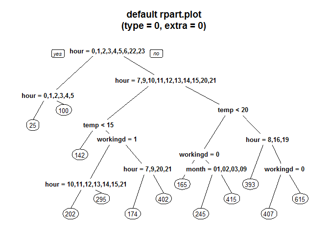
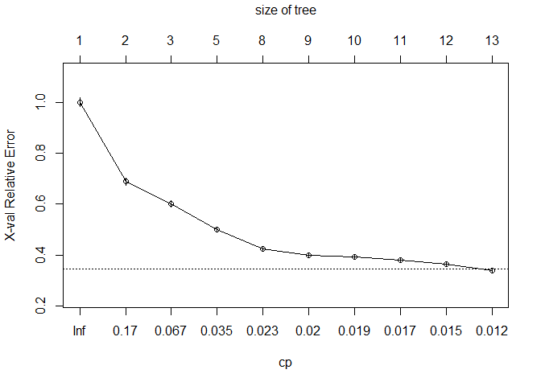
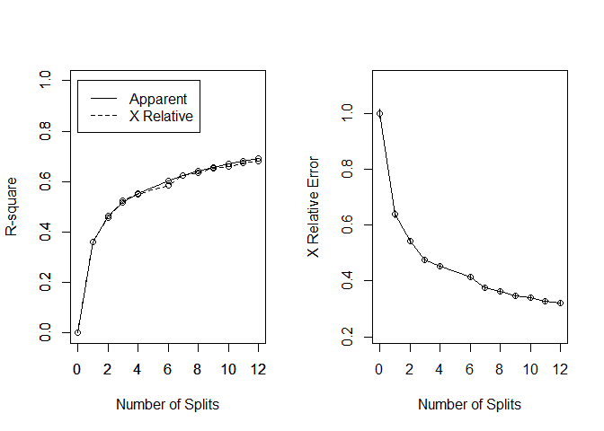

# Bike Sharing: Decision Trees - rpart

### Data Fields
**datetime** - hourly date + timestamp

**season** -  1 = spring, 2 = summer, 3 = fall, 4 = winter 

**holiday** - whether the day is considered a holiday

**workingday** - whether the day is neither a weekend nor holiday

**weather** - 1: Clear, Few clouds, Partly cloudy, Partly cloudy

2: Mist + Cloudy, Mist + Broken clouds, Mist + Few clouds, Mist 

3: Light Snow, Light Rain + Thunderstorm + Scattered clouds, Light Rain + Scattered clouds 

4: Heavy Rain + Ice Pallets + Thunderstorm + Mist, Snow + Fog 

**temp** - temperature in Celsius

**atemp** - "feels like" temperature in Celsius

**humidity** - relative humidity

**windspeed** - wind speed

**casual** - number of non-registered user rentals initiated

**registered** - number of registered user rentals initiated

**count** - number of total rentals


```r
library(rpart)
library(rpart.plot)
library(partykit)
library(RCurl)
```

### 1. Reading files


```r
url <- getURL('https://raw.githubusercontent.com/frankwwu/R-Knots/master/Bike%20Sharing/train.csv')
train <- read.csv(text = url) 
url <- getURL('https://raw.githubusercontent.com/frankwwu/R-Knots/master/Bike%20Sharing/test.csv')
test <- read.csv(text = url) 
```

### 2. Feature selection

Since temp and atemp are highly correlated, we can remove one of them from the training data. We will remove atemp in following feature set.


```r
train<-train[, !(colnames(train) %in% c('atemp'))]
time <- factor(substring(train$datetime, 12, 20))
train$hour<- factor(as.numeric(substr(time, 1, 2)))
train$month <- factor(substring(as.Date(train$datetime), 6, 7))
train$workingday <- factor(train$workingday)

test<-test[, !(colnames(test) %in% c('atemp'))] 
time <- factor(substring(test$datetime, 12, 20))
test$hour<- factor(as.numeric(substr(time, 1, 2)))
test$month <- factor(substring(as.Date(test$datetime), 6, 7))
test$workingday <- factor(test$workingday)
```


```r
formula <- count ~ month + weather + temp + humidity + hour + workingday + holiday
```

### 3. Creating model

Let rpart() to make an intelligent guess of whether using recursive partitioning and regression trees model.


```r
set.seed(200)
fit <- rpart(formula, data=train)

# Print the tree
as.party(fit)
```

```
## 
## Model formula:
## count ~ month + weather + temp + humidity + hour + workingday + 
##     holiday
## 
## Fitted party:
## [1] root
## |   [2] hour in 0, 1, 2, 3, 4, 5, 6, 22, 23
## |   |   [3] hour in 0, 1, 2, 3, 4, 5: 25.178 (n = 2684, err = 2538474.2)
## |   |   [4] hour in 6, 22, 23: 99.799 (n = 1367, err = 5614191.7)
## |   [5] hour in 7, 8, 9, 10, 11, 12, 13, 14, 15, 16, 17, 18, 19, 20, 21
## |   |   [6] hour in 7, 9, 10, 11, 12, 13, 14, 15, 20, 21
## |   |   |   [7] temp < 15.17: 141.675 (n = 1291, err = 10974961.0)
## |   |   |   [8] temp >= 15.17
## |   |   |   |   [9] workingday in 1
## |   |   |   |   |   [10] hour in 10, 11, 12, 13, 14, 15, 21: 201.729 (n = 1634, err = 10198844.9)
## |   |   |   |   |   [11] hour in 7, 9, 20: 294.755 (n = 611, err = 7247679.2)
## |   |   |   |   [12] workingday in 0
## |   |   |   |   |   [13] hour in 7, 9, 20, 21: 173.729 (n = 369, err = 3772892.9)
## |   |   |   |   |   [14] hour in 10, 11, 12, 13, 14, 15: 401.571 (n = 651, err = 13738883.4)
## |   |   [15] hour in 8, 16, 17, 18, 19
## |   |   |   [16] temp < 20.09
## |   |   |   |   [17] workingday in 0: 165.326 (n = 331, err = 4027382.8)
## |   |   |   |   [18] workingday in 1
## |   |   |   |   |   [19] month in 01, 02, 03, 09: 244.950 (n = 340, err = 6465284.2)
## |   |   |   |   |   [20] month in 04, 05, 06, 10, 11, 12: 414.700 (n = 317, err = 9550212.5)
## |   |   |   [21] temp >= 20.09
## |   |   |   |   [22] hour in 8, 16, 19: 393.056 (n = 745, err = 19328949.6)
## |   |   |   |   [23] hour in 17, 18
## |   |   |   |   |   [24] workingday in 0: 407.084 (n = 167, err = 2865826.8)
## |   |   |   |   |   [25] workingday in 1: 614.897 (n = 379, err = 13412023.0)
## 
## Number of inner nodes:    12
## Number of terminal nodes: 13
```

```r
# Plot the tree
rpart.plot(fit, main="default rpart.plot\n(type = 0, extra = 0)")
```



```r
# Save the plot to a file
dev.copy(png, file="Bike-Sharing-DT-rpart.png")  
```

```
## png 
##   3
```

```r
dev.off()
```

```
## png 
##   2
```

```r
# Visualize cross-validation results
plotcp(fit)
```



```r
# Another way to visualize cross-validation results with two plots in one row
par(mfrow=c(1,2))
rsq.rpart(fit)
```

```
## 
## Regression tree:
## rpart(formula = formula, data = train)
## 
## Variables actually used in tree construction:
## [1] hour       month      temp       workingday
## 
## Root node error: 357172914/10886 = 32810
## 
## n= 10886 
## 
##          CP nsplit rel error  xerror      xstd
## 1  0.360230      0   1.00000 1.00030 0.0174151
## 2  0.102632      1   0.63977 0.64006 0.0128281
## 3  0.054947      2   0.53714 0.54228 0.0100635
## 4  0.033748      3   0.48219 0.47596 0.0088464
## 5  0.025443      4   0.44844 0.45183 0.0085266
## 6  0.022100      6   0.39756 0.41517 0.0079299
## 7  0.016079      7   0.37546 0.37591 0.0070720
## 8  0.014120      8   0.35938 0.36361 0.0067171
## 9  0.014016      9   0.34526 0.34704 0.0066204
## 10 0.013235     10   0.33124 0.34137 0.0065975
## 11 0.010775     11   0.31801 0.32739 0.0063560
## 12 0.010000     12   0.30723 0.31969 0.0062585
```



### 4. Prediction


```r
predict <- predict(fit, test)
#plot(predict, type = "simple")
#text(predict)

# Save the result to a file
result <- data.frame(datetime = test$datetime, temp = test$temp, month = test$month, workingday = test$workingday, count=predict)
write.csv(result, file="rpart_result.csv", row.names=FALSE)
```

### 5. Discussion

It appears hour, temp, month, and workingday have major impact to the model; while weather and humidity are negligible. The holiday is correlated to workingday.
