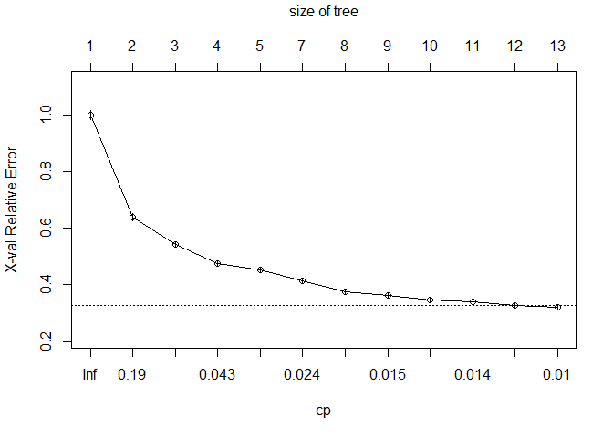

# Bike Sharing: Decision Trees - rpart

### Data Fields
**datetime** - hourly date + timestamp

**season** -  1 = spring, 2 = summer, 3 = fall, 4 = winter 

**holiday** - whether the day is considered a holiday

**workingday** - whether the day is neither a weekend nor holiday

**weather** - 1: Clear, Few clouds, Partly cloudy, Partly cloudy

2: Mist + Cloudy, Mist + Broken clouds, Mist + Few clouds, Mist 

3: Light Snow, Light Rain + Thunderstorm + Scattered clouds, Light Rain + Scattered clouds 

4: Heavy Rain + Ice Pallets + Thunderstorm + Mist, Snow + Fog 

**temp** - temperature in Celsius

**atemp** - "feels like" temperature in Celsius

**humidity** - relative humidity

**windspeed** - wind speed

**casual** - number of non-registered user rentals initiated

**registered** - number of registered user rentals initiated

**count** - number of total rentals


```r
library(rpart)
library(rpart.plot)
library(partykit)
library(RCurl)
```

### 1. Reading files


```r
url <- getURL('https://raw.githubusercontent.com/frankwwu/R-Knots/master/Bike%20Sharing/train.csv')
train <- read.csv(text = url) 
url <- getURL('https://raw.githubusercontent.com/frankwwu/R-Knots/master/Bike%20Sharing/test.csv')
test <- read.csv(text = url) 
```

### 2. Feature selection

Since temp and atemp are highly correlated, we can remove one of them from the training data. We will remove atemp in following feature set.


```r
train<-train[, !(colnames(train) %in% c('atemp'))]
time <- factor(substring(train$datetime, 12, 20))
train$hour<- as.numeric(substr(time, 1, 2))
train$month <- factor(substring(as.Date(train$datetime), 6, 7))
train$workingday <- factor(train$workingday)

test<-test[, !(colnames(test) %in% c('atemp'))] 
time <- factor(substring(test$datetime, 12, 20))
test$hour<- as.numeric(substr(time, 1, 2))
test$month <- factor(substring(as.Date(test$datetime), 6, 7))
test$workingday <- factor(test$workingday)
```


```r
formula <- count ~ month + weather + temp + humidity + hour + workingday + holiday
```

### 3. Creating model

Let rpart() to make an intelligent guess of whether using recursive partitioning and regression trees model.


```r
fit <- rpart(formula, data=train)

# Print the tree
as.party(fit)
```

```
## 
## Model formula:
## count ~ month + weather + temp + humidity + hour + workingday + 
##     holiday
## 
## Fitted party:
## [1] root
## |   [2] hour < 6.5: 32.582 (n = 3139, err = 4914289.6)
## |   [3] hour >= 6.5
## |   |   [4] temp < 20.09
## |   |   |   [5] month in 01, 02, 03, 09: 138.047 (n = 1748, err = 20812851.1)
## |   |   |   [6] month in 04, 05, 06, 10, 11, 12
## |   |   |   |   [7] hour >= 19.5: 129.790 (n = 458, err = 2048733.9)
## |   |   |   |   [8] hour < 19.5: 268.621 (n = 1314, err = 32857553.3)
## |   |   [9] temp >= 20.09
## |   |   |   [10] hour >= 20.5: 172.898 (n = 697, err = 4240695.8)
## |   |   |   [11] hour < 20.5
## |   |   |   |   [12] hour < 15.5
## |   |   |   |   |   [13] workingday in 1
## |   |   |   |   |   |   [14] hour >= 8.5: 215.135 (n = 1269, err = 8079566.0)
## |   |   |   |   |   |   [15] hour < 8.5: 440.332 (n = 274, err = 7773966.8)
## |   |   |   |   |   [16] workingday in 0
## |   |   |   |   |   |   [17] hour < 9.5: 152.620 (n = 179, err = 1594058.2)
## |   |   |   |   |   |   [18] hour >= 9.5: 436.185 (n = 466, err = 8127186.1)
## |   |   |   |   [19] hour >= 15.5
## |   |   |   |   |   [20] hour >= 18.5: 345.494 (n = 510, err = 8390191.5)
## |   |   |   |   |   [21] hour < 18.5
## |   |   |   |   |   |   [22] hour < 16.5: 375.885 (n = 286, err = 4620913.2)
## |   |   |   |   |   |   [23] hour >= 16.5
## |   |   |   |   |   |   |   [24] workingday in 0: 407.084 (n = 167, err = 2865826.8)
## |   |   |   |   |   |   |   [25] workingday in 1: 614.897 (n = 379, err = 13412023.0)
## 
## Number of inner nodes:    12
## Number of terminal nodes: 13
```

```r
# Plot the tree
rpart.plot(fit, main="default rpart.plot\n(type = 0, extra = 0)")
```


```r
# Save the plot to a file
dev.copy(png, file="Bike-Sharing-DT-rpart.png")  
```

```
## png 
##   3
```

```r
dev.off()
```

```
## png 
##   2
```

```r
# Visualize cross-validation results
plotcp(fit)
```



```r
# Another way to visualize cross-validation results with two plots in one row
par(mfrow=c(1,2))
rsq.rpart(fit)
```

```
## 
## Regression tree:
## rpart(formula = formula, data = train)
## 
## Variables actually used in tree construction:
## [1] hour       month      temp       workingday
## 
## Root node error: 357172914/10886 = 32810
## 
## n= 10886 
## 
##          CP nsplit rel error  xerror      xstd
## 1  0.312175      0   1.00000 1.00025 0.0174120
## 2  0.089214      1   0.68782 0.68803 0.0137917
## 3  0.049780      2   0.59861 0.60043 0.0121638
## 4  0.024818      4   0.49905 0.49969 0.0101758
## 5  0.022090      7   0.42460 0.42521 0.0091972
## 6  0.018749      8   0.40251 0.39906 0.0085629
## 7  0.018327      9   0.38376 0.39178 0.0084100
## 8  0.016176     10   0.36543 0.38054 0.0081075
## 9  0.014016     11   0.34925 0.36223 0.0077292
## 10 0.010000     12   0.33524 0.33702 0.0071268
```


### 4. Prediction


```r
predict <- predict(fit, test)
#plot(predict, type = "simple")
#text(predict)

# Save the result to a file
result <- data.frame(datetime = test$datetime, temp = test$temp, month = test$month, workingday = test$workingday, count=predict)
write.csv(result, file="rpart_result.csv", row.names=FALSE)
```

### 5. Discussion

It appears hour, temp, month, and workingday have major impact to the model; while weather and humidity are negligible. The holiday is correlated to workingday.
