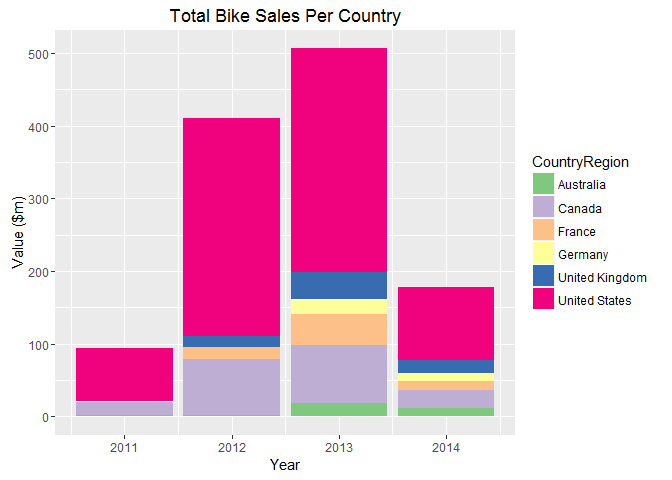
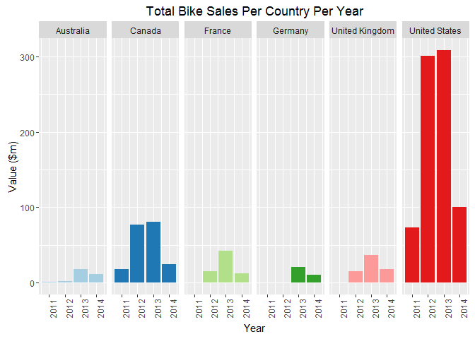
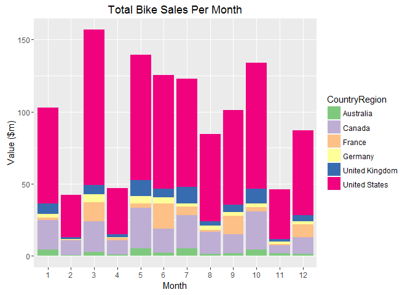

# Boston Code Camp 24


```r
library(RODBC)
library(knitr)
library(plyr)
library(ggplot2)
library(foreach)
library(lubridate)
```


### Conneting to SQL Server database with RODBC
Connecting to AdventureWorks2014 database with <code>RODBC</code>. Querying with the stored procedure and the SQL statement. Don't forget to disconnect the database in the end.


```r
# Connecting the database with RODBC
conn <- odbcDriverConnect("Driver=ODBC Driver 11 for SQL Server;Server=BEETS;Database=AdventureWorks2014;Trusted_Connection=yes")

# Querying employees with the stored procedure
employees<-sqlQuery(conn,"exec dbo.uspGetEmployeeManagers @BusinessEntityID = 9")

# Querying the sales with the SQL statement
sales <- sqlQuery(conn, "SELECT soh.OrderDate,                                            
                        cr.Name as CountryRegion,
                        soh.TotalDue AS TotalDue
                        FROM [AdventureWorks2014].[Sales].[SalesOrderHeader] soh
                        INNER JOIN [AdventureWorks2014].[Sales].[SalesTerritory] AS t 
                            ON t.territoryid=soh.territoryid
                        INNER JOIN [AdventureWorks2014].[Person].[CountryRegion] AS cr 
                            ON cr.countryregioncode=t.countryregioncode
                        INNER JOIN [AdventureWorks2014].[Sales].[SalesOrderDetail] AS sod
                            ON soh.SalesOrderID = sod.SalesOrderID
                        INNER JOIN [AdventureWorks2014].[Production].[Product] AS p
                            ON sod.ProductID = p.ProductID
                        INNER JOIN [AdventureWorks2014].[Production].[ProductSubcategory] AS ps
                            ON p.ProductSubcategoryID = ps.ProductSubcategoryID                      
                        WHERE ps.Name like '%Bikes%'
                        ORDER BY cr.Name")

# Closing the database connection
close(conn)
```

###Displaying employees in the table with knitr
Generating a simple table with <code>knitr</code>. 


```r
kable(employees)
```


 RecursionLevel   BusinessEntityID  FirstName   LastName     OrganizationNode   ManagerFirstName   ManagerLastName 
---------------  -----------------  ----------  -----------  -----------------  -----------------  ----------------
              0                  9  Gigi        Matthew      /1/1/4/2/          Dylan              Miller          
              1                  7  Dylan       Miller       /1/1/4/            Roberto            Tamburello      
              2                  3  Roberto     Tamburello   /1/1/              Terri              Duffy           

[More](http://www.r-bloggers.com/fast-track-publishing-using-knitr-table-mania-part-iv/) for using tables with [knitr](https://cran.r-project.org/web/packages/knitr/knitr.pdf)

###Calculating the bike sales per country with plyr

plyr package is for transforming subsets of data -- split different data types, apply function, and return results in the same or a different data type. 

| Data Type            | array | data frame | list  |n replicates|function arguments|
|----------------------|-------|------------|-------|------------|------------------|
|**array**             | aaply | adply      | alply | arply      | amply            |
|**data frame**        | daply | ddply      | dlply | drply      | dmply            |
|**list**              | laply | ldply      | llply | lrply      | lmply            |
|**n replicates**      | raply | rdply      | rlply | rrply      | rmply            |
|**function arguments**| maply | mdply      | mlply | mrply      | mmply            |


```r
ddply(sales, .(CountryRegion), function(sales) sum(sales$TotalDue))
```

```
##    CountryRegion        V1
## 1      Australia  33432158
## 2         Canada 201067099
## 3         France  70412910
## 4        Germany  32340979
## 5 United Kingdom  69794915
## 6  United States 782797347
```

Here is a fast introduction to [plyr](http://www.r-bloggers.com/a-fast-intro-to-plyr-for-r/).

###Visualizing the bike sales per country with ggplot2

The ggplot2 package offers a powerful graphics language for creating elegant and complex plots. Here is a [cheat sheet](http://www.rstudio.com/wp-content/uploads/2015/03/ggplot2-cheatsheet.pdf). Following example demos:

- Color coding with countries

- Set labels

- Set the title


```r
ggplot(data=sales,aes(x=year(OrderDate), y=TotalDue/1000000, fill=CountryRegion)) + 
  geom_bar(stat="identity") +  
  labs(x="Year",y="Value ($m)") +
  scale_fill_brewer(type="qual") +
  ggtitle("Total Bike Sales Per Country") 
```



###Calculating the bike sales per country per year

- Use <code>lubridate</code> to get years from date-time. Here is a [lubridate tutorial](https://cran.r-project.org/web/packages/lubridate/vignettes/lubridate.html).


```r
years <- unique(year(sales$OrderDate))
yearBegin <- min(years)
yearEnd <- max(years)
yearBegin:yearEnd
```

```
## [1] 2011 2012 2013 2014
```

```r
foreach(y=yearBegin:yearEnd) %do% ddply(sales[year(sales$OrderDate)==y,], .(CountryRegion), function(sales) sum(sales$TotalDue))
```

```
## [[1]]
##    CountryRegion         V1
## 1      Australia  1693032.7
## 2         Canada 18368276.4
## 3         France   236268.6
## 4        Germany   272780.9
## 5 United Kingdom   400991.9
## 6  United States 73363415.3
## 
## [[2]]
##    CountryRegion          V1
## 1      Australia   2347885.5
## 2         Canada  76841705.6
## 3         France  15673540.2
## 4        Germany    607828.2
## 5 United Kingdom  15019603.8
## 6  United States 300171758.7
## 
## [[3]]
##    CountryRegion        V1
## 1      Australia  17982835
## 2         Canada  80902434
## 3         France  41989080
## 4        Germany  21072927
## 5 United Kingdom  36509443
## 6  United States 308402624
## 
## [[4]]
##    CountryRegion        V1
## 1      Australia  11408405
## 2         Canada  24954683
## 3         France  12514022
## 4        Germany  10387443
## 5 United Kingdom  17864877
## 6  United States 100859548
```

```r
#for (y in yearBegin:yearEnd ) {
#  ddply(sales[year(sales$OrderDate)==y,], .(CountryRegion), function(sales) sum(sales$TotalDue))
#}
```

###Visualizing the bike sales per country per year

- Lay out panels in a grid per country/region

- Hide the legend

- Rotate the x-axis text 90 degree

- Set the palette to 3 for different color scheme.


```r
ggplot(data=sales,aes(x=year(OrderDate),y=TotalDue/1000000, fill=CountryRegion)) +
  geom_bar(stat="identity") + 
  facet_grid(.~CountryRegion) +
  theme(legend.position="none", axis.text.x=element_text(angle=90)) +
  labs(x="Year",y="Value ($m)") +
  scale_fill_brewer(type="qual", palette=3) +
  ggtitle("Total Bike Sales Per Country Per Year") 
```



###Visualizing the sales per month

- Use <code>lubridate</code> to get months from date-time


```r
ggplot(data=sales,aes(x=month(OrderDate),  y=TotalDue/1000000, fill=CountryRegion)) + 
  geom_bar(stat="identity") + 
  labs(x="Month", y="Value ($m)") +
  scale_fill_brewer(type="qual") +
  scale_x_discrete("Month", limits=c(1:12)) +
  ggtitle("Total Bike Sales Per Month")  
```



More examples of [ggplot2](http://rstudio-pubs-static.s3.amazonaws.com/5051_39c30acbb432498fa1a290f166c6b403.html)


