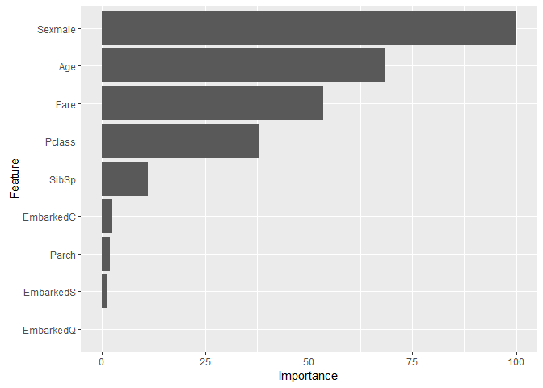
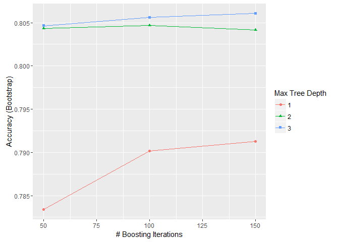
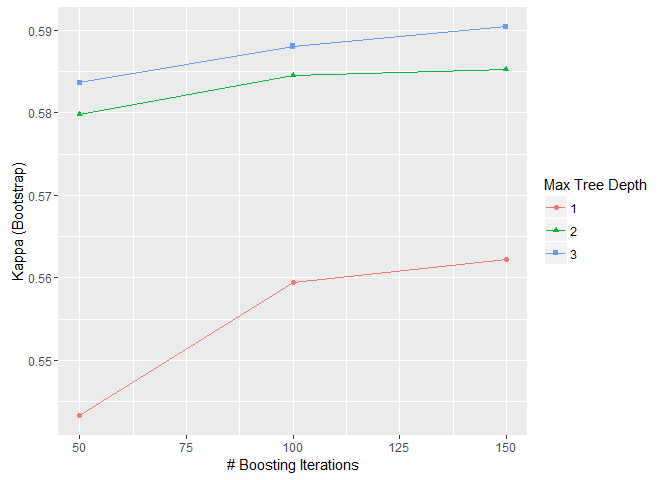
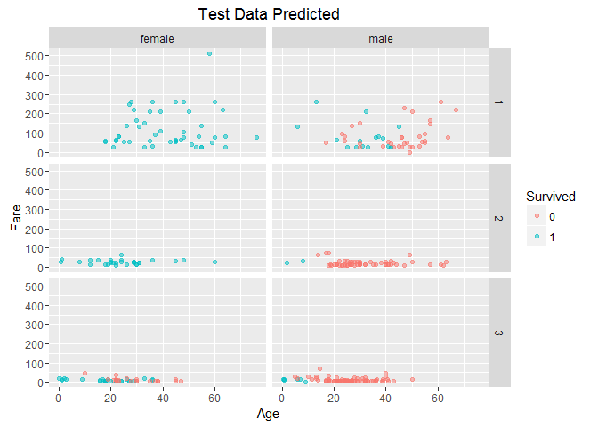
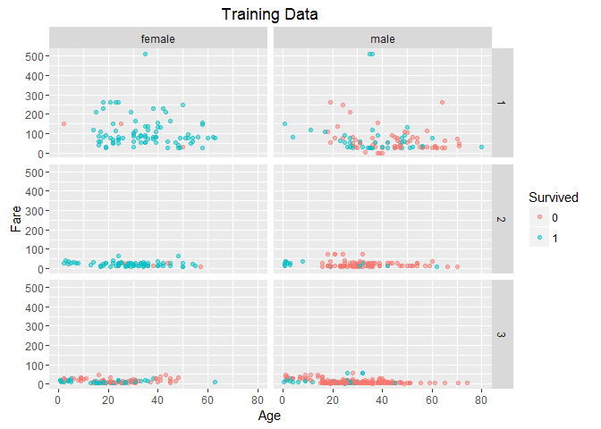
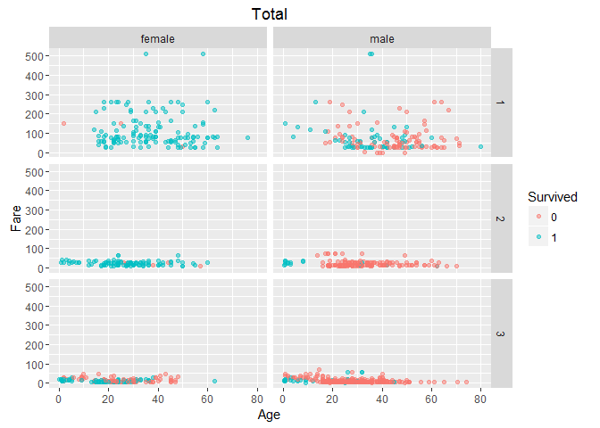

# Titanic: gbm

### Variable Descriptions

**survival**:  Survival (0 = No; 1 = Yes) 

**pclass**:    Passenger Class (1 = 1st; 2 = 2nd; 3 = 3rd) 

**name**:      Name 

**sex**:       Sex 

**age**:       Age 

**sibsp**:     Number of Siblings/Spouses Aboard 

**parch**:     Number of Parents/Children Aboard 

**ticket**:    Ticket Number 

**fare**:      Passenger Fare 

**cabin**:     Cabin 

**embarked**:  Port of Embarkation (C = Cherbourg; Q = Queenstown; S = Southampton) 
 
 

```r
library(caret)
library(dplyr)
library(ggplot2)
library(RCurl)
```

### 1. Reading data


```r
url <- getURL('https://raw.githubusercontent.com/frankwwu/R-Knots/master/Titanic/train.csv')
train <- read.csv(text = url) 
url <- getURL('https://raw.githubusercontent.com/frankwwu/R-Knots/master/Titanic/test.csv')
test <- read.csv(text = url) 
```

### 2.  Removing NA.


```r
train<-train[, !(colnames(train) %in% c('Name', 'Ticket', 'Cabin'))]
train <-train %>% na.omit()
test<-test[, !(colnames(test) %in% c('Name', 'Ticket', 'Cabin'))]
test <- test %>% na.omit()
```

### 3. Selecting features


```r
train$Survived <- factor(train$Survived)
formula = Survived ~ Pclass + Sex + Age + SibSp + Parch + Fare + Embarked
```

### 4. Creating random forests model


```r
set.seed(24)
fit <- suppressMessages(train(formula, data=train, method="gbm"))
```

```
## Warning: package 'gbm' was built under R version 3.2.4
```

```
## Iter   TrainDeviance   ValidDeviance   StepSize   Improve
##      1        1.3198             nan     0.1000    0.0194
##      2        1.2892             nan     0.1000    0.0169
##      3        1.2611             nan     0.1000    0.0123
##      4        1.2368             nan     0.1000    0.0091
##      5        1.2175             nan     0.1000    0.0093
##      6        1.1961             nan     0.1000    0.0098
##      7        1.1819             nan     0.1000    0.0061
##      8        1.1654             nan     0.1000    0.0080
##      9        1.1524             nan     0.1000    0.0057
##     10        1.1371             nan     0.1000    0.0066
##     20        1.0559             nan     0.1000    0.0010
##     40        0.9882             nan     0.1000    0.0005
##     60        0.9568             nan     0.1000   -0.0011
##     80        0.9335             nan     0.1000   -0.0011
##    100        0.9130             nan     0.1000   -0.0002
##    120        0.8956             nan     0.1000   -0.0004
##    140        0.8836             nan     0.1000   -0.0005
##    150        0.8781             nan     0.1000   -0.0003
## 
## Iter   TrainDeviance   ValidDeviance   StepSize   Improve
##      1        1.3077             nan     0.1000    0.0239
##      2        1.2539             nan     0.1000    0.0255
##      3        1.2116             nan     0.1000    0.0210
##      4        1.1865             nan     0.1000    0.0091
##      5        1.1533             nan     0.1000    0.0164
##      6        1.1256             nan     0.1000    0.0109
##      7        1.0998             nan     0.1000    0.0114
##      8        1.0763             nan     0.1000    0.0096
##      9        1.0612             nan     0.1000    0.0061
##     10        1.0445             nan     0.1000    0.0077
##     20        0.9517             nan     0.1000    0.0005
##     40        0.8743             nan     0.1000    0.0002
##     60        0.8228             nan     0.1000    0.0000
##     80        0.7858             nan     0.1000   -0.0007
##    100        0.7582             nan     0.1000   -0.0008
##    120        0.7287             nan     0.1000   -0.0012
##    140        0.6995             nan     0.1000   -0.0007
##    150        0.6880             nan     0.1000   -0.0002
## 
## Iter   TrainDeviance   ValidDeviance   StepSize   Improve
##      1        1.2885             nan     0.1000    0.0339
##      2        1.2280             nan     0.1000    0.0265
##      3        1.1815             nan     0.1000    0.0224
##      4        1.1409             nan     0.1000    0.0183
##      5        1.1140             nan     0.1000    0.0109
##      6        1.0855             nan     0.1000    0.0133
##      7        1.0607             nan     0.1000    0.0099
##      8        1.0379             nan     0.1000    0.0095
##      9        1.0198             nan     0.1000    0.0075
##     10        1.0019             nan     0.1000    0.0086
##     20        0.9019             nan     0.1000    0.0002
##     40        0.8052             nan     0.1000    0.0011
##     60        0.7494             nan     0.1000   -0.0004
##     80        0.7061             nan     0.1000   -0.0002
##    100        0.6689             nan     0.1000   -0.0007
##    120        0.6366             nan     0.1000   -0.0012
##    140        0.6114             nan     0.1000   -0.0002
##    150        0.5991             nan     0.1000   -0.0003
## 
## Iter   TrainDeviance   ValidDeviance   StepSize   Improve
##      1        1.3060             nan     0.1000    0.0252
##      2        1.2681             nan     0.1000    0.0210
##      3        1.2349             nan     0.1000    0.0166
##      4        1.2023             nan     0.1000    0.0124
##      5        1.1771             nan     0.1000    0.0101
##      6        1.1558             nan     0.1000    0.0108
##      7        1.1367             nan     0.1000    0.0084
##      8        1.1142             nan     0.1000    0.0108
##      9        1.0992             nan     0.1000    0.0061
##     10        1.0839             nan     0.1000    0.0079
##     20        0.9866             nan     0.1000    0.0006
##     40        0.9054             nan     0.1000    0.0006
##     60        0.8584             nan     0.1000    0.0000
##     80        0.8313             nan     0.1000   -0.0005
##    100        0.8129             nan     0.1000   -0.0007
##    120        0.7974             nan     0.1000   -0.0009
##    140        0.7844             nan     0.1000   -0.0008
##    150        0.7793             nan     0.1000   -0.0002
## 
## Iter   TrainDeviance   ValidDeviance   StepSize   Improve
##      1        1.2816             nan     0.1000    0.0347
##      2        1.2272             nan     0.1000    0.0304
##      3        1.1790             nan     0.1000    0.0236
##      4        1.1376             nan     0.1000    0.0194
##      5        1.1006             nan     0.1000    0.0150
##      6        1.0676             nan     0.1000    0.0143
##      7        1.0411             nan     0.1000    0.0127
##      8        1.0192             nan     0.1000    0.0103
##      9        1.0014             nan     0.1000    0.0059
##     10        0.9868             nan     0.1000    0.0048
##     20        0.8823             nan     0.1000    0.0013
##     40        0.7806             nan     0.1000   -0.0003
##     60        0.7313             nan     0.1000    0.0001
##     80        0.6936             nan     0.1000    0.0003
##    100        0.6661             nan     0.1000   -0.0001
##    120        0.6373             nan     0.1000   -0.0014
##    140        0.6141             nan     0.1000   -0.0008
##    150        0.6045             nan     0.1000   -0.0010
## 
## Iter   TrainDeviance   ValidDeviance   StepSize   Improve
##      1        1.2736             nan     0.1000    0.0410
##      2        1.2036             nan     0.1000    0.0318
##      3        1.1509             nan     0.1000    0.0256
##      4        1.1039             nan     0.1000    0.0215
##      5        1.0649             nan     0.1000    0.0169
##      6        1.0341             nan     0.1000    0.0146
##      7        1.0043             nan     0.1000    0.0128
##      8        0.9806             nan     0.1000    0.0081
##      9        0.9570             nan     0.1000    0.0108
##     10        0.9382             nan     0.1000    0.0090
##     20        0.8258             nan     0.1000    0.0040
##     40        0.7219             nan     0.1000    0.0005
##     60        0.6566             nan     0.1000   -0.0004
##     80        0.6136             nan     0.1000   -0.0009
##    100        0.5797             nan     0.1000   -0.0007
##    120        0.5482             nan     0.1000   -0.0013
##    140        0.5263             nan     0.1000   -0.0009
##    150        0.5161             nan     0.1000   -0.0019
## 
## Iter   TrainDeviance   ValidDeviance   StepSize   Improve
##      1        1.2696             nan     0.1000    0.0227
##      2        1.2309             nan     0.1000    0.0188
##      3        1.2047             nan     0.1000    0.0142
##      4        1.1753             nan     0.1000    0.0118
##      5        1.1579             nan     0.1000    0.0095
##      6        1.1390             nan     0.1000    0.0078
##      7        1.1244             nan     0.1000    0.0077
##      8        1.1093             nan     0.1000    0.0062
##      9        1.0968             nan     0.1000    0.0062
##     10        1.0833             nan     0.1000    0.0059
##     20        1.0057             nan     0.1000    0.0022
##     40        0.9382             nan     0.1000   -0.0020
##     60        0.9071             nan     0.1000    0.0001
##     80        0.8847             nan     0.1000   -0.0000
##    100        0.8663             nan     0.1000    0.0002
##    120        0.8510             nan     0.1000    0.0002
##    140        0.8361             nan     0.1000   -0.0005
##    150        0.8309             nan     0.1000   -0.0000
## 
## Iter   TrainDeviance   ValidDeviance   StepSize   Improve
##      1        1.2548             nan     0.1000    0.0301
##      2        1.2018             nan     0.1000    0.0247
##      3        1.1608             nan     0.1000    0.0196
##      4        1.1309             nan     0.1000    0.0148
##      5        1.1015             nan     0.1000    0.0147
##      6        1.0764             nan     0.1000    0.0122
##      7        1.0515             nan     0.1000    0.0097
##      8        1.0295             nan     0.1000    0.0096
##      9        1.0118             nan     0.1000    0.0067
##     10        0.9978             nan     0.1000    0.0054
##     20        0.9062             nan     0.1000   -0.0003
##     40        0.8259             nan     0.1000    0.0004
##     60        0.7802             nan     0.1000   -0.0010
##     80        0.7436             nan     0.1000   -0.0010
##    100        0.7108             nan     0.1000   -0.0006
##    120        0.6797             nan     0.1000   -0.0012
##    140        0.6536             nan     0.1000   -0.0008
##    150        0.6429             nan     0.1000   -0.0005
## 
## Iter   TrainDeviance   ValidDeviance   StepSize   Improve
##      1        1.2563             nan     0.1000    0.0319
##      2        1.1948             nan     0.1000    0.0295
##      3        1.1458             nan     0.1000    0.0217
##      4        1.1034             nan     0.1000    0.0208
##      5        1.0684             nan     0.1000    0.0154
##      6        1.0342             nan     0.1000    0.0139
##      7        1.0088             nan     0.1000    0.0122
##      8        0.9855             nan     0.1000    0.0091
##      9        0.9665             nan     0.1000    0.0066
##     10        0.9481             nan     0.1000    0.0077
##     20        0.8440             nan     0.1000   -0.0004
##     40        0.7585             nan     0.1000    0.0005
##     60        0.6988             nan     0.1000   -0.0009
##     80        0.6501             nan     0.1000   -0.0005
##    100        0.6155             nan     0.1000   -0.0010
##    120        0.5832             nan     0.1000   -0.0015
##    140        0.5575             nan     0.1000   -0.0017
##    150        0.5448             nan     0.1000   -0.0011
## 
## Iter   TrainDeviance   ValidDeviance   StepSize   Improve
##      1        1.2841             nan     0.1000    0.0253
##      2        1.2439             nan     0.1000    0.0193
##      3        1.2137             nan     0.1000    0.0158
##      4        1.1816             nan     0.1000    0.0112
##      5        1.1645             nan     0.1000    0.0042
##      6        1.1433             nan     0.1000    0.0084
##      7        1.1269             nan     0.1000    0.0062
##      8        1.1105             nan     0.1000    0.0074
##      9        1.0965             nan     0.1000    0.0059
##     10        1.0858             nan     0.1000    0.0038
##     20        1.0070             nan     0.1000   -0.0007
##     40        0.9452             nan     0.1000    0.0001
##     60        0.9126             nan     0.1000    0.0000
##     80        0.8935             nan     0.1000   -0.0002
##    100        0.8776             nan     0.1000   -0.0005
##    120        0.8652             nan     0.1000   -0.0000
##    140        0.8539             nan     0.1000   -0.0003
##    150        0.8492             nan     0.1000   -0.0013
## 
## Iter   TrainDeviance   ValidDeviance   StepSize   Improve
##      1        1.2640             nan     0.1000    0.0347
##      2        1.2063             nan     0.1000    0.0246
##      3        1.1605             nan     0.1000    0.0193
##      4        1.1329             nan     0.1000    0.0121
##      5        1.1029             nan     0.1000    0.0151
##      6        1.0783             nan     0.1000    0.0118
##      7        1.0521             nan     0.1000    0.0108
##      8        1.0333             nan     0.1000    0.0081
##      9        1.0163             nan     0.1000    0.0089
##     10        1.0042             nan     0.1000    0.0046
##     20        0.9087             nan     0.1000    0.0038
##     40        0.8260             nan     0.1000    0.0003
##     60        0.7751             nan     0.1000    0.0001
##     80        0.7408             nan     0.1000   -0.0002
##    100        0.7148             nan     0.1000   -0.0012
##    120        0.6966             nan     0.1000   -0.0008
##    140        0.6748             nan     0.1000   -0.0002
##    150        0.6644             nan     0.1000   -0.0008
## 
## Iter   TrainDeviance   ValidDeviance   StepSize   Improve
##      1        1.2567             nan     0.1000    0.0352
##      2        1.1995             nan     0.1000    0.0293
##      3        1.1480             nan     0.1000    0.0246
##      4        1.1084             nan     0.1000    0.0182
##      5        1.0750             nan     0.1000    0.0164
##      6        1.0480             nan     0.1000    0.0115
##      7        1.0224             nan     0.1000    0.0111
##      8        1.0005             nan     0.1000    0.0103
##      9        0.9812             nan     0.1000    0.0083
##     10        0.9703             nan     0.1000    0.0033
##     20        0.8649             nan     0.1000    0.0014
##     40        0.7649             nan     0.1000   -0.0004
##     60        0.7036             nan     0.1000    0.0005
##     80        0.6611             nan     0.1000   -0.0004
##    100        0.6219             nan     0.1000   -0.0012
##    120        0.5954             nan     0.1000   -0.0016
##    140        0.5703             nan     0.1000   -0.0017
##    150        0.5598             nan     0.1000   -0.0005
## 
## Iter   TrainDeviance   ValidDeviance   StepSize   Improve
##      1        1.2954             nan     0.1000    0.0268
##      2        1.2550             nan     0.1000    0.0210
##      3        1.2203             nan     0.1000    0.0169
##      4        1.1934             nan     0.1000    0.0114
##      5        1.1673             nan     0.1000    0.0129
##      6        1.1432             nan     0.1000    0.0098
##      7        1.1260             nan     0.1000    0.0068
##      8        1.1096             nan     0.1000    0.0076
##      9        1.0937             nan     0.1000    0.0079
##     10        1.0838             nan     0.1000    0.0038
##     20        0.9996             nan     0.1000    0.0021
##     40        0.9159             nan     0.1000    0.0001
##     60        0.8758             nan     0.1000   -0.0004
##     80        0.8511             nan     0.1000    0.0001
##    100        0.8334             nan     0.1000   -0.0007
##    120        0.8181             nan     0.1000   -0.0001
##    140        0.8069             nan     0.1000   -0.0005
##    150        0.8026             nan     0.1000   -0.0004
## 
## Iter   TrainDeviance   ValidDeviance   StepSize   Improve
##      1        1.2834             nan     0.1000    0.0317
##      2        1.2306             nan     0.1000    0.0251
##      3        1.1853             nan     0.1000    0.0222
##      4        1.1475             nan     0.1000    0.0205
##      5        1.1186             nan     0.1000    0.0147
##      6        1.0928             nan     0.1000    0.0139
##      7        1.0676             nan     0.1000    0.0116
##      8        1.0463             nan     0.1000    0.0106
##      9        1.0323             nan     0.1000    0.0039
##     10        1.0129             nan     0.1000    0.0074
##     20        0.9048             nan     0.1000    0.0021
##     40        0.8172             nan     0.1000    0.0006
##     60        0.7695             nan     0.1000   -0.0010
##     80        0.7349             nan     0.1000   -0.0029
##    100        0.7060             nan     0.1000   -0.0020
##    120        0.6803             nan     0.1000   -0.0014
##    140        0.6610             nan     0.1000   -0.0016
##    150        0.6481             nan     0.1000   -0.0014
## 
## Iter   TrainDeviance   ValidDeviance   StepSize   Improve
##      1        1.2710             nan     0.1000    0.0323
##      2        1.2125             nan     0.1000    0.0282
##      3        1.1599             nan     0.1000    0.0248
##      4        1.1188             nan     0.1000    0.0205
##      5        1.0835             nan     0.1000    0.0168
##      6        1.0521             nan     0.1000    0.0146
##      7        1.0235             nan     0.1000    0.0110
##      8        1.0014             nan     0.1000    0.0070
##      9        0.9812             nan     0.1000    0.0091
##     10        0.9640             nan     0.1000    0.0054
##     20        0.8552             nan     0.1000    0.0034
##     40        0.7632             nan     0.1000   -0.0007
##     60        0.7045             nan     0.1000   -0.0011
##     80        0.6561             nan     0.1000    0.0004
##    100        0.6253             nan     0.1000   -0.0009
##    120        0.5989             nan     0.1000   -0.0002
##    140        0.5717             nan     0.1000   -0.0008
##    150        0.5600             nan     0.1000   -0.0012
## 
## Iter   TrainDeviance   ValidDeviance   StepSize   Improve
##      1        1.2943             nan     0.1000    0.0244
##      2        1.2533             nan     0.1000    0.0192
##      3        1.2246             nan     0.1000    0.0157
##      4        1.2002             nan     0.1000    0.0129
##      5        1.1759             nan     0.1000    0.0109
##      6        1.1564             nan     0.1000    0.0083
##      7        1.1363             nan     0.1000    0.0094
##      8        1.1223             nan     0.1000    0.0067
##      9        1.1059             nan     0.1000    0.0075
##     10        1.0944             nan     0.1000    0.0061
##     20        1.0099             nan     0.1000    0.0024
##     40        0.9365             nan     0.1000    0.0009
##     60        0.8974             nan     0.1000    0.0008
##     80        0.8714             nan     0.1000    0.0003
##    100        0.8526             nan     0.1000   -0.0002
##    120        0.8355             nan     0.1000   -0.0003
##    140        0.8213             nan     0.1000   -0.0003
##    150        0.8160             nan     0.1000   -0.0013
## 
## Iter   TrainDeviance   ValidDeviance   StepSize   Improve
##      1        1.2734             nan     0.1000    0.0309
##      2        1.2189             nan     0.1000    0.0277
##      3        1.1708             nan     0.1000    0.0213
##      4        1.1338             nan     0.1000    0.0139
##      5        1.1027             nan     0.1000    0.0152
##      6        1.0739             nan     0.1000    0.0132
##      7        1.0511             nan     0.1000    0.0112
##      8        1.0319             nan     0.1000    0.0082
##      9        1.0140             nan     0.1000    0.0071
##     10        1.0029             nan     0.1000    0.0021
##     20        0.9025             nan     0.1000    0.0035
##     40        0.8133             nan     0.1000    0.0004
##     60        0.7657             nan     0.1000   -0.0006
##     80        0.7301             nan     0.1000    0.0004
##    100        0.6930             nan     0.1000   -0.0006
##    120        0.6700             nan     0.1000   -0.0003
##    140        0.6423             nan     0.1000   -0.0000
##    150        0.6331             nan     0.1000   -0.0004
## 
## Iter   TrainDeviance   ValidDeviance   StepSize   Improve
##      1        1.2661             nan     0.1000    0.0390
##      2        1.2077             nan     0.1000    0.0288
##      3        1.1557             nan     0.1000    0.0261
##      4        1.1131             nan     0.1000    0.0192
##      5        1.0780             nan     0.1000    0.0157
##      6        1.0502             nan     0.1000    0.0122
##      7        1.0249             nan     0.1000    0.0136
##      8        1.0087             nan     0.1000    0.0050
##      9        0.9875             nan     0.1000    0.0083
##     10        0.9670             nan     0.1000    0.0106
##     20        0.8460             nan     0.1000    0.0033
##     40        0.7411             nan     0.1000    0.0004
##     60        0.6863             nan     0.1000   -0.0009
##     80        0.6489             nan     0.1000   -0.0015
##    100        0.6116             nan     0.1000   -0.0008
##    120        0.5853             nan     0.1000   -0.0012
##    140        0.5533             nan     0.1000   -0.0003
##    150        0.5421             nan     0.1000   -0.0010
## 
## Iter   TrainDeviance   ValidDeviance   StepSize   Improve
##      1        1.2935             nan     0.1000    0.0238
##      2        1.2531             nan     0.1000    0.0188
##      3        1.2237             nan     0.1000    0.0151
##      4        1.1960             nan     0.1000    0.0134
##      5        1.1733             nan     0.1000    0.0123
##      6        1.1468             nan     0.1000    0.0099
##      7        1.1278             nan     0.1000    0.0080
##      8        1.1071             nan     0.1000    0.0097
##      9        1.0955             nan     0.1000    0.0048
##     10        1.0796             nan     0.1000    0.0071
##     20        0.9827             nan     0.1000    0.0029
##     40        0.9084             nan     0.1000    0.0009
##     60        0.8638             nan     0.1000    0.0002
##     80        0.8362             nan     0.1000   -0.0001
##    100        0.8160             nan     0.1000   -0.0002
##    120        0.8003             nan     0.1000   -0.0004
##    140        0.7877             nan     0.1000   -0.0003
##    150        0.7818             nan     0.1000   -0.0002
## 
## Iter   TrainDeviance   ValidDeviance   StepSize   Improve
##      1        1.2611             nan     0.1000    0.0362
##      2        1.2027             nan     0.1000    0.0291
##      3        1.1532             nan     0.1000    0.0246
##      4        1.1160             nan     0.1000    0.0182
##      5        1.0832             nan     0.1000    0.0163
##      6        1.0568             nan     0.1000    0.0124
##      7        1.0319             nan     0.1000    0.0123
##      8        1.0104             nan     0.1000    0.0097
##      9        0.9913             nan     0.1000    0.0069
##     10        0.9720             nan     0.1000    0.0071
##     20        0.8726             nan     0.1000    0.0014
##     40        0.7799             nan     0.1000    0.0003
##     60        0.7273             nan     0.1000    0.0002
##     80        0.6927             nan     0.1000   -0.0010
##    100        0.6672             nan     0.1000    0.0003
##    120        0.6425             nan     0.1000   -0.0007
##    140        0.6275             nan     0.1000   -0.0006
##    150        0.6194             nan     0.1000   -0.0008
## 
## Iter   TrainDeviance   ValidDeviance   StepSize   Improve
##      1        1.2586             nan     0.1000    0.0395
##      2        1.1935             nan     0.1000    0.0310
##      3        1.1403             nan     0.1000    0.0272
##      4        1.0981             nan     0.1000    0.0190
##      5        1.0575             nan     0.1000    0.0187
##      6        1.0242             nan     0.1000    0.0150
##      7        0.9979             nan     0.1000    0.0123
##      8        0.9719             nan     0.1000    0.0112
##      9        0.9494             nan     0.1000    0.0092
##     10        0.9361             nan     0.1000    0.0052
##     20        0.8240             nan     0.1000    0.0032
##     40        0.7242             nan     0.1000   -0.0001
##     60        0.6741             nan     0.1000   -0.0015
##     80        0.6353             nan     0.1000   -0.0012
##    100        0.6046             nan     0.1000   -0.0011
##    120        0.5709             nan     0.1000   -0.0023
##    140        0.5448             nan     0.1000   -0.0023
##    150        0.5340             nan     0.1000   -0.0003
## 
## Iter   TrainDeviance   ValidDeviance   StepSize   Improve
##      1        1.2921             nan     0.1000    0.0272
##      2        1.2433             nan     0.1000    0.0233
##      3        1.2065             nan     0.1000    0.0184
##      4        1.1754             nan     0.1000    0.0145
##      5        1.1491             nan     0.1000    0.0111
##      6        1.1254             nan     0.1000    0.0117
##      7        1.1048             nan     0.1000    0.0091
##      8        1.0906             nan     0.1000    0.0052
##      9        1.0736             nan     0.1000    0.0078
##     10        1.0587             nan     0.1000    0.0067
##     20        0.9647             nan     0.1000    0.0015
##     40        0.8737             nan     0.1000    0.0007
##     60        0.8214             nan     0.1000   -0.0002
##     80        0.7924             nan     0.1000    0.0001
##    100        0.7724             nan     0.1000   -0.0015
##    120        0.7592             nan     0.1000   -0.0006
##    140        0.7466             nan     0.1000   -0.0007
##    150        0.7415             nan     0.1000   -0.0001
## 
## Iter   TrainDeviance   ValidDeviance   StepSize   Improve
##      1        1.2743             nan     0.1000    0.0385
##      2        1.2182             nan     0.1000    0.0281
##      3        1.1640             nan     0.1000    0.0241
##      4        1.1238             nan     0.1000    0.0205
##      5        1.0814             nan     0.1000    0.0161
##      6        1.0528             nan     0.1000    0.0117
##      7        1.0261             nan     0.1000    0.0137
##      8        1.0071             nan     0.1000    0.0092
##      9        0.9847             nan     0.1000    0.0103
##     10        0.9688             nan     0.1000    0.0063
##     20        0.8509             nan     0.1000    0.0030
##     40        0.7522             nan     0.1000    0.0001
##     60        0.7067             nan     0.1000    0.0006
##     80        0.6704             nan     0.1000   -0.0002
##    100        0.6440             nan     0.1000   -0.0000
##    120        0.6210             nan     0.1000   -0.0008
##    140        0.6002             nan     0.1000   -0.0002
##    150        0.5893             nan     0.1000   -0.0012
## 
## Iter   TrainDeviance   ValidDeviance   StepSize   Improve
##      1        1.2609             nan     0.1000    0.0410
##      2        1.1911             nan     0.1000    0.0349
##      3        1.1339             nan     0.1000    0.0254
##      4        1.0905             nan     0.1000    0.0232
##      5        1.0488             nan     0.1000    0.0194
##      6        1.0143             nan     0.1000    0.0154
##      7        0.9842             nan     0.1000    0.0138
##      8        0.9644             nan     0.1000    0.0089
##      9        0.9412             nan     0.1000    0.0085
##     10        0.9220             nan     0.1000    0.0073
##     20        0.8055             nan     0.1000    0.0028
##     40        0.7042             nan     0.1000    0.0000
##     60        0.6422             nan     0.1000   -0.0016
##     80        0.5982             nan     0.1000   -0.0013
##    100        0.5603             nan     0.1000   -0.0012
##    120        0.5330             nan     0.1000    0.0001
##    140        0.5105             nan     0.1000   -0.0005
##    150        0.4980             nan     0.1000   -0.0006
## 
## Iter   TrainDeviance   ValidDeviance   StepSize   Improve
##      1        1.2774             nan     0.1000    0.0235
##      2        1.2370             nan     0.1000    0.0186
##      3        1.2157             nan     0.1000    0.0081
##      4        1.1878             nan     0.1000    0.0151
##      5        1.1636             nan     0.1000    0.0123
##      6        1.1435             nan     0.1000    0.0097
##      7        1.1239             nan     0.1000    0.0100
##      8        1.1085             nan     0.1000    0.0083
##      9        1.0959             nan     0.1000    0.0062
##     10        1.0797             nan     0.1000    0.0062
##     20        0.9891             nan     0.1000    0.0028
##     40        0.8961             nan     0.1000    0.0002
##     60        0.8452             nan     0.1000   -0.0000
##     80        0.8151             nan     0.1000    0.0003
##    100        0.7944             nan     0.1000   -0.0001
##    120        0.7775             nan     0.1000   -0.0012
##    140        0.7637             nan     0.1000   -0.0007
##    150        0.7580             nan     0.1000   -0.0003
## 
## Iter   TrainDeviance   ValidDeviance   StepSize   Improve
##      1        1.2504             nan     0.1000    0.0349
##      2        1.1948             nan     0.1000    0.0274
##      3        1.1548             nan     0.1000    0.0228
##      4        1.1194             nan     0.1000    0.0176
##      5        1.0873             nan     0.1000    0.0156
##      6        1.0602             nan     0.1000    0.0105
##      7        1.0347             nan     0.1000    0.0116
##      8        1.0128             nan     0.1000    0.0111
##      9        0.9959             nan     0.1000    0.0079
##     10        0.9747             nan     0.1000    0.0081
##     20        0.8589             nan     0.1000    0.0019
##     40        0.7574             nan     0.1000   -0.0001
##     60        0.7005             nan     0.1000    0.0003
##     80        0.6569             nan     0.1000   -0.0002
##    100        0.6238             nan     0.1000   -0.0003
##    120        0.6010             nan     0.1000   -0.0002
##    140        0.5788             nan     0.1000    0.0001
##    150        0.5690             nan     0.1000   -0.0004
## 
## Iter   TrainDeviance   ValidDeviance   StepSize   Improve
##      1        1.2425             nan     0.1000    0.0424
##      2        1.1799             nan     0.1000    0.0307
##      3        1.1233             nan     0.1000    0.0260
##      4        1.0799             nan     0.1000    0.0227
##      5        1.0407             nan     0.1000    0.0171
##      6        1.0093             nan     0.1000    0.0132
##      7        0.9815             nan     0.1000    0.0122
##      8        0.9582             nan     0.1000    0.0101
##      9        0.9384             nan     0.1000    0.0086
##     10        0.9171             nan     0.1000    0.0068
##     20        0.7969             nan     0.1000    0.0032
##     40        0.6871             nan     0.1000   -0.0012
##     60        0.6312             nan     0.1000    0.0007
##     80        0.5771             nan     0.1000   -0.0004
##    100        0.5424             nan     0.1000   -0.0005
##    120        0.5110             nan     0.1000   -0.0011
##    140        0.4837             nan     0.1000   -0.0019
##    150        0.4716             nan     0.1000   -0.0003
## 
## Iter   TrainDeviance   ValidDeviance   StepSize   Improve
##      1        1.3011             nan     0.1000    0.0299
##      2        1.2550             nan     0.1000    0.0238
##      3        1.2155             nan     0.1000    0.0195
##      4        1.1805             nan     0.1000    0.0154
##      5        1.1637             nan     0.1000    0.0073
##      6        1.1398             nan     0.1000    0.0125
##      7        1.1220             nan     0.1000    0.0097
##      8        1.1045             nan     0.1000    0.0086
##      9        1.0891             nan     0.1000    0.0071
##     10        1.0737             nan     0.1000    0.0065
##     20        0.9875             nan     0.1000    0.0015
##     40        0.9045             nan     0.1000    0.0015
##     60        0.8625             nan     0.1000    0.0001
##     80        0.8381             nan     0.1000    0.0005
##    100        0.8171             nan     0.1000   -0.0002
##    120        0.8023             nan     0.1000   -0.0002
##    140        0.7902             nan     0.1000   -0.0002
##    150        0.7850             nan     0.1000   -0.0011
## 
## Iter   TrainDeviance   ValidDeviance   StepSize   Improve
##      1        1.2876             nan     0.1000    0.0346
##      2        1.2299             nan     0.1000    0.0256
##      3        1.1807             nan     0.1000    0.0223
##      4        1.1398             nan     0.1000    0.0206
##      5        1.1076             nan     0.1000    0.0138
##      6        1.0722             nan     0.1000    0.0147
##      7        1.0446             nan     0.1000    0.0107
##      8        1.0235             nan     0.1000    0.0104
##      9        1.0052             nan     0.1000    0.0077
##     10        0.9869             nan     0.1000    0.0063
##     20        0.8819             nan     0.1000    0.0033
##     40        0.7901             nan     0.1000    0.0006
##     60        0.7392             nan     0.1000   -0.0005
##     80        0.7070             nan     0.1000   -0.0006
##    100        0.6772             nan     0.1000   -0.0012
##    120        0.6558             nan     0.1000   -0.0014
##    140        0.6337             nan     0.1000   -0.0010
##    150        0.6248             nan     0.1000   -0.0006
## 
## Iter   TrainDeviance   ValidDeviance   StepSize   Improve
##      1        1.2789             nan     0.1000    0.0384
##      2        1.2154             nan     0.1000    0.0301
##      3        1.1600             nan     0.1000    0.0253
##      4        1.1162             nan     0.1000    0.0230
##      5        1.0770             nan     0.1000    0.0179
##      6        1.0403             nan     0.1000    0.0163
##      7        1.0075             nan     0.1000    0.0121
##      8        0.9813             nan     0.1000    0.0106
##      9        0.9612             nan     0.1000    0.0075
##     10        0.9416             nan     0.1000    0.0085
##     20        0.8255             nan     0.1000    0.0003
##     40        0.7290             nan     0.1000   -0.0002
##     60        0.6729             nan     0.1000   -0.0004
##     80        0.6314             nan     0.1000   -0.0004
##    100        0.5938             nan     0.1000   -0.0026
##    120        0.5703             nan     0.1000   -0.0012
##    140        0.5402             nan     0.1000   -0.0015
##    150        0.5270             nan     0.1000   -0.0008
## 
## Iter   TrainDeviance   ValidDeviance   StepSize   Improve
##      1        1.2962             nan     0.1000    0.0292
##      2        1.2446             nan     0.1000    0.0229
##      3        1.2119             nan     0.1000    0.0180
##      4        1.1791             nan     0.1000    0.0156
##      5        1.1500             nan     0.1000    0.0133
##      6        1.1318             nan     0.1000    0.0078
##      7        1.1133             nan     0.1000    0.0107
##      8        1.0940             nan     0.1000    0.0064
##      9        1.0786             nan     0.1000    0.0082
##     10        1.0619             nan     0.1000    0.0080
##     20        0.9675             nan     0.1000    0.0011
##     40        0.8915             nan     0.1000    0.0011
##     60        0.8590             nan     0.1000   -0.0008
##     80        0.8344             nan     0.1000   -0.0009
##    100        0.8164             nan     0.1000   -0.0007
##    120        0.8005             nan     0.1000   -0.0012
##    140        0.7879             nan     0.1000    0.0000
##    150        0.7828             nan     0.1000   -0.0007
## 
## Iter   TrainDeviance   ValidDeviance   StepSize   Improve
##      1        1.2809             nan     0.1000    0.0392
##      2        1.2226             nan     0.1000    0.0306
##      3        1.1718             nan     0.1000    0.0238
##      4        1.1270             nan     0.1000    0.0189
##      5        1.0989             nan     0.1000    0.0122
##      6        1.0663             nan     0.1000    0.0139
##      7        1.0366             nan     0.1000    0.0114
##      8        1.0147             nan     0.1000    0.0095
##      9        0.9933             nan     0.1000    0.0097
##     10        0.9764             nan     0.1000    0.0079
##     20        0.8704             nan     0.1000    0.0016
##     40        0.7850             nan     0.1000   -0.0010
##     60        0.7418             nan     0.1000    0.0004
##     80        0.7044             nan     0.1000   -0.0001
##    100        0.6791             nan     0.1000   -0.0012
##    120        0.6537             nan     0.1000    0.0004
##    140        0.6297             nan     0.1000   -0.0010
##    150        0.6188             nan     0.1000   -0.0014
## 
## Iter   TrainDeviance   ValidDeviance   StepSize   Improve
##      1        1.2773             nan     0.1000    0.0401
##      2        1.2094             nan     0.1000    0.0340
##      3        1.1508             nan     0.1000    0.0274
##      4        1.1024             nan     0.1000    0.0228
##      5        1.0632             nan     0.1000    0.0202
##      6        1.0317             nan     0.1000    0.0160
##      7        1.0023             nan     0.1000    0.0126
##      8        0.9790             nan     0.1000    0.0120
##      9        0.9600             nan     0.1000    0.0084
##     10        0.9363             nan     0.1000    0.0096
##     20        0.8232             nan     0.1000    0.0017
##     40        0.7411             nan     0.1000   -0.0007
##     60        0.6793             nan     0.1000    0.0008
##     80        0.6327             nan     0.1000    0.0002
##    100        0.5966             nan     0.1000   -0.0003
##    120        0.5656             nan     0.1000   -0.0008
##    140        0.5413             nan     0.1000   -0.0001
##    150        0.5296             nan     0.1000   -0.0013
## 
## Iter   TrainDeviance   ValidDeviance   StepSize   Improve
##      1        1.2972             nan     0.1000    0.0339
##      2        1.2429             nan     0.1000    0.0264
##      3        1.1994             nan     0.1000    0.0212
##      4        1.1624             nan     0.1000    0.0175
##      5        1.1327             nan     0.1000    0.0145
##      6        1.1098             nan     0.1000    0.0118
##      7        1.0895             nan     0.1000    0.0102
##      8        1.0728             nan     0.1000    0.0082
##      9        1.0594             nan     0.1000    0.0066
##     10        1.0500             nan     0.1000    0.0035
##     20        0.9706             nan     0.1000    0.0005
##     40        0.9037             nan     0.1000    0.0002
##     60        0.8653             nan     0.1000   -0.0005
##     80        0.8434             nan     0.1000   -0.0007
##    100        0.8286             nan     0.1000   -0.0005
##    120        0.8146             nan     0.1000    0.0000
##    140        0.8034             nan     0.1000   -0.0001
##    150        0.7976             nan     0.1000   -0.0004
## 
## Iter   TrainDeviance   ValidDeviance   StepSize   Improve
##      1        1.2909             nan     0.1000    0.0312
##      2        1.2302             nan     0.1000    0.0314
##      3        1.1798             nan     0.1000    0.0245
##      4        1.1398             nan     0.1000    0.0213
##      5        1.1109             nan     0.1000    0.0153
##      6        1.0807             nan     0.1000    0.0144
##      7        1.0557             nan     0.1000    0.0119
##      8        1.0337             nan     0.1000    0.0111
##      9        1.0147             nan     0.1000    0.0077
##     10        0.9969             nan     0.1000    0.0076
##     20        0.8932             nan     0.1000    0.0030
##     40        0.7982             nan     0.1000   -0.0004
##     60        0.7526             nan     0.1000    0.0003
##     80        0.7189             nan     0.1000    0.0002
##    100        0.6858             nan     0.1000   -0.0017
##    120        0.6608             nan     0.1000   -0.0002
##    140        0.6371             nan     0.1000   -0.0016
##    150        0.6259             nan     0.1000    0.0000
## 
## Iter   TrainDeviance   ValidDeviance   StepSize   Improve
##      1        1.2872             nan     0.1000    0.0387
##      2        1.2205             nan     0.1000    0.0318
##      3        1.1689             nan     0.1000    0.0246
##      4        1.1194             nan     0.1000    0.0216
##      5        1.0830             nan     0.1000    0.0181
##      6        1.0507             nan     0.1000    0.0152
##      7        1.0229             nan     0.1000    0.0124
##      8        1.0006             nan     0.1000    0.0100
##      9        0.9816             nan     0.1000    0.0084
##     10        0.9625             nan     0.1000    0.0074
##     20        0.8500             nan     0.1000    0.0037
##     40        0.7497             nan     0.1000    0.0017
##     60        0.6796             nan     0.1000    0.0013
##     80        0.6345             nan     0.1000   -0.0025
##    100        0.5967             nan     0.1000    0.0001
##    120        0.5654             nan     0.1000   -0.0004
##    140        0.5355             nan     0.1000   -0.0008
##    150        0.5226             nan     0.1000   -0.0010
## 
## Iter   TrainDeviance   ValidDeviance   StepSize   Improve
##      1        1.3083             nan     0.1000    0.0233
##      2        1.2705             nan     0.1000    0.0184
##      3        1.2386             nan     0.1000    0.0140
##      4        1.2129             nan     0.1000    0.0106
##      5        1.1906             nan     0.1000    0.0122
##      6        1.1720             nan     0.1000    0.0098
##      7        1.1518             nan     0.1000    0.0076
##      8        1.1346             nan     0.1000    0.0082
##      9        1.1180             nan     0.1000    0.0060
##     10        1.1060             nan     0.1000    0.0056
##     20        1.0249             nan     0.1000    0.0021
##     40        0.9473             nan     0.1000    0.0005
##     60        0.9097             nan     0.1000    0.0008
##     80        0.8838             nan     0.1000    0.0001
##    100        0.8689             nan     0.1000    0.0003
##    120        0.8551             nan     0.1000   -0.0007
##    140        0.8446             nan     0.1000   -0.0007
##    150        0.8402             nan     0.1000   -0.0010
## 
## Iter   TrainDeviance   ValidDeviance   StepSize   Improve
##      1        1.2904             nan     0.1000    0.0329
##      2        1.2364             nan     0.1000    0.0276
##      3        1.1908             nan     0.1000    0.0191
##      4        1.1553             nan     0.1000    0.0164
##      5        1.1285             nan     0.1000    0.0138
##      6        1.1084             nan     0.1000    0.0084
##      7        1.0822             nan     0.1000    0.0096
##      8        1.0608             nan     0.1000    0.0089
##      9        1.0440             nan     0.1000    0.0075
##     10        1.0272             nan     0.1000    0.0073
##     20        0.9271             nan     0.1000    0.0043
##     40        0.8404             nan     0.1000    0.0010
##     60        0.7917             nan     0.1000   -0.0005
##     80        0.7649             nan     0.1000   -0.0004
##    100        0.7355             nan     0.1000   -0.0007
##    120        0.7074             nan     0.1000   -0.0008
##    140        0.6826             nan     0.1000   -0.0005
##    150        0.6713             nan     0.1000   -0.0003
## 
## Iter   TrainDeviance   ValidDeviance   StepSize   Improve
##      1        1.2833             nan     0.1000    0.0352
##      2        1.2212             nan     0.1000    0.0296
##      3        1.1719             nan     0.1000    0.0227
##      4        1.1327             nan     0.1000    0.0176
##      5        1.0999             nan     0.1000    0.0164
##      6        1.0757             nan     0.1000    0.0110
##      7        1.0473             nan     0.1000    0.0096
##      8        1.0269             nan     0.1000    0.0070
##      9        1.0064             nan     0.1000    0.0079
##     10        0.9890             nan     0.1000    0.0057
##     20        0.8802             nan     0.1000    0.0024
##     40        0.7845             nan     0.1000   -0.0006
##     60        0.7244             nan     0.1000   -0.0005
##     80        0.6786             nan     0.1000   -0.0012
##    100        0.6406             nan     0.1000   -0.0007
##    120        0.6038             nan     0.1000   -0.0016
##    140        0.5769             nan     0.1000   -0.0007
##    150        0.5655             nan     0.1000    0.0002
## 
## Iter   TrainDeviance   ValidDeviance   StepSize   Improve
##      1        1.3109             nan     0.1000    0.0271
##      2        1.2651             nan     0.1000    0.0223
##      3        1.2290             nan     0.1000    0.0179
##      4        1.1973             nan     0.1000    0.0144
##      5        1.1758             nan     0.1000    0.0120
##      6        1.1586             nan     0.1000    0.0078
##      7        1.1369             nan     0.1000    0.0098
##      8        1.1223             nan     0.1000    0.0058
##      9        1.1097             nan     0.1000    0.0053
##     10        1.0919             nan     0.1000    0.0074
##     20        0.9922             nan     0.1000    0.0025
##     40        0.9103             nan     0.1000   -0.0001
##     60        0.8686             nan     0.1000    0.0001
##     80        0.8413             nan     0.1000   -0.0005
##    100        0.8206             nan     0.1000   -0.0001
##    120        0.8057             nan     0.1000   -0.0006
##    140        0.7935             nan     0.1000   -0.0006
##    150        0.7872             nan     0.1000   -0.0012
## 
## Iter   TrainDeviance   ValidDeviance   StepSize   Improve
##      1        1.3006             nan     0.1000    0.0330
##      2        1.2418             nan     0.1000    0.0274
##      3        1.1969             nan     0.1000    0.0249
##      4        1.1537             nan     0.1000    0.0207
##      5        1.1212             nan     0.1000    0.0177
##      6        1.0900             nan     0.1000    0.0150
##      7        1.0645             nan     0.1000    0.0119
##      8        1.0448             nan     0.1000    0.0080
##      9        1.0238             nan     0.1000    0.0089
##     10        1.0069             nan     0.1000    0.0078
##     20        0.8886             nan     0.1000    0.0021
##     40        0.7895             nan     0.1000   -0.0002
##     60        0.7427             nan     0.1000   -0.0011
##     80        0.7088             nan     0.1000   -0.0019
##    100        0.6769             nan     0.1000    0.0001
##    120        0.6514             nan     0.1000   -0.0006
##    140        0.6287             nan     0.1000    0.0001
##    150        0.6207             nan     0.1000   -0.0012
## 
## Iter   TrainDeviance   ValidDeviance   StepSize   Improve
##      1        1.2878             nan     0.1000    0.0431
##      2        1.2166             nan     0.1000    0.0345
##      3        1.1604             nan     0.1000    0.0251
##      4        1.1148             nan     0.1000    0.0216
##      5        1.0784             nan     0.1000    0.0184
##      6        1.0457             nan     0.1000    0.0159
##      7        1.0178             nan     0.1000    0.0136
##      8        0.9893             nan     0.1000    0.0134
##      9        0.9636             nan     0.1000    0.0097
##     10        0.9457             nan     0.1000    0.0081
##     20        0.8300             nan     0.1000    0.0025
##     40        0.7279             nan     0.1000   -0.0009
##     60        0.6683             nan     0.1000   -0.0006
##     80        0.6251             nan     0.1000   -0.0015
##    100        0.5843             nan     0.1000   -0.0009
##    120        0.5565             nan     0.1000    0.0004
##    140        0.5297             nan     0.1000   -0.0011
##    150        0.5184             nan     0.1000   -0.0012
## 
## Iter   TrainDeviance   ValidDeviance   StepSize   Improve
##      1        1.3157             nan     0.1000    0.0268
##      2        1.2736             nan     0.1000    0.0216
##      3        1.2373             nan     0.1000    0.0172
##      4        1.2079             nan     0.1000    0.0136
##      5        1.1849             nan     0.1000    0.0103
##      6        1.1630             nan     0.1000    0.0109
##      7        1.1436             nan     0.1000    0.0085
##      8        1.1267             nan     0.1000    0.0065
##      9        1.1123             nan     0.1000    0.0059
##     10        1.0997             nan     0.1000    0.0054
##     20        1.0102             nan     0.1000    0.0018
##     40        0.9441             nan     0.1000   -0.0001
##     60        0.9081             nan     0.1000    0.0003
##     80        0.8867             nan     0.1000   -0.0001
##    100        0.8689             nan     0.1000   -0.0005
##    120        0.8549             nan     0.1000   -0.0002
##    140        0.8432             nan     0.1000   -0.0004
##    150        0.8369             nan     0.1000   -0.0005
## 
## Iter   TrainDeviance   ValidDeviance   StepSize   Improve
##      1        1.3044             nan     0.1000    0.0350
##      2        1.2470             nan     0.1000    0.0281
##      3        1.2016             nan     0.1000    0.0228
##      4        1.1602             nan     0.1000    0.0182
##      5        1.1392             nan     0.1000    0.0065
##      6        1.1081             nan     0.1000    0.0131
##      7        1.0843             nan     0.1000    0.0112
##      8        1.0620             nan     0.1000    0.0104
##      9        1.0412             nan     0.1000    0.0091
##     10        1.0203             nan     0.1000    0.0083
##     20        0.9191             nan     0.1000    0.0020
##     40        0.8300             nan     0.1000    0.0006
##     60        0.7814             nan     0.1000   -0.0008
##     80        0.7385             nan     0.1000   -0.0010
##    100        0.7093             nan     0.1000   -0.0008
##    120        0.6886             nan     0.1000   -0.0010
##    140        0.6668             nan     0.1000   -0.0013
##    150        0.6579             nan     0.1000   -0.0012
## 
## Iter   TrainDeviance   ValidDeviance   StepSize   Improve
##      1        1.2920             nan     0.1000    0.0364
##      2        1.2300             nan     0.1000    0.0295
##      3        1.1769             nan     0.1000    0.0247
##      4        1.1329             nan     0.1000    0.0212
##      5        1.0936             nan     0.1000    0.0161
##      6        1.0634             nan     0.1000    0.0119
##      7        1.0374             nan     0.1000    0.0129
##      8        1.0145             nan     0.1000    0.0111
##      9        0.9940             nan     0.1000    0.0065
##     10        0.9766             nan     0.1000    0.0077
##     20        0.8642             nan     0.1000    0.0019
##     40        0.7609             nan     0.1000    0.0009
##     60        0.7022             nan     0.1000   -0.0004
##     80        0.6548             nan     0.1000   -0.0006
##    100        0.6203             nan     0.1000   -0.0006
##    120        0.5938             nan     0.1000   -0.0014
##    140        0.5665             nan     0.1000   -0.0011
##    150        0.5507             nan     0.1000   -0.0007
## 
## Iter   TrainDeviance   ValidDeviance   StepSize   Improve
##      1        1.3117             nan     0.1000    0.0330
##      2        1.2574             nan     0.1000    0.0275
##      3        1.2151             nan     0.1000    0.0223
##      4        1.1735             nan     0.1000    0.0176
##      5        1.1450             nan     0.1000    0.0147
##      6        1.1230             nan     0.1000    0.0114
##      7        1.1018             nan     0.1000    0.0100
##      8        1.0825             nan     0.1000    0.0075
##      9        1.0657             nan     0.1000    0.0077
##     10        1.0523             nan     0.1000    0.0060
##     20        0.9666             nan     0.1000    0.0025
##     40        0.8928             nan     0.1000    0.0006
##     60        0.8604             nan     0.1000   -0.0003
##     80        0.8396             nan     0.1000   -0.0004
##    100        0.8253             nan     0.1000   -0.0004
##    120        0.8130             nan     0.1000   -0.0002
##    140        0.8011             nan     0.1000   -0.0013
##    150        0.7958             nan     0.1000   -0.0003
## 
## Iter   TrainDeviance   ValidDeviance   StepSize   Improve
##      1        1.2913             nan     0.1000    0.0377
##      2        1.2228             nan     0.1000    0.0300
##      3        1.1734             nan     0.1000    0.0217
##      4        1.1295             nan     0.1000    0.0193
##      5        1.0917             nan     0.1000    0.0175
##      6        1.0638             nan     0.1000    0.0133
##      7        1.0371             nan     0.1000    0.0137
##      8        1.0145             nan     0.1000    0.0112
##      9        0.9944             nan     0.1000    0.0079
##     10        0.9783             nan     0.1000    0.0054
##     20        0.8781             nan     0.1000    0.0013
##     40        0.7941             nan     0.1000    0.0005
##     60        0.7511             nan     0.1000   -0.0005
##     80        0.7158             nan     0.1000   -0.0006
##    100        0.6886             nan     0.1000   -0.0002
##    120        0.6565             nan     0.1000   -0.0001
##    140        0.6341             nan     0.1000   -0.0008
##    150        0.6245             nan     0.1000   -0.0013
## 
## Iter   TrainDeviance   ValidDeviance   StepSize   Improve
##      1        1.2827             nan     0.1000    0.0426
##      2        1.2123             nan     0.1000    0.0326
##      3        1.1561             nan     0.1000    0.0277
##      4        1.1090             nan     0.1000    0.0217
##      5        1.0705             nan     0.1000    0.0185
##      6        1.0408             nan     0.1000    0.0139
##      7        1.0112             nan     0.1000    0.0140
##      8        0.9853             nan     0.1000    0.0116
##      9        0.9638             nan     0.1000    0.0092
##     10        0.9434             nan     0.1000    0.0060
##     20        0.8335             nan     0.1000    0.0002
##     40        0.7436             nan     0.1000    0.0010
##     60        0.6938             nan     0.1000   -0.0005
##     80        0.6545             nan     0.1000   -0.0003
##    100        0.6191             nan     0.1000    0.0000
##    120        0.5813             nan     0.1000    0.0002
##    140        0.5520             nan     0.1000   -0.0015
##    150        0.5416             nan     0.1000   -0.0004
## 
## Iter   TrainDeviance   ValidDeviance   StepSize   Improve
##      1        1.2914             nan     0.1000    0.0278
##      2        1.2411             nan     0.1000    0.0221
##      3        1.2045             nan     0.1000    0.0174
##      4        1.1764             nan     0.1000    0.0140
##      5        1.1558             nan     0.1000    0.0087
##      6        1.1333             nan     0.1000    0.0115
##      7        1.1130             nan     0.1000    0.0093
##      8        1.0950             nan     0.1000    0.0081
##      9        1.0791             nan     0.1000    0.0071
##     10        1.0638             nan     0.1000    0.0062
##     20        0.9706             nan     0.1000    0.0019
##     40        0.8723             nan     0.1000    0.0009
##     60        0.8204             nan     0.1000    0.0015
##     80        0.7852             nan     0.1000   -0.0001
##    100        0.7607             nan     0.1000    0.0001
##    120        0.7436             nan     0.1000   -0.0002
##    140        0.7304             nan     0.1000   -0.0003
##    150        0.7228             nan     0.1000   -0.0005
## 
## Iter   TrainDeviance   ValidDeviance   StepSize   Improve
##      1        1.2805             nan     0.1000    0.0352
##      2        1.2235             nan     0.1000    0.0291
##      3        1.1728             nan     0.1000    0.0236
##      4        1.1361             nan     0.1000    0.0194
##      5        1.1022             nan     0.1000    0.0170
##      6        1.0717             nan     0.1000    0.0144
##      7        1.0441             nan     0.1000    0.0100
##      8        1.0213             nan     0.1000    0.0087
##      9        0.9978             nan     0.1000    0.0093
##     10        0.9803             nan     0.1000    0.0083
##     20        0.8606             nan     0.1000    0.0027
##     40        0.7514             nan     0.1000   -0.0001
##     60        0.6972             nan     0.1000   -0.0001
##     80        0.6528             nan     0.1000    0.0008
##    100        0.6221             nan     0.1000   -0.0008
##    120        0.5962             nan     0.1000   -0.0002
##    140        0.5751             nan     0.1000   -0.0009
##    150        0.5644             nan     0.1000   -0.0015
## 
## Iter   TrainDeviance   ValidDeviance   StepSize   Improve
##      1        1.2664             nan     0.1000    0.0413
##      2        1.2004             nan     0.1000    0.0318
##      3        1.1422             nan     0.1000    0.0277
##      4        1.1030             nan     0.1000    0.0197
##      5        1.0680             nan     0.1000    0.0179
##      6        1.0363             nan     0.1000    0.0161
##      7        1.0078             nan     0.1000    0.0119
##      8        0.9820             nan     0.1000    0.0126
##      9        0.9547             nan     0.1000    0.0122
##     10        0.9322             nan     0.1000    0.0081
##     20        0.8075             nan     0.1000    0.0029
##     40        0.6983             nan     0.1000   -0.0026
##     60        0.6313             nan     0.1000   -0.0006
##     80        0.5873             nan     0.1000   -0.0004
##    100        0.5518             nan     0.1000   -0.0005
##    120        0.5236             nan     0.1000   -0.0004
##    140        0.5002             nan     0.1000   -0.0017
##    150        0.4890             nan     0.1000   -0.0002
## 
## Iter   TrainDeviance   ValidDeviance   StepSize   Improve
##      1        1.3053             nan     0.1000    0.0336
##      2        1.2510             nan     0.1000    0.0262
##      3        1.2077             nan     0.1000    0.0216
##      4        1.1718             nan     0.1000    0.0185
##      5        1.1406             nan     0.1000    0.0123
##      6        1.1100             nan     0.1000    0.0134
##      7        1.0871             nan     0.1000    0.0112
##      8        1.0632             nan     0.1000    0.0106
##      9        1.0439             nan     0.1000    0.0088
##     10        1.0268             nan     0.1000    0.0069
##     20        0.9201             nan     0.1000    0.0031
##     40        0.8325             nan     0.1000    0.0007
##     60        0.7906             nan     0.1000   -0.0003
##     80        0.7657             nan     0.1000   -0.0008
##    100        0.7493             nan     0.1000   -0.0000
##    120        0.7383             nan     0.1000   -0.0003
##    140        0.7251             nan     0.1000   -0.0003
##    150        0.7200             nan     0.1000   -0.0009
## 
## Iter   TrainDeviance   ValidDeviance   StepSize   Improve
##      1        1.2969             nan     0.1000    0.0416
##      2        1.2302             nan     0.1000    0.0316
##      3        1.1756             nan     0.1000    0.0263
##      4        1.1302             nan     0.1000    0.0201
##      5        1.0903             nan     0.1000    0.0174
##      6        1.0579             nan     0.1000    0.0166
##      7        1.0284             nan     0.1000    0.0145
##      8        1.0038             nan     0.1000    0.0106
##      9        0.9779             nan     0.1000    0.0114
##     10        0.9562             nan     0.1000    0.0092
##     20        0.8329             nan     0.1000    0.0030
##     40        0.7267             nan     0.1000   -0.0004
##     60        0.6785             nan     0.1000   -0.0007
##     80        0.6424             nan     0.1000    0.0004
##    100        0.6209             nan     0.1000    0.0001
##    120        0.5981             nan     0.1000   -0.0009
##    140        0.5772             nan     0.1000   -0.0007
##    150        0.5649             nan     0.1000    0.0001
## 
## Iter   TrainDeviance   ValidDeviance   StepSize   Improve
##      1        1.2836             nan     0.1000    0.0441
##      2        1.2097             nan     0.1000    0.0363
##      3        1.1503             nan     0.1000    0.0287
##      4        1.1000             nan     0.1000    0.0258
##      5        1.0545             nan     0.1000    0.0228
##      6        1.0213             nan     0.1000    0.0162
##      7        0.9872             nan     0.1000    0.0165
##      8        0.9581             nan     0.1000    0.0135
##      9        0.9328             nan     0.1000    0.0099
##     10        0.9134             nan     0.1000    0.0095
##     20        0.7746             nan     0.1000    0.0055
##     40        0.6736             nan     0.1000   -0.0001
##     60        0.6113             nan     0.1000   -0.0004
##     80        0.5662             nan     0.1000   -0.0009
##    100        0.5386             nan     0.1000   -0.0008
##    120        0.5092             nan     0.1000   -0.0010
##    140        0.4854             nan     0.1000   -0.0003
##    150        0.4765             nan     0.1000   -0.0011
## 
## Iter   TrainDeviance   ValidDeviance   StepSize   Improve
##      1        1.3056             nan     0.1000    0.0275
##      2        1.2576             nan     0.1000    0.0226
##      3        1.2203             nan     0.1000    0.0187
##      4        1.1912             nan     0.1000    0.0146
##      5        1.1677             nan     0.1000    0.0120
##      6        1.1438             nan     0.1000    0.0120
##      7        1.1222             nan     0.1000    0.0093
##      8        1.1015             nan     0.1000    0.0088
##      9        1.0832             nan     0.1000    0.0061
##     10        1.0686             nan     0.1000    0.0066
##     20        0.9823             nan     0.1000    0.0021
##     40        0.9135             nan     0.1000   -0.0003
##     60        0.8740             nan     0.1000    0.0004
##     80        0.8501             nan     0.1000   -0.0006
##    100        0.8323             nan     0.1000   -0.0012
##    120        0.8209             nan     0.1000   -0.0002
##    140        0.8079             nan     0.1000   -0.0005
##    150        0.8034             nan     0.1000   -0.0006
## 
## Iter   TrainDeviance   ValidDeviance   StepSize   Improve
##      1        1.2825             nan     0.1000    0.0381
##      2        1.2221             nan     0.1000    0.0282
##      3        1.1743             nan     0.1000    0.0250
##      4        1.1351             nan     0.1000    0.0167
##      5        1.0993             nan     0.1000    0.0169
##      6        1.0708             nan     0.1000    0.0135
##      7        1.0442             nan     0.1000    0.0116
##      8        1.0221             nan     0.1000    0.0096
##      9        1.0079             nan     0.1000    0.0053
##     10        0.9895             nan     0.1000    0.0085
##     20        0.8909             nan     0.1000    0.0013
##     40        0.7929             nan     0.1000    0.0006
##     60        0.7425             nan     0.1000   -0.0004
##     80        0.7120             nan     0.1000    0.0004
##    100        0.6898             nan     0.1000   -0.0004
##    120        0.6606             nan     0.1000    0.0002
##    140        0.6411             nan     0.1000   -0.0007
##    150        0.6334             nan     0.1000   -0.0013
## 
## Iter   TrainDeviance   ValidDeviance   StepSize   Improve
##      1        1.2750             nan     0.1000    0.0382
##      2        1.2109             nan     0.1000    0.0284
##      3        1.1609             nan     0.1000    0.0245
##      4        1.1175             nan     0.1000    0.0221
##      5        1.0811             nan     0.1000    0.0144
##      6        1.0479             nan     0.1000    0.0157
##      7        1.0184             nan     0.1000    0.0127
##      8        0.9946             nan     0.1000    0.0120
##      9        0.9729             nan     0.1000    0.0099
##     10        0.9550             nan     0.1000    0.0092
##     20        0.8371             nan     0.1000    0.0003
##     40        0.7305             nan     0.1000   -0.0006
##     60        0.6715             nan     0.1000   -0.0015
##     80        0.6280             nan     0.1000   -0.0015
##    100        0.6004             nan     0.1000   -0.0011
##    120        0.5705             nan     0.1000   -0.0003
##    140        0.5462             nan     0.1000   -0.0005
##    150        0.5362             nan     0.1000   -0.0012
## 
## Iter   TrainDeviance   ValidDeviance   StepSize   Improve
##      1        1.3115             nan     0.1000    0.0235
##      2        1.2750             nan     0.1000    0.0191
##      3        1.2438             nan     0.1000    0.0155
##      4        1.2198             nan     0.1000    0.0087
##      5        1.1970             nan     0.1000    0.0123
##      6        1.1742             nan     0.1000    0.0108
##      7        1.1552             nan     0.1000    0.0088
##      8        1.1382             nan     0.1000    0.0071
##      9        1.1179             nan     0.1000    0.0091
##     10        1.1017             nan     0.1000    0.0075
##     20        1.0089             nan     0.1000    0.0017
##     40        0.9265             nan     0.1000    0.0013
##     60        0.8812             nan     0.1000   -0.0001
##     80        0.8571             nan     0.1000   -0.0002
##    100        0.8385             nan     0.1000   -0.0004
##    120        0.8217             nan     0.1000    0.0001
##    140        0.8078             nan     0.1000   -0.0001
##    150        0.8014             nan     0.1000   -0.0002
## 
## Iter   TrainDeviance   ValidDeviance   StepSize   Improve
##      1        1.2910             nan     0.1000    0.0331
##      2        1.2387             nan     0.1000    0.0267
##      3        1.1937             nan     0.1000    0.0194
##      4        1.1579             nan     0.1000    0.0188
##      5        1.1271             nan     0.1000    0.0156
##      6        1.0979             nan     0.1000    0.0149
##      7        1.0731             nan     0.1000    0.0117
##      8        1.0488             nan     0.1000    0.0090
##      9        1.0341             nan     0.1000    0.0062
##     10        1.0183             nan     0.1000    0.0081
##     20        0.8992             nan     0.1000    0.0025
##     40        0.8050             nan     0.1000   -0.0004
##     60        0.7513             nan     0.1000    0.0001
##     80        0.7220             nan     0.1000   -0.0013
##    100        0.6938             nan     0.1000   -0.0010
##    120        0.6723             nan     0.1000   -0.0008
##    140        0.6509             nan     0.1000   -0.0009
##    150        0.6439             nan     0.1000   -0.0017
## 
## Iter   TrainDeviance   ValidDeviance   StepSize   Improve
##      1        1.2856             nan     0.1000    0.0351
##      2        1.2260             nan     0.1000    0.0281
##      3        1.1756             nan     0.1000    0.0265
##      4        1.1332             nan     0.1000    0.0179
##      5        1.0907             nan     0.1000    0.0192
##      6        1.0574             nan     0.1000    0.0147
##      7        1.0302             nan     0.1000    0.0143
##      8        1.0072             nan     0.1000    0.0103
##      9        0.9874             nan     0.1000    0.0086
##     10        0.9687             nan     0.1000    0.0079
##     20        0.8417             nan     0.1000    0.0023
##     40        0.7437             nan     0.1000    0.0002
##     60        0.6862             nan     0.1000   -0.0008
##     80        0.6416             nan     0.1000   -0.0001
##    100        0.6084             nan     0.1000   -0.0009
##    120        0.5771             nan     0.1000   -0.0003
##    140        0.5520             nan     0.1000   -0.0014
##    150        0.5370             nan     0.1000   -0.0006
## 
## Iter   TrainDeviance   ValidDeviance   StepSize   Improve
##      1        1.2961             nan     0.1000    0.0252
##      2        1.2536             nan     0.1000    0.0204
##      3        1.2234             nan     0.1000    0.0159
##      4        1.1946             nan     0.1000    0.0130
##      5        1.1709             nan     0.1000    0.0102
##      6        1.1504             nan     0.1000    0.0073
##      7        1.1304             nan     0.1000    0.0072
##      8        1.1140             nan     0.1000    0.0079
##      9        1.0999             nan     0.1000    0.0046
##     10        1.0873             nan     0.1000    0.0061
##     20        1.0028             nan     0.1000    0.0030
##     40        0.9168             nan     0.1000    0.0003
##     60        0.8691             nan     0.1000    0.0002
##     80        0.8417             nan     0.1000    0.0005
##    100        0.8231             nan     0.1000   -0.0003
##    120        0.8097             nan     0.1000   -0.0014
##    140        0.7980             nan     0.1000   -0.0005
##    150        0.7932             nan     0.1000   -0.0010
## 
## Iter   TrainDeviance   ValidDeviance   StepSize   Improve
##      1        1.2848             nan     0.1000    0.0313
##      2        1.2283             nan     0.1000    0.0263
##      3        1.1834             nan     0.1000    0.0211
##      4        1.1466             nan     0.1000    0.0170
##      5        1.1145             nan     0.1000    0.0153
##      6        1.0893             nan     0.1000    0.0127
##      7        1.0650             nan     0.1000    0.0092
##      8        1.0464             nan     0.1000    0.0081
##      9        1.0260             nan     0.1000    0.0094
##     10        1.0085             nan     0.1000    0.0081
##     20        0.9022             nan     0.1000    0.0008
##     40        0.7946             nan     0.1000    0.0017
##     60        0.7408             nan     0.1000   -0.0000
##     80        0.6957             nan     0.1000   -0.0006
##    100        0.6673             nan     0.1000   -0.0008
##    120        0.6378             nan     0.1000    0.0002
##    140        0.6139             nan     0.1000   -0.0009
##    150        0.6036             nan     0.1000   -0.0004
## 
## Iter   TrainDeviance   ValidDeviance   StepSize   Improve
##      1        1.2728             nan     0.1000    0.0384
##      2        1.2126             nan     0.1000    0.0288
##      3        1.1623             nan     0.1000    0.0221
##      4        1.1180             nan     0.1000    0.0195
##      5        1.0811             nan     0.1000    0.0173
##      6        1.0480             nan     0.1000    0.0162
##      7        1.0182             nan     0.1000    0.0098
##      8        0.9951             nan     0.1000    0.0093
##      9        0.9760             nan     0.1000    0.0072
##     10        0.9555             nan     0.1000    0.0089
##     20        0.8342             nan     0.1000    0.0006
##     40        0.7285             nan     0.1000    0.0009
##     60        0.6609             nan     0.1000    0.0006
##     80        0.6162             nan     0.1000   -0.0005
##    100        0.5817             nan     0.1000   -0.0017
##    120        0.5515             nan     0.1000   -0.0003
##    140        0.5259             nan     0.1000   -0.0010
##    150        0.5111             nan     0.1000   -0.0002
## 
## Iter   TrainDeviance   ValidDeviance   StepSize   Improve
##      1        1.3059             nan     0.1000    0.0179
##      2        1.2758             nan     0.1000    0.0140
##      3        1.2496             nan     0.1000    0.0106
##      4        1.2230             nan     0.1000    0.0127
##      5        1.2005             nan     0.1000    0.0085
##      6        1.1827             nan     0.1000    0.0084
##      7        1.1646             nan     0.1000    0.0092
##      8        1.1504             nan     0.1000    0.0076
##      9        1.1350             nan     0.1000    0.0063
##     10        1.1191             nan     0.1000    0.0058
##     20        1.0291             nan     0.1000    0.0033
##     40        0.9527             nan     0.1000    0.0003
##     60        0.9112             nan     0.1000    0.0002
##     80        0.8881             nan     0.1000   -0.0006
##    100        0.8709             nan     0.1000   -0.0009
##    120        0.8594             nan     0.1000   -0.0004
##    140        0.8491             nan     0.1000   -0.0008
##    150        0.8437             nan     0.1000   -0.0004
## 
## Iter   TrainDeviance   ValidDeviance   StepSize   Improve
##      1        1.2840             nan     0.1000    0.0270
##      2        1.2482             nan     0.1000    0.0157
##      3        1.2156             nan     0.1000    0.0145
##      4        1.1769             nan     0.1000    0.0183
##      5        1.1429             nan     0.1000    0.0148
##      6        1.1159             nan     0.1000    0.0109
##      7        1.0918             nan     0.1000    0.0113
##      8        1.0711             nan     0.1000    0.0095
##      9        1.0550             nan     0.1000    0.0060
##     10        1.0381             nan     0.1000    0.0056
##     20        0.9233             nan     0.1000    0.0026
##     40        0.8396             nan     0.1000   -0.0007
##     60        0.7913             nan     0.1000   -0.0001
##     80        0.7568             nan     0.1000    0.0002
##    100        0.7278             nan     0.1000    0.0001
##    120        0.7005             nan     0.1000   -0.0013
##    140        0.6767             nan     0.1000   -0.0007
##    150        0.6654             nan     0.1000   -0.0008
## 
## Iter   TrainDeviance   ValidDeviance   StepSize   Improve
##      1        1.2736             nan     0.1000    0.0345
##      2        1.2168             nan     0.1000    0.0262
##      3        1.1655             nan     0.1000    0.0233
##      4        1.1308             nan     0.1000    0.0123
##      5        1.0946             nan     0.1000    0.0176
##      6        1.0653             nan     0.1000    0.0119
##      7        1.0423             nan     0.1000    0.0102
##      8        1.0219             nan     0.1000    0.0088
##      9        1.0030             nan     0.1000    0.0057
##     10        0.9863             nan     0.1000    0.0060
##     20        0.8744             nan     0.1000    0.0010
##     40        0.7852             nan     0.1000   -0.0006
##     60        0.7321             nan     0.1000   -0.0021
##     80        0.6885             nan     0.1000    0.0002
##    100        0.6474             nan     0.1000   -0.0003
##    120        0.6188             nan     0.1000    0.0002
##    140        0.5933             nan     0.1000    0.0007
##    150        0.5786             nan     0.1000   -0.0005
## 
## Iter   TrainDeviance   ValidDeviance   StepSize   Improve
##      1        1.2910             nan     0.1000    0.0267
##      2        1.2476             nan     0.1000    0.0207
##      3        1.2130             nan     0.1000    0.0167
##      4        1.1844             nan     0.1000    0.0134
##      5        1.1606             nan     0.1000    0.0098
##      6        1.1399             nan     0.1000    0.0099
##      7        1.1233             nan     0.1000    0.0085
##      8        1.1064             nan     0.1000    0.0061
##      9        1.0910             nan     0.1000    0.0071
##     10        1.0776             nan     0.1000    0.0063
##     20        0.9874             nan     0.1000    0.0025
##     40        0.9139             nan     0.1000    0.0004
##     60        0.8750             nan     0.1000    0.0002
##     80        0.8501             nan     0.1000   -0.0006
##    100        0.8301             nan     0.1000   -0.0002
##    120        0.8158             nan     0.1000    0.0001
##    140        0.8038             nan     0.1000   -0.0004
##    150        0.7979             nan     0.1000   -0.0001
## 
## Iter   TrainDeviance   ValidDeviance   StepSize   Improve
##      1        1.2679             nan     0.1000    0.0350
##      2        1.2074             nan     0.1000    0.0268
##      3        1.1636             nan     0.1000    0.0195
##      4        1.1249             nan     0.1000    0.0199
##      5        1.0928             nan     0.1000    0.0156
##      6        1.0669             nan     0.1000    0.0121
##      7        1.0442             nan     0.1000    0.0108
##      8        1.0230             nan     0.1000    0.0084
##      9        1.0055             nan     0.1000    0.0062
##     10        0.9907             nan     0.1000    0.0070
##     20        0.8873             nan     0.1000    0.0022
##     40        0.7967             nan     0.1000   -0.0007
##     60        0.7544             nan     0.1000   -0.0011
##     80        0.7172             nan     0.1000   -0.0001
##    100        0.6862             nan     0.1000   -0.0001
##    120        0.6611             nan     0.1000   -0.0005
##    140        0.6401             nan     0.1000   -0.0017
##    150        0.6332             nan     0.1000   -0.0003
## 
## Iter   TrainDeviance   ValidDeviance   StepSize   Improve
##      1        1.2643             nan     0.1000    0.0375
##      2        1.2031             nan     0.1000    0.0315
##      3        1.1502             nan     0.1000    0.0263
##      4        1.1039             nan     0.1000    0.0220
##      5        1.0670             nan     0.1000    0.0173
##      6        1.0321             nan     0.1000    0.0146
##      7        1.0044             nan     0.1000    0.0115
##      8        0.9791             nan     0.1000    0.0100
##      9        0.9584             nan     0.1000    0.0074
##     10        0.9407             nan     0.1000    0.0063
##     20        0.8160             nan     0.1000    0.0021
##     40        0.7255             nan     0.1000   -0.0023
##     60        0.6712             nan     0.1000   -0.0005
##     80        0.6311             nan     0.1000   -0.0001
##    100        0.5933             nan     0.1000   -0.0020
##    120        0.5654             nan     0.1000   -0.0011
##    140        0.5418             nan     0.1000   -0.0024
##    150        0.5320             nan     0.1000   -0.0008
## 
## Iter   TrainDeviance   ValidDeviance   StepSize   Improve
##      1        1.2901             nan     0.1000    0.0250
##      2        1.2492             nan     0.1000    0.0208
##      3        1.2163             nan     0.1000    0.0153
##      4        1.1898             nan     0.1000    0.0134
##      5        1.1662             nan     0.1000    0.0108
##      6        1.1479             nan     0.1000    0.0089
##      7        1.1291             nan     0.1000    0.0054
##      8        1.1152             nan     0.1000    0.0056
##      9        1.1011             nan     0.1000    0.0047
##     10        1.0901             nan     0.1000    0.0038
##     20        0.9970             nan     0.1000    0.0022
##     40        0.9149             nan     0.1000    0.0008
##     60        0.8766             nan     0.1000    0.0000
##     80        0.8479             nan     0.1000    0.0004
##    100        0.8302             nan     0.1000   -0.0009
##    120        0.8151             nan     0.1000   -0.0007
##    140        0.8015             nan     0.1000   -0.0006
##    150        0.7963             nan     0.1000    0.0000
## 
## Iter   TrainDeviance   ValidDeviance   StepSize   Improve
##      1        1.2801             nan     0.1000    0.0324
##      2        1.2293             nan     0.1000    0.0247
##      3        1.1900             nan     0.1000    0.0190
##      4        1.1594             nan     0.1000    0.0140
##      5        1.1250             nan     0.1000    0.0162
##      6        1.0978             nan     0.1000    0.0136
##      7        1.0760             nan     0.1000    0.0111
##      8        1.0537             nan     0.1000    0.0106
##      9        1.0346             nan     0.1000    0.0080
##     10        1.0182             nan     0.1000    0.0053
##     20        0.9046             nan     0.1000    0.0015
##     40        0.8169             nan     0.1000   -0.0003
##     60        0.7632             nan     0.1000   -0.0003
##     80        0.7217             nan     0.1000    0.0003
##    100        0.6871             nan     0.1000    0.0006
##    120        0.6580             nan     0.1000   -0.0006
##    140        0.6321             nan     0.1000   -0.0010
##    150        0.6220             nan     0.1000   -0.0004
## 
## Iter   TrainDeviance   ValidDeviance   StepSize   Improve
##      1        1.2677             nan     0.1000    0.0365
##      2        1.2098             nan     0.1000    0.0268
##      3        1.1601             nan     0.1000    0.0222
##      4        1.1163             nan     0.1000    0.0187
##      5        1.0829             nan     0.1000    0.0168
##      6        1.0541             nan     0.1000    0.0129
##      7        1.0264             nan     0.1000    0.0133
##      8        1.0043             nan     0.1000    0.0079
##      9        0.9860             nan     0.1000    0.0075
##     10        0.9652             nan     0.1000    0.0078
##     20        0.8324             nan     0.1000    0.0024
##     40        0.7303             nan     0.1000    0.0000
##     60        0.6669             nan     0.1000   -0.0007
##     80        0.6227             nan     0.1000    0.0002
##    100        0.5774             nan     0.1000   -0.0010
##    120        0.5512             nan     0.1000   -0.0004
##    140        0.5266             nan     0.1000   -0.0012
##    150        0.5148             nan     0.1000   -0.0014
## 
## Iter   TrainDeviance   ValidDeviance   StepSize   Improve
##      1        1.2958             nan     0.1000    0.0275
##      2        1.2503             nan     0.1000    0.0227
##      3        1.2151             nan     0.1000    0.0188
##      4        1.1834             nan     0.1000    0.0153
##      5        1.1604             nan     0.1000    0.0108
##      6        1.1433             nan     0.1000    0.0084
##      7        1.1181             nan     0.1000    0.0115
##      8        1.0993             nan     0.1000    0.0091
##      9        1.0827             nan     0.1000    0.0074
##     10        1.0682             nan     0.1000    0.0055
##     20        0.9778             nan     0.1000    0.0027
##     40        0.9003             nan     0.1000    0.0003
##     60        0.8637             nan     0.1000    0.0003
##     80        0.8401             nan     0.1000   -0.0000
##    100        0.8217             nan     0.1000    0.0003
##    120        0.8073             nan     0.1000   -0.0004
##    140        0.7923             nan     0.1000   -0.0009
##    150        0.7871             nan     0.1000   -0.0002
## 
## Iter   TrainDeviance   ValidDeviance   StepSize   Improve
##      1        1.2727             nan     0.1000    0.0432
##      2        1.2080             nan     0.1000    0.0313
##      3        1.1573             nan     0.1000    0.0265
##      4        1.1146             nan     0.1000    0.0197
##      5        1.0803             nan     0.1000    0.0170
##      6        1.0498             nan     0.1000    0.0127
##      7        1.0259             nan     0.1000    0.0103
##      8        0.9999             nan     0.1000    0.0123
##      9        0.9774             nan     0.1000    0.0103
##     10        0.9581             nan     0.1000    0.0077
##     20        0.8537             nan     0.1000    0.0024
##     40        0.7749             nan     0.1000    0.0011
##     60        0.7240             nan     0.1000   -0.0005
##     80        0.6721             nan     0.1000    0.0010
##    100        0.6376             nan     0.1000    0.0004
##    120        0.6117             nan     0.1000   -0.0008
##    140        0.5871             nan     0.1000   -0.0014
##    150        0.5777             nan     0.1000   -0.0003
## 
## Iter   TrainDeviance   ValidDeviance   StepSize   Improve
##      1        1.2593             nan     0.1000    0.0436
##      2        1.1902             nan     0.1000    0.0331
##      3        1.1365             nan     0.1000    0.0286
##      4        1.0881             nan     0.1000    0.0235
##      5        1.0514             nan     0.1000    0.0193
##      6        1.0170             nan     0.1000    0.0174
##      7        0.9877             nan     0.1000    0.0137
##      8        0.9628             nan     0.1000    0.0126
##      9        0.9438             nan     0.1000    0.0079
##     10        0.9260             nan     0.1000    0.0082
##     20        0.7973             nan     0.1000    0.0032
##     40        0.7000             nan     0.1000   -0.0002
##     60        0.6443             nan     0.1000   -0.0003
##     80        0.6061             nan     0.1000   -0.0017
##    100        0.5685             nan     0.1000   -0.0003
##    120        0.5342             nan     0.1000   -0.0002
##    140        0.5090             nan     0.1000    0.0000
##    150        0.4975             nan     0.1000   -0.0006
## 
## Iter   TrainDeviance   ValidDeviance   StepSize   Improve
##      1        1.2713             nan     0.1000    0.0387
##      2        1.2102             nan     0.1000    0.0309
##      3        1.1551             nan     0.1000    0.0239
##      4        1.1127             nan     0.1000    0.0185
##      5        1.0770             nan     0.1000    0.0182
##      6        1.0442             nan     0.1000    0.0145
##      7        1.0148             nan     0.1000    0.0090
##      8        0.9912             nan     0.1000    0.0105
##      9        0.9717             nan     0.1000    0.0075
##     10        0.9536             nan     0.1000    0.0082
##     20        0.8504             nan     0.1000   -0.0001
##     40        0.7761             nan     0.1000   -0.0007
##     60        0.7385             nan     0.1000   -0.0017
##     80        0.7130             nan     0.1000   -0.0016
##    100        0.6869             nan     0.1000   -0.0016
##    120        0.6626             nan     0.1000   -0.0008
##    140        0.6437             nan     0.1000   -0.0024
##    150        0.6365             nan     0.1000   -0.0013
```

```r
fit
```

```
## Stochastic Gradient Boosting 
## 
## 714 samples
##   8 predictor
##   2 classes: '0', '1' 
## 
## No pre-processing
## Resampling: Bootstrapped (25 reps) 
## Summary of sample sizes: 714, 714, 714, 714, 714, 714, ... 
## Resampling results across tuning parameters:
## 
##   interaction.depth  n.trees  Accuracy   Kappa      Accuracy SD
##   1                   50      0.7833805  0.5433134  0.01702930 
##   1                  100      0.7901573  0.5594534  0.01922641 
##   1                  150      0.7912812  0.5621807  0.01916780 
##   2                   50      0.8043136  0.5797420  0.02022771 
##   2                  100      0.8046917  0.5845079  0.02193997 
##   2                  150      0.8041330  0.5852245  0.02262011 
##   3                   50      0.8046455  0.5836262  0.02146636 
##   3                  100      0.8055923  0.5880221  0.02280923 
##   3                  150      0.8060663  0.5904004  0.02231175 
##   Kappa SD  
##   0.03461188
##   0.03989058
##   0.03943728
##   0.04299226
##   0.04552176
##   0.04621753
##   0.04487193
##   0.04657183
##   0.04576858
## 
## Tuning parameter 'shrinkage' was held constant at a value of 0.1
## 
## Tuning parameter 'n.minobsinnode' was held constant at a value of 10
## Accuracy was used to select the optimal model using  the largest value.
## The final values used for the model were n.trees = 150,
##  interaction.depth = 3, shrinkage = 0.1 and n.minobsinnode = 10.
```

```r
ggplot(varImp(fit))
```



```r
ggplot(fit, metric = "Accuracy")
```



```r
ggplot(fit, metric = "Kappa")
```



### 5. Predicting with the test data set


```r
Survived <- predict(fit, test)
r<-cbind(Survived, test)
ggplot(r, aes(Age, Fare, color=Survived)) + 
  geom_point(alpha = 0.5) +
  facet_grid(Pclass~Sex) +
  ggtitle("Test Data Predicted")
```



```r
ggplot(train, aes(Age, Fare, color=Survived)) + 
  geom_point(alpha = 0.5) +
  facet_grid(Pclass~Sex) +
  ggtitle("Training Data")
```



```r
total<-rbind(train, r)
ggplot(total, aes(Age, Fare, color=Survived)) + 
  geom_point(alpha = 0.5) +
  facet_grid(Pclass~Sex) +
  ggtitle("Total")
```


