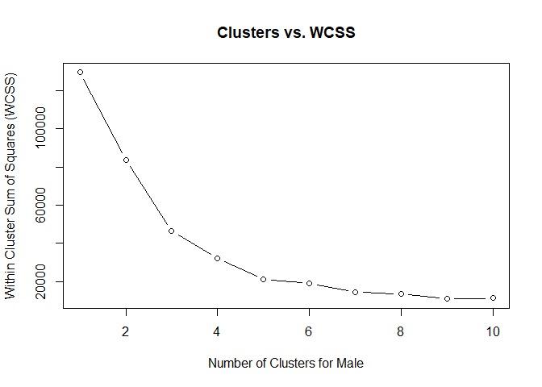
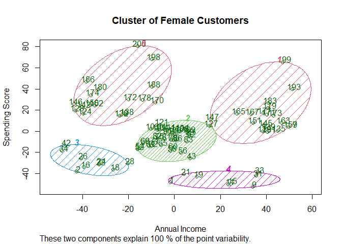

```r
library(cluster)
library(ggplot2)
```


```r
dataset<-read.csv('Mall_Customers.csv')
head(dataset)
```

```
##   CustomerID  Genre Age Annual.Income..k.. Spending.Score..1.100.
## 1          1   Male  19                 15                     39
## 2          2   Male  21                 15                     81
## 3          3 Female  20                 16                      6
## 4          4 Female  23                 16                     77
## 5          5 Female  31                 17                     40
## 6          6 Female  22                 17                     76
```


```r
summary(dataset)
```

```
##    CustomerID        Genre                Age        Annual.Income..k..
##  Min.   :  1.00   Length:200         Min.   :18.00   Min.   : 15.00    
##  1st Qu.: 50.75   Class :character   1st Qu.:28.75   1st Qu.: 41.50    
##  Median :100.50   Mode  :character   Median :36.00   Median : 61.50    
##  Mean   :100.50                      Mean   :38.85   Mean   : 60.56    
##  3rd Qu.:150.25                      3rd Qu.:49.00   3rd Qu.: 78.00    
##  Max.   :200.00                      Max.   :70.00   Max.   :137.00    
##  Spending.Score..1.100.
##  Min.   : 1.00         
##  1st Qu.:34.75         
##  Median :50.00         
##  Mean   :50.20         
##  3rd Qu.:73.00         
##  Max.   :99.00
```


```r
ggplot(data = dataset, aes(x = 'Annual Income (k$)', y = Age, fill = Genre)) + 
        geom_violin()
```

<!-- -->


```r
male <- subset(dataset, Genre == "Male")[4:5]
female <- subset(dataset, Genre == "Female")[4:5]
```


```r
set.seed(12)
wcss<-vector()

for(i in 1:10) 
        wcss[i]<- sum(kmeans(male, i)$withinss)
plot(1:10, wcss, type="b", main=paste('Clusters vs. WCSS'),xlab='Number of Clusters for Male', ylab='Within Cluster Sum of Squares (WCSS)')
```

<!-- -->


```r
for(i in 1:10) 
        wcss[i]<- sum(kmeans(female, i)$withinss)
plot(1:10, wcss, type="b", main=paste('Clusters vs. WCSS'),xlab='Number of Clusters for Female', ylab='Within Cluster Sum of Squares (WCSS)')
```

<!-- -->

```r
set.seed(29)
kmeans_male<-kmeans(male, 5,iter.max=300, nstart=10)
```


```r
kmeans_female<-kmeans(female, 5,iter.max=300, nstart=10)
```


```r
clusplot(male,
        kmeans_male$cluster,
        lines = 0,
        shade = TRUE,
        color = TRUE,
        labels = 2,
        plotchar = FALSE,
        span = TRUE,
        main = paste('Cluster of Female Customers'),
        xlab = 'Annual Income',
        ylab = 'Spending Score')
```

<!-- -->

```r
clusplot(female,
        kmeans_female$cluster,
        lines = 0,
        shade = TRUE,
        color = TRUE,
        labels = 2,
        plotchar = FALSE,
        span = TRUE,
        main = paste('Cluster of Female Customers'),
        xlab = 'Annual Income',
        ylab = 'Spending Score')
```

<!-- -->
