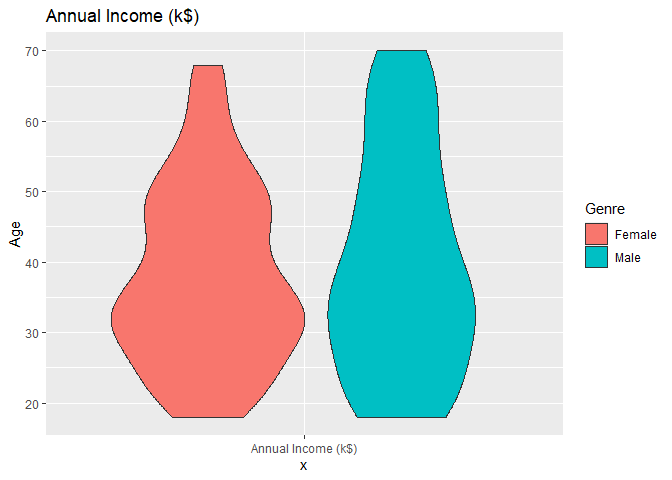

```r
library(cluster)
library(ggplot2)
```


```r
dataset <- read.csv('Mall_Customers.csv')
head(dataset)
```

```
##   CustomerID  Genre Age Annual.Income..k.. Spending.Score..1.100.
## 1          1   Male  19                 15                     39
## 2          2   Male  21                 15                     81
## 3          3 Female  20                 16                      6
## 4          4 Female  23                 16                     77
## 5          5 Female  31                 17                     40
## 6          6 Female  22                 17                     76
```


```r
summary(dataset)
```

```
##    CustomerID        Genre                Age        Annual.Income..k..
##  Min.   :  1.00   Length:200         Min.   :18.00   Min.   : 15.00    
##  1st Qu.: 50.75   Class :character   1st Qu.:28.75   1st Qu.: 41.50    
##  Median :100.50   Mode  :character   Median :36.00   Median : 61.50    
##  Mean   :100.50                      Mean   :38.85   Mean   : 60.56    
##  3rd Qu.:150.25                      3rd Qu.:49.00   3rd Qu.: 78.00    
##  Max.   :200.00                      Max.   :70.00   Max.   :137.00    
##  Spending.Score..1.100.
##  Min.   : 1.00         
##  1st Qu.:34.75         
##  Median :50.00         
##  Mean   :50.20         
##  3rd Qu.:73.00         
##  Max.   :99.00
```


```r
ggplot(data = dataset, aes(x = 'Annual Income (k$)', y = Age, fill = Genre)) + 
  geom_violin() +
  ggtitle("Annual Income (k$)")
```

<!-- -->


```r
ggplot(data = dataset, aes(x = 'Spending Score (1-100)', y = Age, fill = Genre)) + 
  geom_violin() +
  ggtitle("Spending Score (1-100)")
```

<!-- -->

## Two Features


```r
male <- subset(dataset, Genre == "Male")[4:5]
female <- subset(dataset, Genre == "Female")[4:5]
```


```r
set.seed(12)
wcss <- vector()

for(i in 1:10) 
  wcss[i] <- sum(kmeans(male, i)$withinss)
plot(1:10, wcss, type = "b", main = 'Clusters vs. WCSS', xlab = 'Number of Clusters for Male', ylab = 'Within Cluster Sum of Squares (WCSS)')
```

<!-- -->


```r
for(i in 1:10) 
  wcss[i] <- sum(kmeans(female, i)$withinss)
plot(1:10, wcss, type = "b", main = 'Clusters vs. WCSS', xlab = 'Number of Clusters for Female', ylab = 'Within Cluster Sum of Squares (WCSS)')
```

<!-- -->


```r
kmeans_male <- kmeans(male, 5, iter.max = 300, nstart = 10)
kmeans_male
```

```
## K-means clustering with 5 clusters of sizes 9, 8, 34, 19, 18
## 
## Cluster means:
##   Annual.Income..k.. Spending.Score..1.100.
## 1           25.77778               77.66667
## 2           22.87500               17.62500
## 3           54.73529               49.85294
## 4           85.89474               12.94737
## 5           87.11111               82.66667
## 
## Clustering vector:
##   1   2   9  11  15  16  18  19  21  22  24  26  28  31  33  34  42  43  52  54 
##   2   1   2   2   2   1   1   2   2   1   1   1   1   2   2   1   1   3   3   3 
##  56  58  60  61  62  65  66  69  71  75  76  78  81  82  83  86  92  93  96  99 
##   3   3   3   3   3   3   3   3   3   3   3   3   3   3   3   3   3   3   3   3 
## 100 103 104 105 108 109 110 111 114 121 124 127 128 129 130 131 132 135 138 139 
##   3   3   3   3   3   3   3   3   3   3   5   3   5   4   5   4   5   4   5   4 
## 142 145 146 147 150 151 152 157 159 163 165 167 170 171 172 173 174 177 178 179 
##   5   4   5   4   5   4   5   4   4   4   4   4   5   4   5   4   5   4   5   4 
## 180 183 186 188 193 198 199 200 
##   5   4   5   5   4   5   4   5 
## 
## Within cluster sum of squares by cluster:
## [1] 1287.556 1762.750 3838.882 5948.737 8187.778
##  (between_SS / total_SS =  83.8 %)
## 
## Available components:
## 
## [1] "cluster"      "centers"      "totss"        "withinss"     "tot.withinss"
## [6] "betweenss"    "size"         "iter"         "ifault"
```


```r
kmeans_female <- kmeans(female, 5, iter.max = 300, nstart = 10)
kmeans_female
```

```
## K-means clustering with 5 clusters of sizes 14, 13, 46, 18, 21
## 
## Cluster means:
##   Annual.Income..k.. Spending.Score..1.100.
## 1           27.35714               21.71429
## 2           25.69231               80.53846
## 3           54.54348               49.52174
## 4           89.05556               23.72222
## 5           86.04762               81.66667
## 
## Clustering vector:
##   3   4   5   6   7   8  10  12  13  14  17  20  23  25  27  29  30  32  35  36 
##   1   2   1   2   1   2   2   2   1   2   1   2   1   1   1   1   2   2   1   2 
##  37  38  39  40  41  44  45  46  47  48  49  50  51  53  55  57  59  63  64  67 
##   1   2   1   2   1   3   1   2   3   3   3   3   3   3   3   3   3   3   3   3 
##  68  70  72  73  74  77  79  80  84  85  87  88  89  90  91  94  95  97  98 101 
##   3   3   3   3   3   3   3   3   3   3   3   3   3   3   3   3   3   3   3   3 
## 102 106 107 112 113 115 116 117 118 119 120 122 123 125 126 133 134 136 137 140 
##   3   3   3   3   3   3   3   3   3   3   3   3   3   4   5   4   5   5   4   5 
## 141 143 144 148 149 153 154 155 156 158 160 161 162 164 166 168 169 175 176 181 
##   4   4   5   5   4   4   5   4   5   5   5   4   5   5   5   5   4   4   5   4 
## 182 184 185 187 189 190 191 192 194 195 196 197 
##   5   5   4   4   4   5   4   5   5   4   5   4 
## 
## Within cluster sum of squares by cluster:
## [1] 2742.071 2188.000 5404.891 6552.556 5235.619
##  (between_SS / total_SS =  84.2 %)
## 
## Available components:
## 
## [1] "cluster"      "centers"      "totss"        "withinss"     "tot.withinss"
## [6] "betweenss"    "size"         "iter"         "ifault"
```


```r
clusplot(male,
        kmeans_male$cluster,
        lines = 0,
        shade = TRUE,
        color = TRUE,
        labels = 2,
        plotchar = FALSE,
        span = TRUE,
        main = 'Cluster of Male Customers',
        xlab = 'Annual Income',
        ylab = 'Spending Score')
```

<!-- -->


```r
clusplot(female,
        kmeans_female$cluster,
        lines = 0,
        shade = TRUE,
        color = TRUE,
        labels = 2,
        plotchar = FALSE,
        span = TRUE,
        main = 'Cluster of Female Customers',
        xlab = 'Annual Income',
        ylab = 'Spending Score')
```

<!-- -->

## Three Features


```r
male <- subset(dataset, Genre == "Male")[3:5]
female <- subset(dataset, Genre == "Female")[3:5]
```


```r
set.seed(24)
wcss <- vector()

for(i in 1:10) 
  wcss[i] <- sum(kmeans(male, i)$withinss)
plot(1:10, wcss, type = "b", main = 'Clusters vs. WCSS', xlab = 'Number of Clusters for Male', ylab = 'Within Cluster Sum of Squares (WCSS)')
```

<!-- -->


```r
for(i in 1:10) 
  wcss[i] <- sum(kmeans(female, i)$withinss)
plot(1:10, wcss, type = "b", main = 'Clusters vs. WCSS', xlab = 'Number of Clusters for Female', ylab = 'Within Cluster Sum of Squares (WCSS)')
```

<!-- -->


```r
kmeans_male <- kmeans(male, 5, iter.max=300, nstart=10)
kmeans_male
```

```
## K-means clustering with 5 clusters of sizes 21, 18, 24, 7, 18
## 
## Cluster means:
##        Age Annual.Income..k.. Spending.Score..1.100.
## 1 23.47619           40.85714               63.04762
## 2 38.83333           86.38889               11.66667
## 3 56.00000           55.29167               47.70833
## 4 52.57143           24.00000               14.57143
## 5 33.27778           87.11111               82.66667
## 
## Clustering vector:
##   1   2   9  11  15  16  18  19  21  22  24  26  28  31  33  34  42  43  52  54 
##   1   1   4   4   4   1   1   4   4   1   1   1   1   4   4   1   1   3   1   3 
##  56  58  60  61  62  65  66  69  71  75  76  78  81  82  83  86  92  93  96  99 
##   3   3   3   3   1   3   1   1   3   3   1   3   3   3   3   3   1   3   1   3 
## 100 103 104 105 108 109 110 111 114 121 124 127 128 129 130 131 132 135 138 139 
##   1   3   1   3   3   3   3   3   1   1   5   3   5   2   5   2   5   2   5   2 
## 142 145 146 147 150 151 152 157 159 163 165 167 170 171 172 173 174 177 178 179 
##   5   2   5   3   5   2   5   2   2   2   2   2   5   2   5   2   5   2   5   2 
## 180 183 186 188 193 198 199 200 
##   5   2   5   5   2   5   2   5 
## 
## Within cluster sum of squares by cluster:
## [1] 11514.762  8204.778  5635.917  2115.429  8515.389
##  (between_SS / total_SS =  76.1 %)
## 
## Available components:
## 
## [1] "cluster"      "centers"      "totss"        "withinss"     "tot.withinss"
## [6] "betweenss"    "size"         "iter"         "ifault"
```


```r
kmeans_female <- kmeans(female, 5, iter.max=300, nstart=10)
kmeans_female
```

```
## K-means clustering with 5 clusters of sizes 14, 21, 13, 18, 46
## 
## Cluster means:
##        Age Annual.Income..k.. Spending.Score..1.100.
## 1 43.21429           27.35714               21.71429
## 2 32.19048           86.04762               81.66667
## 3 25.46154           25.69231               80.53846
## 4 41.38889           89.05556               23.72222
## 5 41.52174           54.54348               49.52174
## 
## Clustering vector:
##   3   4   5   6   7   8  10  12  13  14  17  20  23  25  27  29  30  32  35  36 
##   1   3   1   3   1   3   3   3   1   3   1   3   1   1   1   1   3   3   1   3 
##  37  38  39  40  41  44  45  46  47  48  49  50  51  53  55  57  59  63  64  67 
##   1   3   1   3   1   5   1   3   5   5   5   5   5   5   5   5   5   5   5   5 
##  68  70  72  73  74  77  79  80  84  85  87  88  89  90  91  94  95  97  98 101 
##   5   5   5   5   5   5   5   5   5   5   5   5   5   5   5   5   5   5   5   5 
## 102 106 107 112 113 115 116 117 118 119 120 122 123 125 126 133 134 136 137 140 
##   5   5   5   5   5   5   5   5   5   5   5   5   5   4   2   4   2   2   4   2 
## 141 143 144 148 149 153 154 155 156 158 160 161 162 164 166 168 169 175 176 181 
##   4   4   2   2   4   4   2   4   2   2   2   4   2   2   2   2   4   4   2   4 
## 182 184 185 187 189 190 191 192 194 195 196 197 
##   2   2   4   4   4   2   4   2   2   4   2   4 
## 
## Within cluster sum of squares by cluster:
## [1]  4516.429  5424.857  2515.231  8314.833 15188.370
##  (between_SS / total_SS =  77.2 %)
## 
## Available components:
## 
## [1] "cluster"      "centers"      "totss"        "withinss"     "tot.withinss"
## [6] "betweenss"    "size"         "iter"         "ifault"
```
