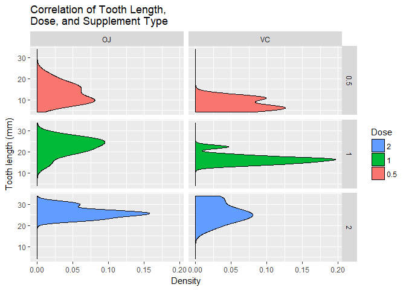
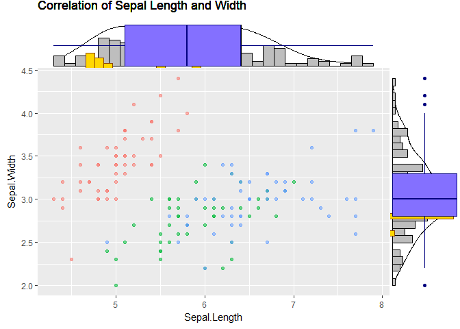

```r
library(datasets)
library(ggplot2)
library(gridExtra)
library(plotly)
```

###geom_boxplot


```r
ggplot(data=ToothGrowth, aes(x=as.factor(dose), y=len, fill=as.factor(dose))) +
    geom_boxplot() +   
    facet_grid(. ~ supp) +   
    xlab("Dose (mg)") +
    ylab("Tooth length (mm)") +
    guides(fill=guide_legend(title="Dose")) + 
    ggtitle("Correlation of Tooth Length, \nDose, and Supplement Type")
```

<!-- -->

###geom_violin


```r
ggplot(data=ToothGrowth, aes(x=as.factor(dose), y=len, fill=as.factor(dose))) +
    geom_violin() +   
    facet_grid(. ~ supp) +   
    xlab("Dose (mg)") +
    ylab("Tooth length (mm)") +
    guides(fill=guide_legend(title="Dose")) + 
    ggtitle("Correlation of Tooth Length, \nDose, and Supplement Type")
```

<!-- -->

```r
ggplot(data=ToothGrowth, aes(x=as.factor(dose), y=len, fill=as.factor(dose))) +
    geom_violin(adjust = .5) +   
    facet_grid(. ~ supp) +   
    xlab("Dose (mg)") +
    ylab("Tooth length (mm)") +
    guides(fill=guide_legend(title="Dose")) + 
    ggtitle("Correlation of Tooth Length, \nDose, and Supplement Type")
```

<!-- -->

###geom_density


```r
ggplot(ToothGrowth,aes(x=len, fill=as.factor(dose))) +
    geom_density() + 
    facet_grid(dose~supp) +
    xlab("Tooth length (mm)") +
    ylab("Density") +
    guides(fill=guide_legend(title="Dose", reverse=TRUE)) + 
    ggtitle("Correlation of Tooth Length, \nDose, and Supplement Type") + 
    coord_flip()
```

<!-- -->

```r
ggplot(ToothGrowth,aes(x=len, fill=as.factor(dose))) +
    geom_density(adjust = .5) + 
    facet_grid(dose~supp) +
    xlab("Tooth length (mm)") +
    ylab("Density") +
    guides(fill=guide_legend(title="Dose", reverse=TRUE)) + 
    ggtitle("Correlation of Tooth Length, \nDose, and Supplement Type") + 
    coord_flip()
```

<!-- -->

###gridExtra


```r
p <- ggplot(iris, aes(x = Sepal.Length, y = Sepal.Width, colour = Species)) + 
    geom_point(aes(alpha = 0.5)) + 
    ggtitle("Correlation of Sepal Length and Width") + 
    theme(legend.position="none")

ggExtra::ggMarginal(p)

ggExtra::ggMarginal(p, type = "histogram")

ggExtra::ggMarginal(p, type = "histogram", size = 2, col = "darkorange4", fill = "gold")

ggExtra::ggMarginal(p, type = "boxplot", col = "navy", fill = "lightslateblue")
```

<!-- -->

###ployly


```r
s <- subplot(
  plot_ly(x = iris$Sepal.Length, type = "histogram"),
  plotly_empty(),
  plot_ly(x = iris$Sepal.Length, y = iris$Sepal.Width, type = "histogram2dcontour"),
  plot_ly(y = iris$Sepal.Width, type = "histogram"),
  nrows = 2, heights = c(0.2, 0.8), widths = c(0.8, 0.2), margin = 0, shareX = TRUE, shareY = TRUE, titleX = FALSE, titleY = FALSE
)
layout(s, showlegend = FALSE)
```

<!--html_preserve--><div id="22f05a7528c6" style="width:672px;height:480px;" class="plotly html-widget"></div>
<script type="application/json" data-for="22f05a7528c6">{"x":{"data":[{"x":[5.1,4.9,4.7,4.6,5,5.4,4.6,5,4.4,4.9,5.4,4.8,4.8,4.3,5.8,5.7,5.4,5.1,5.7,5.1,5.4,5.1,4.6,5.1,4.8,5,5,5.2,5.2,4.7,4.8,5.4,5.2,5.5,4.9,5,5.5,4.9,4.4,5.1,5,4.5,4.4,5,5.1,4.8,5.1,4.6,5.3,5,7,6.4,6.9,5.5,6.5,5.7,6.3,4.9,6.6,5.2,5,5.9,6,6.1,5.6,6.7,5.6,5.8,6.2,5.6,5.9,6.1,6.3,6.1,6.4,6.6,6.8,6.7,6,5.7,5.5,5.5,5.8,6,5.4,6,6.7,6.3,5.6,5.5,5.5,6.1,5.8,5,5.6,5.7,5.7,6.2,5.1,5.7,6.3,5.8,7.1,6.3,6.5,7.6,4.9,7.3,6.7,7.2,6.5,6.4,6.8,5.7,5.8,6.4,6.5,7.7,7.7,6,6.9,5.6,7.7,6.3,6.7,7.2,6.2,6.1,6.4,7.2,7.4,7.9,6.4,6.3,6.1,7.7,6.3,6.4,6,6.9,6.7,6.9,5.8,6.8,6.7,6.7,6.3,6.5,6.2,5.9],"type":"histogram","marker":{"fillcolor":"rgba(31,119,180,1)","color":"rgba(31,119,180,1)","line":{"color":"transparent"}},"xaxis":"x","yaxis":"y","frame":null},{"type":"scatter","mode":"markers","marker":{"fillcolor":"rgba(31,119,180,1)","color":"rgba(255,127,14,1)","line":{"color":"transparent"}},"xaxis":"x2","yaxis":"y","frame":null},{"colorbar":{"title":"","ticklen":2,"len":0.5,"y":1,"lenmode":"fraction","yanchor":"top"},"colorscale":[["0","rgb(68,1,84)"],["0.0416666666666667","rgb(70,19,97)"],["0.0833333333333333","rgb(72,32,111)"],["0.125","rgb(71,45,122)"],["0.166666666666667","rgb(68,58,128)"],["0.208333333333333","rgb(64,70,135)"],["0.25","rgb(60,82,138)"],["0.291666666666667","rgb(56,93,140)"],["0.333333333333333","rgb(49,104,142)"],["0.375","rgb(46,114,142)"],["0.416666666666667","rgb(42,123,142)"],["0.458333333333333","rgb(38,133,141)"],["0.5","rgb(37,144,140)"],["0.541666666666667","rgb(33,154,138)"],["0.583333333333333","rgb(39,164,133)"],["0.625","rgb(47,174,127)"],["0.666666666666667","rgb(53,183,121)"],["0.708333333333333","rgb(79,191,110)"],["0.75","rgb(98,199,98)"],["0.791666666666667","rgb(119,207,85)"],["0.833333333333333","rgb(147,214,70)"],["0.875","rgb(172,220,52)"],["0.916666666666667","rgb(199,225,42)"],["0.958333333333333","rgb(226,228,40)"],["1","rgb(253,231,37)"]],"showscale":true,"x":[5.1,4.9,4.7,4.6,5,5.4,4.6,5,4.4,4.9,5.4,4.8,4.8,4.3,5.8,5.7,5.4,5.1,5.7,5.1,5.4,5.1,4.6,5.1,4.8,5,5,5.2,5.2,4.7,4.8,5.4,5.2,5.5,4.9,5,5.5,4.9,4.4,5.1,5,4.5,4.4,5,5.1,4.8,5.1,4.6,5.3,5,7,6.4,6.9,5.5,6.5,5.7,6.3,4.9,6.6,5.2,5,5.9,6,6.1,5.6,6.7,5.6,5.8,6.2,5.6,5.9,6.1,6.3,6.1,6.4,6.6,6.8,6.7,6,5.7,5.5,5.5,5.8,6,5.4,6,6.7,6.3,5.6,5.5,5.5,6.1,5.8,5,5.6,5.7,5.7,6.2,5.1,5.7,6.3,5.8,7.1,6.3,6.5,7.6,4.9,7.3,6.7,7.2,6.5,6.4,6.8,5.7,5.8,6.4,6.5,7.7,7.7,6,6.9,5.6,7.7,6.3,6.7,7.2,6.2,6.1,6.4,7.2,7.4,7.9,6.4,6.3,6.1,7.7,6.3,6.4,6,6.9,6.7,6.9,5.8,6.8,6.7,6.7,6.3,6.5,6.2,5.9],"y":[3.5,3,3.2,3.1,3.6,3.9,3.4,3.4,2.9,3.1,3.7,3.4,3,3,4,4.4,3.9,3.5,3.8,3.8,3.4,3.7,3.6,3.3,3.4,3,3.4,3.5,3.4,3.2,3.1,3.4,4.1,4.2,3.1,3.2,3.5,3.6,3,3.4,3.5,2.3,3.2,3.5,3.8,3,3.8,3.2,3.7,3.3,3.2,3.2,3.1,2.3,2.8,2.8,3.3,2.4,2.9,2.7,2,3,2.2,2.9,2.9,3.1,3,2.7,2.2,2.5,3.2,2.8,2.5,2.8,2.9,3,2.8,3,2.9,2.6,2.4,2.4,2.7,2.7,3,3.4,3.1,2.3,3,2.5,2.6,3,2.6,2.3,2.7,3,2.9,2.9,2.5,2.8,3.3,2.7,3,2.9,3,3,2.5,2.9,2.5,3.6,3.2,2.7,3,2.5,2.8,3.2,3,3.8,2.6,2.2,3.2,2.8,2.8,2.7,3.3,3.2,2.8,3,2.8,3,2.8,3.8,2.8,2.8,2.6,3,3.4,3.1,3,3.1,3.1,3.1,2.7,3.2,3.3,3,2.5,3,3.4,3],"type":"histogram2dcontour","xaxis":"x","yaxis":"y2","frame":null},{"y":[3.5,3,3.2,3.1,3.6,3.9,3.4,3.4,2.9,3.1,3.7,3.4,3,3,4,4.4,3.9,3.5,3.8,3.8,3.4,3.7,3.6,3.3,3.4,3,3.4,3.5,3.4,3.2,3.1,3.4,4.1,4.2,3.1,3.2,3.5,3.6,3,3.4,3.5,2.3,3.2,3.5,3.8,3,3.8,3.2,3.7,3.3,3.2,3.2,3.1,2.3,2.8,2.8,3.3,2.4,2.9,2.7,2,3,2.2,2.9,2.9,3.1,3,2.7,2.2,2.5,3.2,2.8,2.5,2.8,2.9,3,2.8,3,2.9,2.6,2.4,2.4,2.7,2.7,3,3.4,3.1,2.3,3,2.5,2.6,3,2.6,2.3,2.7,3,2.9,2.9,2.5,2.8,3.3,2.7,3,2.9,3,3,2.5,2.9,2.5,3.6,3.2,2.7,3,2.5,2.8,3.2,3,3.8,2.6,2.2,3.2,2.8,2.8,2.7,3.3,3.2,2.8,3,2.8,3,2.8,3.8,2.8,2.8,2.6,3,3.4,3.1,3,3.1,3.1,3.1,2.7,3.2,3.3,3,2.5,3,3.4,3],"type":"histogram","orientation":"h","marker":{"fillcolor":"rgba(31,119,180,1)","color":"rgba(214,39,40,1)","line":{"color":"transparent"}},"xaxis":"x2","yaxis":"y2","frame":null}],"layout":{"xaxis":{"domain":[0,0.8],"anchor":"y2"},"xaxis2":{"domain":[0.8,1],"showticklabels":false,"showgrid":false,"zeroline":false,"anchor":"y2"},"yaxis2":{"domain":[0,0.8],"anchor":"x"},"yaxis":{"domain":[0.8,1],"showticklabels":false,"showgrid":false,"zeroline":false,"anchor":"x"},"margin":{"b":40,"l":60,"t":25,"r":10},"hovermode":"closest","showlegend":false,"legend":{"y":0.5,"yanchor":"top"}},"attrs":{"22f055bf1bff":{"x":[5.1,4.9,4.7,4.6,5,5.4,4.6,5,4.4,4.9,5.4,4.8,4.8,4.3,5.8,5.7,5.4,5.1,5.7,5.1,5.4,5.1,4.6,5.1,4.8,5,5,5.2,5.2,4.7,4.8,5.4,5.2,5.5,4.9,5,5.5,4.9,4.4,5.1,5,4.5,4.4,5,5.1,4.8,5.1,4.6,5.3,5,7,6.4,6.9,5.5,6.5,5.7,6.3,4.9,6.6,5.2,5,5.9,6,6.1,5.6,6.7,5.6,5.8,6.2,5.6,5.9,6.1,6.3,6.1,6.4,6.6,6.8,6.7,6,5.7,5.5,5.5,5.8,6,5.4,6,6.7,6.3,5.6,5.5,5.5,6.1,5.8,5,5.6,5.7,5.7,6.2,5.1,5.7,6.3,5.8,7.1,6.3,6.5,7.6,4.9,7.3,6.7,7.2,6.5,6.4,6.8,5.7,5.8,6.4,6.5,7.7,7.7,6,6.9,5.6,7.7,6.3,6.7,7.2,6.2,6.1,6.4,7.2,7.4,7.9,6.4,6.3,6.1,7.7,6.3,6.4,6,6.9,6.7,6.9,5.8,6.8,6.7,6.7,6.3,6.5,6.2,5.9],"alpha":1,"sizes":[10,100],"type":"histogram"},"22f0551e4146":{"alpha":1,"sizes":[10,100]},"22f0406675cd":{"x":[5.1,4.9,4.7,4.6,5,5.4,4.6,5,4.4,4.9,5.4,4.8,4.8,4.3,5.8,5.7,5.4,5.1,5.7,5.1,5.4,5.1,4.6,5.1,4.8,5,5,5.2,5.2,4.7,4.8,5.4,5.2,5.5,4.9,5,5.5,4.9,4.4,5.1,5,4.5,4.4,5,5.1,4.8,5.1,4.6,5.3,5,7,6.4,6.9,5.5,6.5,5.7,6.3,4.9,6.6,5.2,5,5.9,6,6.1,5.6,6.7,5.6,5.8,6.2,5.6,5.9,6.1,6.3,6.1,6.4,6.6,6.8,6.7,6,5.7,5.5,5.5,5.8,6,5.4,6,6.7,6.3,5.6,5.5,5.5,6.1,5.8,5,5.6,5.7,5.7,6.2,5.1,5.7,6.3,5.8,7.1,6.3,6.5,7.6,4.9,7.3,6.7,7.2,6.5,6.4,6.8,5.7,5.8,6.4,6.5,7.7,7.7,6,6.9,5.6,7.7,6.3,6.7,7.2,6.2,6.1,6.4,7.2,7.4,7.9,6.4,6.3,6.1,7.7,6.3,6.4,6,6.9,6.7,6.9,5.8,6.8,6.7,6.7,6.3,6.5,6.2,5.9],"y":[3.5,3,3.2,3.1,3.6,3.9,3.4,3.4,2.9,3.1,3.7,3.4,3,3,4,4.4,3.9,3.5,3.8,3.8,3.4,3.7,3.6,3.3,3.4,3,3.4,3.5,3.4,3.2,3.1,3.4,4.1,4.2,3.1,3.2,3.5,3.6,3,3.4,3.5,2.3,3.2,3.5,3.8,3,3.8,3.2,3.7,3.3,3.2,3.2,3.1,2.3,2.8,2.8,3.3,2.4,2.9,2.7,2,3,2.2,2.9,2.9,3.1,3,2.7,2.2,2.5,3.2,2.8,2.5,2.8,2.9,3,2.8,3,2.9,2.6,2.4,2.4,2.7,2.7,3,3.4,3.1,2.3,3,2.5,2.6,3,2.6,2.3,2.7,3,2.9,2.9,2.5,2.8,3.3,2.7,3,2.9,3,3,2.5,2.9,2.5,3.6,3.2,2.7,3,2.5,2.8,3.2,3,3.8,2.6,2.2,3.2,2.8,2.8,2.7,3.3,3.2,2.8,3,2.8,3,2.8,3.8,2.8,2.8,2.6,3,3.4,3.1,3,3.1,3.1,3.1,2.7,3.2,3.3,3,2.5,3,3.4,3],"alpha":1,"sizes":[10,100],"type":"histogram2dcontour"},"22f051f94264":{"y":[3.5,3,3.2,3.1,3.6,3.9,3.4,3.4,2.9,3.1,3.7,3.4,3,3,4,4.4,3.9,3.5,3.8,3.8,3.4,3.7,3.6,3.3,3.4,3,3.4,3.5,3.4,3.2,3.1,3.4,4.1,4.2,3.1,3.2,3.5,3.6,3,3.4,3.5,2.3,3.2,3.5,3.8,3,3.8,3.2,3.7,3.3,3.2,3.2,3.1,2.3,2.8,2.8,3.3,2.4,2.9,2.7,2,3,2.2,2.9,2.9,3.1,3,2.7,2.2,2.5,3.2,2.8,2.5,2.8,2.9,3,2.8,3,2.9,2.6,2.4,2.4,2.7,2.7,3,3.4,3.1,2.3,3,2.5,2.6,3,2.6,2.3,2.7,3,2.9,2.9,2.5,2.8,3.3,2.7,3,2.9,3,3,2.5,2.9,2.5,3.6,3.2,2.7,3,2.5,2.8,3.2,3,3.8,2.6,2.2,3.2,2.8,2.8,2.7,3.3,3.2,2.8,3,2.8,3,2.8,3.8,2.8,2.8,2.6,3,3.4,3.1,3,3.1,3.1,3.1,2.7,3.2,3.3,3,2.5,3,3.4,3],"alpha":1,"sizes":[10,100],"type":"histogram"}},"source":"A","config":{"modeBarButtonsToAdd":[{"name":"Collaborate","icon":{"width":1000,"ascent":500,"descent":-50,"path":"M487 375c7-10 9-23 5-36l-79-259c-3-12-11-23-22-31-11-8-22-12-35-12l-263 0c-15 0-29 5-43 15-13 10-23 23-28 37-5 13-5 25-1 37 0 0 0 3 1 7 1 5 1 8 1 11 0 2 0 4-1 6 0 3-1 5-1 6 1 2 2 4 3 6 1 2 2 4 4 6 2 3 4 5 5 7 5 7 9 16 13 26 4 10 7 19 9 26 0 2 0 5 0 9-1 4-1 6 0 8 0 2 2 5 4 8 3 3 5 5 5 7 4 6 8 15 12 26 4 11 7 19 7 26 1 1 0 4 0 9-1 4-1 7 0 8 1 2 3 5 6 8 4 4 6 6 6 7 4 5 8 13 13 24 4 11 7 20 7 28 1 1 0 4 0 7-1 3-1 6-1 7 0 2 1 4 3 6 1 1 3 4 5 6 2 3 3 5 5 6 1 2 3 5 4 9 2 3 3 7 5 10 1 3 2 6 4 10 2 4 4 7 6 9 2 3 4 5 7 7 3 2 7 3 11 3 3 0 8 0 13-1l0-1c7 2 12 2 14 2l218 0c14 0 25-5 32-16 8-10 10-23 6-37l-79-259c-7-22-13-37-20-43-7-7-19-10-37-10l-248 0c-5 0-9-2-11-5-2-3-2-7 0-12 4-13 18-20 41-20l264 0c5 0 10 2 16 5 5 3 8 6 10 11l85 282c2 5 2 10 2 17 7-3 13-7 17-13z m-304 0c-1-3-1-5 0-7 1-1 3-2 6-2l174 0c2 0 4 1 7 2 2 2 4 4 5 7l6 18c0 3 0 5-1 7-1 1-3 2-6 2l-173 0c-3 0-5-1-8-2-2-2-4-4-4-7z m-24-73c-1-3-1-5 0-7 2-2 3-2 6-2l174 0c2 0 5 0 7 2 3 2 4 4 5 7l6 18c1 2 0 5-1 6-1 2-3 3-5 3l-174 0c-3 0-5-1-7-3-3-1-4-4-5-6z"},"click":"function(gd) { \n        // is this being viewed in RStudio?\n        if (location.search == '?viewer_pane=1') {\n          alert('To learn about plotly for collaboration, visit:\\n https://cpsievert.github.io/plotly_book/plot-ly-for-collaboration.html');\n        } else {\n          window.open('https://cpsievert.github.io/plotly_book/plot-ly-for-collaboration.html', '_blank');\n        }\n      }"}],"cloud":false},"highlight":{"on":"plotly_click","persistent":false,"dynamic":false,"selectize":false,"opacityDim":0.2,"selected":{"opacity":1}},"subplot":true,"base_url":"https://plot.ly"},"evals":["config.modeBarButtonsToAdd.0.click"],"jsHooks":{"render":[{"code":"function(el, x) { var ctConfig = crosstalk.var('plotlyCrosstalkOpts').set({\"on\":\"plotly_click\",\"persistent\":false,\"dynamic\":false,\"selectize\":false,\"opacityDim\":0.2,\"selected\":{\"opacity\":1}}); }","data":null}]}}</script><!--/html_preserve-->
