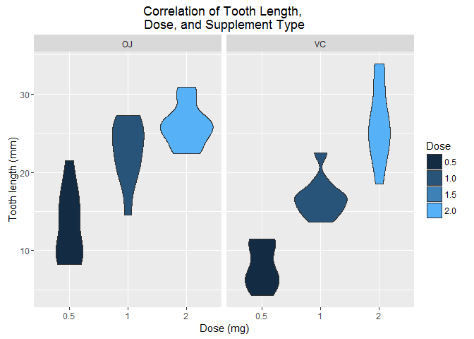
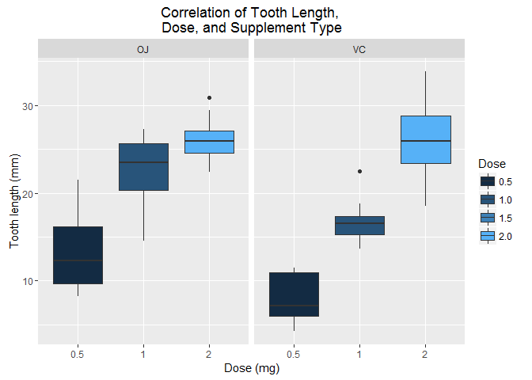
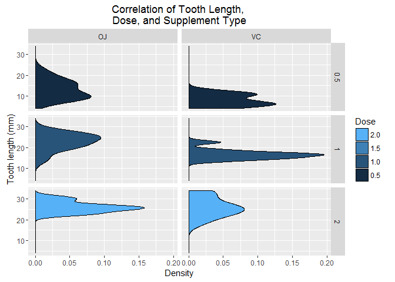

# ggplot2: geom_violin vs. geom_boxplot vs. geom_density


```r
library(datasets)
library(ggplot2)

summary(ToothGrowth)
```

```
##       len        supp         dose      
##  Min.   : 4.20   OJ:30   Min.   :0.500  
##  1st Qu.:13.07   VC:30   1st Qu.:0.500  
##  Median :19.25           Median :1.000  
##  Mean   :18.81           Mean   :1.167  
##  3rd Qu.:25.27           3rd Qu.:2.000  
##  Max.   :33.90           Max.   :2.000
```

```r
ggplot(data=ToothGrowth, aes(x=as.factor(dose), y=len, fill=dose)) +
    geom_violin() +   
    facet_grid(. ~ supp) +   
    xlab("Dose (mg)") +
    ylab("Tooth length (mm)") +
    guides(fill=guide_legend(title="Dose")) + 
    ggtitle("Correlation of Tooth Length, \nDose, and Supplement Type")
```



```r
ggplot(data=ToothGrowth, aes(x=as.factor(dose), y=len, fill=dose)) +
    geom_boxplot() +   
    facet_grid(. ~ supp) +   
    xlab("Dose (mg)") +
    ylab("Tooth length (mm)") +
    guides(fill=guide_legend(title="Dose")) + 
    ggtitle("Correlation of Tooth Length, \nDose, and Supplement Type")
```



```r
ggplot(ToothGrowth,aes(x=len, fill=dose)) +
    geom_density() + 
    facet_grid(dose~supp) +
    xlab("Tooth length (mm)") +
    ylab("Density") +
    guides(fill=guide_legend(title="Dose", reverse=TRUE)) + 
    ggtitle("Correlation of Tooth Length, \nDose, and Supplement Type") + 
    coord_flip()
```


