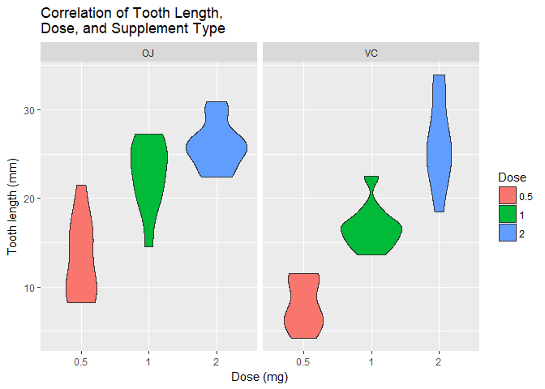
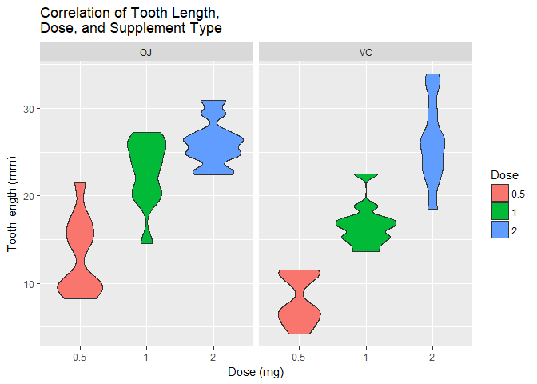
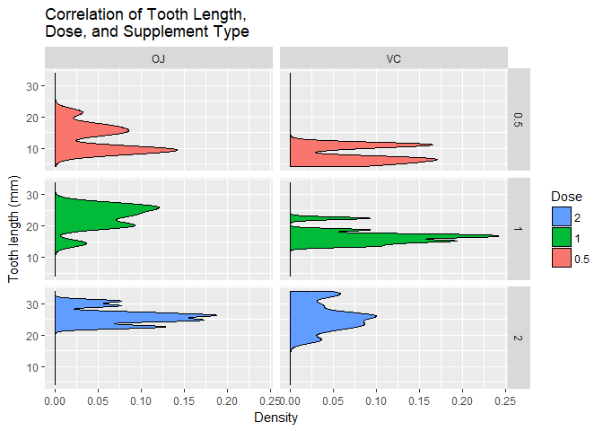
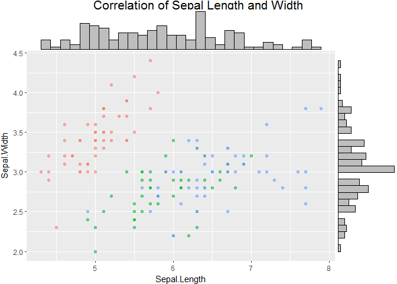

# Density


```r
library(datasets)
library(ggplot2)
library(gridExtra)
```

###geom_boxplot


```r
ggplot(data=ToothGrowth, aes(x=as.factor(dose), y=len, fill=as.factor(dose))) +
    geom_boxplot() +   
    facet_grid(. ~ supp) +   
    xlab("Dose (mg)") +
    ylab("Tooth length (mm)") +
    guides(fill=guide_legend(title="Dose")) + 
    ggtitle("Correlation of Tooth Length, \nDose, and Supplement Type")
```

<!-- -->

###geom_violin


```r
ggplot(data=ToothGrowth, aes(x=as.factor(dose), y=len, fill=as.factor(dose))) +
    geom_violin() +   
    facet_grid(. ~ supp) +   
    xlab("Dose (mg)") +
    ylab("Tooth length (mm)") +
    guides(fill=guide_legend(title="Dose")) + 
    ggtitle("Correlation of Tooth Length, \nDose, and Supplement Type")
```

<!-- -->

```r
ggplot(data=ToothGrowth, aes(x=as.factor(dose), y=len, fill=as.factor(dose))) +
    geom_violin(adjust = .5) +   
    facet_grid(. ~ supp) +   
    xlab("Dose (mg)") +
    ylab("Tooth length (mm)") +
    guides(fill=guide_legend(title="Dose")) + 
    ggtitle("Correlation of Tooth Length, \nDose, and Supplement Type")
```

<!-- -->

###geom_density


```r
ggplot(ToothGrowth,aes(x=len, fill=as.factor(dose))) +
    geom_density() + 
    facet_grid(dose~supp) +
    xlab("Tooth length (mm)") +
    ylab("Density") +
    guides(fill=guide_legend(title="Dose", reverse=TRUE)) + 
    ggtitle("Correlation of Tooth Length, \nDose, and Supplement Type") + 
    coord_flip()
```

<!-- -->

```r
ggplot(ToothGrowth,aes(x=len, fill=as.factor(dose))) +
    geom_density(adjust = .5) + 
    facet_grid(dose~supp) +
    xlab("Tooth length (mm)") +
    ylab("Density") +
    guides(fill=guide_legend(title="Dose", reverse=TRUE)) + 
    ggtitle("Correlation of Tooth Length, \nDose, and Supplement Type") + 
    coord_flip()
```

<!-- -->

###gridExtra


```r
p <- ggplot(iris, aes(x = Sepal.Length, y = Sepal.Width, colour = Species)) + 
    geom_point(aes(alpha = 0.5)) + 
    ggtitle("Correlation of Sepal Length and Width") + 
    theme(legend.position="none")

ggExtra::ggMarginal(p)
```

<!-- -->

```r
ggExtra::ggMarginal(p, type = "histogram")
```

<!-- -->

```r
ggExtra::ggMarginal(p, type = "histogram", size = 2, col = "darkorange4", fill = "gold")
```

<!-- -->

```r
ggExtra::ggMarginal(p, type = "boxplot", col = "navy", fill = "lightslateblue")
```

<!-- -->
