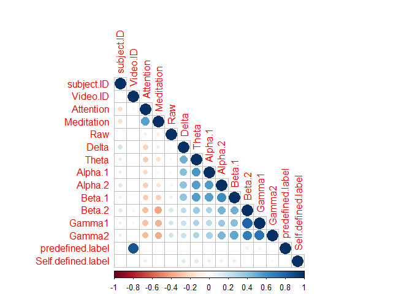
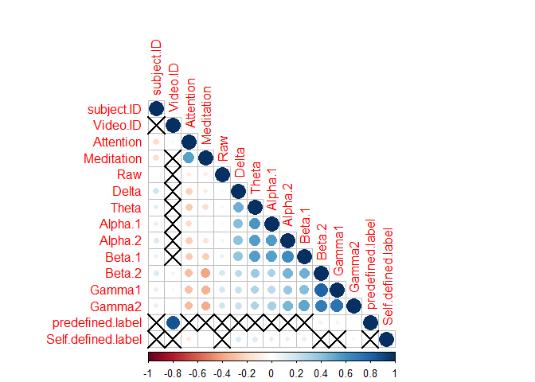
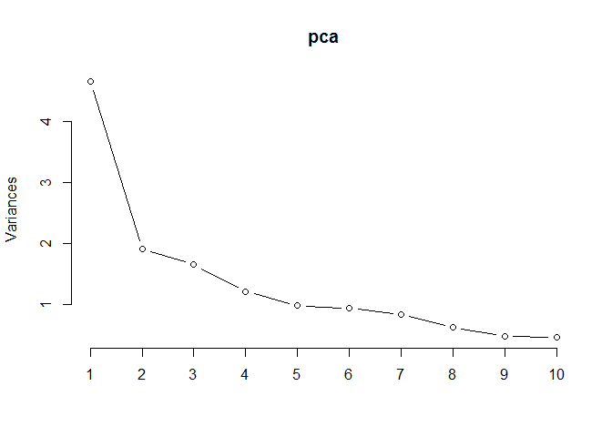
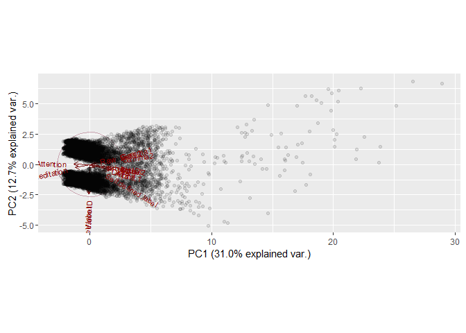

# EGG Brain Wave for Confusion


```r
library(RCurl)
library(corrplot)
library(ggbiplot)
```

## Source

https://www.kaggle.com/wanghaohan/eeg-brain-wave-for-confusion


```r
url <- getURL('https://raw.githubusercontent.com/frankwwu/R-Knots/master/EEG%20Brain%20Wave%20for%20Confusion/EEG-data.csv')
df <- read.csv(text = url) 
dim(df)
```

```
## [1] 12811    15
```

```r
str(df)
```

```
## 'data.frame':	12811 obs. of  15 variables:
##  $ subject.ID        : int  0 0 0 0 0 0 0 0 0 0 ...
##  $ Video.ID          : int  0 0 0 0 0 0 0 0 0 0 ...
##  $ Attention         : int  56 40 47 47 44 44 43 40 43 47 ...
##  $ Meditation        : int  43 35 48 57 53 66 69 61 69 69 ...
##  $ Raw               : int  278 -50 101 -5 -8 73 130 -2 17 -59 ...
##  $ Delta             : int  301963 73787 758353 2012240 1005145 1786446 635191 161098 492796 82048 ...
##  $ Theta             : int  90612 28083 383745 129350 354328 176766 122446 12119 120998 116131 ...
##  $ Alpha.1           : int  33735 1439 201999 61236 37102 59352 90107 1963 63697 47317 ...
##  $ Alpha.2           : int  23991 2240 62107 17084 88881 26157 65072 809 68242 26197 ...
##  $ Beta.1            : int  27946 2746 36293 11488 45307 15054 36230 1277 10769 41642 ...
##  $ Beta.2            : int  45097 3687 130536 62462 99603 33669 53019 3186 88403 28866 ...
##  $ Gamma1            : int  33228 5293 57243 49960 44790 33782 62938 3266 73756 32551 ...
##  $ Gamma2            : int  8293 2740 25354 33932 29749 31750 59307 2518 22676 41810 ...
##  $ predefined.label  : int  0 0 0 0 0 0 0 0 0 0 ...
##  $ Self.defined.label: int  0 0 0 0 0 0 0 0 0 0 ...
```

```r
unique(df$subject.ID)
```

```
##  [1] 0 1 2 3 4 5 6 7 8 9
```

```r
unique(df$predefined.label)
```

```
## [1] 0 1
```

```r
unique(df$Self.defined.label)
```

```
## [1] 0 1
```

##Data Exploration

Lower triangular of the correlogram


```r
correlation<-cor(df)
corrplot(correlation, type="lower")
```

<!-- -->

Positive correlations are displayed in blue and negative correlations in red color. Color intensity and the size of the circle are proportional to the correlation coefficients.

Add significance level to the correlogram


```r
cor.mtest <- function(mat, ...) {
    mat <- as.matrix(mat)
    n <- ncol(mat)
    p.mat<- matrix(NA, n, n)
    diag(p.mat) <- 0
    for (i in 1:(n - 1)) {
        for (j in (i + 1):n) {
            tmp <- cor.test(mat[, i], mat[, j], ...)
            p.mat[i, j] <- p.mat[j, i] <- tmp$p.value
        }
    }
  colnames(p.mat) <- rownames(p.mat) <- colnames(mat)
  p.mat
}
corrplot(correlation, type="lower", p.mat = cor.mtest(df), sig.level = 0.01)
```

<!-- -->

In the above figure, correlations with p-value > 0.01 are considered as insignificant. In this case the correlation coefficient values are leaved blank or crosses are added.

##PCA


```r
pca <- prcomp(df, center = TRUE, scale. = TRUE) 
print(pca)
```

```
## Standard deviations:
##  [1] 2.1550891 1.3802880 1.2836013 1.0992593 0.9883026 0.9660853 0.9099450
##  [8] 0.7828485 0.6889364 0.6711315 0.6250323 0.5894814 0.5312631 0.4116339
## [15] 0.3585953
## 
## Rotation:
##                            PC1          PC2         PC3         PC4
## subject.ID          0.11511492 -0.021809607 -0.01828263  0.46128520
## Video.ID           -0.01535410 -0.666729596 -0.21979801 -0.05826287
## Attention          -0.23397891  0.009581742  0.23855011 -0.51754611
## Meditation         -0.21625760 -0.075078181  0.39927382 -0.41911302
## Raw                 0.09449827  0.033943813 -0.21854043 -0.15516787
## Delta               0.25240795 -0.117464082  0.30337885  0.18815587
## Theta               0.31803723 -0.110072809  0.31259129  0.04488235
## Alpha.1             0.29815887 -0.130575890  0.36308452 -0.07365772
## Alpha.2             0.34331933 -0.077877363  0.23250206 -0.09514124
## Beta.1              0.35643402 -0.071913127  0.16016136 -0.12163713
## Beta.2              0.36289044  0.132989930 -0.23635740 -0.19638297
## Gamma1              0.33999871  0.135748886 -0.29808942 -0.25286091
## Gamma2              0.35304974  0.084073038 -0.25279956 -0.22778182
## predefined.label   -0.01748613 -0.668102028 -0.21020221 -0.07574814
## Self.defined.label  0.07184279 -0.066123416  0.18210691  0.29902746
##                             PC5          PC6         PC7          PC8
## subject.ID         -0.554142189  0.334666165 -0.53554130  0.232124094
## Video.ID            0.004763102 -0.031676803 -0.03500358 -0.024995962
## Attention          -0.112565767  0.104272013 -0.34348195 -0.052158551
## Meditation         -0.031388620  0.156454289 -0.27775907 -0.031349415
## Raw                 0.222780379  0.892765834  0.24897980  0.076852403
## Delta              -0.086407008  0.171861295  0.02232393 -0.813982805
## Theta              -0.002627682 -0.001689938  0.20811921 -0.023244056
## Alpha.1            -0.046265780  0.024699108  0.13033083  0.231047802
## Alpha.2            -0.070637856 -0.035356965  0.02861328  0.296555717
## Beta.1              0.011492815 -0.074755907  0.09567699  0.258358587
## Beta.2             -0.037960728 -0.077274177 -0.21179827 -0.141865562
## Gamma1              0.008857381 -0.081753700 -0.24574940 -0.195811940
## Gamma2              0.058474648 -0.064413915 -0.17670794  0.026357680
## predefined.label   -0.017443241 -0.015146085 -0.05131247 -0.008568412
## Self.defined.label  0.780793149  0.024339604 -0.49494297  0.073904553
##                              PC9         PC10         PC11        PC12
## subject.ID         -0.0002338844 -0.059913818 -0.027968661  0.08981180
## Video.ID            0.0346114960 -0.009013836  0.017394410  0.01449464
## Attention          -0.4713581844 -0.352896510 -0.164255444 -0.30652976
## Meditation          0.4315779105  0.286946627  0.211960301  0.42889477
## Raw                -0.0246441616 -0.010432384  0.029602233 -0.01875867
## Delta              -0.1449566265  0.240422672 -0.104261264 -0.06958005
## Theta               0.0304976891 -0.686784446  0.345072538  0.28795839
## Alpha.1             0.4916432545 -0.080890466 -0.544075595 -0.36664405
## Alpha.2            -0.1821252769  0.392133616  0.570278016 -0.43021772
## Beta.1             -0.4762675313  0.173802562 -0.297206440  0.52138526
## Beta.2              0.0926301259 -0.155189118  0.173446263 -0.12472135
## Gamma1              0.2327312344 -0.095700009  0.048975597  0.05725938
## Gamma2             -0.0343220266  0.182041266 -0.232491433  0.10911531
## predefined.label   -0.0291627275 -0.027378116  0.007904135 -0.03511127
## Self.defined.label -0.0364415977 -0.047115720 -0.004745011 -0.04866703
##                           PC13         PC14          PC15
## subject.ID         -0.01895279  0.017127905  0.0174018620
## Video.ID            0.04907909 -0.123135153  0.6937514892
## Attention          -0.04649391  0.047795095  0.0636944057
## Meditation          0.01156922 -0.097050023 -0.0435456427
## Raw                 0.03858261  0.007032366  0.0062706649
## Delta              -0.02104093 -0.003492133  0.0001485589
## Theta              -0.26082600 -0.022530214  0.0030035376
## Alpha.1             0.07039016  0.003607667 -0.0023133496
## Alpha.2            -0.07273480  0.116105813  0.0440505680
## Beta.1              0.35370390  0.058213253 -0.0021642387
## Beta.2              0.47574825 -0.603203861 -0.1237017956
## Gamma1              0.12486483  0.716015460  0.1020344863
## Gamma2             -0.73893826 -0.258147197 -0.0078358416
## predefined.label   -0.02140094  0.110264957 -0.6961748653
## Self.defined.label  0.03475659  0.007635458 -0.0044698369
```

```r
plot(pca, type = "l")
```

<!-- -->

```r
summary(pca)
```

```
## Importance of components:
##                           PC1    PC2    PC3     PC4     PC5     PC6    PC7
## Standard deviation     2.1551 1.3803 1.2836 1.09926 0.98830 0.96609 0.9099
## Proportion of Variance 0.3096 0.1270 0.1098 0.08056 0.06512 0.06222 0.0552
## Cumulative Proportion  0.3096 0.4366 0.5465 0.62704 0.69216 0.75438 0.8096
##                            PC8     PC9    PC10    PC11    PC12    PC13
## Standard deviation     0.78285 0.68894 0.67113 0.62503 0.58948 0.53126
## Proportion of Variance 0.04086 0.03164 0.03003 0.02604 0.02317 0.01882
## Cumulative Proportion  0.85043 0.88208 0.91210 0.93815 0.96132 0.98013
##                          PC14    PC15
## Standard deviation     0.4116 0.35860
## Proportion of Variance 0.0113 0.00857
## Cumulative Proportion  0.9914 1.00000
```

```r
ggbiplot(pca, obs.scale = 1, var.scale = 1, ellipse = TRUE, circle = TRUE, alpha = 0.1)
```

<!-- -->

