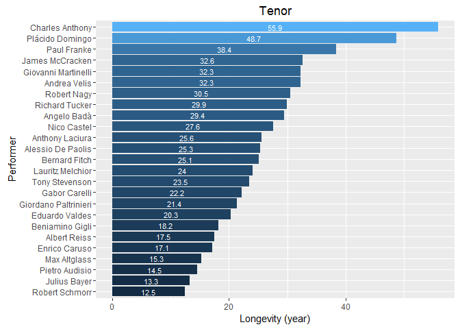
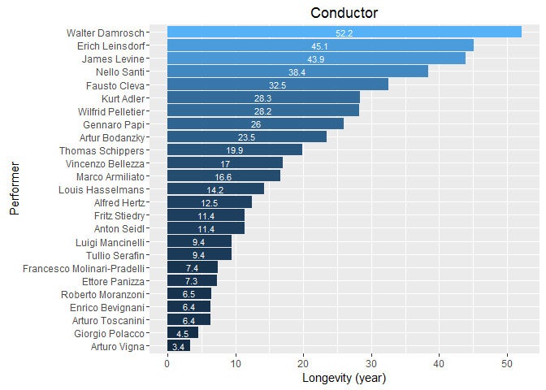
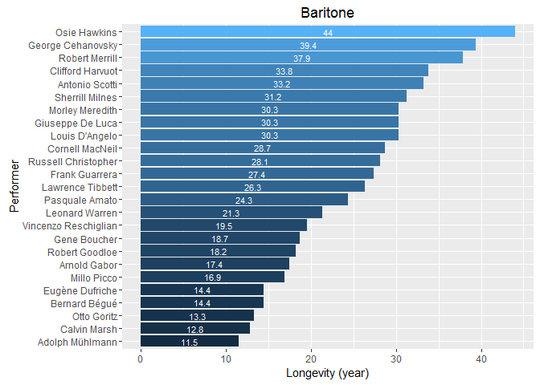
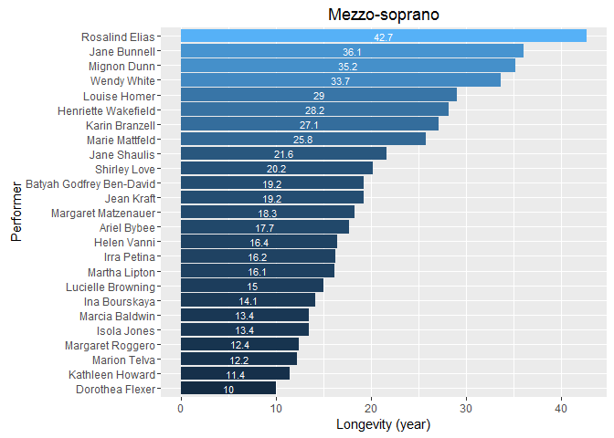
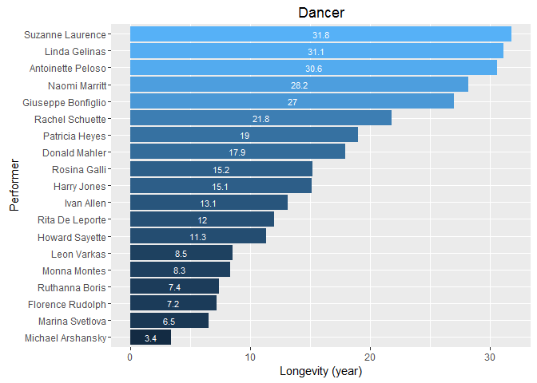
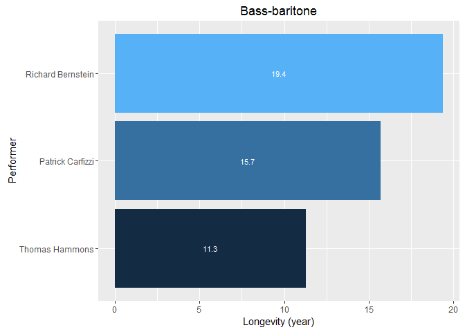
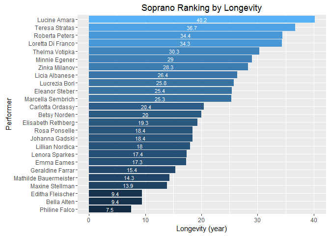
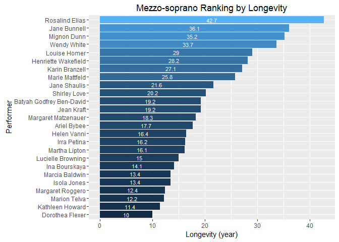
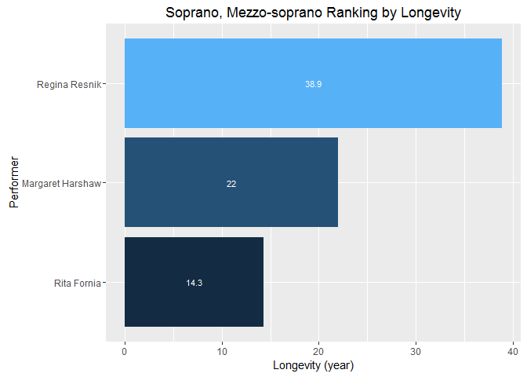

# Met Opera Performers


```r
library(rvest)
library(dplyr)
library(foreach)
library(ggplot2)
```

###Read data


```r
performers<- read_html("https://en.wikipedia.org/wiki/List_of_performers_at_the_Metropolitan_Opera")
names<-performers%>% html_nodes("td") %>% html_nodes("a")%>% html_text()
performers<-performers %>%
html_nodes(xpath='//*[@id="mw-content-text"]/table[1]') %>%
html_table()
performers<-performers[[1]]
```

###Data cleaning

Clean and unicode encode names.

Clean categories


```r
# Clean names
rows<-nrow(performers)
len<-length(names)
for(i in 1:rows)
{
  for(j in 1:len)
  {
    if(length(grep(names[j], performers[i,]$Performer))>0)
    {
      Encoding(names[j]) <- "UTF-8"
      performers[i,]$Performer<-names[j]
      break
    }
  }
}

# Clean categories
performers[performers$Category=="Bass-baritone",]$Category<-"Bass-Baritone"
performers[performers$Category=="Mezzo-soprano",]$Category<-"Mezzo-Soprano"
performers[performers$Category=="Mezzo Soprano",]$Category<-"Mezzo-Soprano"
performers[performers$Category=="Mezzo-soprano, Soprano",]$Category<-"Soprano, Mezzo-soprano"
```

###Calculate longevity


```r
performers$"First performance" <- as.Date(performers$"First performance", "%m/%d/%Y")
performers$"Last performance" <- as.Date(performers$"Last performance", "%m/%d/%Y")
performers <- mutate(performers, Longevity = round(((performers$"Last performance" - performers$"First performance")/365), digits=1))
```

###Maximum display 25 performers in a plot


```r
cats<-unique(performers$Category)
count<-length(cats)
top=25
```

###Ranking by Longevity


```r
foreach(i = 1:count) %do%
{
  cat_performers<-performers[performers$Category==cats[i],]
  cat_performers$Performer<-factor(cat_performers$Performer, levels=cat_performers[order(cat_performers$Longevity), "Performer"])
  
  if(dim(cat_performers)[1] > top)
  {
    cat_performers<-cat_performers[1:top,]
  }
  
  ggplot(data=cat_performers, aes(x=Performer, y=Longevity, fill=Longevity)) + 
    geom_bar(stat="identity") +
    geom_text(data=cat_performers, aes(label=Longevity), size=3, y = cat_performers$Longevity/2, color="white") +
    coord_flip() +
    ggtitle(cats[i]) +
    theme(legend.position="none") + 
    labs(y="Longevity (year)") +
    scale_fill_gradient("Count", low="navy", high="firebrick1")
}
```

```
## [[1]]
```

```
## Don't know how to automatically pick scale for object of type difftime. Defaulting to continuous.
## Don't know how to automatically pick scale for object of type difftime. Defaulting to continuous.
```

<!-- -->

```
## 
## [[2]]
```

```
## Don't know how to automatically pick scale for object of type difftime. Defaulting to continuous.
## Don't know how to automatically pick scale for object of type difftime. Defaulting to continuous.
```

<!-- -->

```
## 
## [[3]]
```

```
## Don't know how to automatically pick scale for object of type difftime. Defaulting to continuous.
## Don't know how to automatically pick scale for object of type difftime. Defaulting to continuous.
```

<!-- -->

```
## 
## [[4]]
```

```
## Don't know how to automatically pick scale for object of type difftime. Defaulting to continuous.
## Don't know how to automatically pick scale for object of type difftime. Defaulting to continuous.
```

<!-- -->

```
## 
## [[5]]
```

```
## Don't know how to automatically pick scale for object of type difftime. Defaulting to continuous.
## Don't know how to automatically pick scale for object of type difftime. Defaulting to continuous.
```

<!-- -->

```
## 
## [[6]]
```

```
## Don't know how to automatically pick scale for object of type difftime. Defaulting to continuous.
## Don't know how to automatically pick scale for object of type difftime. Defaulting to continuous.
```

<!-- -->

```
## 
## [[7]]
```

```
## Don't know how to automatically pick scale for object of type difftime. Defaulting to continuous.
## Don't know how to automatically pick scale for object of type difftime. Defaulting to continuous.
```

<!-- -->

```
## 
## [[8]]
```

```
## Don't know how to automatically pick scale for object of type difftime. Defaulting to continuous.
## Don't know how to automatically pick scale for object of type difftime. Defaulting to continuous.
```

<!-- -->

```
## 
## [[9]]
```

```
## Don't know how to automatically pick scale for object of type difftime. Defaulting to continuous.
## Don't know how to automatically pick scale for object of type difftime. Defaulting to continuous.
```

<!-- -->

```
## 
## [[10]]
```

```
## Don't know how to automatically pick scale for object of type difftime. Defaulting to continuous.
## Don't know how to automatically pick scale for object of type difftime. Defaulting to continuous.
```

<!-- -->

###Ranking by Performance


```r
foreach(i = 1:count) %do%
{
  cat_performers<-performers[performers$Category==cats[i],]
  cat_performers$Performer<-factor(cat_performers$Performer, levels=cat_performers[order(cat_performers$Performances), "Performer"])
  
  if(dim(cat_performers)[1] > top)
  {
    cat_performers<-cat_performers[1:top,]
  }
  
  ggplot(data=cat_performers, aes(x=Performer, y=Performances, fill=Performances)) + 
    geom_bar(stat="identity") +
    geom_text(data=cat_performers, aes(label=Performances), size=3, y = cat_performers$Performances/2, color="white") +
    coord_flip() +
    ggtitle(cats[i]) +
    theme(legend.position="none") +
    scale_fill_gradient("Count", low="darkgreen", high="firebrick1")
}
```

```
## [[1]]
```

<!-- -->

```
## 
## [[2]]
```

<!-- -->

```
## 
## [[3]]
```

<!-- -->

```
## 
## [[4]]
```

<!-- -->

```
## 
## [[5]]
```

<!-- -->

```
## 
## [[6]]
```

<!-- -->

```
## 
## [[7]]
```

<!-- -->

```
## 
## [[8]]
```

<!-- -->

```
## 
## [[9]]
```

<!-- -->

```
## 
## [[10]]
```

<!-- -->

###Summary of Longevity


```r
groupByCategory <- group_by(performers, Category)
Performances<-summarise(groupByCategory, Count=n(), MinPerformances=min(Performances), MaxPerformances=max(Performances))
Performances
```

```
## # A tibble: 10 x 4
##                  Category Count MinPerformances MaxPerformances
##                     <chr> <int>           <int>           <int>
## 1                Baritone    59             238            2394
## 2                    Bass    59             243            1642
## 3           Bass-Baritone     5             262            1888
## 4               Conductor    32             251            2531
## 5               Contralto     1             291             291
## 6                  Dancer    19             240             535
## 7           Mezzo-Soprano    56             235             900
## 8                 Soprano    64             236            1422
## 9  Soprano, Mezzo-soprano     3             326             450
## 10                  Tenor    74             235            2928
```

###Summary of Performance


```r
Longevities<-summarise(groupByCategory, Count=n(), MinLongevity=min(Longevity), MaxLongevity=max(Longevity))
Longevities
```

```
## # A tibble: 10 x 4
##                  Category Count   MinLongevity   MaxLongevity
##                     <chr> <int> <S3: difftime> <S3: difftime>
## 1                Baritone    59       4.2 days      44.1 days
## 2                    Bass    59       5.4 days      44.7 days
## 3           Bass-Baritone     5      11.3 days      35.2 days
## 4               Conductor    32       3.4 days      52.3 days
## 5               Contralto     1      24.2 days      24.2 days
## 6                  Dancer    19       3.4 days      31.8 days
## 7           Mezzo-Soprano    56       5.4 days      42.7 days
## 8                 Soprano    64       5.5 days      40.2 days
## 9  Soprano, Mezzo-soprano     3      14.3 days      38.9 days
## 10                  Tenor    74       3.4 days      55.9 days
```
