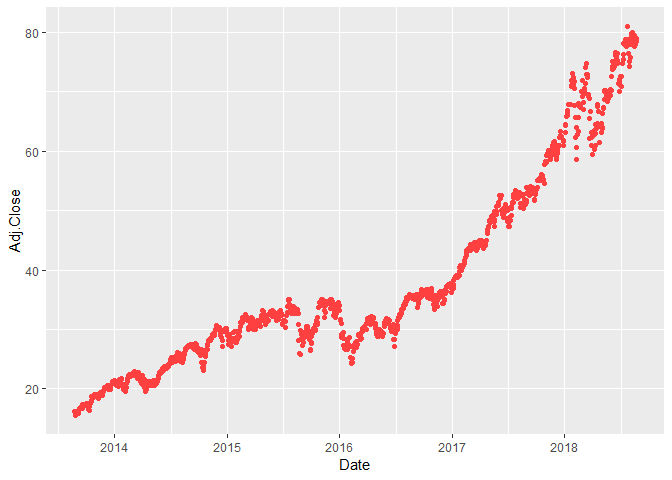

The dataset is downloaded from Yahoo Finance, https://finance.yahoo.com/quote/UOPIX


```r
library(RCurl)
library(ggplot2)
```


```r
url <- getURL('https://raw.githubusercontent.com/frankwwu/R-Knots/master/Outliers/UOPIX-Outliers.csv')
UOPIX <- read.csv(text = url) 
```


```r
UOPIX$Date=as.Date(UOPIX$Date)
UOPIX$ID <- seq.int(nrow(UOPIX))
```


```r
ggplot(data = UOPIX, aes(x=Date, y=Adj.Close)) +
  geom_point(color='brown1')
```

<!-- -->


```r
outlier_values <- boxplot.stats(UOPIX$Adj.Close, coef = 2)$out
outlier_values
```

```
## [1] 202.42 206.78 206.83 208.18
```


```r
min <- min(outlier_values)
outliers <- UOPIX[UOPIX$Adj.Close >= min,]
outliers
```

```
##            Date   Open   High    Low  Close Adj.Close Volume   ID
## 1107 2018-01-16 202.42 202.42 202.42 202.42    202.42      0 1107
## 1108 2018-01-17 206.78 206.78 206.78 206.78    206.78      0 1108
## 1109 2018-01-18 206.83 206.83 206.83 206.83    206.83      0 1109
## 1110 2018-01-19 208.18 208.18 208.18 208.18    208.18      0 1110
```

```r
rows <- nrow(outliers)
for (r in 1:rows){
  cur <- outliers[r,]$ID
  prev <- outliers[r,]$ID - 1
  UOPIX[UOPIX$ID == cur,]$Adj.Close <- UOPIX[UOPIX$ID == prev,]$Adj.Close
}

UOPIX[UOPIX$Adj.Close >= min,]
```

```
## [1] Date      Open      High      Low       Close     Adj.Close Volume   
## [8] ID       
## <0 rows> (or 0-length row.names)
```


```r
ggplot(data = UOPIX, aes(x=Date, y=Adj.Close)) +
  geom_point(color='brown1')
```

<!-- -->
