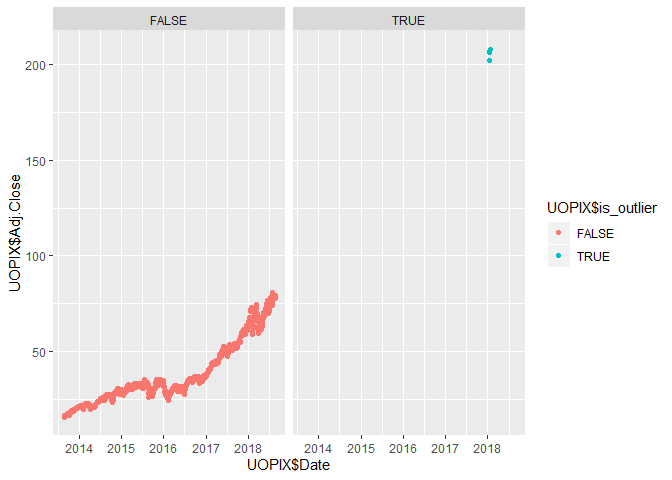

The dataset is downloaded from Yahoo Finance, https://finance.yahoo.com/quote/UOPIX


```r
library(RCurl)
library(ggplot2)
library(plotly)
library(tidyverse)
library(outliers)
```


```r
url <- getURL('https://raw.githubusercontent.com/frankwwu/R-Knots/master/Outliers/UOPIX-Outliers.csv')
UOPIX <- read.csv(text = url) 
```


```r
UOPIX$Date=as.Date(UOPIX$Date)
UOPIX$ID <- seq.int(nrow(UOPIX))
```


```r
ggplot(data = UOPIX, aes(x=Date, y=Adj.Close)) +
  geom_point(color='brown1')
```

<!-- -->


```r
ggplot(data = UOPIX, aes(x=Date, y=Adj.Close)) +
  geom_violin(color='brown1')
```

<!-- -->


```r
outlier_scores <- scores(UOPIX$Adj.Close)
```


```r
is_outlier <- outlier_scores > 3 | outlier_scores < -3

# Add a column with info whether the refund_value is an outlier
UOPIX$is_outlier <- is_outlier
```


```r
ggplot(UOPIX, aes(UOPIX$Date, UOPIX$Adj.Close)) +
    geom_point(aes(color = UOPIX$is_outlier)) +
    facet_wrap(~is_outlier)
```

<!-- -->


```r
ggplot(UOPIX, aes(Date, UOPIX$Adj.Close)) +
    geom_violin(aes(color = UOPIX$is_outlier)) +
    facet_wrap(~is_outlier)
```

<!-- -->


```r
outlier_values <- boxplot.stats(UOPIX$Adj.Close, coef = 3)$out
outlier_values
```

```
## [1] 202.42 206.78 206.83 208.18
```


```r
UOPIX_outliers <- UOPIX[outlier_scores > 3| outlier_scores < -3, ]
nrow(UOPIX_outliers)
```

```
## [1] 4
```

```r
head(UOPIX_outliers)
```

```
##            Date   Open   High    Low  Close Adj.Close Volume   ID
## 1107 2018-01-16 202.42 202.42 202.42 202.42    202.42      0 1107
## 1108 2018-01-17 206.78 206.78 206.78 206.78    206.78      0 1108
## 1109 2018-01-18 206.83 206.83 206.83 206.83    206.83      0 1109
## 1110 2018-01-19 208.18 208.18 208.18 208.18    208.18      0 1110
##      is_outlier
## 1107       TRUE
## 1108       TRUE
## 1109       TRUE
## 1110       TRUE
```


```r
min <- min(outlier_values)
outliers <- UOPIX[UOPIX$Adj.Close >= min,]
outliers
```

```
##            Date   Open   High    Low  Close Adj.Close Volume   ID
## 1107 2018-01-16 202.42 202.42 202.42 202.42    202.42      0 1107
## 1108 2018-01-17 206.78 206.78 206.78 206.78    206.78      0 1108
## 1109 2018-01-18 206.83 206.83 206.83 206.83    206.83      0 1109
## 1110 2018-01-19 208.18 208.18 208.18 208.18    208.18      0 1110
##      is_outlier
## 1107       TRUE
## 1108       TRUE
## 1109       TRUE
## 1110       TRUE
```

```r
# Replace with the previous value
rows <- nrow(outliers)
for (r in 1:rows){
  cur <- outliers[r,]$ID
  prev <- outliers[r,]$ID - 1
  UOPIX[UOPIX$ID == cur,]$Adj.Close <- UOPIX[UOPIX$ID == prev,]$Adj.Close
}

UOPIX[UOPIX$Adj.Close >= min,]
```

```
## [1] Date       Open       High       Low        Close      Adj.Close 
## [7] Volume     ID         is_outlier
## <0 rows> (or 0-length row.names)
```


```r
ggplot(UOPIX, aes(UOPIX$Date, UOPIX$Adj.Close)) +
    geom_point(aes(color = UOPIX$is_outlier)) +
    facet_wrap(~is_outlier)
```

<!-- -->

```r
ggplot(UOPIX, aes(UOPIX$Date, UOPIX$Adj.Close)) +
    geom_point(aes(color = UOPIX$is_outlier))
```

<!-- -->


```r
ggplot(UOPIX, aes(Date, UOPIX$Adj.Close)) +
    geom_violin(aes(color = UOPIX$is_outlier)) +
    facet_wrap(~is_outlier)
```

<!-- -->


```r
# Replace outliers with NA
UOPIX[outlier_scores > 3 | outlier_scores < -3, ]$Adj.Close <- NA
summary(UOPIX$Adj.Close)
```

```
##    Min. 1st Qu.  Median    Mean 3rd Qu.    Max.    NA's 
##   15.58   27.28   32.38   37.98   48.56   80.98       4
```


```r
ggplot(UOPIX, aes(UOPIX$Date, UOPIX$Adj.Close)) +
    geom_point(aes(color = UOPIX$is_outlier)) +
    facet_wrap(~is_outlier)
```

```
## Warning: Removed 4 rows containing missing values (geom_point).
```

<!-- -->


