This project is created for Boston Code Camp 23. It demonstrates how to
connect and query the SQL Server database with <code>RODBC</code>, and
how to explore and visualize the data with <code>ggplot2</code>. The
focus is on the technology rather than the interpretation of the
content. I use AdventureWorks as the sample database because it is free
and widely available. Please be aware that the schema is slightly
different in each version. You may need to modify the query statement if
you find this issue with your installed AdventureWorks database.

For data exploring with <code>ggplot2</code>, I build plots from a
simple one, add features incrementally, and achieve relatively
sophisticated plots in the end. I also create several identical plots
with both <code>qplot</code> and <code>ggplot</code>, respectively. This
will be helpful for beginners to better understand the concepts and
techniques of <code>ggplot2</code>.

### System Requirements

-   Microsoft SQL Server 2005 or higher

-   AdventureWorks Databases
    <http://msftdbprodsamples.codeplex.com/releases/view/125550>. For
    older versions,
    <http://msftdbprodsamples.codeplex.com/releases/view/93587>

-   Microsoft ODBC Driver for SQL Server
    <http://www.microsoft.com/en-US/download/details.aspx?id=36434>

-   R <http://cran.r-project.org/>

### Demo: Conneting to SQL Server database

Connecting to AdventureWorks database with <code>RODBC</code>.

    library(RODBC)
    conn <- odbcDriverConnect("Driver=ODBC Driver 11 for SQL Server;Server=HP2;Database=AdventureWorks;Trusted_Connection=yes")

### Demo: Querying with the stored procedure

The returned result is in a data frame.

    # AdventureWorks query
    #managers<-sqlQuery(conn,"exec dbo.uspGetEmployeeManagers @EmployeeID = 1")
    # AdventureWorks2014 query
    managers<-sqlQuery(conn,"exec dbo.uspGetEmployeeManagers @BusinessEntityID = 5")
    head(managers)

    ##   RecursionLevel BusinessEntityID FirstName   LastName OrganizationNode
    ## 1              0                5      Gail   Erickson          /1/1/2/
    ## 2              1                3   Roberto Tamburello            /1/1/
    ##   ManagerFirstName ManagerLastName
    ## 1          Roberto      Tamburello
    ## 2            Terri           Duffy

### Demo: Generating a simple table with knitr

Displaying the data with <code>kable</code>, a simple table generator.

    library(knitr)
    kable(managers)

<table>
<thead>
<tr class="header">
<th align="right">RecursionLevel</th>
<th align="right">BusinessEntityID</th>
<th align="left">FirstName</th>
<th align="left">LastName</th>
<th align="left">OrganizationNode</th>
<th align="left">ManagerFirstName</th>
<th align="left">ManagerLastName</th>
</tr>
</thead>
<tbody>
<tr class="odd">
<td align="right">0</td>
<td align="right">5</td>
<td align="left">Gail</td>
<td align="left">Erickson</td>
<td align="left">/1/1/2/</td>
<td align="left">Roberto</td>
<td align="left">Tamburello</td>
</tr>
<tr class="even">
<td align="right">1</td>
<td align="right">3</td>
<td align="left">Roberto</td>
<td align="left">Tamburello</td>
<td align="left">/1/1/</td>
<td align="left">Terri</td>
<td align="left">Duffy</td>
</tr>
</tbody>
</table>

### Demo: Querying with the SQL statement

Querying the sales data. The returned result is in a data frame.

    sales <- sqlQuery(conn, "SELECT soh.OrderDate,                                            
                            cr.Name as CountryRegion,
                            p.Name AS ProductName,                                           
                            soh.TotalDue,
                            ps.Name AS Category,
                            pc.Name AS Subcategory,
                            CASE WHEN soh.OnlineOrderFlag >0 THEN 'TRUE' ELSE 'FALSE' END AS OnlineOrder
                            FROM [AdventureWorks].[Sales].[SalesOrderHeader] soh
                            INNER JOIN [AdventureWorks].[Sales].[SalesTerritory] AS t 
                                ON t.territoryid=soh.territoryid
                            INNER JOIN [AdventureWorks].[Person].[CountryRegion] AS cr 
                                ON cr.countryregioncode=t.countryregioncode
                            INNER JOIN [AdventureWorks].[Sales].[SalesOrderDetail] AS sod
                                ON soh.SalesOrderID = sod.SalesOrderID
                            INNER JOIN [AdventureWorks].[Production].[Product] AS p
                                ON sod.ProductID = p.ProductID
                            INNER JOIN [AdventureWorks].[Production].[ProductSubcategory] AS ps
                                ON p.ProductSubcategoryID = ps.ProductSubcategoryID
                            INNER JOIN [AdventureWorks].[Production].[ProductCategory] AS pc
                                ON ps.ProductCategoryID = pc.ProductCategoryID
                            ORDER BY cr.Name")
    close(conn)
    head(sales, 3)

    ##    OrderDate CountryRegion      ProductName TotalDue        Category
    ## 1 2013-06-06     Australia LL Mountain Tire 654.4584 Tires and Tubes
    ## 2 2013-06-22     Australia LL Mountain Tire 632.3473 Tires and Tubes
    ## 3 2013-07-02     Australia LL Mountain Tire  30.1444 Tires and Tubes
    ##   Subcategory OnlineOrder
    ## 1 Accessories        TRUE
    ## 2 Accessories        TRUE
    ## 3 Accessories        TRUE

    str(sales)

    ## 'data.frame':    121317 obs. of  7 variables:
    ##  $ OrderDate    : POSIXct, format: "2013-06-06" "2013-06-22" ...
    ##  $ CountryRegion: Factor w/ 6 levels "Australia","Canada",..: 1 1 1 1 1 1 1 1 1 1 ...
    ##  $ ProductName  : Factor w/ 266 levels "All-Purpose Bike Stand",..: 78 78 78 78 78 78 78 78 78 78 ...
    ##  $ TotalDue     : num  654.5 632.3 30.1 35.7 38.9 ...
    ##  $ Category     : Factor w/ 35 levels "Bib-Shorts","Bike Racks",..: 31 31 31 31 31 31 31 31 31 31 ...
    ##  $ Subcategory  : Factor w/ 4 levels "Accessories",..: 1 1 1 1 1 1 1 1 1 1 ...
    ##  $ OnlineOrder  : logi  TRUE TRUE TRUE TRUE TRUE TRUE ...

    summary(sales)

    ##    OrderDate                          CountryRegion  
    ##  Min.   :2011-05-31 00:00:00   Australia     :15058  
    ##  1st Qu.:2013-02-28 00:00:00   Canada        :19064  
    ##  Median :2013-09-30 00:00:00   France        : 9088  
    ##  Mean   :2013-07-15 20:03:09   Germany       : 7528  
    ##  3rd Qu.:2014-01-31 00:00:00   United Kingdom:10426  
    ##  Max.   :2014-06-30 00:00:00   United States :60153  
    ##                                                      
    ##                  ProductName        TotalDue        
    ##  Water Bottle - 30 oz. :  4688   Min.   :     1.52  
    ##  AWC Logo Cap          :  3382   1st Qu.:   623.75  
    ##  Patch Kit/8 Patches   :  3354   Median :  2785.52  
    ##  Mountain Tire Tube    :  3095   Mean   : 24126.63  
    ##  Sport-100 Helmet, Blue:  3090   3rd Qu.: 41890.97  
    ##  Sport-100 Helmet, Red :  3083   Max.   :187487.83  
    ##  (Other)               :100625                      
    ##               Category          Subcategory    OnlineOrder    
    ##  Road Bikes       :20944   Accessories:41194   Mode :logical  
    ##  Tires and Tubes  :17495   Bikes      :40031   FALSE:60919    
    ##  Mountain Bikes   :12457   Clothing   :21394   TRUE :60398    
    ##  Helmets          : 9180   Components :18698   NA's :0        
    ##  Bottles and Cages: 8425                                      
    ##  Jerseys          : 7191                                      
    ##  (Other)          :45625

### Demo: Exploring the sales history

This section shows how to generate the same plots with both
<code>qplot</code> and <code>ggplot</code> step by step. Let's start
with qplot and add features incrementally.

    library(ggplot2)
    qplot(data=sales, y=TotalDue, x=OrderDate, main='Simple Plot (qplot)')

    qplot(data=sales, y=TotalDue, x=OrderDate, color=OnlineOrder, size=TotalDue, main='Plot with aesthetic mappings (qplot)')

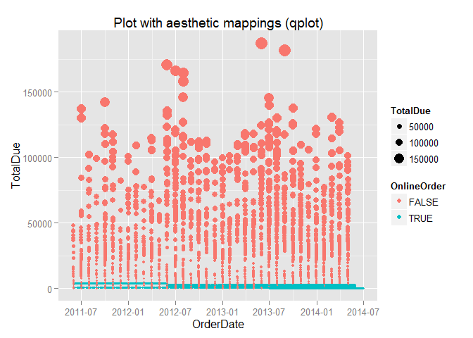

    qplot(data=sales, y=TotalDue, x=OrderDate, color=OnlineOrder, size=TotalDue, main='Plot with log and aesthetic mappings (qplot)') + scale_y_log10()

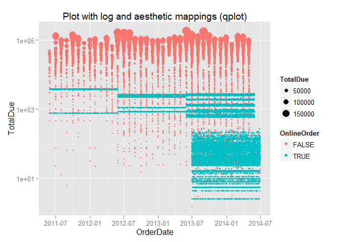

Now let's generate the same plot set with <code>ggplot</code> step by
step.

    ggplot(sales, aes(OrderDate, TotalDue)) + geom_point() + ggtitle('Simple Plot (ggplot)')

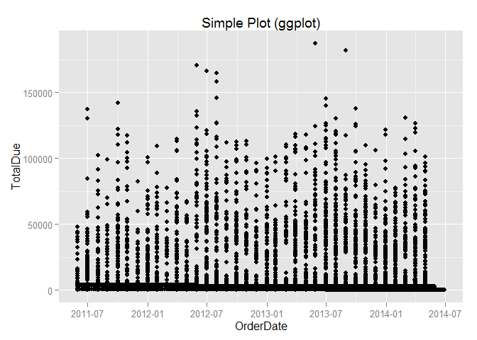

    ggplot(sales, aes(OrderDate, TotalDue)) + geom_point(aes(colour = OnlineOrder, size=TotalDue)) + ggtitle('Plot with aesthetic mappings (ggplot)')

    ggplot(sales, aes(OrderDate, TotalDue)) + geom_point(aes(colour = OnlineOrder, size=TotalDue)) + ggtitle('Plot with log and aesthetic mappings (ggplot)') + scale_y_log10()

### Demo: Bar plot with qplot and ggplot

This section shows how to create bar plots with <code>qplot</code> and
<code>ggplot</code>. Please also pay attention to how to use
<code>lubridate</code> to extract the month value from OrderDate.

    library(lubridate)
    qplot(month(OrderDate), TotalDue/1000000, fill=CountryRegion, data=sales, geom="bar", stat="identity", xlab="Month", ylab="Value ($m)",  main='Bar Plot (qplot)') +
       scale_x_discrete(limits=c(1:12)) 

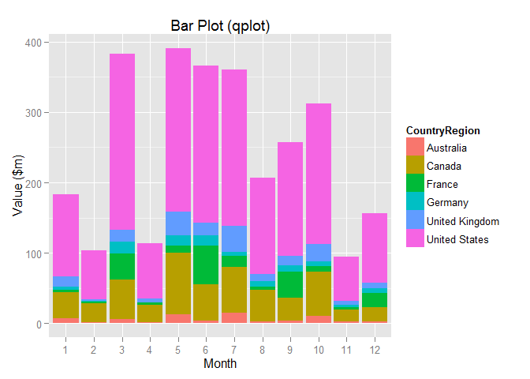

    ggplot(data=sales,aes(x=month(OrderDate),  y=TotalDue/1000000, fill=CountryRegion)) + 
      geom_bar(stat="identity") + 
      labs(x="Month", y="Value ($m)") +
      scale_fill_brewer(type="qual") +
      scale_x_discrete("Month", limits=c(1:12)) +
      ggtitle("Bar Plot (ggplot)")

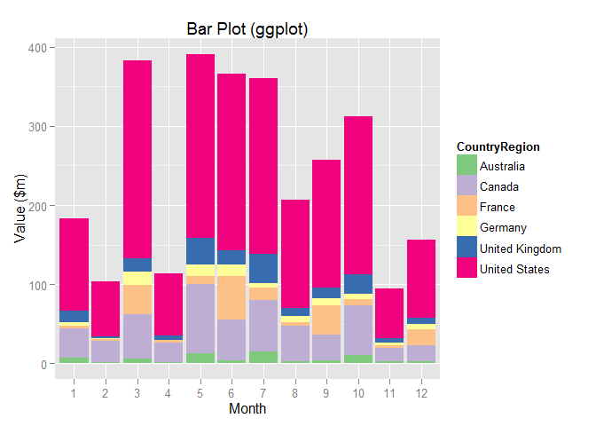

The above two bar plots should be the same, except the built-in pallet.

### Demo: Bar plot with flipped cartesian coordinates

Following two examples show how to use <code>coord\_flip</code> to flip
the cartesian coordinates. Please also pay attention to how to convert
OrderDate to year with <code>lubridate</code>.

    qplot(year(OrderDate), TotalDue/1000000, fill=CountryRegion, data=sales, geom="bar", stat="identity", xlab="Year", ylab="Value ($m)", main="Bar Plot with Coordinate Flip (qplot)") + coord_flip()

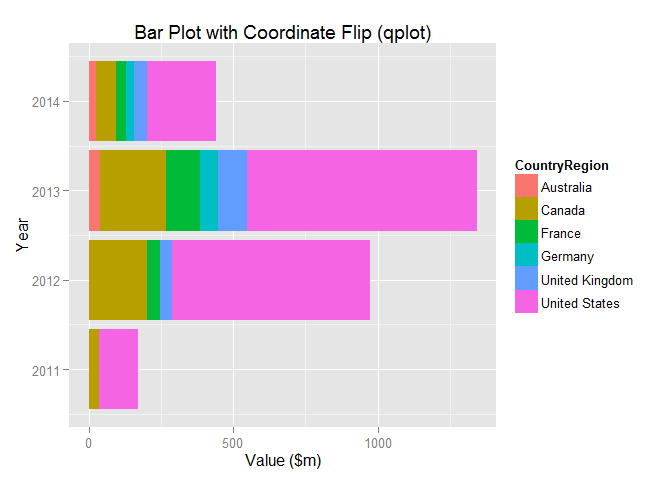

    ggplot(data=sales,aes(x=year(OrderDate), y=TotalDue/1000000, fill=CountryRegion)) + 
      geom_bar(stat="identity") +  
      labs(x="Year",y="Value ($m)") +
      scale_fill_brewer(type="qual") +
      ggtitle("Bar Plot with Coordinate Flip (ggplot)") +
      coord_flip()

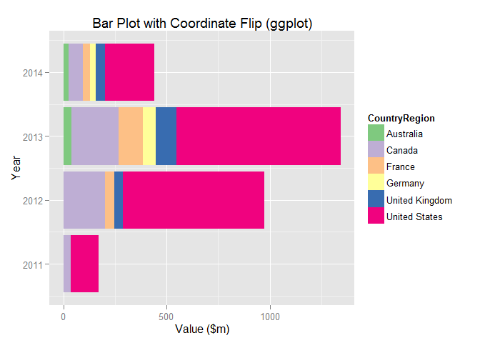

The above two bar plots should be identical, except the built-in pallet.

### Demo: Tabular display

The tabular plot is excellent in representing multivariate data. Let's
start with displaying sales per year per country.

    ggplot(sales, aes(OrderDate, TotalDue)) + 
      geom_point(aes(color=factor(CountryRegion), fill = factor(CountryRegion))) + 
      facet_grid(.~CountryRegion) + 
      theme(legend.position="none", axis.text.x=element_text(angle=90))

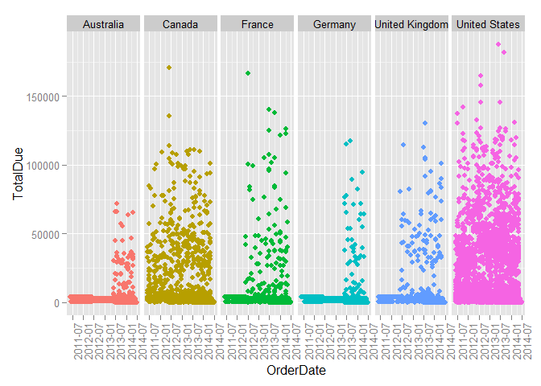

It appears there are a lot of overlapped data points; and we can't see
how many data points are overlapped. We definitely need to improve the
plot. Let's try to use the violin plot to show the density of data.

    ggplot(sales, aes(OrderDate, TotalDue)) + 
      geom_violin(aes(fill = factor(CountryRegion))) + 
      facet_grid(.~CountryRegion) + 
      theme(legend.position="none", axis.text.x=element_text(angle=90))

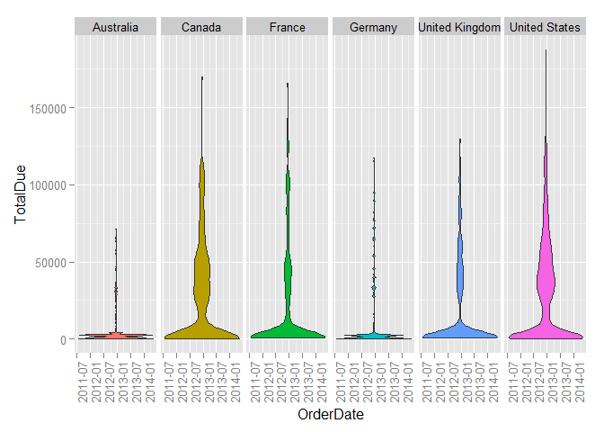

Looks good! Let's overlap the points with violin in the same plot. The
order matters!

    ggplot(sales, aes(OrderDate, TotalDue)) + 
      facet_grid(.~CountryRegion) + 
      theme(legend.position="none", axis.text.x=element_text(angle=90)) + 
      geom_point(aes(color=factor(CountryRegion), fill = factor(CountryRegion))) +
      geom_violin(aes(fill = factor(CountryRegion)))

Looks pretty cool! We have learned how to overlap two plots together for
richer representation.

Depending on characteristics of data, sometimes you may need to try
different plots to better represent the density. As an exercise, you can
replace the <code>geom\_violin</code> with either
<code>geom\_boxplot</code> or <code>geom\_density</code> to see the
different plots. You don't know which one is the best for your data
until you try.

### Demo: Lay out panels in a grid

Let's generate an arrry of bar plots in the panel. Each plot is
associated to a country. Note how to set the palette with the index.

    ggplot(data=sales,aes(x=year(OrderDate),y=TotalDue/1000000, fill=CountryRegion)) +
      geom_bar(stat="identity") + 
      facet_grid(.~CountryRegion) +
      theme(legend.position="none",axis.text.x=element_text(angle=90)) +
      labs(x="Year",y="Value ($m)") +
      scale_fill_brewer(type="qual", palette=3)

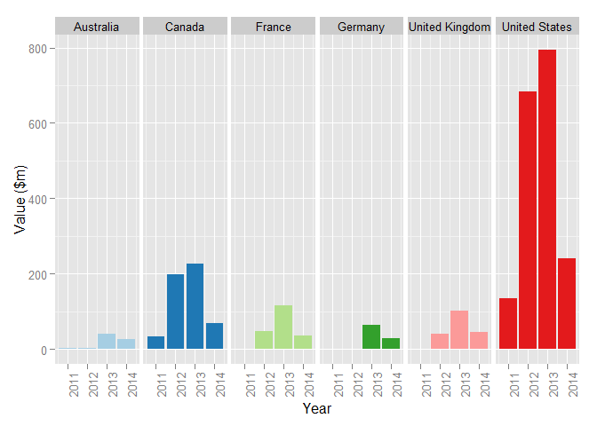

Finally, let's format the above plot with the Subcategory. Note how to
set the palette with the name.

    #library(lubridate)
    ggplot(data=sales,aes(x=year(OrderDate), y=TotalDue/1000000, fill=CountryRegion)) +
      geom_bar(stat="identity") +
      facet_grid(Subcategory~CountryRegion) +
      theme(legend.position="none", axis.text.x=element_text(angle=90)) + 
      labs(x="Year",y="Value ($m)") +
      scale_fill_brewer(type="qual", palette='Paired')

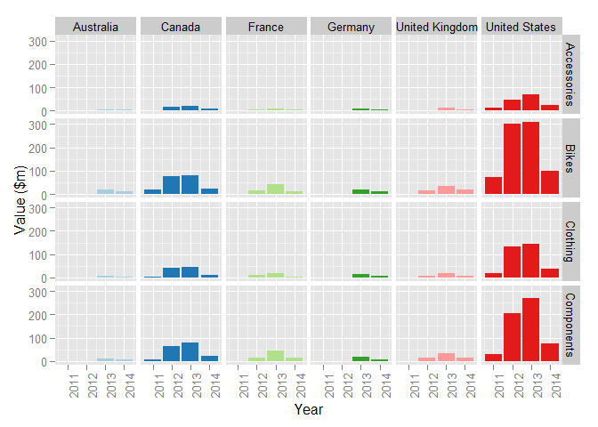
