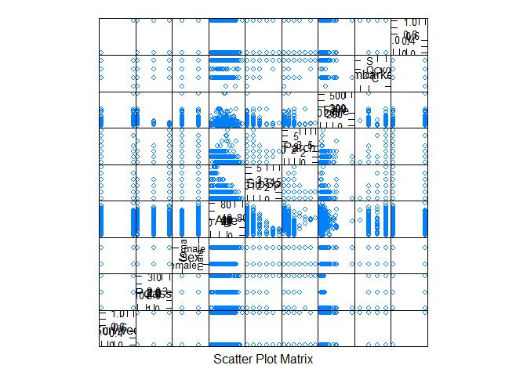
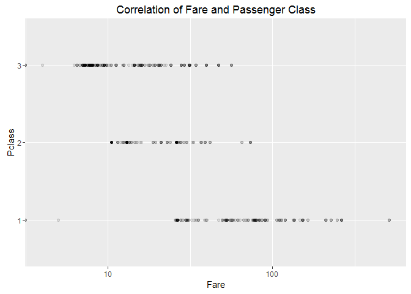
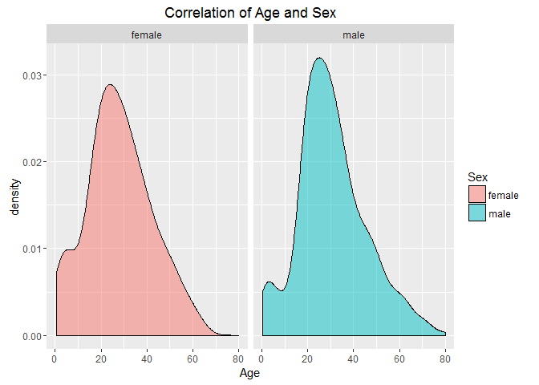
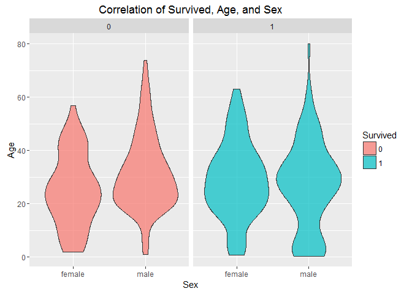
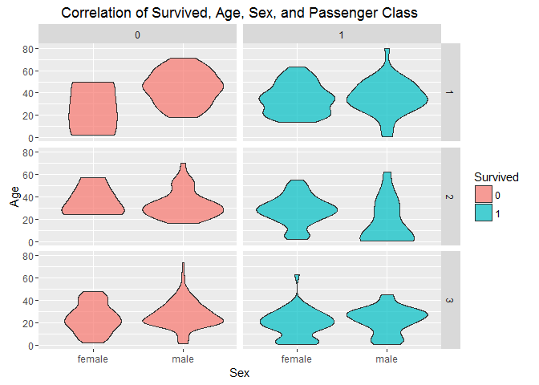

# Titanic

### Variable Descriptions

**Survival**:  Survival (0 = No; 1 = Yes) 

**Pclass**:    Passenger Class (1 = 1st; 2 = 2nd; 3 = 3rd) 

**Name**:      Name 

**Sex**:       Sex 

**Age**:       Age 

**Sibsp**:     Number of Siblings/Spouses Aboard 

**Parch**:     Number of Parents/Children Aboard 

**Ticket**:    Ticket Number 

**Fare**:      Passenger Fare 

**Cabin**:     Cabin 

**Embarked**:  Port of Embarkation (C = Cherbourg; Q = Queenstown; S = Southampton) 


```r
library(gtools)
library(ggplot2)
library(caret)
library(dplyr)
library(RCurl)
```


```r
url <- getURL('https://raw.githubusercontent.com/frankwwu/R-Knots/master/Titanic/train.csv')
train <- read.csv(text = url) 
dim(train)
```

```
## [1] 891  12
```

Removing names and NAs.


```r
train<-train[, !(colnames(train) %in% c('Name'))]
train <-train %>% na.omit()
```


```r
par(mar = rep(2, 4))
trainCols <- c("Survived", "Pclass", "Sex", "Age", "SibSp", "Parch", "Fare", "Embarked")
featurePlot(x=train[,trainCols], y=train$Survived, plot='pairs', par.settings=list(superpose.symbol=list(alpha = rep(1, 9), cex=rep(0, 1), font = rep(1, 2), pch=c(0))))
```



```r
dev.copy(png, width=900, height=900, file="Titanic-features.png")  
```

```
## png 
##   3
```

```r
dev.off()
```

```
## png 
##   2
```


```r
train$Survived <- factor(train$Survived)
train$Sex <- factor(train$Sex)
train$Pclass <- factor(train$Pclass)
```


```r
ggplot(train, aes(Fare, Pclass)) +     
  geom_point(stat="identity", alpha=0.1) +
  scale_x_log10() +
  ggtitle("Correlation of Fare and Passenger Class")
```




```r
ggplot(data=train, aes(x=Age, fill=Sex)) +
    geom_density(alpha=0.5) + 
    facet_grid(. ~ Sex) + 
    ggtitle("Correlation of Age and Sex")
```




```r
ggplot(data=train, aes(x=Sex, y=Age, fill=Survived)) +
    geom_violin(alpha=0.7) +   
    facet_grid(. ~ Survived) +   
    labs(x="Sex", y="Age") +
    guides(fill=guide_legend(title="Survived")) + 
    ggtitle("Correlation of Survived, Age, and Sex")
```




```r
ggplot(data=train, aes(x=Sex, y=Age, fill=Survived)) +
    geom_violin(alpha=0.7) +   
    facet_grid(Pclass ~ Survived) +   
    labs(x="Sex", y="Age") +
    guides(fill=guide_legend(title="Survived")) + 
    ggtitle("Correlation of Survived, Age, Sex, and Passenger Class")
```




```r
ggplot(train, aes(Age, Fare, color=Survived)) + 
  geom_point(alpha = 0.5) +
  facet_grid(Pclass~Sex) +
  ggtitle("Training Data")
```


Suggested training set formula: <code>Survived ~ Pclass + Sex + Age + SibSp + Parch + Fare + Embarked</code>
