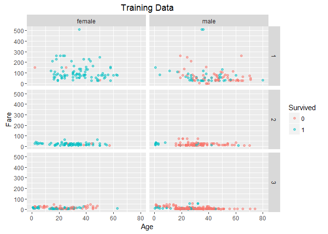

# Titanic - Decision Trees with Parallel Processing

### Variable Descriptions

**survival**:  Survival (0 = No; 1 = Yes) 

**pclass**:    Passenger Class (1 = 1st; 2 = 2nd; 3 = 3rd) 

**name**:      Name 

**sex**:       Sex 

**age**:       Age 

**sibsp**:     Number of Siblings/Spouses Aboard 

**parch**:     Number of Parents/Children Aboard 

**ticket**:    Ticket Number 

**fare**:      Passenger Fare 

**cabin**:     Cabin 

**embarked**:  Port of Embarkation (C = Cherbourg; Q = Queenstown; S = Southampton) 
 


```r
library(doParallel)
library(caret)
library(ParallelForest)
library(dplyr)
library(ggplot2)
library(rattle)
library(RCurl)
```

### 1. Reading data


```r
url <- getURL('https://raw.githubusercontent.com/frankwwu/R-Knots/master/Titanic/train.csv')
train <- read.csv(text = url) 
url <- getURL('https://raw.githubusercontent.com/frankwwu/R-Knots/master/Titanic/test.csv')
test <- read.csv(text = url) 
```

### 2. Removing names and NAs.


```r
train<-train[, !(colnames(train) %in% c('name'))]
train <-train %>% na.omit()
test<-test[, !(colnames(test) %in% c('name'))]
test <- test %>% na.omit()
```

### 3. Selecting features


```r
train$Survived <- factor(train$Survived)
formula = Survived ~ Pclass + Sex + Age + SibSp + Parch + Fare + Embarked
```

### 4. Random Forest training model with parallel processing


```r
set.seed(2020)
cluster <- makeCluster(detectCores() - 1)
registerDoParallel(cluster)
# The number of resampling iterations is 3.
fitControl <- trainControl(method = "cv", number = 3, allowParallel = TRUE)
```


```r
fit <- train(formula, data=train, method="rf", importance = TRUE, trControl=fitControl)
```

```
## Loading required package: randomForest
```

```
## randomForest 4.6-12
```

```
## Type rfNews() to see new features/changes/bug fixes.
```

```
## 
## Attaching package: 'randomForest'
```

```
## The following object is masked from 'package:dplyr':
## 
##     combine
```

```
## The following object is masked from 'package:ggplot2':
## 
##     margin
```


```r
stopCluster(cluster)
confusionMatrix.train(fit)
```

```
## Cross-Validated (3 fold) Confusion Matrix 
## 
## (entries are percentages of table totals)
##  
##           Reference
## Prediction    0    1
##          0 54.3 13.4
##          1  5.0 27.2
```

```r
fit
```

```
## Random Forest 
## 
## 714 samples
##  11 predictor
##   2 classes: '0', '1' 
## 
## No pre-processing
## Resampling: Cross-Validated (3 fold) 
## Summary of sample sizes: 476, 476, 476 
## Resampling results across tuning parameters:
## 
##   mtry  Accuracy   Kappa      Accuracy SD  Kappa SD  
##   2     0.8151261  0.6033409  0.02755226   0.06445274
##   5     0.8039216  0.5892368  0.01057400   0.02573612
##   9     0.7843137  0.5479448  0.01698089   0.04920397
## 
## Accuracy was used to select the optimal model using  the largest value.
## The final value used for the model was mtry = 2.
```

```r
# Accuracy
ggplot(fit, metric = "Accuracy")
```


```r
# Kappa coefficient
ggplot(fit, metric = "Kappa")
```


### 5. Predicting with the test data set


```r
Survived<-predict(fit, test)
Survived
```

```
##   [1] 0 0 0 0 0 0 0 0 1 0 0 1 0 1 1 0 0 0 0 1 0 0 1 0 1 0 0 0 0 0 1 0 0 0 0
##  [36] 0 1 1 0 0 1 1 0 0 1 1 0 0 0 1 0 0 0 1 1 1 0 0 1 1 0 0 0 1 0 1 0 1 1 0
##  [71] 0 1 0 1 0 1 0 0 1 0 0 0 1 0 0 1 0 0 0 0 1 1 1 0 1 1 1 1 1 0 1 0 0 0 0
## [106] 0 0 0 0 0 0 0 0 1 0 0 0 0 0 0 1 1 0 0 1 0 0 1 1 1 0 0 0 0 0 0 0 0 1 1
## [141] 1 1 1 0 1 1 1 0 1 0 0 0 0 0 1 0 1 0 0 1 1 1 0 0 0 1 0 0 0 1 0 0 0 1 1
## [176] 0 1 0 1 0 0 0 0 1 0 1 0 0 0 1 1 1 1 0 0 1 0 1 1 0 1 0 0 0 1 0 0 0 1 1
## [211] 0 0 0 1 1 0 0 0 0 0 1 0 1 0 0 0 0 0 0 1 0 0 0 0 0 1 1 1 0 0 0 0 0 1 1
## [246] 1 0 0 0 0 0 0 0 1 0 1 0 0 0 1 0 1 0 0 0 0 0 0 0 1 1 0 1 0 1 1 0 0 0 1
## [281] 0 1 0 0 1 1 0 1 0 1 0 0 1 0 0 1 1 0 0 0 0 0 0 1 0 0 0 0 0 1 0 0 0 1 0
## [316] 1 0 0 1 0 1 0 0 0 0 0 1 1 0 1 0
## Levels: 0 1
```

```r
r<-cbind(Survived, test)
ggplot(r, aes(Age, Fare, color=Survived)) + 
  geom_point(alpha = 0.5) +
  facet_grid(Pclass~Sex) +
  ggtitle("Test Data Predicted")
```


```r
ggplot(train, aes(Age, Fare, color=Survived)) + 
  geom_point(alpha = 0.5) +
  facet_grid(Pclass~Sex) +
  ggtitle("Training Data")
```



```r
total<-rbind(train, r)
ggplot(total, aes(Age, Fare, color=Survived)) + 
  geom_point(alpha = 0.5) +
  facet_grid(Pclass~Sex) +
  ggtitle("Total")
```


