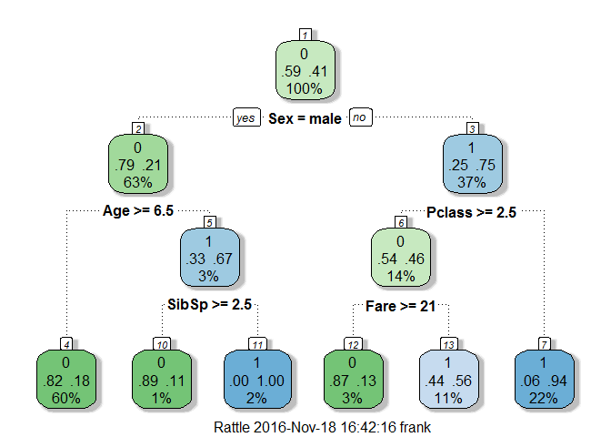

# Titanic - Decision Trees

### Variable Descriptions

**Survival**:  Survival (0 = No; 1 = Yes) 

**Pclass**:    Passenger Class (1 = 1st; 2 = 2nd; 3 = 3rd) 

**Name**:      Name 

**Sex**:       Sex 

**Age**:       Age 

**Sibsp**:     Number of Siblings/Spouses Aboard 

**Parch**:     Number of Parents/Children Aboard 

**Ticket**:    Ticket Number 

**Fare**:      Passenger Fare 

**Cabin**:     Cabin 

**Embarked**:  Port of Embarkation (C = Cherbourg; Q = Queenstown; S = Southampton) 


```r
library(rpart)
library(rattle)
library(dplyr)
library(RCurl)
```

### 1. Reading data


```r
url <- getURL('https://raw.githubusercontent.com/frankwwu/R-Knots/master/Titanic/train.csv')
train <- read.csv(text = url) 
url <- getURL('https://raw.githubusercontent.com/frankwwu/R-Knots/master/Titanic/test.csv')
test <- read.csv(text = url) 
```

### 2. Removing NAs


```r
train<-train[, !(colnames(train) %in% c('Name', 'Ticket', 'Cabin'))]
train <-train %>% na.omit()
test<-test[, !(colnames(test) %in% c('Name', 'Ticket', 'Cabin'))]
test <- test %>% na.omit()
```

### 3. Selecting features


```r
train$Survived <- factor(train$Survived)
formula = Survived ~ Pclass + Sex + Age + SibSp + Parch + Fare + Embarked
```

### 4. Creating classification tree


```r
set.seed(200)
tree <- rpart(formula, data=train, method="class")
fancyRpartPlot(tree)
```

<!-- -->

### 5. Cross-Validation 

To examine whether the tree model is over fitting, find the size of tree with the minimum error.


```r
plotcp(tree)
```

<!-- -->

```r
tree$cptable[which.min(tree$cptable[,"xerror"]),"CP"]
```

```
## [1] 0.01034483
```

```r
printcp(tree)
```

```
## 
## Classification tree:
## rpart(formula = formula, data = train, method = "class")
## 
## Variables actually used in tree construction:
## [1] Age    Fare   Parch  Pclass Sex    SibSp 
## 
## Root node error: 290/714 = 0.40616
## 
## n= 714 
## 
##         CP nsplit rel error  xerror     xstd
## 1 0.458621      0   1.00000 1.00000 0.045252
## 2 0.029310      1   0.54138 0.54138 0.038162
## 3 0.027586      3   0.48276 0.55517 0.038506
## 4 0.024138      4   0.45517 0.53448 0.037986
## 5 0.010345      5   0.43103 0.50345 0.037162
## 6 0.010000      9   0.38966 0.53103 0.037897
```

### 6. Prune the tree
Prune back the tree to avoid overfitting the data. Typically, you will want to select a tree size that minimizes the cross-validated error, the xerror column printed by printcp( ).


```r
ptree<- prune(tree, cp=tree$cptable[which.min(tree$cptable[,"xerror"]),"CP"])
fancyRpartPlot(ptree)
```

<!-- -->

### 7. Prediction


```r
Prediction <- predict(ptree, test, type = "prob")
Prediction
```

```
##              0         1
## 1   0.82051282 0.1794872
## 2   0.44303797 0.5569620
## 3   0.82051282 0.1794872
## 4   0.82051282 0.1794872
## 5   0.44303797 0.5569620
## 6   0.82051282 0.1794872
## 7   0.44303797 0.5569620
## 8   0.82051282 0.1794872
## 9   0.44303797 0.5569620
## 10  0.82051282 0.1794872
## 12  0.82051282 0.1794872
## 13  0.05660377 0.9433962
## 14  0.82051282 0.1794872
## 15  0.05660377 0.9433962
## 16  0.05660377 0.9433962
## 17  0.82051282 0.1794872
## 18  0.82051282 0.1794872
## 19  0.44303797 0.5569620
## 20  0.44303797 0.5569620
## 21  0.82051282 0.1794872
## 22  0.82051282 0.1794872
## 24  0.82051282 0.1794872
## 25  0.05660377 0.9433962
## 26  0.82051282 0.1794872
## 27  0.05660377 0.9433962
## 28  0.82051282 0.1794872
## 29  0.82051282 0.1794872
## 31  0.82051282 0.1794872
## 32  0.82051282 0.1794872
## 33  0.44303797 0.5569620
## 35  0.82051282 0.1794872
## 36  0.82051282 0.1794872
## 38  0.44303797 0.5569620
## 39  0.82051282 0.1794872
## 41  0.82051282 0.1794872
## 43  0.82051282 0.1794872
## 44  0.05660377 0.9433962
## 45  0.05660377 0.9433962
## 46  0.82051282 0.1794872
## 47  0.82051282 0.1794872
## 49  0.05660377 0.9433962
## 50  0.44303797 0.5569620
## 51  0.82051282 0.1794872
## 52  0.82051282 0.1794872
## 53  0.05660377 0.9433962
## 54  0.05660377 0.9433962
## 56  0.82051282 0.1794872
## 57  0.82051282 0.1794872
## 58  0.82051282 0.1794872
## 60  0.05660377 0.9433962
## 61  0.82051282 0.1794872
## 62  0.82051282 0.1794872
## 63  0.82051282 0.1794872
## 64  0.44303797 0.5569620
## 65  0.82051282 0.1794872
## 67  0.44303797 0.5569620
## 68  0.82051282 0.1794872
## 69  0.82051282 0.1794872
## 70  0.05660377 0.9433962
## 71  0.44303797 0.5569620
## 72  0.82051282 0.1794872
## 73  0.44303797 0.5569620
## 74  0.82051282 0.1794872
## 75  0.05660377 0.9433962
## 76  0.82051282 0.1794872
## 78  0.05660377 0.9433962
## 79  0.82051282 0.1794872
## 80  0.44303797 0.5569620
## 81  0.00000000 1.0000000
## 82  0.82051282 0.1794872
## 83  0.82051282 0.1794872
## 87  0.44303797 0.5569620
## 88  0.44303797 0.5569620
## 90  0.00000000 1.0000000
## 91  0.44303797 0.5569620
## 93  0.05660377 0.9433962
## 95  0.82051282 0.1794872
## 96  0.82051282 0.1794872
## 97  0.05660377 0.9433962
## 98  0.82051282 0.1794872
## 99  0.44303797 0.5569620
## 100 0.82051282 0.1794872
## 101 0.05660377 0.9433962
## 102 0.82051282 0.1794872
## 104 0.82051282 0.1794872
## 105 0.44303797 0.5569620
## 106 0.82051282 0.1794872
## 107 0.82051282 0.1794872
## 110 0.82051282 0.1794872
## 111 0.82051282 0.1794872
## 113 0.05660377 0.9433962
## 114 0.44303797 0.5569620
## 115 0.05660377 0.9433962
## 116 0.82051282 0.1794872
## 118 0.44303797 0.5569620
## 119 0.82051282 0.1794872
## 120 0.05660377 0.9433962
## 121 0.05660377 0.9433962
## 123 0.05660377 0.9433962
## 124 0.82051282 0.1794872
## 126 0.44303797 0.5569620
## 127 0.82051282 0.1794872
## 129 0.82051282 0.1794872
## 130 0.82051282 0.1794872
## 131 0.82051282 0.1794872
## 132 0.82051282 0.1794872
## 135 0.82051282 0.1794872
## 136 0.82051282 0.1794872
## 137 0.82051282 0.1794872
## 138 0.82051282 0.1794872
## 139 0.44303797 0.5569620
## 140 0.82051282 0.1794872
## 141 0.86956522 0.1304348
## 142 0.05660377 0.9433962
## 143 0.82051282 0.1794872
## 144 0.82051282 0.1794872
## 145 0.82051282 0.1794872
## 146 0.82051282 0.1794872
## 148 0.82051282 0.1794872
## 150 0.82051282 0.1794872
## 151 0.05660377 0.9433962
## 154 0.44303797 0.5569620
## 155 0.82051282 0.1794872
## 156 0.82051282 0.1794872
## 157 0.05660377 0.9433962
## 158 0.44303797 0.5569620
## 159 0.82051282 0.1794872
## 160 0.44303797 0.5569620
## 162 0.82051282 0.1794872
## 163 0.05660377 0.9433962
## 165 0.82051282 0.1794872
## 166 0.86956522 0.1304348
## 167 0.82051282 0.1794872
## 168 0.82051282 0.1794872
## 170 0.44303797 0.5569620
## 172 0.82051282 0.1794872
## 173 0.82051282 0.1794872
## 175 0.82051282 0.1794872
## 176 0.05660377 0.9433962
## 177 0.05660377 0.9433962
## 178 0.82051282 0.1794872
## 179 0.05660377 0.9433962
## 180 0.05660377 0.9433962
## 181 0.82051282 0.1794872
## 182 0.82051282 0.1794872
## 183 0.05660377 0.9433962
## 185 0.05660377 0.9433962
## 186 0.82051282 0.1794872
## 187 0.05660377 0.9433962
## 188 0.82051282 0.1794872
## 190 0.82051282 0.1794872
## 191 0.82051282 0.1794872
## 193 0.82051282 0.1794872
## 194 0.82051282 0.1794872
## 195 0.82051282 0.1794872
## 196 0.82051282 0.1794872
## 197 0.00000000 1.0000000
## 198 0.44303797 0.5569620
## 199 0.82051282 0.1794872
## 202 0.00000000 1.0000000
## 203 0.82051282 0.1794872
## 204 0.05660377 0.9433962
## 205 0.82051282 0.1794872
## 207 0.44303797 0.5569620
## 208 0.82051282 0.1794872
## 209 0.05660377 0.9433962
## 210 0.82051282 0.1794872
## 211 0.82051282 0.1794872
## 213 0.82051282 0.1794872
## 214 0.05660377 0.9433962
## 215 0.44303797 0.5569620
## 216 0.82051282 0.1794872
## 218 0.82051282 0.1794872
## 219 0.05660377 0.9433962
## 221 0.05660377 0.9433962
## 222 0.82051282 0.1794872
## 223 0.05660377 0.9433962
## 224 0.82051282 0.1794872
## 225 0.05660377 0.9433962
## 227 0.82051282 0.1794872
## 229 0.82051282 0.1794872
## 230 0.82051282 0.1794872
## 231 0.82051282 0.1794872
## 232 0.05660377 0.9433962
## 233 0.82051282 0.1794872
## 235 0.82051282 0.1794872
## 236 0.82051282 0.1794872
## 237 0.82051282 0.1794872
## 238 0.82051282 0.1794872
## 239 0.05660377 0.9433962
## 240 0.05660377 0.9433962
## 241 0.05660377 0.9433962
## 242 0.05660377 0.9433962
## 243 0.82051282 0.1794872
## 246 0.82051282 0.1794872
## 247 0.05660377 0.9433962
## 248 0.82051282 0.1794872
## 249 0.05660377 0.9433962
## 251 0.05660377 0.9433962
## 252 0.82051282 0.1794872
## 253 0.82051282 0.1794872
## 254 0.82051282 0.1794872
## 255 0.82051282 0.1794872
## 258 0.82051282 0.1794872
## 259 0.05660377 0.9433962
## 260 0.82051282 0.1794872
## 261 0.82051282 0.1794872
## 262 0.82051282 0.1794872
## 263 0.05660377 0.9433962
## 264 0.44303797 0.5569620
## 265 0.82051282 0.1794872
## 270 0.82051282 0.1794872
## 271 0.82051282 0.1794872
## 273 0.05660377 0.9433962
## 276 0.05660377 0.9433962
## 277 0.82051282 0.1794872
## 278 0.82051282 0.1794872
## 279 0.82051282 0.1794872
## 280 0.82051282 0.1794872
## 281 0.44303797 0.5569620
## 282 0.00000000 1.0000000
## 284 0.44303797 0.5569620
## 285 0.44303797 0.5569620
## 286 0.82051282 0.1794872
## 288 0.82051282 0.1794872
## 292 0.44303797 0.5569620
## 294 0.82051282 0.1794872
## 295 0.82051282 0.1794872
## 296 0.82051282 0.1794872
## 297 0.05660377 0.9433962
## 299 0.82051282 0.1794872
## 300 0.82051282 0.1794872
## 301 0.82051282 0.1794872
## 303 0.82051282 0.1794872
## 304 0.82051282 0.1794872
## 306 0.05660377 0.9433962
## 307 0.82051282 0.1794872
## 308 0.00000000 1.0000000
## 309 0.82051282 0.1794872
## 310 0.44303797 0.5569620
## 311 0.82051282 0.1794872
## 312 0.82051282 0.1794872
## 314 0.44303797 0.5569620
## 315 0.05660377 0.9433962
## 316 0.44303797 0.5569620
## 317 0.82051282 0.1794872
## 318 0.82051282 0.1794872
## 319 0.82051282 0.1794872
## 320 0.82051282 0.1794872
## 321 0.82051282 0.1794872
## 322 0.82051282 0.1794872
## 323 0.82051282 0.1794872
## 324 0.82051282 0.1794872
## 325 0.05660377 0.9433962
## 326 0.82051282 0.1794872
## 327 0.05660377 0.9433962
## 328 0.82051282 0.1794872
## 329 0.82051282 0.1794872
## 330 0.82051282 0.1794872
## 331 0.05660377 0.9433962
## 332 0.82051282 0.1794872
## 334 0.44303797 0.5569620
## 335 0.82051282 0.1794872
## 336 0.82051282 0.1794872
## 337 0.82051282 0.1794872
## 338 0.82051282 0.1794872
## 339 0.82051282 0.1794872
## 341 0.82051282 0.1794872
## 342 0.82051282 0.1794872
## 344 0.05660377 0.9433962
## 346 0.44303797 0.5569620
## 347 0.82051282 0.1794872
## 348 0.44303797 0.5569620
## 349 0.82051282 0.1794872
## 350 0.05660377 0.9433962
## 351 0.05660377 0.9433962
## 352 0.82051282 0.1794872
## 353 0.82051282 0.1794872
## 354 0.82051282 0.1794872
## 355 0.44303797 0.5569620
## 356 0.82051282 0.1794872
## 357 0.05660377 0.9433962
## 360 0.44303797 0.5569620
## 361 0.82051282 0.1794872
## 362 0.05660377 0.9433962
## 363 0.05660377 0.9433962
## 364 0.82051282 0.1794872
## 365 0.05660377 0.9433962
## 368 0.86956522 0.1304348
## 369 0.05660377 0.9433962
## 370 0.82051282 0.1794872
## 371 0.82051282 0.1794872
## 372 0.05660377 0.9433962
## 373 0.82051282 0.1794872
## 374 0.82051282 0.1794872
## 375 0.05660377 0.9433962
## 376 0.05660377 0.9433962
## 377 0.44303797 0.5569620
## 378 0.82051282 0.1794872
## 379 0.82051282 0.1794872
## 380 0.88888889 0.1111111
## 382 0.82051282 0.1794872
## 384 0.44303797 0.5569620
## 386 0.05660377 0.9433962
## 387 0.82051282 0.1794872
## 388 0.82051282 0.1794872
## 389 0.82051282 0.1794872
## 390 0.88888889 0.1111111
## 391 0.82051282 0.1794872
## 392 0.05660377 0.9433962
## 393 0.82051282 0.1794872
## 394 0.82051282 0.1794872
## 395 0.82051282 0.1794872
## 396 0.05660377 0.9433962
## 397 0.82051282 0.1794872
## 398 0.05660377 0.9433962
## 399 0.82051282 0.1794872
## 400 0.82051282 0.1794872
## 401 0.05660377 0.9433962
## 402 0.82051282 0.1794872
## 403 0.05660377 0.9433962
## 404 0.82051282 0.1794872
## 405 0.82051282 0.1794872
## 406 0.82051282 0.1794872
## 407 0.82051282 0.1794872
## 408 0.82051282 0.1794872
## 410 0.44303797 0.5569620
## 412 0.05660377 0.9433962
## 413 0.44303797 0.5569620
## 415 0.05660377 0.9433962
## 416 0.82051282 0.1794872
```

