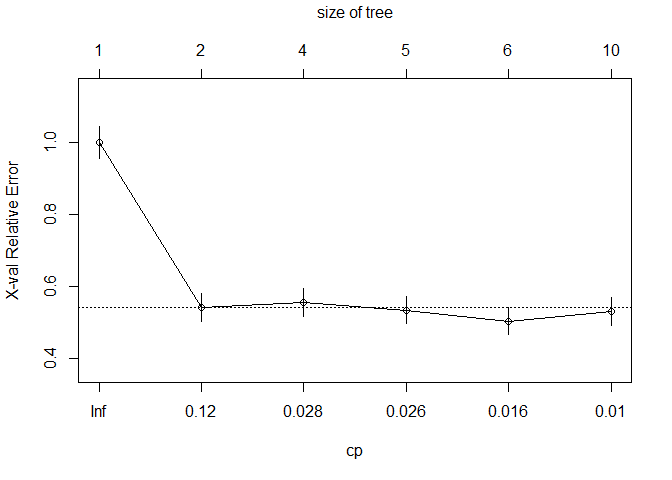

# Titanic - Decision Trees

### Variable Descriptions

**Survival**:  Survival (0 = No; 1 = Yes) 

**Pclass**:    Passenger Class (1 = 1st; 2 = 2nd; 3 = 3rd) 

**Name**:      Name 

**Sex**:       Sex 

**Age**:       Age 

**Sibsp**:     Number of Siblings/Spouses Aboard 

**Parch**:     Number of Parents/Children Aboard 

**Ticket**:    Ticket Number 

**Fare**:      Passenger Fare 

**Cabin**:     Cabin 

**Embarked**:  Port of Embarkation (C = Cherbourg; Q = Queenstown; S = Southampton) 


```r
library(rpart)
library(rattle)
library(rpart.plot)
library(dplyr)
library(RCurl)
```

### Reading data


```r
url <- getURL('https://raw.githubusercontent.com/frankwwu/R-Knots/master/Titanic/train.csv')
train <- read.csv(text = url) 
url <- getURL('https://raw.githubusercontent.com/frankwwu/R-Knots/master/Titanic/test.csv')
test <- read.csv(text = url) 
```

### Removing NA.


```r
train<-train[, !(colnames(train) %in% c('Name', 'Ticket', 'Cabin'))]
train <-train %>% na.omit()
test<-test[, !(colnames(test) %in% c('Name', 'Ticket', 'Cabin'))]
test <- test %>% na.omit()
```

### 1. Selecting features


```r
train$Survived <- factor(train$Survived)
formula = Survived ~ Pclass + Sex + Age + SibSp + Parch + Fare + Embarked
```

### 2. Creating classification tree


```r
set.seed(200)
fit <- rpart(formula, data=train, method="class")
fancyRpartPlot(fit)
```


### Prune the tree
Prune back the tree to avoid overfitting the data. Typically, you will want to select a tree size that minimizes the cross-validated error, the xerror column printed by printcp( ).


```r
pfit<- prune(fit, cp=fit$cptable[which.min(fit$cptable[,"xerror"]),"CP"])
fancyRpartPlot(pfit)
```



### Prediction


```r
Prediction <- predict(pfit, test, type = "prob")
#Prediction
```

### Trying to tweak rpart.control control parameters.


```r
fit <- rpart(formula, data=train, method="class", control=rpart.control(minsplit=2, cp=0))
fancyRpartPlot(fit)
```

```
## Warning: labs do not fit even at cex 0.15, there may be some overplotting
```


```r
fit <- rpart(formula, data=train, method="class", control=rpart.control(minsplit=2, cp=0, minbucket=2))
fancyRpartPlot(fit)
```

```
## Warning: labs do not fit even at cex 0.15, there may be some overplotting
```


### 3. Creating regression tree


```r
fit <- rpart(formula, data=train, method="anova")
# Plot tree 
fancyRpartPlot(fit)
```


```r
# Visualize cross-validation results
plotcp(fit) 
```


```r
# Detailed summary of splits
summary(fit)
```

```
## Call:
## rpart(formula = formula, data = train, method = "anova")
##   n= 714 
## 
##           CP nsplit rel error    xerror       xstd
## 1 0.29033302      0 1.0000000 1.0029968 0.01437210
## 2 0.08404023      1 0.7096670 0.7127836 0.03606339
## 3 0.03132439      2 0.6256268 0.6288479 0.03456130
## 4 0.03120810      3 0.5943024 0.6311605 0.03631107
## 5 0.02580785      4 0.5630943 0.5976796 0.03559951
## 6 0.01881840      5 0.5372864 0.5802332 0.03527277
## 7 0.01005920      6 0.5184680 0.5643923 0.03596314
## 8 0.01000000      7 0.5084088 0.5844896 0.03752183
## 
## Variable importance
##      Sex   Pclass     Fare      Age    Parch    SibSp Embarked 
##       42       18       16        9        6        6        2 
## 
## Node number 1: 714 observations,    complexity param=0.290333
##   mean=1.406162, MSE=0.2411945 
##   left son=2 (453 obs) right son=3 (261 obs)
##   Primary splits:
##       Sex      splits as  RL,           improve=0.29033300, (0 missing)
##       Pclass   < 2.5      to the right, improve=0.11396520, (0 missing)
##       Fare     < 52.2771  to the left,  improve=0.09724745, (0 missing)
##       Embarked splits as  RRLL,         improve=0.04047720, (0 missing)
##       Parch    < 0.5      to the left,  improve=0.02704447, (0 missing)
##   Surrogate splits:
##       Fare     < 77.6229  to the left,  agree=0.668, adj=0.092, (0 split)
##       Parch    < 0.5      to the left,  agree=0.667, adj=0.088, (0 split)
##       Age      < 15.5     to the right, agree=0.639, adj=0.011, (0 split)
##       Embarked splits as  RLLL,         agree=0.637, adj=0.008, (0 split)
## 
## Node number 2: 453 observations,    complexity param=0.03132439
##   mean=1.205298, MSE=0.1631507 
##   left son=4 (429 obs) right son=5 (24 obs)
##   Primary splits:
##       Age      < 6.5      to the right, improve=0.07298961, (0 missing)
##       Pclass   < 1.5      to the right, improve=0.06398534, (0 missing)
##       Fare     < 26.26875 to the left,  improve=0.05454819, (0 missing)
##       Embarked splits as  -RLL,         improve=0.02237328, (0 missing)
##       Parch    < 0.5      to the left,  improve=0.01786985, (0 missing)
## 
## Node number 3: 261 observations,    complexity param=0.08404023
##   mean=1.754789, MSE=0.1850824 
##   left son=6 (102 obs) right son=7 (159 obs)
##   Primary splits:
##       Pclass   < 2.5      to the right, improve=0.29960370, (0 missing)
##       Fare     < 48.2     to the left,  improve=0.10867610, (0 missing)
##       Parch    < 3.5      to the right, improve=0.05575780, (0 missing)
##       SibSp    < 2.5      to the right, improve=0.04146980, (0 missing)
##       Embarked splits as  RRLL,         improve=0.03866644, (0 missing)
##   Surrogate splits:
##       Fare     < 22.5125  to the left,  agree=0.785, adj=0.451, (0 split)
##       Age      < 18.5     to the left,  agree=0.678, adj=0.176, (0 split)
##       SibSp    < 1.5      to the right, agree=0.644, adj=0.088, (0 split)
##       Embarked splits as  RRLR,         agree=0.640, adj=0.078, (0 split)
##       Parch    < 2.5      to the right, agree=0.636, adj=0.069, (0 split)
## 
## Node number 4: 429 observations,    complexity param=0.0312081
##   mean=1.179487, MSE=0.1472715 
##   left son=8 (330 obs) right son=9 (99 obs)
##   Primary splits:
##       Pclass   < 1.5      to the right, improve=0.085066160, (0 missing)
##       Fare     < 26.26875 to the left,  improve=0.068393910, (0 missing)
##       Embarked splits as  -RLL,         improve=0.027852730, (0 missing)
##       Age      < 24.75    to the left,  improve=0.009777594, (0 missing)
##       SibSp    < 1.5      to the right, improve=0.007115702, (0 missing)
##   Surrogate splits:
##       Fare     < 26.26875 to the left,  agree=0.911, adj=0.616, (0 split)
##       Age      < 44.5     to the left,  agree=0.800, adj=0.131, (0 split)
##       Embarked splits as  -RLL,         agree=0.781, adj=0.051, (0 split)
## 
## Node number 5: 24 observations,    complexity param=0.02580785
##   mean=1.666667, MSE=0.2222222 
##   left son=10 (9 obs) right son=11 (15 obs)
##   Primary splits:
##       SibSp  < 2.5      to the right, improve=0.83333330, (0 missing)
##       Pclass < 2.5      to the right, improve=0.35714290, (0 missing)
##       Fare   < 20.825   to the right, improve=0.25000000, (0 missing)
##       Age    < 1.5      to the right, improve=0.05714286, (0 missing)
##   Surrogate splits:
##       Pclass   < 2.5      to the right, agree=0.792, adj=0.444, (0 split)
##       Fare     < 26.95    to the right, agree=0.750, adj=0.333, (0 split)
##       Embarked splits as  -RLR,         agree=0.708, adj=0.222, (0 split)
## 
## Node number 6: 102 observations,    complexity param=0.0188184
##   mean=1.460784, MSE=0.2484621 
##   left son=12 (23 obs) right son=13 (79 obs)
##   Primary splits:
##       Fare     < 20.8     to the right, improve=0.12787570, (0 missing)
##       Age      < 38.5     to the right, improve=0.07645390, (0 missing)
##       SibSp    < 0.5      to the right, improve=0.04218376, (0 missing)
##       Embarked splits as  -RLL,         improve=0.03848792, (0 missing)
##       Parch    < 3.5      to the right, improve=0.02997571, (0 missing)
##   Surrogate splits:
##       Parch < 1.5      to the right, agree=0.902, adj=0.565, (0 split)
##       SibSp < 2.5      to the right, agree=0.853, adj=0.348, (0 split)
##       Age   < 12       to the left,  agree=0.784, adj=0.043, (0 split)
## 
## Node number 7: 159 observations
##   mean=1.943396, MSE=0.05339979 
## 
## Node number 8: 330 observations
##   mean=1.118182, MSE=0.1042149 
## 
## Node number 9: 99 observations,    complexity param=0.0100592
##   mean=1.383838, MSE=0.2365065 
##   left son=18 (22 obs) right son=19 (77 obs)
##   Primary splits:
##       Age      < 53       to the right, improve=0.073986190, (0 missing)
##       SibSp    < 0.5      to the left,  improve=0.010569460, (0 missing)
##       Embarked splits as  -RLL,         improve=0.008874646, (0 missing)
##       Fare     < 31.6604  to the right, improve=0.008874646, (0 missing)
##       Parch    < 0.5      to the right, improve=0.002903697, (0 missing)
## 
## Node number 10: 9 observations
##   mean=1.111111, MSE=0.09876543 
## 
## Node number 11: 15 observations
##   mean=2, MSE=0 
## 
## Node number 12: 23 observations
##   mean=1.130435, MSE=0.1134216 
## 
## Node number 13: 79 observations
##   mean=1.556962, MSE=0.2467553 
## 
## Node number 18: 22 observations
##   mean=1.136364, MSE=0.1177686 
## 
## Node number 19: 77 observations
##   mean=1.454545, MSE=0.2479339
```

### 4. Creating random forests

Constructing a multitude of decision trees at training time. Random decision forests correct for decision trees' habit of overfitting to their training set.


```r
library(randomForest)
```

```
## randomForest 4.6-12
```

```
## Type rfNews() to see new features/changes/bug fixes.
```

```
## 
## Attaching package: 'randomForest'
```

```
## The following object is masked from 'package:dplyr':
## 
##     combine
```

```r
fit <- randomForest(formula, data=train)
print(fit)
```

```
## 
## Call:
##  randomForest(formula = formula, data = train) 
##                Type of random forest: classification
##                      Number of trees: 500
## No. of variables tried at each split: 2
## 
##         OOB estimate of  error rate: 18.91%
## Confusion matrix:
##     0   1 class.error
## 0 378  46   0.1084906
## 1  89 201   0.3068966
```

```r
importance(fit)
```

```
##          MeanDecreaseGini
## Pclass          30.459665
## Sex             83.130594
## Age             51.121243
## SibSp           12.615861
## Parch           10.414987
## Fare            53.912920
## Embarked         8.205936
```


