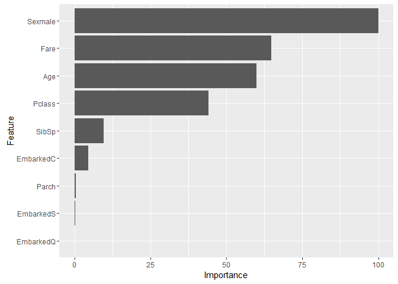

# Titanic: GBM (Gradient Boosting Machine)

### Variable Descriptions

**Survival**:  Survival (0 = No; 1 = Yes) 

**Pclass**:    Passenger Class (1 = 1st; 2 = 2nd; 3 = 3rd) 

**Name**:      Name 

**Sex**:       Sex 

**Age**:       Age 

**Sibsp**:     Number of Siblings/Spouses Aboard 

**Parch**:     Number of Parents/Children Aboard 

**Ticket**:    Ticket Number 

**Fare**:      Passenger Fare 

**Cabin**:     Cabin 

**Embarked**:  Port of Embarkation (C = Cherbourg; Q = Queenstown; S = Southampton) 
 

```r
library(caret)
library(dplyr)
library(ggplot2)
library(RCurl)
```

### Reading data


```r
url <- getURL('https://raw.githubusercontent.com/frankwwu/R-Knots/master/Titanic/train.csv')
train <- read.csv(text = url) 
url <- getURL('https://raw.githubusercontent.com/frankwwu/R-Knots/master/Titanic/test.csv')
test <- read.csv(text = url) 
```

### Removing NA.


```r
train<-train[, !(colnames(train) %in% c('Name', 'Ticket', 'Cabin'))]
train <-train %>% na.omit()
test<-test[, !(colnames(test) %in% c('Name', 'Ticket', 'Cabin'))]
test <- test %>% na.omit()
```

### Selecting features


```r
train$Survived <- factor(train$Survived)
formula = Survived ~ Pclass + Sex + Age + SibSp + Parch + Fare + Embarked
```

### Creating GBM model


```r
set.seed(200)
gbmModel <- suppressMessages(train(formula, data=train, method="gbm"))
```

```
## Warning: package 'gbm' was built under R version 3.2.4
```

```
## Iter   TrainDeviance   ValidDeviance   StepSize   Improve
##      1        1.3021             nan     0.1000    0.0270
##      2        1.2553             nan     0.1000    0.0226
##      3        1.2162             nan     0.1000    0.0182
##      4        1.1820             nan     0.1000    0.0142
##      5        1.1562             nan     0.1000    0.0112
##      6        1.1362             nan     0.1000    0.0089
##      7        1.1194             nan     0.1000    0.0069
##      8        1.1051             nan     0.1000    0.0060
##      9        1.0898             nan     0.1000    0.0086
##     10        1.0755             nan     0.1000    0.0072
##     20        0.9901             nan     0.1000    0.0025
##     40        0.9251             nan     0.1000    0.0010
##     60        0.8848             nan     0.1000   -0.0004
##     80        0.8622             nan     0.1000   -0.0002
##    100        0.8444             nan     0.1000   -0.0002
##    120        0.8354             nan     0.1000   -0.0002
##    140        0.8274             nan     0.1000   -0.0005
##    150        0.8240             nan     0.1000   -0.0002
## 
## Iter   TrainDeviance   ValidDeviance   StepSize   Improve
##      1        1.2773             nan     0.1000    0.0350
##      2        1.2207             nan     0.1000    0.0269
##      3        1.1713             nan     0.1000    0.0212
##      4        1.1328             nan     0.1000    0.0190
##      5        1.0990             nan     0.1000    0.0160
##      6        1.0712             nan     0.1000    0.0132
##      7        1.0519             nan     0.1000    0.0100
##      8        1.0327             nan     0.1000    0.0095
##      9        1.0127             nan     0.1000    0.0074
##     10        0.9947             nan     0.1000    0.0076
##     20        0.8930             nan     0.1000    0.0033
##     40        0.8095             nan     0.1000   -0.0006
##     60        0.7676             nan     0.1000   -0.0004
##     80        0.7412             nan     0.1000   -0.0003
##    100        0.7162             nan     0.1000    0.0005
##    120        0.6990             nan     0.1000   -0.0012
##    140        0.6776             nan     0.1000   -0.0017
##    150        0.6722             nan     0.1000   -0.0011
## 
## Iter   TrainDeviance   ValidDeviance   StepSize   Improve
##      1        1.2732             nan     0.1000    0.0369
##      2        1.2097             nan     0.1000    0.0313
##      3        1.1568             nan     0.1000    0.0262
##      4        1.1131             nan     0.1000    0.0211
##      5        1.0773             nan     0.1000    0.0186
##      6        1.0474             nan     0.1000    0.0154
##      7        1.0231             nan     0.1000    0.0116
##      8        1.0053             nan     0.1000    0.0079
##      9        0.9829             nan     0.1000    0.0105
##     10        0.9629             nan     0.1000    0.0094
##     20        0.8522             nan     0.1000    0.0021
##     40        0.7618             nan     0.1000    0.0002
##     60        0.7081             nan     0.1000   -0.0016
##     80        0.6752             nan     0.1000   -0.0004
##    100        0.6391             nan     0.1000   -0.0014
##    120        0.6071             nan     0.1000   -0.0009
##    140        0.5873             nan     0.1000   -0.0013
##    150        0.5731             nan     0.1000   -0.0002
## 
## Iter   TrainDeviance   ValidDeviance   StepSize   Improve
##      1        1.3115             nan     0.1000    0.0256
##      2        1.2756             nan     0.1000    0.0211
##      3        1.2363             nan     0.1000    0.0174
##      4        1.2068             nan     0.1000    0.0141
##      5        1.1823             nan     0.1000    0.0117
##      6        1.1615             nan     0.1000    0.0093
##      7        1.1416             nan     0.1000    0.0090
##      8        1.1262             nan     0.1000    0.0078
##      9        1.1088             nan     0.1000    0.0069
##     10        1.0941             nan     0.1000    0.0069
##     20        0.9998             nan     0.1000    0.0021
##     40        0.9247             nan     0.1000    0.0003
##     60        0.8950             nan     0.1000    0.0004
##     80        0.8736             nan     0.1000   -0.0000
##    100        0.8591             nan     0.1000   -0.0008
##    120        0.8442             nan     0.1000    0.0002
##    140        0.8330             nan     0.1000   -0.0000
##    150        0.8282             nan     0.1000   -0.0007
## 
## Iter   TrainDeviance   ValidDeviance   StepSize   Improve
##      1        1.2942             nan     0.1000    0.0341
##      2        1.2392             nan     0.1000    0.0280
##      3        1.1872             nan     0.1000    0.0243
##      4        1.1480             nan     0.1000    0.0193
##      5        1.1133             nan     0.1000    0.0160
##      6        1.0831             nan     0.1000    0.0137
##      7        1.0563             nan     0.1000    0.0109
##      8        1.0310             nan     0.1000    0.0108
##      9        1.0099             nan     0.1000    0.0092
##     10        0.9930             nan     0.1000    0.0070
##     20        0.8907             nan     0.1000    0.0018
##     40        0.8045             nan     0.1000    0.0005
##     60        0.7613             nan     0.1000   -0.0003
##     80        0.7254             nan     0.1000   -0.0006
##    100        0.7011             nan     0.1000    0.0000
##    120        0.6724             nan     0.1000    0.0009
##    140        0.6516             nan     0.1000   -0.0009
##    150        0.6438             nan     0.1000   -0.0004
## 
## Iter   TrainDeviance   ValidDeviance   StepSize   Improve
##      1        1.2776             nan     0.1000    0.0376
##      2        1.2177             nan     0.1000    0.0301
##      3        1.1605             nan     0.1000    0.0272
##      4        1.1147             nan     0.1000    0.0212
##      5        1.0778             nan     0.1000    0.0178
##      6        1.0422             nan     0.1000    0.0159
##      7        1.0114             nan     0.1000    0.0135
##      8        0.9865             nan     0.1000    0.0120
##      9        0.9630             nan     0.1000    0.0095
##     10        0.9484             nan     0.1000    0.0051
##     20        0.8401             nan     0.1000    0.0016
##     40        0.7425             nan     0.1000    0.0011
##     60        0.6872             nan     0.1000   -0.0015
##     80        0.6434             nan     0.1000   -0.0004
##    100        0.6147             nan     0.1000   -0.0011
##    120        0.5836             nan     0.1000   -0.0007
##    140        0.5588             nan     0.1000   -0.0011
##    150        0.5473             nan     0.1000   -0.0001
## 
## Iter   TrainDeviance   ValidDeviance   StepSize   Improve
##      1        1.3118             nan     0.1000    0.0254
##      2        1.2749             nan     0.1000    0.0199
##      3        1.2408             nan     0.1000    0.0157
##      4        1.2144             nan     0.1000    0.0134
##      5        1.1936             nan     0.1000    0.0102
##      6        1.1765             nan     0.1000    0.0072
##      7        1.1568             nan     0.1000    0.0072
##      8        1.1346             nan     0.1000    0.0094
##      9        1.1196             nan     0.1000    0.0077
##     10        1.1058             nan     0.1000    0.0066
##     20        1.0152             nan     0.1000    0.0021
##     40        0.9441             nan     0.1000    0.0006
##     60        0.9077             nan     0.1000    0.0005
##     80        0.8854             nan     0.1000   -0.0006
##    100        0.8706             nan     0.1000    0.0001
##    120        0.8561             nan     0.1000   -0.0002
##    140        0.8499             nan     0.1000   -0.0004
##    150        0.8448             nan     0.1000   -0.0006
## 
## Iter   TrainDeviance   ValidDeviance   StepSize   Improve
##      1        1.2969             nan     0.1000    0.0332
##      2        1.2424             nan     0.1000    0.0275
##      3        1.2015             nan     0.1000    0.0205
##      4        1.1734             nan     0.1000    0.0131
##      5        1.1412             nan     0.1000    0.0149
##      6        1.1147             nan     0.1000    0.0134
##      7        1.0914             nan     0.1000    0.0119
##      8        1.0694             nan     0.1000    0.0093
##      9        1.0539             nan     0.1000    0.0067
##     10        1.0361             nan     0.1000    0.0075
##     20        0.9389             nan     0.1000    0.0017
##     40        0.8466             nan     0.1000    0.0013
##     60        0.8022             nan     0.1000   -0.0013
##     80        0.7701             nan     0.1000   -0.0013
##    100        0.7407             nan     0.1000   -0.0002
##    120        0.7181             nan     0.1000   -0.0005
##    140        0.6971             nan     0.1000   -0.0007
##    150        0.6881             nan     0.1000   -0.0001
## 
## Iter   TrainDeviance   ValidDeviance   StepSize   Improve
##      1        1.2948             nan     0.1000    0.0347
##      2        1.2361             nan     0.1000    0.0274
##      3        1.1923             nan     0.1000    0.0227
##      4        1.1520             nan     0.1000    0.0199
##      5        1.1187             nan     0.1000    0.0142
##      6        1.0840             nan     0.1000    0.0147
##      7        1.0589             nan     0.1000    0.0100
##      8        1.0351             nan     0.1000    0.0099
##      9        1.0173             nan     0.1000    0.0078
##     10        0.9991             nan     0.1000    0.0072
##     20        0.8912             nan     0.1000    0.0020
##     40        0.7897             nan     0.1000    0.0009
##     60        0.7322             nan     0.1000   -0.0013
##     80        0.6919             nan     0.1000   -0.0009
##    100        0.6604             nan     0.1000   -0.0013
##    120        0.6313             nan     0.1000   -0.0008
##    140        0.6080             nan     0.1000   -0.0007
##    150        0.5956             nan     0.1000   -0.0007
## 
## Iter   TrainDeviance   ValidDeviance   StepSize   Improve
##      1        1.3001             nan     0.1000    0.0239
##      2        1.2615             nan     0.1000    0.0187
##      3        1.2376             nan     0.1000    0.0106
##      4        1.2088             nan     0.1000    0.0147
##      5        1.1836             nan     0.1000    0.0121
##      6        1.1630             nan     0.1000    0.0096
##      7        1.1455             nan     0.1000    0.0077
##      8        1.1329             nan     0.1000    0.0050
##      9        1.1190             nan     0.1000    0.0060
##     10        1.1035             nan     0.1000    0.0063
##     20        1.0020             nan     0.1000    0.0026
##     40        0.9205             nan     0.1000    0.0007
##     60        0.8819             nan     0.1000    0.0001
##     80        0.8555             nan     0.1000    0.0003
##    100        0.8377             nan     0.1000    0.0002
##    120        0.8240             nan     0.1000   -0.0013
##    140        0.8100             nan     0.1000    0.0003
##    150        0.8026             nan     0.1000   -0.0000
## 
## Iter   TrainDeviance   ValidDeviance   StepSize   Improve
##      1        1.2848             nan     0.1000    0.0291
##      2        1.2299             nan     0.1000    0.0248
##      3        1.1881             nan     0.1000    0.0192
##      4        1.1537             nan     0.1000    0.0166
##      5        1.1240             nan     0.1000    0.0126
##      6        1.1006             nan     0.1000    0.0107
##      7        1.0719             nan     0.1000    0.0128
##      8        1.0470             nan     0.1000    0.0109
##      9        1.0240             nan     0.1000    0.0080
##     10        1.0081             nan     0.1000    0.0064
##     20        0.9033             nan     0.1000    0.0038
##     40        0.8084             nan     0.1000    0.0009
##     60        0.7569             nan     0.1000   -0.0004
##     80        0.7280             nan     0.1000   -0.0002
##    100        0.7028             nan     0.1000    0.0002
##    120        0.6842             nan     0.1000    0.0000
##    140        0.6622             nan     0.1000   -0.0021
##    150        0.6537             nan     0.1000   -0.0015
## 
## Iter   TrainDeviance   ValidDeviance   StepSize   Improve
##      1        1.2704             nan     0.1000    0.0354
##      2        1.2078             nan     0.1000    0.0297
##      3        1.1589             nan     0.1000    0.0222
##      4        1.1178             nan     0.1000    0.0160
##      5        1.0827             nan     0.1000    0.0172
##      6        1.0573             nan     0.1000    0.0134
##      7        1.0336             nan     0.1000    0.0117
##      8        1.0118             nan     0.1000    0.0103
##      9        0.9924             nan     0.1000    0.0083
##     10        0.9766             nan     0.1000    0.0048
##     20        0.8478             nan     0.1000    0.0040
##     40        0.7525             nan     0.1000   -0.0011
##     60        0.6985             nan     0.1000   -0.0009
##     80        0.6557             nan     0.1000   -0.0004
##    100        0.6199             nan     0.1000   -0.0008
##    120        0.5888             nan     0.1000   -0.0011
##    140        0.5636             nan     0.1000   -0.0012
##    150        0.5547             nan     0.1000   -0.0008
## 
## Iter   TrainDeviance   ValidDeviance   StepSize   Improve
##      1        1.2961             nan     0.1000    0.0313
##      2        1.2415             nan     0.1000    0.0249
##      3        1.2010             nan     0.1000    0.0215
##      4        1.1716             nan     0.1000    0.0170
##      5        1.1442             nan     0.1000    0.0140
##      6        1.1190             nan     0.1000    0.0122
##      7        1.0981             nan     0.1000    0.0095
##      8        1.0810             nan     0.1000    0.0071
##      9        1.0654             nan     0.1000    0.0063
##     10        1.0510             nan     0.1000    0.0073
##     20        0.9576             nan     0.1000    0.0029
##     40        0.8889             nan     0.1000    0.0002
##     60        0.8537             nan     0.1000   -0.0011
##     80        0.8329             nan     0.1000    0.0001
##    100        0.8180             nan     0.1000   -0.0011
##    120        0.8066             nan     0.1000   -0.0012
##    140        0.7949             nan     0.1000   -0.0017
##    150        0.7898             nan     0.1000   -0.0004
## 
## Iter   TrainDeviance   ValidDeviance   StepSize   Improve
##      1        1.2850             nan     0.1000    0.0321
##      2        1.2233             nan     0.1000    0.0291
##      3        1.1740             nan     0.1000    0.0247
##      4        1.1301             nan     0.1000    0.0216
##      5        1.0925             nan     0.1000    0.0164
##      6        1.0609             nan     0.1000    0.0151
##      7        1.0321             nan     0.1000    0.0116
##      8        1.0104             nan     0.1000    0.0102
##      9        0.9909             nan     0.1000    0.0083
##     10        0.9754             nan     0.1000    0.0080
##     20        0.8870             nan     0.1000    0.0023
##     40        0.8018             nan     0.1000    0.0008
##     60        0.7470             nan     0.1000   -0.0001
##     80        0.7154             nan     0.1000    0.0012
##    100        0.6847             nan     0.1000   -0.0010
##    120        0.6599             nan     0.1000   -0.0011
##    140        0.6419             nan     0.1000   -0.0015
##    150        0.6316             nan     0.1000   -0.0006
## 
## Iter   TrainDeviance   ValidDeviance   StepSize   Improve
##      1        1.2715             nan     0.1000    0.0394
##      2        1.1992             nan     0.1000    0.0303
##      3        1.1457             nan     0.1000    0.0266
##      4        1.1037             nan     0.1000    0.0198
##      5        1.0624             nan     0.1000    0.0189
##      6        1.0313             nan     0.1000    0.0148
##      7        1.0056             nan     0.1000    0.0121
##      8        0.9835             nan     0.1000    0.0084
##      9        0.9632             nan     0.1000    0.0085
##     10        0.9493             nan     0.1000    0.0040
##     20        0.8452             nan     0.1000    0.0004
##     40        0.7376             nan     0.1000    0.0001
##     60        0.6855             nan     0.1000   -0.0010
##     80        0.6472             nan     0.1000   -0.0008
##    100        0.6173             nan     0.1000   -0.0004
##    120        0.5851             nan     0.1000   -0.0015
##    140        0.5599             nan     0.1000   -0.0006
##    150        0.5520             nan     0.1000   -0.0018
## 
## Iter   TrainDeviance   ValidDeviance   StepSize   Improve
##      1        1.2968             nan     0.1000    0.0260
##      2        1.2509             nan     0.1000    0.0221
##      3        1.2151             nan     0.1000    0.0166
##      4        1.1851             nan     0.1000    0.0130
##      5        1.1631             nan     0.1000    0.0106
##      6        1.1378             nan     0.1000    0.0110
##      7        1.1208             nan     0.1000    0.0076
##      8        1.1057             nan     0.1000    0.0050
##      9        1.0890             nan     0.1000    0.0080
##     10        1.0739             nan     0.1000    0.0069
##     20        0.9772             nan     0.1000    0.0035
##     40        0.9048             nan     0.1000    0.0001
##     60        0.8730             nan     0.1000    0.0006
##     80        0.8503             nan     0.1000   -0.0007
##    100        0.8368             nan     0.1000    0.0000
##    120        0.8249             nan     0.1000   -0.0010
##    140        0.8140             nan     0.1000   -0.0003
##    150        0.8076             nan     0.1000   -0.0007
## 
## Iter   TrainDeviance   ValidDeviance   StepSize   Improve
##      1        1.2755             nan     0.1000    0.0339
##      2        1.2191             nan     0.1000    0.0259
##      3        1.1748             nan     0.1000    0.0220
##      4        1.1393             nan     0.1000    0.0183
##      5        1.1085             nan     0.1000    0.0152
##      6        1.0784             nan     0.1000    0.0137
##      7        1.0570             nan     0.1000    0.0099
##      8        1.0392             nan     0.1000    0.0070
##      9        1.0168             nan     0.1000    0.0109
##     10        0.9959             nan     0.1000    0.0068
##     20        0.8929             nan     0.1000    0.0038
##     40        0.8069             nan     0.1000   -0.0009
##     60        0.7646             nan     0.1000   -0.0005
##     80        0.7235             nan     0.1000   -0.0012
##    100        0.6946             nan     0.1000   -0.0006
##    120        0.6646             nan     0.1000   -0.0003
##    140        0.6408             nan     0.1000   -0.0013
##    150        0.6314             nan     0.1000   -0.0006
## 
## Iter   TrainDeviance   ValidDeviance   StepSize   Improve
##      1        1.2700             nan     0.1000    0.0378
##      2        1.2083             nan     0.1000    0.0289
##      3        1.1562             nan     0.1000    0.0244
##      4        1.1147             nan     0.1000    0.0199
##      5        1.0819             nan     0.1000    0.0151
##      6        1.0476             nan     0.1000    0.0143
##      7        1.0199             nan     0.1000    0.0131
##      8        0.9921             nan     0.1000    0.0116
##      9        0.9737             nan     0.1000    0.0085
##     10        0.9493             nan     0.1000    0.0101
##     20        0.8378             nan     0.1000    0.0015
##     40        0.7526             nan     0.1000   -0.0010
##     60        0.6986             nan     0.1000   -0.0008
##     80        0.6607             nan     0.1000   -0.0011
##    100        0.6189             nan     0.1000   -0.0009
##    120        0.5778             nan     0.1000   -0.0002
##    140        0.5481             nan     0.1000   -0.0004
##    150        0.5382             nan     0.1000   -0.0006
## 
## Iter   TrainDeviance   ValidDeviance   StepSize   Improve
##      1        1.3079             nan     0.1000    0.0286
##      2        1.2620             nan     0.1000    0.0225
##      3        1.2270             nan     0.1000    0.0188
##      4        1.2001             nan     0.1000    0.0149
##      5        1.1768             nan     0.1000    0.0121
##      6        1.1546             nan     0.1000    0.0101
##      7        1.1389             nan     0.1000    0.0075
##      8        1.1276             nan     0.1000    0.0039
##      9        1.1158             nan     0.1000    0.0074
##     10        1.1024             nan     0.1000    0.0067
##     20        1.0257             nan     0.1000    0.0012
##     40        0.9562             nan     0.1000   -0.0005
##     60        0.9146             nan     0.1000    0.0002
##     80        0.8885             nan     0.1000   -0.0005
##    100        0.8688             nan     0.1000   -0.0003
##    120        0.8528             nan     0.1000   -0.0016
##    140        0.8384             nan     0.1000   -0.0009
##    150        0.8307             nan     0.1000   -0.0013
## 
## Iter   TrainDeviance   ValidDeviance   StepSize   Improve
##      1        1.2917             nan     0.1000    0.0337
##      2        1.2370             nan     0.1000    0.0264
##      3        1.1941             nan     0.1000    0.0227
##      4        1.1544             nan     0.1000    0.0188
##      5        1.1221             nan     0.1000    0.0168
##      6        1.0902             nan     0.1000    0.0130
##      7        1.0664             nan     0.1000    0.0100
##      8        1.0455             nan     0.1000    0.0100
##      9        1.0278             nan     0.1000    0.0074
##     10        1.0112             nan     0.1000    0.0069
##     20        0.9259             nan     0.1000    0.0032
##     40        0.8351             nan     0.1000   -0.0011
##     60        0.7774             nan     0.1000    0.0001
##     80        0.7293             nan     0.1000    0.0001
##    100        0.7012             nan     0.1000    0.0006
##    120        0.6741             nan     0.1000   -0.0003
##    140        0.6502             nan     0.1000   -0.0015
##    150        0.6408             nan     0.1000   -0.0006
## 
## Iter   TrainDeviance   ValidDeviance   StepSize   Improve
##      1        1.2860             nan     0.1000    0.0354
##      2        1.2204             nan     0.1000    0.0308
##      3        1.1679             nan     0.1000    0.0271
##      4        1.1266             nan     0.1000    0.0211
##      5        1.0877             nan     0.1000    0.0192
##      6        1.0581             nan     0.1000    0.0135
##      7        1.0298             nan     0.1000    0.0097
##      8        1.0091             nan     0.1000    0.0100
##      9        0.9914             nan     0.1000    0.0070
##     10        0.9750             nan     0.1000    0.0074
##     20        0.8683             nan     0.1000    0.0030
##     40        0.7675             nan     0.1000    0.0005
##     60        0.7030             nan     0.1000    0.0011
##     80        0.6567             nan     0.1000   -0.0017
##    100        0.6222             nan     0.1000   -0.0010
##    120        0.5925             nan     0.1000   -0.0004
##    140        0.5683             nan     0.1000   -0.0010
##    150        0.5565             nan     0.1000   -0.0007
## 
## Iter   TrainDeviance   ValidDeviance   StepSize   Improve
##      1        1.3048             nan     0.1000    0.0250
##      2        1.2680             nan     0.1000    0.0199
##      3        1.2380             nan     0.1000    0.0160
##      4        1.2101             nan     0.1000    0.0128
##      5        1.1896             nan     0.1000    0.0107
##      6        1.1722             nan     0.1000    0.0050
##      7        1.1556             nan     0.1000    0.0092
##      8        1.1433             nan     0.1000    0.0047
##      9        1.1277             nan     0.1000    0.0074
##     10        1.1143             nan     0.1000    0.0058
##     20        1.0317             nan     0.1000    0.0009
##     40        0.9661             nan     0.1000    0.0009
##     60        0.9329             nan     0.1000    0.0003
##     80        0.9120             nan     0.1000   -0.0007
##    100        0.8947             nan     0.1000   -0.0005
##    120        0.8837             nan     0.1000   -0.0004
##    140        0.8709             nan     0.1000   -0.0007
##    150        0.8678             nan     0.1000   -0.0006
## 
## Iter   TrainDeviance   ValidDeviance   StepSize   Improve
##      1        1.2925             nan     0.1000    0.0293
##      2        1.2432             nan     0.1000    0.0276
##      3        1.2011             nan     0.1000    0.0204
##      4        1.1637             nan     0.1000    0.0170
##      5        1.1349             nan     0.1000    0.0128
##      6        1.1182             nan     0.1000    0.0055
##      7        1.0928             nan     0.1000    0.0105
##      8        1.0763             nan     0.1000    0.0056
##      9        1.0540             nan     0.1000    0.0088
##     10        1.0378             nan     0.1000    0.0069
##     20        0.9495             nan     0.1000    0.0026
##     40        0.8708             nan     0.1000    0.0000
##     60        0.8259             nan     0.1000    0.0000
##     80        0.7930             nan     0.1000   -0.0001
##    100        0.7650             nan     0.1000   -0.0010
##    120        0.7372             nan     0.1000    0.0002
##    140        0.7122             nan     0.1000   -0.0014
##    150        0.7036             nan     0.1000   -0.0004
## 
## Iter   TrainDeviance   ValidDeviance   StepSize   Improve
##      1        1.2914             nan     0.1000    0.0357
##      2        1.2315             nan     0.1000    0.0264
##      3        1.1819             nan     0.1000    0.0225
##      4        1.1445             nan     0.1000    0.0187
##      5        1.1118             nan     0.1000    0.0172
##      6        1.0828             nan     0.1000    0.0126
##      7        1.0590             nan     0.1000    0.0094
##      8        1.0409             nan     0.1000    0.0089
##      9        1.0192             nan     0.1000    0.0085
##     10        1.0004             nan     0.1000    0.0075
##     20        0.8982             nan     0.1000    0.0022
##     40        0.8167             nan     0.1000   -0.0020
##     60        0.7614             nan     0.1000   -0.0007
##     80        0.7163             nan     0.1000   -0.0007
##    100        0.6821             nan     0.1000   -0.0013
##    120        0.6563             nan     0.1000   -0.0007
##    140        0.6315             nan     0.1000   -0.0004
##    150        0.6222             nan     0.1000   -0.0015
## 
## Iter   TrainDeviance   ValidDeviance   StepSize   Improve
##      1        1.2739             nan     0.1000    0.0253
##      2        1.2353             nan     0.1000    0.0208
##      3        1.2013             nan     0.1000    0.0165
##      4        1.1757             nan     0.1000    0.0133
##      5        1.1558             nan     0.1000    0.0111
##      6        1.1348             nan     0.1000    0.0091
##      7        1.1205             nan     0.1000    0.0054
##      8        1.1031             nan     0.1000    0.0065
##      9        1.0906             nan     0.1000    0.0043
##     10        1.0797             nan     0.1000    0.0042
##     20        1.0159             nan     0.1000    0.0021
##     40        0.9582             nan     0.1000    0.0001
##     60        0.9250             nan     0.1000   -0.0005
##     80        0.8986             nan     0.1000   -0.0008
##    100        0.8768             nan     0.1000    0.0002
##    120        0.8617             nan     0.1000   -0.0005
##    140        0.8478             nan     0.1000   -0.0010
##    150        0.8410             nan     0.1000    0.0002
## 
## Iter   TrainDeviance   ValidDeviance   StepSize   Improve
##      1        1.2598             nan     0.1000    0.0335
##      2        1.2100             nan     0.1000    0.0268
##      3        1.1654             nan     0.1000    0.0207
##      4        1.1286             nan     0.1000    0.0152
##      5        1.1015             nan     0.1000    0.0135
##      6        1.0765             nan     0.1000    0.0106
##      7        1.0544             nan     0.1000    0.0106
##      8        1.0325             nan     0.1000    0.0095
##      9        1.0174             nan     0.1000    0.0073
##     10        1.0029             nan     0.1000    0.0069
##     20        0.9127             nan     0.1000    0.0022
##     40        0.8228             nan     0.1000    0.0011
##     60        0.7659             nan     0.1000    0.0001
##     80        0.7312             nan     0.1000   -0.0004
##    100        0.6999             nan     0.1000   -0.0005
##    120        0.6721             nan     0.1000   -0.0003
##    140        0.6412             nan     0.1000   -0.0004
##    150        0.6288             nan     0.1000   -0.0014
## 
## Iter   TrainDeviance   ValidDeviance   StepSize   Improve
##      1        1.2569             nan     0.1000    0.0341
##      2        1.1978             nan     0.1000    0.0297
##      3        1.1501             nan     0.1000    0.0213
##      4        1.1071             nan     0.1000    0.0209
##      5        1.0715             nan     0.1000    0.0148
##      6        1.0422             nan     0.1000    0.0119
##      7        1.0172             nan     0.1000    0.0130
##      8        0.9962             nan     0.1000    0.0099
##      9        0.9756             nan     0.1000    0.0086
##     10        0.9593             nan     0.1000    0.0077
##     20        0.8597             nan     0.1000    0.0004
##     40        0.7507             nan     0.1000    0.0001
##     60        0.6938             nan     0.1000    0.0005
##     80        0.6485             nan     0.1000   -0.0002
##    100        0.6100             nan     0.1000   -0.0005
##    120        0.5747             nan     0.1000   -0.0000
##    140        0.5447             nan     0.1000   -0.0017
##    150        0.5307             nan     0.1000   -0.0016
## 
## Iter   TrainDeviance   ValidDeviance   StepSize   Improve
##      1        1.3008             nan     0.1000    0.0352
##      2        1.2458             nan     0.1000    0.0284
##      3        1.2059             nan     0.1000    0.0237
##      4        1.1663             nan     0.1000    0.0193
##      5        1.1350             nan     0.1000    0.0153
##      6        1.1121             nan     0.1000    0.0105
##      7        1.0856             nan     0.1000    0.0126
##      8        1.0676             nan     0.1000    0.0055
##      9        1.0460             nan     0.1000    0.0107
##     10        1.0293             nan     0.1000    0.0080
##     20        0.9203             nan     0.1000    0.0027
##     40        0.8415             nan     0.1000    0.0002
##     60        0.7963             nan     0.1000    0.0002
##     80        0.7690             nan     0.1000    0.0003
##    100        0.7514             nan     0.1000   -0.0005
##    120        0.7360             nan     0.1000   -0.0007
##    140        0.7217             nan     0.1000   -0.0002
##    150        0.7168             nan     0.1000   -0.0003
## 
## Iter   TrainDeviance   ValidDeviance   StepSize   Improve
##      1        1.2860             nan     0.1000    0.0421
##      2        1.2233             nan     0.1000    0.0301
##      3        1.1727             nan     0.1000    0.0260
##      4        1.1249             nan     0.1000    0.0229
##      5        1.0854             nan     0.1000    0.0211
##      6        1.0518             nan     0.1000    0.0165
##      7        1.0236             nan     0.1000    0.0134
##      8        0.9961             nan     0.1000    0.0111
##      9        0.9746             nan     0.1000    0.0090
##     10        0.9534             nan     0.1000    0.0069
##     20        0.8460             nan     0.1000    0.0009
##     40        0.7386             nan     0.1000    0.0011
##     60        0.6926             nan     0.1000    0.0007
##     80        0.6531             nan     0.1000   -0.0007
##    100        0.6199             nan     0.1000    0.0000
##    120        0.5960             nan     0.1000   -0.0004
##    140        0.5722             nan     0.1000   -0.0002
##    150        0.5605             nan     0.1000   -0.0002
## 
## Iter   TrainDeviance   ValidDeviance   StepSize   Improve
##      1        1.2823             nan     0.1000    0.0457
##      2        1.2102             nan     0.1000    0.0363
##      3        1.1485             nan     0.1000    0.0296
##      4        1.0954             nan     0.1000    0.0241
##      5        1.0534             nan     0.1000    0.0212
##      6        1.0206             nan     0.1000    0.0154
##      7        0.9901             nan     0.1000    0.0155
##      8        0.9665             nan     0.1000    0.0123
##      9        0.9405             nan     0.1000    0.0108
##     10        0.9215             nan     0.1000    0.0096
##     20        0.7960             nan     0.1000    0.0038
##     40        0.6886             nan     0.1000   -0.0008
##     60        0.6357             nan     0.1000   -0.0010
##     80        0.5865             nan     0.1000   -0.0010
##    100        0.5453             nan     0.1000   -0.0001
##    120        0.5096             nan     0.1000   -0.0015
##    140        0.4849             nan     0.1000   -0.0014
##    150        0.4673             nan     0.1000   -0.0007
## 
## Iter   TrainDeviance   ValidDeviance   StepSize   Improve
##      1        1.3218             nan     0.1000    0.0272
##      2        1.2763             nan     0.1000    0.0230
##      3        1.2400             nan     0.1000    0.0183
##      4        1.2099             nan     0.1000    0.0147
##      5        1.1825             nan     0.1000    0.0114
##      6        1.1590             nan     0.1000    0.0110
##      7        1.1374             nan     0.1000    0.0084
##      8        1.1197             nan     0.1000    0.0091
##      9        1.1049             nan     0.1000    0.0073
##     10        1.0907             nan     0.1000    0.0068
##     20        1.0031             nan     0.1000    0.0021
##     40        0.9304             nan     0.1000    0.0006
##     60        0.8987             nan     0.1000   -0.0002
##     80        0.8801             nan     0.1000   -0.0009
##    100        0.8635             nan     0.1000    0.0000
##    120        0.8524             nan     0.1000   -0.0010
##    140        0.8423             nan     0.1000   -0.0005
##    150        0.8367             nan     0.1000    0.0003
## 
## Iter   TrainDeviance   ValidDeviance   StepSize   Improve
##      1        1.3002             nan     0.1000    0.0330
##      2        1.2490             nan     0.1000    0.0265
##      3        1.2050             nan     0.1000    0.0231
##      4        1.1684             nan     0.1000    0.0194
##      5        1.1404             nan     0.1000    0.0155
##      6        1.1109             nan     0.1000    0.0137
##      7        1.0900             nan     0.1000    0.0088
##      8        1.0680             nan     0.1000    0.0113
##      9        1.0520             nan     0.1000    0.0015
##     10        1.0339             nan     0.1000    0.0086
##     20        0.9310             nan     0.1000    0.0022
##     40        0.8405             nan     0.1000    0.0007
##     60        0.8005             nan     0.1000   -0.0003
##     80        0.7635             nan     0.1000   -0.0006
##    100        0.7344             nan     0.1000   -0.0009
##    120        0.7062             nan     0.1000   -0.0004
##    140        0.6837             nan     0.1000   -0.0007
##    150        0.6754             nan     0.1000   -0.0008
## 
## Iter   TrainDeviance   ValidDeviance   StepSize   Improve
##      1        1.2946             nan     0.1000    0.0367
##      2        1.2310             nan     0.1000    0.0286
##      3        1.1764             nan     0.1000    0.0237
##      4        1.1320             nan     0.1000    0.0203
##      5        1.0974             nan     0.1000    0.0149
##      6        1.0654             nan     0.1000    0.0150
##      7        1.0394             nan     0.1000    0.0115
##      8        1.0167             nan     0.1000    0.0079
##      9        0.9974             nan     0.1000    0.0077
##     10        0.9813             nan     0.1000    0.0077
##     20        0.8778             nan     0.1000    0.0020
##     40        0.7830             nan     0.1000   -0.0001
##     60        0.7248             nan     0.1000   -0.0002
##     80        0.6814             nan     0.1000    0.0004
##    100        0.6478             nan     0.1000   -0.0010
##    120        0.6186             nan     0.1000   -0.0006
##    140        0.5924             nan     0.1000   -0.0007
##    150        0.5773             nan     0.1000   -0.0009
## 
## Iter   TrainDeviance   ValidDeviance   StepSize   Improve
##      1        1.2851             nan     0.1000    0.0300
##      2        1.2396             nan     0.1000    0.0222
##      3        1.2026             nan     0.1000    0.0190
##      4        1.1769             nan     0.1000    0.0149
##      5        1.1495             nan     0.1000    0.0124
##      6        1.1288             nan     0.1000    0.0104
##      7        1.1134             nan     0.1000    0.0069
##      8        1.0965             nan     0.1000    0.0072
##      9        1.0810             nan     0.1000    0.0078
##     10        1.0692             nan     0.1000    0.0052
##     20        0.9828             nan     0.1000    0.0031
##     40        0.9043             nan     0.1000    0.0002
##     60        0.8638             nan     0.1000   -0.0001
##     80        0.8351             nan     0.1000   -0.0005
##    100        0.8141             nan     0.1000   -0.0003
##    120        0.8019             nan     0.1000   -0.0041
##    140        0.7879             nan     0.1000   -0.0017
##    150        0.7826             nan     0.1000   -0.0007
## 
## Iter   TrainDeviance   ValidDeviance   StepSize   Improve
##      1        1.2634             nan     0.1000    0.0394
##      2        1.2072             nan     0.1000    0.0258
##      3        1.1547             nan     0.1000    0.0248
##      4        1.1137             nan     0.1000    0.0191
##      5        1.0786             nan     0.1000    0.0166
##      6        1.0490             nan     0.1000    0.0133
##      7        1.0245             nan     0.1000    0.0109
##      8        1.0002             nan     0.1000    0.0097
##      9        0.9827             nan     0.1000    0.0080
##     10        0.9677             nan     0.1000    0.0063
##     20        0.8654             nan     0.1000    0.0020
##     40        0.7721             nan     0.1000    0.0011
##     60        0.7214             nan     0.1000    0.0004
##     80        0.6854             nan     0.1000   -0.0000
##    100        0.6510             nan     0.1000   -0.0000
##    120        0.6218             nan     0.1000   -0.0001
##    140        0.5912             nan     0.1000   -0.0003
##    150        0.5844             nan     0.1000   -0.0018
## 
## Iter   TrainDeviance   ValidDeviance   StepSize   Improve
##      1        1.2648             nan     0.1000    0.0393
##      2        1.1980             nan     0.1000    0.0321
##      3        1.1391             nan     0.1000    0.0264
##      4        1.0925             nan     0.1000    0.0225
##      5        1.0536             nan     0.1000    0.0185
##      6        1.0222             nan     0.1000    0.0140
##      7        0.9910             nan     0.1000    0.0124
##      8        0.9677             nan     0.1000    0.0109
##      9        0.9458             nan     0.1000    0.0107
##     10        0.9285             nan     0.1000    0.0069
##     20        0.8004             nan     0.1000    0.0033
##     40        0.6970             nan     0.1000   -0.0007
##     60        0.6350             nan     0.1000   -0.0011
##     80        0.5890             nan     0.1000   -0.0001
##    100        0.5528             nan     0.1000   -0.0005
##    120        0.5262             nan     0.1000   -0.0006
##    140        0.5033             nan     0.1000   -0.0016
##    150        0.4904             nan     0.1000   -0.0004
## 
## Iter   TrainDeviance   ValidDeviance   StepSize   Improve
##      1        1.2970             nan     0.1000    0.0278
##      2        1.2489             nan     0.1000    0.0216
##      3        1.2128             nan     0.1000    0.0179
##      4        1.1847             nan     0.1000    0.0144
##      5        1.1612             nan     0.1000    0.0122
##      6        1.1388             nan     0.1000    0.0098
##      7        1.1214             nan     0.1000    0.0075
##      8        1.1081             nan     0.1000    0.0063
##      9        1.0937             nan     0.1000    0.0059
##     10        1.0814             nan     0.1000    0.0053
##     20        0.9956             nan     0.1000    0.0011
##     40        0.9145             nan     0.1000    0.0010
##     60        0.8752             nan     0.1000    0.0004
##     80        0.8537             nan     0.1000   -0.0013
##    100        0.8367             nan     0.1000   -0.0009
##    120        0.8244             nan     0.1000    0.0000
##    140        0.8120             nan     0.1000   -0.0008
##    150        0.8062             nan     0.1000   -0.0011
## 
## Iter   TrainDeviance   ValidDeviance   StepSize   Improve
##      1        1.2833             nan     0.1000    0.0320
##      2        1.2317             nan     0.1000    0.0248
##      3        1.1828             nan     0.1000    0.0247
##      4        1.1412             nan     0.1000    0.0222
##      5        1.1041             nan     0.1000    0.0131
##      6        1.0771             nan     0.1000    0.0125
##      7        1.0511             nan     0.1000    0.0121
##      8        1.0393             nan     0.1000    0.0034
##      9        1.0182             nan     0.1000    0.0102
##     10        0.9983             nan     0.1000    0.0063
##     20        0.8922             nan     0.1000    0.0042
##     40        0.7991             nan     0.1000    0.0014
##     60        0.7566             nan     0.1000   -0.0012
##     80        0.7269             nan     0.1000   -0.0005
##    100        0.6950             nan     0.1000    0.0003
##    120        0.6743             nan     0.1000   -0.0002
##    140        0.6569             nan     0.1000   -0.0014
##    150        0.6493             nan     0.1000   -0.0016
## 
## Iter   TrainDeviance   ValidDeviance   StepSize   Improve
##      1        1.2707             nan     0.1000    0.0416
##      2        1.2091             nan     0.1000    0.0311
##      3        1.1538             nan     0.1000    0.0270
##      4        1.1103             nan     0.1000    0.0217
##      5        1.0741             nan     0.1000    0.0169
##      6        1.0449             nan     0.1000    0.0133
##      7        1.0162             nan     0.1000    0.0126
##      8        0.9935             nan     0.1000    0.0106
##      9        0.9760             nan     0.1000    0.0059
##     10        0.9561             nan     0.1000    0.0090
##     20        0.8436             nan     0.1000    0.0030
##     40        0.7480             nan     0.1000   -0.0001
##     60        0.6945             nan     0.1000   -0.0007
##     80        0.6568             nan     0.1000    0.0004
##    100        0.6289             nan     0.1000   -0.0010
##    120        0.6012             nan     0.1000   -0.0012
##    140        0.5720             nan     0.1000   -0.0015
##    150        0.5611             nan     0.1000   -0.0005
## 
## Iter   TrainDeviance   ValidDeviance   StepSize   Improve
##      1        1.3147             nan     0.1000    0.0281
##      2        1.2692             nan     0.1000    0.0227
##      3        1.2310             nan     0.1000    0.0182
##      4        1.1991             nan     0.1000    0.0142
##      5        1.1737             nan     0.1000    0.0116
##      6        1.1520             nan     0.1000    0.0109
##      7        1.1288             nan     0.1000    0.0079
##      8        1.1095             nan     0.1000    0.0085
##      9        1.0928             nan     0.1000    0.0062
##     10        1.0776             nan     0.1000    0.0070
##     20        0.9861             nan     0.1000    0.0038
##     40        0.8917             nan     0.1000    0.0006
##     60        0.8411             nan     0.1000    0.0004
##     80        0.8095             nan     0.1000   -0.0002
##    100        0.7880             nan     0.1000    0.0001
##    120        0.7736             nan     0.1000   -0.0009
##    140        0.7617             nan     0.1000   -0.0010
##    150        0.7555             nan     0.1000   -0.0006
## 
## Iter   TrainDeviance   ValidDeviance   StepSize   Improve
##      1        1.3016             nan     0.1000    0.0369
##      2        1.2435             nan     0.1000    0.0283
##      3        1.1896             nan     0.1000    0.0247
##      4        1.1430             nan     0.1000    0.0198
##      5        1.1090             nan     0.1000    0.0177
##      6        1.0856             nan     0.1000    0.0107
##      7        1.0560             nan     0.1000    0.0121
##      8        1.0315             nan     0.1000    0.0112
##      9        1.0093             nan     0.1000    0.0111
##     10        0.9865             nan     0.1000    0.0097
##     20        0.8655             nan     0.1000    0.0034
##     40        0.7581             nan     0.1000    0.0005
##     60        0.7101             nan     0.1000   -0.0001
##     80        0.6798             nan     0.1000    0.0001
##    100        0.6536             nan     0.1000   -0.0004
##    120        0.6228             nan     0.1000   -0.0015
##    140        0.6027             nan     0.1000   -0.0006
##    150        0.5881             nan     0.1000   -0.0006
## 
## Iter   TrainDeviance   ValidDeviance   StepSize   Improve
##      1        1.2825             nan     0.1000    0.0412
##      2        1.2125             nan     0.1000    0.0355
##      3        1.1537             nan     0.1000    0.0260
##      4        1.1063             nan     0.1000    0.0227
##      5        1.0672             nan     0.1000    0.0207
##      6        1.0320             nan     0.1000    0.0163
##      7        1.0038             nan     0.1000    0.0139
##      8        0.9767             nan     0.1000    0.0117
##      9        0.9528             nan     0.1000    0.0092
##     10        0.9322             nan     0.1000    0.0095
##     20        0.8085             nan     0.1000    0.0005
##     40        0.6788             nan     0.1000    0.0001
##     60        0.6280             nan     0.1000   -0.0007
##     80        0.5822             nan     0.1000   -0.0008
##    100        0.5571             nan     0.1000   -0.0010
##    120        0.5303             nan     0.1000    0.0011
##    140        0.5061             nan     0.1000   -0.0018
##    150        0.4948             nan     0.1000   -0.0018
## 
## Iter   TrainDeviance   ValidDeviance   StepSize   Improve
##      1        1.2888             nan     0.1000    0.0353
##      2        1.2282             nan     0.1000    0.0288
##      3        1.1796             nan     0.1000    0.0232
##      4        1.1451             nan     0.1000    0.0190
##      5        1.1093             nan     0.1000    0.0158
##      6        1.0817             nan     0.1000    0.0129
##      7        1.0582             nan     0.1000    0.0103
##      8        1.0396             nan     0.1000    0.0103
##      9        1.0232             nan     0.1000    0.0076
##     10        1.0048             nan     0.1000    0.0083
##     20        0.9068             nan     0.1000    0.0019
##     40        0.8338             nan     0.1000    0.0005
##     60        0.8006             nan     0.1000   -0.0004
##     80        0.7805             nan     0.1000   -0.0002
##    100        0.7661             nan     0.1000   -0.0001
##    120        0.7556             nan     0.1000   -0.0012
##    140        0.7447             nan     0.1000   -0.0007
##    150        0.7404             nan     0.1000   -0.0011
## 
## Iter   TrainDeviance   ValidDeviance   StepSize   Improve
##      1        1.2608             nan     0.1000    0.0417
##      2        1.1895             nan     0.1000    0.0339
##      3        1.1332             nan     0.1000    0.0277
##      4        1.0840             nan     0.1000    0.0205
##      5        1.0490             nan     0.1000    0.0185
##      6        1.0179             nan     0.1000    0.0150
##      7        0.9932             nan     0.1000    0.0123
##      8        0.9662             nan     0.1000    0.0113
##      9        0.9518             nan     0.1000    0.0051
##     10        0.9303             nan     0.1000    0.0092
##     20        0.8276             nan     0.1000    0.0023
##     40        0.7548             nan     0.1000    0.0001
##     60        0.7106             nan     0.1000   -0.0002
##     80        0.6716             nan     0.1000   -0.0003
##    100        0.6475             nan     0.1000   -0.0006
##    120        0.6263             nan     0.1000   -0.0007
##    140        0.6084             nan     0.1000   -0.0015
##    150        0.5999             nan     0.1000   -0.0012
## 
## Iter   TrainDeviance   ValidDeviance   StepSize   Improve
##      1        1.2600             nan     0.1000    0.0453
##      2        1.1864             nan     0.1000    0.0314
##      3        1.1273             nan     0.1000    0.0299
##      4        1.0776             nan     0.1000    0.0241
##      5        1.0399             nan     0.1000    0.0174
##      6        1.0038             nan     0.1000    0.0183
##      7        0.9740             nan     0.1000    0.0155
##      8        0.9456             nan     0.1000    0.0120
##      9        0.9228             nan     0.1000    0.0104
##     10        0.9037             nan     0.1000    0.0084
##     20        0.7888             nan     0.1000    0.0021
##     40        0.7043             nan     0.1000   -0.0006
##     60        0.6533             nan     0.1000   -0.0015
##     80        0.6151             nan     0.1000   -0.0011
##    100        0.5817             nan     0.1000   -0.0006
##    120        0.5593             nan     0.1000   -0.0025
##    140        0.5350             nan     0.1000   -0.0008
##    150        0.5244             nan     0.1000   -0.0010
## 
## Iter   TrainDeviance   ValidDeviance   StepSize   Improve
##      1        1.2905             nan     0.1000    0.0247
##      2        1.2482             nan     0.1000    0.0203
##      3        1.2138             nan     0.1000    0.0152
##      4        1.1848             nan     0.1000    0.0123
##      5        1.1553             nan     0.1000    0.0112
##      6        1.1331             nan     0.1000    0.0089
##      7        1.1160             nan     0.1000    0.0095
##      8        1.0997             nan     0.1000    0.0070
##      9        1.0841             nan     0.1000    0.0079
##     10        1.0707             nan     0.1000    0.0064
##     20        0.9819             nan     0.1000    0.0034
##     40        0.8988             nan     0.1000    0.0002
##     60        0.8541             nan     0.1000   -0.0006
##     80        0.8266             nan     0.1000   -0.0005
##    100        0.8049             nan     0.1000   -0.0005
##    120        0.7860             nan     0.1000   -0.0005
##    140        0.7710             nan     0.1000   -0.0003
##    150        0.7658             nan     0.1000   -0.0013
## 
## Iter   TrainDeviance   ValidDeviance   StepSize   Improve
##      1        1.2728             nan     0.1000    0.0345
##      2        1.2147             nan     0.1000    0.0245
##      3        1.1688             nan     0.1000    0.0230
##      4        1.1314             nan     0.1000    0.0164
##      5        1.0987             nan     0.1000    0.0151
##      6        1.0710             nan     0.1000    0.0134
##      7        1.0531             nan     0.1000    0.0083
##      8        1.0309             nan     0.1000    0.0098
##      9        1.0112             nan     0.1000    0.0097
##     10        0.9954             nan     0.1000    0.0083
##     20        0.8802             nan     0.1000    0.0031
##     40        0.7865             nan     0.1000    0.0002
##     60        0.7354             nan     0.1000   -0.0003
##     80        0.6938             nan     0.1000   -0.0003
##    100        0.6658             nan     0.1000   -0.0002
##    120        0.6424             nan     0.1000   -0.0008
##    140        0.6145             nan     0.1000   -0.0001
##    150        0.6067             nan     0.1000   -0.0005
## 
## Iter   TrainDeviance   ValidDeviance   StepSize   Improve
##      1        1.2616             nan     0.1000    0.0362
##      2        1.2014             nan     0.1000    0.0284
##      3        1.1479             nan     0.1000    0.0258
##      4        1.1078             nan     0.1000    0.0184
##      5        1.0693             nan     0.1000    0.0152
##      6        1.0357             nan     0.1000    0.0134
##      7        1.0065             nan     0.1000    0.0115
##      8        0.9844             nan     0.1000    0.0093
##      9        0.9595             nan     0.1000    0.0101
##     10        0.9434             nan     0.1000    0.0073
##     20        0.8239             nan     0.1000    0.0028
##     40        0.7220             nan     0.1000    0.0007
##     60        0.6598             nan     0.1000   -0.0001
##     80        0.6162             nan     0.1000   -0.0005
##    100        0.5802             nan     0.1000   -0.0007
##    120        0.5501             nan     0.1000   -0.0009
##    140        0.5244             nan     0.1000   -0.0006
##    150        0.5118             nan     0.1000   -0.0005
## 
## Iter   TrainDeviance   ValidDeviance   StepSize   Improve
##      1        1.2728             nan     0.1000    0.0281
##      2        1.2279             nan     0.1000    0.0219
##      3        1.1919             nan     0.1000    0.0183
##      4        1.1605             nan     0.1000    0.0147
##      5        1.1347             nan     0.1000    0.0119
##      6        1.1155             nan     0.1000    0.0101
##      7        1.1009             nan     0.1000    0.0065
##      8        1.0843             nan     0.1000    0.0074
##      9        1.0694             nan     0.1000    0.0053
##     10        1.0543             nan     0.1000    0.0073
##     20        0.9690             nan     0.1000   -0.0007
##     40        0.9031             nan     0.1000    0.0004
##     60        0.8700             nan     0.1000   -0.0004
##     80        0.8481             nan     0.1000   -0.0002
##    100        0.8327             nan     0.1000   -0.0003
##    120        0.8209             nan     0.1000    0.0001
##    140        0.8073             nan     0.1000   -0.0001
##    150        0.8020             nan     0.1000   -0.0008
## 
## Iter   TrainDeviance   ValidDeviance   StepSize   Improve
##      1        1.2657             nan     0.1000    0.0359
##      2        1.2102             nan     0.1000    0.0281
##      3        1.1630             nan     0.1000    0.0233
##      4        1.1265             nan     0.1000    0.0181
##      5        1.0956             nan     0.1000    0.0175
##      6        1.0672             nan     0.1000    0.0117
##      7        1.0432             nan     0.1000    0.0114
##      8        1.0216             nan     0.1000    0.0114
##      9        1.0051             nan     0.1000    0.0062
##     10        0.9870             nan     0.1000    0.0067
##     20        0.8905             nan     0.1000    0.0027
##     40        0.7945             nan     0.1000    0.0009
##     60        0.7495             nan     0.1000    0.0001
##     80        0.7169             nan     0.1000   -0.0019
##    100        0.6825             nan     0.1000   -0.0006
##    120        0.6572             nan     0.1000   -0.0006
##    140        0.6314             nan     0.1000    0.0000
##    150        0.6238             nan     0.1000   -0.0004
## 
## Iter   TrainDeviance   ValidDeviance   StepSize   Improve
##      1        1.2564             nan     0.1000    0.0392
##      2        1.1936             nan     0.1000    0.0292
##      3        1.1441             nan     0.1000    0.0258
##      4        1.1004             nan     0.1000    0.0214
##      5        1.0655             nan     0.1000    0.0164
##      6        1.0336             nan     0.1000    0.0132
##      7        1.0066             nan     0.1000    0.0121
##      8        0.9836             nan     0.1000    0.0098
##      9        0.9646             nan     0.1000    0.0090
##     10        0.9482             nan     0.1000    0.0076
##     20        0.8381             nan     0.1000    0.0034
##     40        0.7437             nan     0.1000    0.0012
##     60        0.6812             nan     0.1000   -0.0003
##     80        0.6413             nan     0.1000   -0.0011
##    100        0.6038             nan     0.1000   -0.0016
##    120        0.5693             nan     0.1000   -0.0007
##    140        0.5397             nan     0.1000   -0.0016
##    150        0.5301             nan     0.1000   -0.0009
## 
## Iter   TrainDeviance   ValidDeviance   StepSize   Improve
##      1        1.3195             nan     0.1000    0.0254
##      2        1.2781             nan     0.1000    0.0207
##      3        1.2474             nan     0.1000    0.0167
##      4        1.2206             nan     0.1000    0.0141
##      5        1.1930             nan     0.1000    0.0108
##      6        1.1717             nan     0.1000    0.0085
##      7        1.1484             nan     0.1000    0.0117
##      8        1.1311             nan     0.1000    0.0096
##      9        1.1158             nan     0.1000    0.0071
##     10        1.1027             nan     0.1000    0.0072
##     20        1.0018             nan     0.1000    0.0015
##     40        0.9196             nan     0.1000    0.0005
##     60        0.8829             nan     0.1000   -0.0009
##     80        0.8584             nan     0.1000   -0.0001
##    100        0.8377             nan     0.1000   -0.0003
##    120        0.8201             nan     0.1000    0.0003
##    140        0.8043             nan     0.1000   -0.0012
##    150        0.7976             nan     0.1000   -0.0005
## 
## Iter   TrainDeviance   ValidDeviance   StepSize   Improve
##      1        1.2975             nan     0.1000    0.0324
##      2        1.2408             nan     0.1000    0.0268
##      3        1.1955             nan     0.1000    0.0204
##      4        1.1578             nan     0.1000    0.0177
##      5        1.1225             nan     0.1000    0.0133
##      6        1.0962             nan     0.1000    0.0105
##      7        1.0738             nan     0.1000    0.0121
##      8        1.0506             nan     0.1000    0.0094
##      9        1.0347             nan     0.1000    0.0083
##     10        1.0195             nan     0.1000    0.0084
##     20        0.9118             nan     0.1000    0.0034
##     40        0.8182             nan     0.1000    0.0002
##     60        0.7705             nan     0.1000    0.0004
##     80        0.7260             nan     0.1000   -0.0013
##    100        0.6977             nan     0.1000    0.0005
##    120        0.6624             nan     0.1000    0.0000
##    140        0.6295             nan     0.1000   -0.0002
##    150        0.6193             nan     0.1000   -0.0008
## 
## Iter   TrainDeviance   ValidDeviance   StepSize   Improve
##      1        1.2897             nan     0.1000    0.0392
##      2        1.2286             nan     0.1000    0.0289
##      3        1.1747             nan     0.1000    0.0228
##      4        1.1296             nan     0.1000    0.0213
##      5        1.0939             nan     0.1000    0.0162
##      6        1.0616             nan     0.1000    0.0133
##      7        1.0338             nan     0.1000    0.0117
##      8        1.0108             nan     0.1000    0.0110
##      9        0.9876             nan     0.1000    0.0079
##     10        0.9680             nan     0.1000    0.0087
##     20        0.8507             nan     0.1000    0.0026
##     40        0.7606             nan     0.1000   -0.0001
##     60        0.6913             nan     0.1000   -0.0001
##     80        0.6436             nan     0.1000   -0.0004
##    100        0.6034             nan     0.1000   -0.0010
##    120        0.5653             nan     0.1000   -0.0013
##    140        0.5392             nan     0.1000   -0.0005
##    150        0.5245             nan     0.1000   -0.0010
## 
## Iter   TrainDeviance   ValidDeviance   StepSize   Improve
##      1        1.2668             nan     0.1000    0.0238
##      2        1.2258             nan     0.1000    0.0186
##      3        1.1908             nan     0.1000    0.0145
##      4        1.1663             nan     0.1000    0.0121
##      5        1.1459             nan     0.1000    0.0099
##      6        1.1283             nan     0.1000    0.0075
##      7        1.1144             nan     0.1000    0.0062
##      8        1.1037             nan     0.1000    0.0047
##      9        1.0893             nan     0.1000    0.0059
##     10        1.0771             nan     0.1000    0.0044
##     20        1.0107             nan     0.1000    0.0026
##     40        0.9410             nan     0.1000    0.0006
##     60        0.9046             nan     0.1000   -0.0006
##     80        0.8821             nan     0.1000   -0.0007
##    100        0.8629             nan     0.1000   -0.0008
##    120        0.8460             nan     0.1000   -0.0001
##    140        0.8345             nan     0.1000   -0.0008
##    150        0.8282             nan     0.1000   -0.0002
## 
## Iter   TrainDeviance   ValidDeviance   StepSize   Improve
##      1        1.2505             nan     0.1000    0.0330
##      2        1.1960             nan     0.1000    0.0266
##      3        1.1512             nan     0.1000    0.0210
##      4        1.1177             nan     0.1000    0.0160
##      5        1.0884             nan     0.1000    0.0112
##      6        1.0647             nan     0.1000    0.0110
##      7        1.0444             nan     0.1000    0.0095
##      8        1.0287             nan     0.1000    0.0067
##      9        1.0150             nan     0.1000    0.0069
##     10        1.0039             nan     0.1000    0.0049
##     20        0.9116             nan     0.1000    0.0014
##     40        0.8225             nan     0.1000    0.0009
##     60        0.7748             nan     0.1000   -0.0008
##     80        0.7365             nan     0.1000   -0.0005
##    100        0.7110             nan     0.1000   -0.0011
##    120        0.6892             nan     0.1000   -0.0004
##    140        0.6678             nan     0.1000   -0.0005
##    150        0.6583             nan     0.1000   -0.0001
## 
## Iter   TrainDeviance   ValidDeviance   StepSize   Improve
##      1        1.2399             nan     0.1000    0.0371
##      2        1.1799             nan     0.1000    0.0258
##      3        1.1354             nan     0.1000    0.0217
##      4        1.0977             nan     0.1000    0.0201
##      5        1.0620             nan     0.1000    0.0155
##      6        1.0397             nan     0.1000    0.0102
##      7        1.0145             nan     0.1000    0.0121
##      8        0.9926             nan     0.1000    0.0095
##      9        0.9740             nan     0.1000    0.0076
##     10        0.9600             nan     0.1000    0.0040
##     20        0.8612             nan     0.1000    0.0009
##     40        0.7646             nan     0.1000   -0.0019
##     60        0.6975             nan     0.1000   -0.0005
##     80        0.6567             nan     0.1000   -0.0006
##    100        0.6197             nan     0.1000   -0.0020
##    120        0.5925             nan     0.1000   -0.0003
##    140        0.5682             nan     0.1000   -0.0014
##    150        0.5569             nan     0.1000   -0.0003
## 
## Iter   TrainDeviance   ValidDeviance   StepSize   Improve
##      1        1.3058             nan     0.1000    0.0225
##      2        1.2691             nan     0.1000    0.0187
##      3        1.2402             nan     0.1000    0.0149
##      4        1.2127             nan     0.1000    0.0117
##      5        1.1910             nan     0.1000    0.0096
##      6        1.1719             nan     0.1000    0.0086
##      7        1.1551             nan     0.1000    0.0068
##      8        1.1397             nan     0.1000    0.0069
##      9        1.1245             nan     0.1000    0.0057
##     10        1.1120             nan     0.1000    0.0060
##     20        1.0341             nan     0.1000    0.0027
##     40        0.9527             nan     0.1000    0.0004
##     60        0.9109             nan     0.1000   -0.0001
##     80        0.8832             nan     0.1000   -0.0003
##    100        0.8609             nan     0.1000   -0.0001
##    120        0.8447             nan     0.1000   -0.0003
##    140        0.8314             nan     0.1000   -0.0008
##    150        0.8260             nan     0.1000   -0.0009
## 
## Iter   TrainDeviance   ValidDeviance   StepSize   Improve
##      1        1.2875             nan     0.1000    0.0327
##      2        1.2370             nan     0.1000    0.0280
##      3        1.1962             nan     0.1000    0.0193
##      4        1.1589             nan     0.1000    0.0187
##      5        1.1279             nan     0.1000    0.0154
##      6        1.0975             nan     0.1000    0.0119
##      7        1.0742             nan     0.1000    0.0099
##      8        1.0532             nan     0.1000    0.0097
##      9        1.0363             nan     0.1000    0.0082
##     10        1.0198             nan     0.1000    0.0069
##     20        0.9128             nan     0.1000    0.0012
##     40        0.8052             nan     0.1000    0.0005
##     60        0.7490             nan     0.1000   -0.0009
##     80        0.7118             nan     0.1000    0.0001
##    100        0.6806             nan     0.1000   -0.0010
##    120        0.6525             nan     0.1000   -0.0003
##    140        0.6261             nan     0.1000   -0.0013
##    150        0.6143             nan     0.1000   -0.0008
## 
## Iter   TrainDeviance   ValidDeviance   StepSize   Improve
##      1        1.2771             nan     0.1000    0.0366
##      2        1.2168             nan     0.1000    0.0302
##      3        1.1661             nan     0.1000    0.0236
##      4        1.1259             nan     0.1000    0.0202
##      5        1.0873             nan     0.1000    0.0171
##      6        1.0529             nan     0.1000    0.0156
##      7        1.0229             nan     0.1000    0.0144
##      8        0.9977             nan     0.1000    0.0101
##      9        0.9782             nan     0.1000    0.0094
##     10        0.9587             nan     0.1000    0.0071
##     20        0.8416             nan     0.1000    0.0036
##     40        0.7317             nan     0.1000   -0.0004
##     60        0.6757             nan     0.1000   -0.0003
##     80        0.6334             nan     0.1000   -0.0006
##    100        0.5985             nan     0.1000   -0.0008
##    120        0.5686             nan     0.1000    0.0006
##    140        0.5444             nan     0.1000   -0.0009
##    150        0.5296             nan     0.1000    0.0002
## 
## Iter   TrainDeviance   ValidDeviance   StepSize   Improve
##      1        1.2867             nan     0.1000    0.0278
##      2        1.2375             nan     0.1000    0.0225
##      3        1.2003             nan     0.1000    0.0182
##      4        1.1694             nan     0.1000    0.0146
##      5        1.1442             nan     0.1000    0.0116
##      6        1.1222             nan     0.1000    0.0094
##      7        1.1030             nan     0.1000    0.0096
##      8        1.0810             nan     0.1000    0.0098
##      9        1.0655             nan     0.1000    0.0076
##     10        1.0480             nan     0.1000    0.0077
##     20        0.9437             nan     0.1000    0.0012
##     40        0.8499             nan     0.1000    0.0012
##     60        0.8091             nan     0.1000    0.0001
##     80        0.7815             nan     0.1000   -0.0001
##    100        0.7619             nan     0.1000    0.0001
##    120        0.7466             nan     0.1000   -0.0003
##    140        0.7380             nan     0.1000   -0.0006
##    150        0.7339             nan     0.1000   -0.0007
## 
## Iter   TrainDeviance   ValidDeviance   StepSize   Improve
##      1        1.2726             nan     0.1000    0.0412
##      2        1.2112             nan     0.1000    0.0302
##      3        1.1588             nan     0.1000    0.0254
##      4        1.1177             nan     0.1000    0.0199
##      5        1.0814             nan     0.1000    0.0176
##      6        1.0493             nan     0.1000    0.0157
##      7        1.0201             nan     0.1000    0.0120
##      8        1.0019             nan     0.1000    0.0067
##      9        0.9792             nan     0.1000    0.0109
##     10        0.9593             nan     0.1000    0.0079
##     20        0.8379             nan     0.1000    0.0044
##     40        0.7464             nan     0.1000   -0.0001
##     60        0.7043             nan     0.1000    0.0000
##     80        0.6671             nan     0.1000   -0.0009
##    100        0.6374             nan     0.1000   -0.0004
##    120        0.6087             nan     0.1000   -0.0010
##    140        0.5884             nan     0.1000   -0.0003
##    150        0.5810             nan     0.1000   -0.0003
## 
## Iter   TrainDeviance   ValidDeviance   StepSize   Improve
##      1        1.2699             nan     0.1000    0.0443
##      2        1.2020             nan     0.1000    0.0334
##      3        1.1420             nan     0.1000    0.0300
##      4        1.0946             nan     0.1000    0.0219
##      5        1.0540             nan     0.1000    0.0184
##      6        1.0170             nan     0.1000    0.0179
##      7        0.9846             nan     0.1000    0.0119
##      8        0.9555             nan     0.1000    0.0127
##      9        0.9328             nan     0.1000    0.0093
##     10        0.9090             nan     0.1000    0.0092
##     20        0.7927             nan     0.1000    0.0015
##     40        0.6866             nan     0.1000    0.0000
##     60        0.6323             nan     0.1000   -0.0004
##     80        0.5919             nan     0.1000   -0.0011
##    100        0.5589             nan     0.1000   -0.0000
##    120        0.5297             nan     0.1000   -0.0004
##    140        0.5027             nan     0.1000   -0.0014
##    150        0.4909             nan     0.1000   -0.0010
## 
## Iter   TrainDeviance   ValidDeviance   StepSize   Improve
##      1        1.2867             nan     0.1000    0.0336
##      2        1.2346             nan     0.1000    0.0272
##      3        1.1898             nan     0.1000    0.0228
##      4        1.1567             nan     0.1000    0.0184
##      5        1.1254             nan     0.1000    0.0156
##      6        1.0983             nan     0.1000    0.0123
##      7        1.0774             nan     0.1000    0.0082
##      8        1.0535             nan     0.1000    0.0094
##      9        1.0376             nan     0.1000    0.0081
##     10        1.0243             nan     0.1000    0.0061
##     20        0.9336             nan     0.1000    0.0014
##     40        0.8589             nan     0.1000    0.0003
##     60        0.8214             nan     0.1000    0.0001
##     80        0.7989             nan     0.1000   -0.0001
##    100        0.7842             nan     0.1000    0.0002
##    120        0.7680             nan     0.1000    0.0000
##    140        0.7563             nan     0.1000   -0.0003
##    150        0.7499             nan     0.1000   -0.0006
## 
## Iter   TrainDeviance   ValidDeviance   StepSize   Improve
##      1        1.2721             nan     0.1000    0.0421
##      2        1.2052             nan     0.1000    0.0304
##      3        1.1510             nan     0.1000    0.0275
##      4        1.1097             nan     0.1000    0.0202
##      5        1.0720             nan     0.1000    0.0179
##      6        1.0388             nan     0.1000    0.0157
##      7        1.0153             nan     0.1000    0.0109
##      8        0.9876             nan     0.1000    0.0123
##      9        0.9656             nan     0.1000    0.0105
##     10        0.9484             nan     0.1000    0.0083
##     20        0.8297             nan     0.1000    0.0019
##     40        0.7380             nan     0.1000   -0.0016
##     60        0.6985             nan     0.1000   -0.0006
##     80        0.6660             nan     0.1000   -0.0002
##    100        0.6393             nan     0.1000   -0.0005
##    120        0.6169             nan     0.1000   -0.0009
##    140        0.5980             nan     0.1000    0.0006
##    150        0.5852             nan     0.1000   -0.0005
## 
## Iter   TrainDeviance   ValidDeviance   StepSize   Improve
##      1        1.2660             nan     0.1000    0.0432
##      2        1.1885             nan     0.1000    0.0354
##      3        1.1249             nan     0.1000    0.0285
##      4        1.0746             nan     0.1000    0.0234
##      5        1.0319             nan     0.1000    0.0199
##      6        0.9944             nan     0.1000    0.0172
##      7        0.9638             nan     0.1000    0.0130
##      8        0.9374             nan     0.1000    0.0127
##      9        0.9153             nan     0.1000    0.0101
##     10        0.8948             nan     0.1000    0.0082
##     20        0.7816             nan     0.1000    0.0032
##     40        0.6907             nan     0.1000    0.0016
##     60        0.6355             nan     0.1000   -0.0001
##     80        0.5944             nan     0.1000   -0.0007
##    100        0.5595             nan     0.1000   -0.0004
##    120        0.5332             nan     0.1000   -0.0004
##    140        0.5049             nan     0.1000    0.0000
##    150        0.4942             nan     0.1000   -0.0004
## 
## Iter   TrainDeviance   ValidDeviance   StepSize   Improve
##      1        1.3133             nan     0.1000    0.0233
##      2        1.2799             nan     0.1000    0.0176
##      3        1.2584             nan     0.1000    0.0099
##      4        1.2328             nan     0.1000    0.0145
##      5        1.2105             nan     0.1000    0.0123
##      6        1.1910             nan     0.1000    0.0067
##      7        1.1702             nan     0.1000    0.0101
##      8        1.1572             nan     0.1000    0.0067
##      9        1.1434             nan     0.1000    0.0048
##     10        1.1316             nan     0.1000    0.0047
##     20        1.0288             nan     0.1000    0.0029
##     40        0.9410             nan     0.1000    0.0007
##     60        0.8883             nan     0.1000    0.0010
##     80        0.8547             nan     0.1000    0.0002
##    100        0.8309             nan     0.1000   -0.0007
##    120        0.8145             nan     0.1000   -0.0001
##    140        0.8028             nan     0.1000    0.0000
##    150        0.7967             nan     0.1000   -0.0007
## 
## Iter   TrainDeviance   ValidDeviance   StepSize   Improve
##      1        1.2962             nan     0.1000    0.0304
##      2        1.2468             nan     0.1000    0.0242
##      3        1.2022             nan     0.1000    0.0208
##      4        1.1734             nan     0.1000    0.0104
##      5        1.1400             nan     0.1000    0.0154
##      6        1.1116             nan     0.1000    0.0146
##      7        1.0896             nan     0.1000    0.0099
##      8        1.0670             nan     0.1000    0.0074
##      9        1.0505             nan     0.1000    0.0056
##     10        1.0317             nan     0.1000    0.0080
##     20        0.9179             nan     0.1000    0.0032
##     40        0.8019             nan     0.1000    0.0002
##     60        0.7466             nan     0.1000    0.0009
##     80        0.7042             nan     0.1000   -0.0010
##    100        0.6715             nan     0.1000   -0.0011
##    120        0.6398             nan     0.1000   -0.0003
##    140        0.6149             nan     0.1000   -0.0000
##    150        0.6072             nan     0.1000   -0.0008
## 
## Iter   TrainDeviance   ValidDeviance   StepSize   Improve
##      1        1.2823             nan     0.1000    0.0339
##      2        1.2280             nan     0.1000    0.0254
##      3        1.1743             nan     0.1000    0.0263
##      4        1.1307             nan     0.1000    0.0192
##      5        1.0971             nan     0.1000    0.0174
##      6        1.0657             nan     0.1000    0.0136
##      7        1.0431             nan     0.1000    0.0099
##      8        1.0185             nan     0.1000    0.0094
##      9        0.9961             nan     0.1000    0.0088
##     10        0.9747             nan     0.1000    0.0092
##     20        0.8537             nan     0.1000    0.0004
##     40        0.7284             nan     0.1000    0.0018
##     60        0.6638             nan     0.1000   -0.0005
##     80        0.6138             nan     0.1000   -0.0007
##    100        0.5811             nan     0.1000   -0.0003
##    120        0.5501             nan     0.1000    0.0007
##    140        0.5268             nan     0.1000   -0.0011
##    150        0.5147             nan     0.1000   -0.0001
## 
## Iter   TrainDeviance   ValidDeviance   StepSize   Improve
##      1        1.3053             nan     0.1000    0.0323
##      2        1.2587             nan     0.1000    0.0250
##      3        1.2126             nan     0.1000    0.0212
##      4        1.1787             nan     0.1000    0.0165
##      5        1.1571             nan     0.1000    0.0085
##      6        1.1282             nan     0.1000    0.0136
##      7        1.1118             nan     0.1000    0.0060
##      8        1.0931             nan     0.1000    0.0105
##      9        1.0751             nan     0.1000    0.0091
##     10        1.0603             nan     0.1000    0.0077
##     20        0.9568             nan     0.1000    0.0029
##     40        0.8665             nan     0.1000   -0.0001
##     60        0.8233             nan     0.1000    0.0007
##     80        0.7929             nan     0.1000   -0.0022
##    100        0.7754             nan     0.1000   -0.0002
##    120        0.7616             nan     0.1000   -0.0002
##    140        0.7508             nan     0.1000   -0.0004
##    150        0.7442             nan     0.1000   -0.0005
## 
## Iter   TrainDeviance   ValidDeviance   StepSize   Improve
##      1        1.2929             nan     0.1000    0.0365
##      2        1.2345             nan     0.1000    0.0315
##      3        1.1836             nan     0.1000    0.0249
##      4        1.1375             nan     0.1000    0.0207
##      5        1.1002             nan     0.1000    0.0181
##      6        1.0695             nan     0.1000    0.0153
##      7        1.0415             nan     0.1000    0.0123
##      8        1.0198             nan     0.1000    0.0099
##      9        0.9974             nan     0.1000    0.0117
##     10        0.9812             nan     0.1000    0.0071
##     20        0.8656             nan     0.1000    0.0037
##     40        0.7609             nan     0.1000    0.0016
##     60        0.7070             nan     0.1000   -0.0004
##     80        0.6678             nan     0.1000   -0.0001
##    100        0.6425             nan     0.1000    0.0002
##    120        0.6223             nan     0.1000   -0.0027
##    140        0.6023             nan     0.1000   -0.0004
##    150        0.5961             nan     0.1000   -0.0004
## 
## Iter   TrainDeviance   ValidDeviance   StepSize   Improve
##      1        1.2853             nan     0.1000    0.0397
##      2        1.2153             nan     0.1000    0.0334
##      3        1.1589             nan     0.1000    0.0293
##      4        1.1106             nan     0.1000    0.0231
##      5        1.0666             nan     0.1000    0.0166
##      6        1.0329             nan     0.1000    0.0160
##      7        1.0019             nan     0.1000    0.0154
##      8        0.9740             nan     0.1000    0.0119
##      9        0.9511             nan     0.1000    0.0096
##     10        0.9314             nan     0.1000    0.0093
##     20        0.8059             nan     0.1000    0.0008
##     40        0.7009             nan     0.1000    0.0004
##     60        0.6398             nan     0.1000    0.0007
##     80        0.5976             nan     0.1000   -0.0013
##    100        0.5654             nan     0.1000   -0.0009
##    120        0.5354             nan     0.1000   -0.0012
##    140        0.5036             nan     0.1000   -0.0005
##    150        0.4938             nan     0.1000   -0.0017
## 
## Iter   TrainDeviance   ValidDeviance   StepSize   Improve
##      1        1.2844             nan     0.1000    0.0235
##      2        1.2472             nan     0.1000    0.0197
##      3        1.2172             nan     0.1000    0.0161
##      4        1.1896             nan     0.1000    0.0116
##      5        1.1716             nan     0.1000    0.0066
##      6        1.1514             nan     0.1000    0.0095
##      7        1.1338             nan     0.1000    0.0081
##      8        1.1196             nan     0.1000    0.0067
##      9        1.1050             nan     0.1000    0.0036
##     10        1.0948             nan     0.1000    0.0035
##     20        1.0213             nan     0.1000    0.0008
##     40        0.9467             nan     0.1000    0.0011
##     60        0.9028             nan     0.1000    0.0003
##     80        0.8733             nan     0.1000   -0.0002
##    100        0.8590             nan     0.1000    0.0001
##    120        0.8466             nan     0.1000   -0.0008
##    140        0.8332             nan     0.1000   -0.0013
##    150        0.8292             nan     0.1000   -0.0015
## 
## Iter   TrainDeviance   ValidDeviance   StepSize   Improve
##      1        1.2680             nan     0.1000    0.0323
##      2        1.2183             nan     0.1000    0.0254
##      3        1.1789             nan     0.1000    0.0177
##      4        1.1467             nan     0.1000    0.0149
##      5        1.1202             nan     0.1000    0.0121
##      6        1.0975             nan     0.1000    0.0094
##      7        1.0728             nan     0.1000    0.0099
##      8        1.0553             nan     0.1000    0.0087
##      9        1.0436             nan     0.1000    0.0049
##     10        1.0258             nan     0.1000    0.0053
##     20        0.9351             nan     0.1000    0.0023
##     40        0.8387             nan     0.1000    0.0004
##     60        0.7895             nan     0.1000   -0.0019
##     80        0.7559             nan     0.1000   -0.0011
##    100        0.7269             nan     0.1000   -0.0002
##    120        0.7046             nan     0.1000   -0.0005
##    140        0.6830             nan     0.1000   -0.0001
##    150        0.6759             nan     0.1000   -0.0008
## 
## Iter   TrainDeviance   ValidDeviance   StepSize   Improve
##      1        1.2581             nan     0.1000    0.0325
##      2        1.2078             nan     0.1000    0.0252
##      3        1.1637             nan     0.1000    0.0218
##      4        1.1229             nan     0.1000    0.0175
##      5        1.0939             nan     0.1000    0.0138
##      6        1.0689             nan     0.1000    0.0089
##      7        1.0435             nan     0.1000    0.0093
##      8        1.0257             nan     0.1000    0.0065
##      9        1.0026             nan     0.1000    0.0086
##     10        0.9875             nan     0.1000    0.0067
##     20        0.8782             nan     0.1000    0.0035
##     40        0.7760             nan     0.1000   -0.0000
##     60        0.7310             nan     0.1000   -0.0006
##     80        0.6939             nan     0.1000   -0.0015
##    100        0.6568             nan     0.1000   -0.0008
##    120        0.6295             nan     0.1000   -0.0004
##    140        0.6011             nan     0.1000   -0.0019
##    150        0.5886             nan     0.1000   -0.0008
## 
## Iter   TrainDeviance   ValidDeviance   StepSize   Improve
##      1        1.2710             nan     0.1000    0.0370
##      2        1.2091             nan     0.1000    0.0302
##      3        1.1578             nan     0.1000    0.0251
##      4        1.1177             nan     0.1000    0.0173
##      5        1.0807             nan     0.1000    0.0186
##      6        1.0516             nan     0.1000    0.0140
##      7        1.0231             nan     0.1000    0.0129
##      8        1.0011             nan     0.1000    0.0106
##      9        0.9803             nan     0.1000    0.0100
##     10        0.9636             nan     0.1000    0.0070
##     20        0.8603             nan     0.1000    0.0029
##     40        0.7793             nan     0.1000   -0.0002
##     60        0.7345             nan     0.1000   -0.0008
##     80        0.7025             nan     0.1000   -0.0013
##    100        0.6806             nan     0.1000   -0.0007
##    120        0.6576             nan     0.1000   -0.0003
##    140        0.6364             nan     0.1000   -0.0016
##    150        0.6271             nan     0.1000   -0.0007
```

```r
gbmModel
```

```
## Stochastic Gradient Boosting 
## 
## 714 samples
##   8 predictor
##   2 classes: '0', '1' 
## 
## No pre-processing
## Resampling: Bootstrapped (25 reps) 
## Summary of sample sizes: 714, 714, 714, 714, 714, 714, ... 
## Resampling results across tuning parameters:
## 
##   interaction.depth  n.trees  Accuracy   Kappa      Accuracy SD
##   1                   50      0.7841128  0.5427641  0.01879407 
##   1                  100      0.7909777  0.5591097  0.02058662 
##   1                  150      0.7937203  0.5643593  0.01877528 
##   2                   50      0.8052743  0.5829755  0.01760340 
##   2                  100      0.8081239  0.5908112  0.02049223 
##   2                  150      0.8098864  0.5946771  0.02000479 
##   3                   50      0.8052626  0.5846522  0.02392426 
##   3                  100      0.8120613  0.5996839  0.02331406 
##   3                  150      0.8131107  0.6024175  0.01964823 
##   Kappa SD  
##   0.04178091
##   0.04335883
##   0.03941899
##   0.03903185
##   0.04433580
##   0.04372215
##   0.05138242
##   0.05029785
##   0.04301957
## 
## Tuning parameter 'shrinkage' was held constant at a value of 0.1
## 
## Tuning parameter 'n.minobsinnode' was held constant at a value of 10
## Accuracy was used to select the optimal model using  the largest value.
## The final values used for the model were n.trees = 150,
##  interaction.depth = 3, shrinkage = 0.1 and n.minobsinnode = 10.
```

```r
ggplot(varImp(gbmModel))
```



```r
ggplot(gbmModel, metric = "Accuracy")
```


```r
ggplot(gbmModel, metric = "Kappa")
```


### Predicting with the test data set


```r
Survived <- predict(gbmModel, test)
r<-cbind(Survived, test)
ggplot(r, aes(Age, Fare, color=Survived)) + 
  geom_point(alpha = 0.5) +
  facet_grid(Pclass~Sex) +
  ggtitle("Test Data Predicted")
```


```r
ggplot(train, aes(Age, Fare, color=Survived)) + 
  geom_point(alpha = 0.5) +
  facet_grid(Pclass~Sex) +
  ggtitle("Training Data")
```


```r
total<-rbind(train, r)
ggplot(total, aes(Age, Fare, color=Survived)) + 
  geom_point(alpha = 0.5) +
  facet_grid(Pclass~Sex) +
  ggtitle("Total")
```


