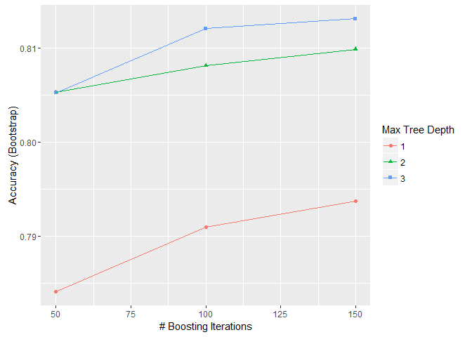

# Titanic: Machine Learning from Disaster - GBM (Gradient Boosting Machine)


### Variable Descriptions

**survival**:  Survival (0 = No; 1 = Yes) 

**pclass**:    Passenger Class (1 = 1st; 2 = 2nd; 3 = 3rd) 

**name**:      Name 

**sex**:       Sex 

**age**:       Age 

**sibsp**:     Number of Siblings/Spouses Aboard 

**parch**:     Number of Parents/Children Aboard 

**ticket**:    Ticket Number 

**fare**:      Passenger Fare 

**cabin**:     Cabin 

**embarked**:  Port of Embarkation (C = Cherbourg; Q = Queenstown; S = Southampton) 
 
 

```r
library(caret)
library(dplyr)
library(ggplot2)
library(RCurl)
```

### Reading data


```r
url <- getURL('https://raw.githubusercontent.com/frankwwu/R-Knots/master/Titanic/train.csv')
train <- read.csv(text = url) 
url <- getURL('https://raw.githubusercontent.com/frankwwu/R-Knots/master/Titanic/test.csv')
test <- read.csv(text = url) 
```

### Removing NA.


```r
train<-train[, !(colnames(train) %in% c('name'))]
train <-train %>% na.omit()
test<-test[, !(colnames(test) %in% c('name'))]
test <- test %>% na.omit()
```

### Selecting features


```r
train$Survived <- factor(train$Survived)
formula = Survived ~ Pclass + Sex + Age + SibSp + Parch + Fare + Embarked
```

### Creating GBM model


```r
gbmModel <- suppressMessages(train(formula, data=train, method="gbm"))
```

```
## Iter   TrainDeviance   ValidDeviance   StepSize   Improve
##      1        1.3084             nan     0.1000    0.0261
##      2        1.2668             nan     0.1000    0.0203
##      3        1.2317             nan     0.1000    0.0169
##      4        1.2066             nan     0.1000    0.0139
##      5        1.1796             nan     0.1000    0.0125
##      6        1.1579             nan     0.1000    0.0092
##      7        1.1340             nan     0.1000    0.0108
##      8        1.1204             nan     0.1000    0.0039
##      9        1.1050             nan     0.1000    0.0062
##     10        1.0908             nan     0.1000    0.0055
##     20        0.9865             nan     0.1000    0.0018
##     40        0.8956             nan     0.1000    0.0001
##     60        0.8508             nan     0.1000    0.0006
##     80        0.8257             nan     0.1000   -0.0009
##    100        0.8077             nan     0.1000   -0.0007
##    120        0.7942             nan     0.1000   -0.0001
##    140        0.7819             nan     0.1000   -0.0006
##    150        0.7774             nan     0.1000   -0.0002
## 
## Iter   TrainDeviance   ValidDeviance   StepSize   Improve
##      1        1.2931             nan     0.1000    0.0301
##      2        1.2387             nan     0.1000    0.0273
##      3        1.1955             nan     0.1000    0.0218
##      4        1.1573             nan     0.1000    0.0182
##      5        1.1251             nan     0.1000    0.0160
##      6        1.0981             nan     0.1000    0.0112
##      7        1.0717             nan     0.1000    0.0112
##      8        1.0507             nan     0.1000    0.0104
##      9        1.0302             nan     0.1000    0.0073
##     10        1.0135             nan     0.1000    0.0066
##     20        0.8876             nan     0.1000    0.0038
##     40        0.7852             nan     0.1000    0.0003
##     60        0.7334             nan     0.1000   -0.0004
##     80        0.6974             nan     0.1000    0.0002
##    100        0.6704             nan     0.1000   -0.0021
##    120        0.6523             nan     0.1000   -0.0006
##    140        0.6330             nan     0.1000   -0.0015
##    150        0.6235             nan     0.1000   -0.0013
## 
## Iter   TrainDeviance   ValidDeviance   StepSize   Improve
##      1        1.2764             nan     0.1000    0.0387
##      2        1.2183             nan     0.1000    0.0236
##      3        1.1677             nan     0.1000    0.0217
##      4        1.1232             nan     0.1000    0.0196
##      5        1.0883             nan     0.1000    0.0166
##      6        1.0594             nan     0.1000    0.0137
##      7        1.0308             nan     0.1000    0.0125
##      8        1.0083             nan     0.1000    0.0092
##      9        0.9856             nan     0.1000    0.0082
##     10        0.9659             nan     0.1000    0.0067
##     20        0.8536             nan     0.1000    0.0020
##     40        0.7419             nan     0.1000    0.0008
##     60        0.6802             nan     0.1000   -0.0002
##     80        0.6329             nan     0.1000   -0.0006
##    100        0.5939             nan     0.1000   -0.0013
##    120        0.5675             nan     0.1000   -0.0008
##    140        0.5445             nan     0.1000   -0.0012
##    150        0.5298             nan     0.1000   -0.0012
## 
## Iter   TrainDeviance   ValidDeviance   StepSize   Improve
##      1        1.3139             nan     0.1000    0.0224
##      2        1.2772             nan     0.1000    0.0181
##      3        1.2439             nan     0.1000    0.0150
##      4        1.2157             nan     0.1000    0.0109
##      5        1.1976             nan     0.1000    0.0091
##      6        1.1754             nan     0.1000    0.0119
##      7        1.1598             nan     0.1000    0.0073
##      8        1.1409             nan     0.1000    0.0096
##      9        1.1242             nan     0.1000    0.0077
##     10        1.1137             nan     0.1000    0.0049
##     20        1.0254             nan     0.1000    0.0007
##     40        0.9550             nan     0.1000   -0.0001
##     60        0.9237             nan     0.1000   -0.0014
##     80        0.8965             nan     0.1000   -0.0005
##    100        0.8790             nan     0.1000   -0.0004
##    120        0.8650             nan     0.1000   -0.0005
##    140        0.8520             nan     0.1000   -0.0002
##    150        0.8460             nan     0.1000   -0.0010
## 
## Iter   TrainDeviance   ValidDeviance   StepSize   Improve
##      1        1.2890             nan     0.1000    0.0318
##      2        1.2356             nan     0.1000    0.0253
##      3        1.1949             nan     0.1000    0.0222
##      4        1.1572             nan     0.1000    0.0175
##      5        1.1326             nan     0.1000    0.0116
##      6        1.1084             nan     0.1000    0.0103
##      7        1.0853             nan     0.1000    0.0120
##      8        1.0679             nan     0.1000    0.0056
##      9        1.0462             nan     0.1000    0.0097
##     10        1.0312             nan     0.1000    0.0056
##     20        0.9276             nan     0.1000    0.0014
##     40        0.8477             nan     0.1000   -0.0005
##     60        0.7966             nan     0.1000   -0.0010
##     80        0.7552             nan     0.1000   -0.0006
##    100        0.7210             nan     0.1000   -0.0020
##    120        0.6971             nan     0.1000   -0.0013
##    140        0.6724             nan     0.1000    0.0004
##    150        0.6620             nan     0.1000   -0.0004
## 
## Iter   TrainDeviance   ValidDeviance   StepSize   Improve
##      1        1.2841             nan     0.1000    0.0354
##      2        1.2257             nan     0.1000    0.0294
##      3        1.1766             nan     0.1000    0.0216
##      4        1.1319             nan     0.1000    0.0209
##      5        1.0973             nan     0.1000    0.0170
##      6        1.0673             nan     0.1000    0.0148
##      7        1.0444             nan     0.1000    0.0099
##      8        1.0219             nan     0.1000    0.0103
##      9        1.0080             nan     0.1000    0.0071
##     10        0.9923             nan     0.1000    0.0063
##     20        0.8837             nan     0.1000    0.0033
##     40        0.7761             nan     0.1000    0.0005
##     60        0.7220             nan     0.1000   -0.0000
##     80        0.6813             nan     0.1000   -0.0014
##    100        0.6496             nan     0.1000   -0.0008
##    120        0.6210             nan     0.1000   -0.0012
##    140        0.5960             nan     0.1000   -0.0004
##    150        0.5839             nan     0.1000   -0.0011
## 
## Iter   TrainDeviance   ValidDeviance   StepSize   Improve
##      1        1.2932             nan     0.1000    0.0300
##      2        1.2472             nan     0.1000    0.0240
##      3        1.2049             nan     0.1000    0.0192
##      4        1.1751             nan     0.1000    0.0162
##      5        1.1501             nan     0.1000    0.0128
##      6        1.1324             nan     0.1000    0.0052
##      7        1.1093             nan     0.1000    0.0108
##      8        1.0922             nan     0.1000    0.0090
##      9        1.0767             nan     0.1000    0.0076
##     10        1.0666             nan     0.1000    0.0030
##     20        0.9601             nan     0.1000    0.0034
##     40        0.8708             nan     0.1000    0.0005
##     60        0.8331             nan     0.1000   -0.0002
##     80        0.8043             nan     0.1000   -0.0001
##    100        0.7849             nan     0.1000   -0.0014
##    120        0.7710             nan     0.1000   -0.0014
##    140        0.7560             nan     0.1000   -0.0002
##    150        0.7508             nan     0.1000   -0.0014
## 
## Iter   TrainDeviance   ValidDeviance   StepSize   Improve
##      1        1.2709             nan     0.1000    0.0406
##      2        1.2094             nan     0.1000    0.0300
##      3        1.1617             nan     0.1000    0.0232
##      4        1.1191             nan     0.1000    0.0216
##      5        1.0844             nan     0.1000    0.0169
##      6        1.0539             nan     0.1000    0.0150
##      7        1.0284             nan     0.1000    0.0127
##      8        1.0021             nan     0.1000    0.0114
##      9        0.9813             nan     0.1000    0.0089
##     10        0.9635             nan     0.1000    0.0078
##     20        0.8531             nan     0.1000    0.0032
##     40        0.7565             nan     0.1000    0.0005
##     60        0.7082             nan     0.1000   -0.0001
##     80        0.6709             nan     0.1000   -0.0011
##    100        0.6388             nan     0.1000   -0.0005
##    120        0.6131             nan     0.1000    0.0002
##    140        0.5931             nan     0.1000   -0.0003
##    150        0.5830             nan     0.1000    0.0001
## 
## Iter   TrainDeviance   ValidDeviance   StepSize   Improve
##      1        1.2628             nan     0.1000    0.0414
##      2        1.1916             nan     0.1000    0.0352
##      3        1.1314             nan     0.1000    0.0280
##      4        1.0880             nan     0.1000    0.0209
##      5        1.0464             nan     0.1000    0.0175
##      6        1.0117             nan     0.1000    0.0146
##      7        0.9810             nan     0.1000    0.0135
##      8        0.9589             nan     0.1000    0.0112
##      9        0.9374             nan     0.1000    0.0105
##     10        0.9158             nan     0.1000    0.0089
##     20        0.8087             nan     0.1000    0.0030
##     40        0.7023             nan     0.1000    0.0006
##     60        0.6408             nan     0.1000   -0.0005
##     80        0.5965             nan     0.1000   -0.0005
##    100        0.5616             nan     0.1000   -0.0018
##    120        0.5300             nan     0.1000   -0.0013
##    140        0.5056             nan     0.1000    0.0005
##    150        0.4942             nan     0.1000   -0.0009
## 
## Iter   TrainDeviance   ValidDeviance   StepSize   Improve
##      1        1.2849             nan     0.1000    0.0231
##      2        1.2483             nan     0.1000    0.0181
##      3        1.2285             nan     0.1000    0.0082
##      4        1.1979             nan     0.1000    0.0152
##      5        1.1758             nan     0.1000    0.0118
##      6        1.1553             nan     0.1000    0.0098
##      7        1.1403             nan     0.1000    0.0079
##      8        1.1232             nan     0.1000    0.0072
##      9        1.1092             nan     0.1000    0.0061
##     10        1.0976             nan     0.1000    0.0049
##     20        1.0107             nan     0.1000    0.0014
##     40        0.9368             nan     0.1000    0.0004
##     60        0.8920             nan     0.1000    0.0002
##     80        0.8649             nan     0.1000   -0.0003
##    100        0.8395             nan     0.1000   -0.0006
##    120        0.8187             nan     0.1000   -0.0006
##    140        0.8039             nan     0.1000   -0.0002
##    150        0.7957             nan     0.1000   -0.0008
## 
## Iter   TrainDeviance   ValidDeviance   StepSize   Improve
##      1        1.2669             nan     0.1000    0.0329
##      2        1.2152             nan     0.1000    0.0243
##      3        1.1719             nan     0.1000    0.0214
##      4        1.1342             nan     0.1000    0.0157
##      5        1.1074             nan     0.1000    0.0132
##      6        1.0861             nan     0.1000    0.0096
##      7        1.0583             nan     0.1000    0.0108
##      8        1.0383             nan     0.1000    0.0086
##      9        1.0237             nan     0.1000    0.0067
##     10        1.0092             nan     0.1000    0.0072
##     20        0.9185             nan     0.1000    0.0013
##     40        0.8124             nan     0.1000    0.0014
##     60        0.7659             nan     0.1000    0.0010
##     80        0.7197             nan     0.1000   -0.0006
##    100        0.6861             nan     0.1000    0.0002
##    120        0.6594             nan     0.1000   -0.0003
##    140        0.6375             nan     0.1000    0.0001
##    150        0.6233             nan     0.1000   -0.0003
## 
## Iter   TrainDeviance   ValidDeviance   StepSize   Improve
##      1        1.2572             nan     0.1000    0.0330
##      2        1.1972             nan     0.1000    0.0274
##      3        1.1490             nan     0.1000    0.0242
##      4        1.1090             nan     0.1000    0.0182
##      5        1.0758             nan     0.1000    0.0134
##      6        1.0497             nan     0.1000    0.0131
##      7        1.0252             nan     0.1000    0.0107
##      8        1.0062             nan     0.1000    0.0077
##      9        0.9867             nan     0.1000    0.0082
##     10        0.9702             nan     0.1000    0.0068
##     20        0.8548             nan     0.1000    0.0016
##     40        0.7396             nan     0.1000   -0.0004
##     60        0.6771             nan     0.1000   -0.0003
##     80        0.6248             nan     0.1000    0.0007
##    100        0.5924             nan     0.1000   -0.0013
##    120        0.5592             nan     0.1000   -0.0015
##    140        0.5325             nan     0.1000   -0.0010
##    150        0.5232             nan     0.1000   -0.0004
## 
## Iter   TrainDeviance   ValidDeviance   StepSize   Improve
##      1        1.2780             nan     0.1000    0.0307
##      2        1.2351             nan     0.1000    0.0241
##      3        1.1931             nan     0.1000    0.0203
##      4        1.1598             nan     0.1000    0.0163
##      5        1.1327             nan     0.1000    0.0137
##      6        1.1092             nan     0.1000    0.0109
##      7        1.0934             nan     0.1000    0.0089
##      8        1.0763             nan     0.1000    0.0069
##      9        1.0588             nan     0.1000    0.0070
##     10        1.0456             nan     0.1000    0.0059
##     20        0.9628             nan     0.1000    0.0022
##     40        0.8945             nan     0.1000    0.0008
##     60        0.8552             nan     0.1000    0.0006
##     80        0.8248             nan     0.1000   -0.0009
##    100        0.8034             nan     0.1000   -0.0001
##    120        0.7868             nan     0.1000   -0.0005
##    140        0.7715             nan     0.1000   -0.0009
##    150        0.7649             nan     0.1000   -0.0005
## 
## Iter   TrainDeviance   ValidDeviance   StepSize   Improve
##      1        1.2619             nan     0.1000    0.0374
##      2        1.2024             nan     0.1000    0.0293
##      3        1.1501             nan     0.1000    0.0226
##      4        1.1072             nan     0.1000    0.0196
##      5        1.0761             nan     0.1000    0.0156
##      6        1.0498             nan     0.1000    0.0148
##      7        1.0251             nan     0.1000    0.0129
##      8        1.0084             nan     0.1000    0.0072
##      9        0.9887             nan     0.1000    0.0100
##     10        0.9693             nan     0.1000    0.0085
##     20        0.8731             nan     0.1000    0.0022
##     40        0.7851             nan     0.1000    0.0004
##     60        0.7238             nan     0.1000   -0.0011
##     80        0.6867             nan     0.1000   -0.0014
##    100        0.6561             nan     0.1000    0.0001
##    120        0.6276             nan     0.1000    0.0002
##    140        0.6070             nan     0.1000   -0.0008
##    150        0.5954             nan     0.1000    0.0003
## 
## Iter   TrainDeviance   ValidDeviance   StepSize   Improve
##      1        1.2546             nan     0.1000    0.0427
##      2        1.1864             nan     0.1000    0.0314
##      3        1.1320             nan     0.1000    0.0260
##      4        1.0925             nan     0.1000    0.0191
##      5        1.0543             nan     0.1000    0.0165
##      6        1.0226             nan     0.1000    0.0132
##      7        0.9987             nan     0.1000    0.0120
##      8        0.9776             nan     0.1000    0.0113
##      9        0.9533             nan     0.1000    0.0102
##     10        0.9386             nan     0.1000    0.0052
##     20        0.8305             nan     0.1000    0.0018
##     40        0.7239             nan     0.1000    0.0009
##     60        0.6595             nan     0.1000   -0.0009
##     80        0.6093             nan     0.1000    0.0006
##    100        0.5663             nan     0.1000   -0.0006
##    120        0.5319             nan     0.1000   -0.0002
##    140        0.5016             nan     0.1000   -0.0003
##    150        0.4896             nan     0.1000   -0.0004
## 
## Iter   TrainDeviance   ValidDeviance   StepSize   Improve
##      1        1.2730             nan     0.1000    0.0335
##      2        1.2221             nan     0.1000    0.0266
##      3        1.1756             nan     0.1000    0.0227
##      4        1.1407             nan     0.1000    0.0178
##      5        1.1112             nan     0.1000    0.0143
##      6        1.0849             nan     0.1000    0.0105
##      7        1.0629             nan     0.1000    0.0091
##      8        1.0474             nan     0.1000    0.0076
##      9        1.0300             nan     0.1000    0.0071
##     10        1.0160             nan     0.1000    0.0054
##     20        0.9221             nan     0.1000    0.0031
##     40        0.8381             nan     0.1000    0.0006
##     60        0.7893             nan     0.1000    0.0005
##     80        0.7600             nan     0.1000    0.0007
##    100        0.7371             nan     0.1000   -0.0008
##    120        0.7245             nan     0.1000   -0.0007
##    140        0.7113             nan     0.1000   -0.0004
##    150        0.7060             nan     0.1000   -0.0008
## 
## Iter   TrainDeviance   ValidDeviance   StepSize   Improve
##      1        1.2690             nan     0.1000    0.0395
##      2        1.2041             nan     0.1000    0.0293
##      3        1.1489             nan     0.1000    0.0252
##      4        1.1063             nan     0.1000    0.0181
##      5        1.0715             nan     0.1000    0.0180
##      6        1.0391             nan     0.1000    0.0166
##      7        1.0103             nan     0.1000    0.0126
##      8        0.9858             nan     0.1000    0.0104
##      9        0.9657             nan     0.1000    0.0076
##     10        0.9479             nan     0.1000    0.0065
##     20        0.8316             nan     0.1000    0.0016
##     40        0.7291             nan     0.1000    0.0006
##     60        0.6795             nan     0.1000   -0.0001
##     80        0.6426             nan     0.1000   -0.0008
##    100        0.6127             nan     0.1000   -0.0006
##    120        0.5905             nan     0.1000   -0.0008
##    140        0.5658             nan     0.1000   -0.0003
##    150        0.5551             nan     0.1000   -0.0011
## 
## Iter   TrainDeviance   ValidDeviance   StepSize   Improve
##      1        1.2581             nan     0.1000    0.0424
##      2        1.1888             nan     0.1000    0.0339
##      3        1.1294             nan     0.1000    0.0268
##      4        1.0847             nan     0.1000    0.0215
##      5        1.0399             nan     0.1000    0.0208
##      6        1.0030             nan     0.1000    0.0163
##      7        0.9687             nan     0.1000    0.0135
##      8        0.9423             nan     0.1000    0.0114
##      9        0.9210             nan     0.1000    0.0085
##     10        0.9005             nan     0.1000    0.0081
##     20        0.7722             nan     0.1000    0.0028
##     40        0.6616             nan     0.1000    0.0003
##     60        0.6083             nan     0.1000   -0.0015
##     80        0.5688             nan     0.1000   -0.0003
##    100        0.5387             nan     0.1000   -0.0001
##    120        0.5091             nan     0.1000   -0.0018
##    140        0.4879             nan     0.1000   -0.0013
##    150        0.4762             nan     0.1000   -0.0004
## 
## Iter   TrainDeviance   ValidDeviance   StepSize   Improve
##      1        1.3005             nan     0.1000    0.0283
##      2        1.2518             nan     0.1000    0.0234
##      3        1.2161             nan     0.1000    0.0183
##      4        1.1918             nan     0.1000    0.0100
##      5        1.1611             nan     0.1000    0.0142
##      6        1.1388             nan     0.1000    0.0082
##      7        1.1154             nan     0.1000    0.0110
##      8        1.0948             nan     0.1000    0.0081
##      9        1.0782             nan     0.1000    0.0066
##     10        1.0664             nan     0.1000    0.0059
##     20        0.9806             nan     0.1000    0.0025
##     40        0.8926             nan     0.1000    0.0006
##     60        0.8487             nan     0.1000   -0.0004
##     80        0.8218             nan     0.1000   -0.0008
##    100        0.8020             nan     0.1000   -0.0005
##    120        0.7879             nan     0.1000   -0.0007
##    140        0.7754             nan     0.1000   -0.0007
##    150        0.7699             nan     0.1000   -0.0004
## 
## Iter   TrainDeviance   ValidDeviance   StepSize   Improve
##      1        1.2856             nan     0.1000    0.0373
##      2        1.2282             nan     0.1000    0.0282
##      3        1.1776             nan     0.1000    0.0240
##      4        1.1376             nan     0.1000    0.0186
##      5        1.1051             nan     0.1000    0.0176
##      6        1.0740             nan     0.1000    0.0135
##      7        1.0484             nan     0.1000    0.0113
##      8        1.0261             nan     0.1000    0.0088
##      9        1.0061             nan     0.1000    0.0101
##     10        0.9847             nan     0.1000    0.0097
##     20        0.8623             nan     0.1000    0.0030
##     40        0.7666             nan     0.1000    0.0008
##     60        0.7079             nan     0.1000   -0.0002
##     80        0.6706             nan     0.1000   -0.0003
##    100        0.6409             nan     0.1000    0.0001
##    120        0.6154             nan     0.1000   -0.0006
##    140        0.5847             nan     0.1000   -0.0001
##    150        0.5769             nan     0.1000   -0.0002
## 
## Iter   TrainDeviance   ValidDeviance   StepSize   Improve
##      1        1.2814             nan     0.1000    0.0374
##      2        1.2155             nan     0.1000    0.0302
##      3        1.1579             nan     0.1000    0.0287
##      4        1.1102             nan     0.1000    0.0250
##      5        1.0690             nan     0.1000    0.0198
##      6        1.0351             nan     0.1000    0.0138
##      7        1.0041             nan     0.1000    0.0134
##      8        0.9796             nan     0.1000    0.0114
##      9        0.9588             nan     0.1000    0.0089
##     10        0.9375             nan     0.1000    0.0088
##     20        0.8033             nan     0.1000    0.0017
##     40        0.6942             nan     0.1000    0.0006
##     60        0.6395             nan     0.1000    0.0006
##     80        0.5928             nan     0.1000   -0.0015
##    100        0.5596             nan     0.1000   -0.0014
##    120        0.5306             nan     0.1000   -0.0002
##    140        0.5035             nan     0.1000   -0.0005
##    150        0.4917             nan     0.1000   -0.0010
## 
## Iter   TrainDeviance   ValidDeviance   StepSize   Improve
##      1        1.2651             nan     0.1000    0.0258
##      2        1.2290             nan     0.1000    0.0204
##      3        1.1957             nan     0.1000    0.0176
##      4        1.1647             nan     0.1000    0.0136
##      5        1.1392             nan     0.1000    0.0110
##      6        1.1188             nan     0.1000    0.0084
##      7        1.0985             nan     0.1000    0.0087
##      8        1.0796             nan     0.1000    0.0080
##      9        1.0635             nan     0.1000    0.0043
##     10        1.0493             nan     0.1000    0.0062
##     20        0.9643             nan     0.1000    0.0028
##     40        0.8944             nan     0.1000    0.0005
##     60        0.8580             nan     0.1000   -0.0004
##     80        0.8355             nan     0.1000   -0.0015
##    100        0.8155             nan     0.1000   -0.0010
##    120        0.8013             nan     0.1000   -0.0002
##    140        0.7870             nan     0.1000   -0.0011
##    150        0.7812             nan     0.1000   -0.0001
## 
## Iter   TrainDeviance   ValidDeviance   StepSize   Improve
##      1        1.2476             nan     0.1000    0.0332
##      2        1.1915             nan     0.1000    0.0253
##      3        1.1487             nan     0.1000    0.0239
##      4        1.1159             nan     0.1000    0.0187
##      5        1.0863             nan     0.1000    0.0140
##      6        1.0597             nan     0.1000    0.0105
##      7        1.0370             nan     0.1000    0.0096
##      8        1.0175             nan     0.1000    0.0096
##      9        0.9968             nan     0.1000    0.0092
##     10        0.9818             nan     0.1000    0.0069
##     20        0.8750             nan     0.1000    0.0034
##     40        0.7903             nan     0.1000   -0.0006
##     60        0.7372             nan     0.1000   -0.0007
##     80        0.6973             nan     0.1000   -0.0005
##    100        0.6686             nan     0.1000   -0.0005
##    120        0.6420             nan     0.1000    0.0005
##    140        0.6251             nan     0.1000   -0.0005
##    150        0.6137             nan     0.1000   -0.0009
## 
## Iter   TrainDeviance   ValidDeviance   StepSize   Improve
##      1        1.2431             nan     0.1000    0.0365
##      2        1.1813             nan     0.1000    0.0305
##      3        1.1327             nan     0.1000    0.0236
##      4        1.0905             nan     0.1000    0.0221
##      5        1.0523             nan     0.1000    0.0164
##      6        1.0217             nan     0.1000    0.0139
##      7        0.9985             nan     0.1000    0.0075
##      8        0.9794             nan     0.1000    0.0083
##      9        0.9579             nan     0.1000    0.0087
##     10        0.9411             nan     0.1000    0.0076
##     20        0.8274             nan     0.1000    0.0007
##     40        0.7227             nan     0.1000    0.0004
##     60        0.6618             nan     0.1000   -0.0012
##     80        0.6237             nan     0.1000   -0.0000
##    100        0.5916             nan     0.1000   -0.0007
##    120        0.5667             nan     0.1000   -0.0012
##    140        0.5444             nan     0.1000   -0.0014
##    150        0.5349             nan     0.1000   -0.0007
## 
## Iter   TrainDeviance   ValidDeviance   StepSize   Improve
##      1        1.2931             nan     0.1000    0.0237
##      2        1.2537             nan     0.1000    0.0181
##      3        1.2212             nan     0.1000    0.0140
##      4        1.1984             nan     0.1000    0.0112
##      5        1.1731             nan     0.1000    0.0109
##      6        1.1535             nan     0.1000    0.0085
##      7        1.1351             nan     0.1000    0.0089
##      8        1.1201             nan     0.1000    0.0059
##      9        1.1055             nan     0.1000    0.0068
##     10        1.0950             nan     0.1000    0.0027
##     20        1.0072             nan     0.1000    0.0029
##     40        0.9231             nan     0.1000    0.0009
##     60        0.8798             nan     0.1000    0.0003
##     80        0.8537             nan     0.1000   -0.0007
##    100        0.8347             nan     0.1000   -0.0006
##    120        0.8191             nan     0.1000   -0.0000
##    140        0.8053             nan     0.1000   -0.0008
##    150        0.7995             nan     0.1000    0.0000
## 
## Iter   TrainDeviance   ValidDeviance   StepSize   Improve
##      1        1.2785             nan     0.1000    0.0336
##      2        1.2270             nan     0.1000    0.0270
##      3        1.1840             nan     0.1000    0.0209
##      4        1.1477             nan     0.1000    0.0160
##      5        1.1172             nan     0.1000    0.0147
##      6        1.0899             nan     0.1000    0.0126
##      7        1.0664             nan     0.1000    0.0110
##      8        1.0447             nan     0.1000    0.0080
##      9        1.0269             nan     0.1000    0.0075
##     10        1.0116             nan     0.1000    0.0070
##     20        0.9061             nan     0.1000    0.0012
##     40        0.8124             nan     0.1000    0.0003
##     60        0.7586             nan     0.1000    0.0007
##     80        0.7255             nan     0.1000   -0.0007
##    100        0.7032             nan     0.1000   -0.0012
##    120        0.6809             nan     0.1000   -0.0015
##    140        0.6622             nan     0.1000   -0.0004
##    150        0.6533             nan     0.1000   -0.0008
## 
## Iter   TrainDeviance   ValidDeviance   StepSize   Improve
##      1        1.2669             nan     0.1000    0.0341
##      2        1.2052             nan     0.1000    0.0265
##      3        1.1590             nan     0.1000    0.0209
##      4        1.1181             nan     0.1000    0.0194
##      5        1.0874             nan     0.1000    0.0128
##      6        1.0589             nan     0.1000    0.0141
##      7        1.0303             nan     0.1000    0.0125
##      8        1.0076             nan     0.1000    0.0110
##      9        0.9870             nan     0.1000    0.0087
##     10        0.9652             nan     0.1000    0.0077
##     20        0.8458             nan     0.1000    0.0034
##     40        0.7446             nan     0.1000    0.0002
##     60        0.6880             nan     0.1000   -0.0014
##     80        0.6491             nan     0.1000    0.0008
##    100        0.6154             nan     0.1000   -0.0011
##    120        0.5910             nan     0.1000   -0.0014
##    140        0.5660             nan     0.1000   -0.0004
##    150        0.5550             nan     0.1000   -0.0005
## 
## Iter   TrainDeviance   ValidDeviance   StepSize   Improve
##      1        1.2684             nan     0.1000    0.0373
##      2        1.2078             nan     0.1000    0.0301
##      3        1.1678             nan     0.1000    0.0239
##      4        1.1269             nan     0.1000    0.0209
##      5        1.0912             nan     0.1000    0.0168
##      6        1.0645             nan     0.1000    0.0137
##      7        1.0391             nan     0.1000    0.0113
##      8        1.0140             nan     0.1000    0.0114
##      9        0.9934             nan     0.1000    0.0088
##     10        0.9750             nan     0.1000    0.0072
##     20        0.8612             nan     0.1000    0.0036
##     40        0.7818             nan     0.1000   -0.0003
##     60        0.7424             nan     0.1000   -0.0010
##     80        0.7218             nan     0.1000   -0.0003
##    100        0.7034             nan     0.1000    0.0000
##    120        0.6912             nan     0.1000   -0.0008
##    140        0.6790             nan     0.1000   -0.0012
##    150        0.6750             nan     0.1000   -0.0010
## 
## Iter   TrainDeviance   ValidDeviance   StepSize   Improve
##      1        1.2529             nan     0.1000    0.0451
##      2        1.1819             nan     0.1000    0.0387
##      3        1.1212             nan     0.1000    0.0295
##      4        1.0673             nan     0.1000    0.0243
##      5        1.0287             nan     0.1000    0.0200
##      6        0.9900             nan     0.1000    0.0167
##      7        0.9581             nan     0.1000    0.0134
##      8        0.9293             nan     0.1000    0.0122
##      9        0.9055             nan     0.1000    0.0112
##     10        0.8838             nan     0.1000    0.0094
##     20        0.7675             nan     0.1000    0.0015
##     40        0.6698             nan     0.1000    0.0006
##     60        0.6291             nan     0.1000   -0.0006
##     80        0.6001             nan     0.1000   -0.0013
##    100        0.5766             nan     0.1000   -0.0014
##    120        0.5529             nan     0.1000   -0.0002
##    140        0.5375             nan     0.1000   -0.0010
##    150        0.5297             nan     0.1000   -0.0010
## 
## Iter   TrainDeviance   ValidDeviance   StepSize   Improve
##      1        1.2449             nan     0.1000    0.0478
##      2        1.1672             nan     0.1000    0.0402
##      3        1.1008             nan     0.1000    0.0312
##      4        1.0438             nan     0.1000    0.0264
##      5        0.9953             nan     0.1000    0.0222
##      6        0.9567             nan     0.1000    0.0180
##      7        0.9248             nan     0.1000    0.0150
##      8        0.8967             nan     0.1000    0.0128
##      9        0.8690             nan     0.1000    0.0127
##     10        0.8490             nan     0.1000    0.0072
##     20        0.7225             nan     0.1000    0.0020
##     40        0.6327             nan     0.1000    0.0013
##     60        0.5780             nan     0.1000    0.0001
##     80        0.5432             nan     0.1000   -0.0009
##    100        0.5137             nan     0.1000   -0.0002
##    120        0.4805             nan     0.1000   -0.0023
##    140        0.4607             nan     0.1000   -0.0009
##    150        0.4473             nan     0.1000   -0.0012
## 
## Iter   TrainDeviance   ValidDeviance   StepSize   Improve
##      1        1.2915             nan     0.1000    0.0256
##      2        1.2540             nan     0.1000    0.0211
##      3        1.2201             nan     0.1000    0.0165
##      4        1.1915             nan     0.1000    0.0121
##      5        1.1645             nan     0.1000    0.0138
##      6        1.1438             nan     0.1000    0.0111
##      7        1.1244             nan     0.1000    0.0095
##      8        1.1077             nan     0.1000    0.0076
##      9        1.0891             nan     0.1000    0.0084
##     10        1.0742             nan     0.1000    0.0071
##     20        0.9839             nan     0.1000    0.0030
##     40        0.9060             nan     0.1000    0.0006
##     60        0.8626             nan     0.1000   -0.0006
##     80        0.8328             nan     0.1000    0.0000
##    100        0.8122             nan     0.1000   -0.0000
##    120        0.7963             nan     0.1000   -0.0004
##    140        0.7822             nan     0.1000   -0.0006
##    150        0.7753             nan     0.1000   -0.0007
## 
## Iter   TrainDeviance   ValidDeviance   StepSize   Improve
##      1        1.2722             nan     0.1000    0.0391
##      2        1.2103             nan     0.1000    0.0326
##      3        1.1592             nan     0.1000    0.0237
##      4        1.1182             nan     0.1000    0.0186
##      5        1.0818             nan     0.1000    0.0167
##      6        1.0564             nan     0.1000    0.0092
##      7        1.0314             nan     0.1000    0.0114
##      8        1.0110             nan     0.1000    0.0092
##      9        0.9942             nan     0.1000    0.0066
##     10        0.9803             nan     0.1000    0.0042
##     20        0.8777             nan     0.1000    0.0026
##     40        0.7819             nan     0.1000    0.0012
##     60        0.7257             nan     0.1000   -0.0003
##     80        0.6867             nan     0.1000   -0.0004
##    100        0.6525             nan     0.1000   -0.0003
##    120        0.6291             nan     0.1000   -0.0017
##    140        0.6074             nan     0.1000   -0.0005
##    150        0.6000             nan     0.1000   -0.0009
## 
## Iter   TrainDeviance   ValidDeviance   StepSize   Improve
##      1        1.2637             nan     0.1000    0.0380
##      2        1.1944             nan     0.1000    0.0339
##      3        1.1414             nan     0.1000    0.0251
##      4        1.0983             nan     0.1000    0.0179
##      5        1.0567             nan     0.1000    0.0203
##      6        1.0223             nan     0.1000    0.0160
##      7        0.9911             nan     0.1000    0.0131
##      8        0.9663             nan     0.1000    0.0113
##      9        0.9473             nan     0.1000    0.0073
##     10        0.9307             nan     0.1000    0.0079
##     20        0.8255             nan     0.1000    0.0023
##     40        0.7191             nan     0.1000    0.0011
##     60        0.6678             nan     0.1000   -0.0009
##     80        0.6232             nan     0.1000   -0.0007
##    100        0.5902             nan     0.1000   -0.0015
##    120        0.5562             nan     0.1000   -0.0015
##    140        0.5295             nan     0.1000   -0.0007
##    150        0.5174             nan     0.1000   -0.0007
## 
## Iter   TrainDeviance   ValidDeviance   StepSize   Improve
##      1        1.3031             nan     0.1000    0.0260
##      2        1.2643             nan     0.1000    0.0204
##      3        1.2300             nan     0.1000    0.0170
##      4        1.2056             nan     0.1000    0.0112
##      5        1.1774             nan     0.1000    0.0129
##      6        1.1557             nan     0.1000    0.0105
##      7        1.1359             nan     0.1000    0.0087
##      8        1.1152             nan     0.1000    0.0077
##      9        1.1001             nan     0.1000    0.0067
##     10        1.0863             nan     0.1000    0.0068
##     20        0.9979             nan     0.1000    0.0022
##     40        0.9182             nan     0.1000    0.0003
##     60        0.8833             nan     0.1000   -0.0001
##     80        0.8633             nan     0.1000   -0.0012
##    100        0.8492             nan     0.1000   -0.0006
##    120        0.8373             nan     0.1000   -0.0006
##    140        0.8273             nan     0.1000   -0.0005
##    150        0.8235             nan     0.1000   -0.0005
## 
## Iter   TrainDeviance   ValidDeviance   StepSize   Improve
##      1        1.2814             nan     0.1000    0.0366
##      2        1.2227             nan     0.1000    0.0276
##      3        1.1763             nan     0.1000    0.0223
##      4        1.1405             nan     0.1000    0.0164
##      5        1.1043             nan     0.1000    0.0174
##      6        1.0756             nan     0.1000    0.0141
##      7        1.0511             nan     0.1000    0.0107
##      8        1.0312             nan     0.1000    0.0064
##      9        1.0110             nan     0.1000    0.0089
##     10        0.9943             nan     0.1000    0.0063
##     20        0.8863             nan     0.1000    0.0018
##     40        0.8142             nan     0.1000    0.0008
##     60        0.7705             nan     0.1000   -0.0009
##     80        0.7381             nan     0.1000   -0.0006
##    100        0.7108             nan     0.1000   -0.0010
##    120        0.6854             nan     0.1000   -0.0003
##    140        0.6679             nan     0.1000   -0.0014
##    150        0.6577             nan     0.1000   -0.0008
## 
## Iter   TrainDeviance   ValidDeviance   StepSize   Improve
##      1        1.2761             nan     0.1000    0.0432
##      2        1.2073             nan     0.1000    0.0314
##      3        1.1541             nan     0.1000    0.0268
##      4        1.1069             nan     0.1000    0.0225
##      5        1.0692             nan     0.1000    0.0191
##      6        1.0357             nan     0.1000    0.0151
##      7        1.0091             nan     0.1000    0.0128
##      8        0.9846             nan     0.1000    0.0112
##      9        0.9630             nan     0.1000    0.0086
##     10        0.9461             nan     0.1000    0.0058
##     20        0.8473             nan     0.1000    0.0020
##     40        0.7658             nan     0.1000    0.0009
##     60        0.7199             nan     0.1000    0.0000
##     80        0.6805             nan     0.1000   -0.0003
##    100        0.6453             nan     0.1000   -0.0011
##    120        0.6105             nan     0.1000   -0.0006
##    140        0.5872             nan     0.1000   -0.0007
##    150        0.5735             nan     0.1000   -0.0009
## 
## Iter   TrainDeviance   ValidDeviance   StepSize   Improve
##      1        1.3209             nan     0.1000    0.0231
##      2        1.2776             nan     0.1000    0.0198
##      3        1.2469             nan     0.1000    0.0160
##      4        1.2182             nan     0.1000    0.0129
##      5        1.2002             nan     0.1000    0.0069
##      6        1.1819             nan     0.1000    0.0103
##      7        1.1635             nan     0.1000    0.0085
##      8        1.1486             nan     0.1000    0.0059
##      9        1.1342             nan     0.1000    0.0070
##     10        1.1217             nan     0.1000    0.0049
##     20        1.0448             nan     0.1000    0.0033
##     40        0.9700             nan     0.1000    0.0004
##     60        0.9275             nan     0.1000    0.0007
##     80        0.9006             nan     0.1000   -0.0011
##    100        0.8810             nan     0.1000   -0.0001
##    120        0.8655             nan     0.1000   -0.0016
##    140        0.8531             nan     0.1000   -0.0006
##    150        0.8437             nan     0.1000   -0.0002
## 
## Iter   TrainDeviance   ValidDeviance   StepSize   Improve
##      1        1.2986             nan     0.1000    0.0310
##      2        1.2430             nan     0.1000    0.0256
##      3        1.1989             nan     0.1000    0.0201
##      4        1.1603             nan     0.1000    0.0165
##      5        1.1308             nan     0.1000    0.0136
##      6        1.1041             nan     0.1000    0.0139
##      7        1.0815             nan     0.1000    0.0101
##      8        1.0633             nan     0.1000    0.0072
##      9        1.0449             nan     0.1000    0.0098
##     10        1.0289             nan     0.1000    0.0056
##     20        0.9299             nan     0.1000    0.0023
##     40        0.8355             nan     0.1000    0.0010
##     60        0.7808             nan     0.1000    0.0001
##     80        0.7369             nan     0.1000   -0.0008
##    100        0.7036             nan     0.1000   -0.0003
##    120        0.6755             nan     0.1000   -0.0008
##    140        0.6562             nan     0.1000   -0.0006
##    150        0.6422             nan     0.1000   -0.0001
## 
## Iter   TrainDeviance   ValidDeviance   StepSize   Improve
##      1        1.2898             nan     0.1000    0.0396
##      2        1.2263             nan     0.1000    0.0317
##      3        1.1835             nan     0.1000    0.0230
##      4        1.1384             nan     0.1000    0.0219
##      5        1.1045             nan     0.1000    0.0165
##      6        1.0717             nan     0.1000    0.0144
##      7        1.0442             nan     0.1000    0.0116
##      8        1.0247             nan     0.1000    0.0076
##      9        1.0020             nan     0.1000    0.0100
##     10        0.9853             nan     0.1000    0.0071
##     20        0.8738             nan     0.1000    0.0036
##     40        0.7699             nan     0.1000    0.0009
##     60        0.7051             nan     0.1000   -0.0012
##     80        0.6620             nan     0.1000   -0.0013
##    100        0.6145             nan     0.1000    0.0002
##    120        0.5778             nan     0.1000   -0.0013
##    140        0.5520             nan     0.1000   -0.0011
##    150        0.5409             nan     0.1000   -0.0013
## 
## Iter   TrainDeviance   ValidDeviance   StepSize   Improve
##      1        1.2232             nan     0.1000    0.0352
##      2        1.1656             nan     0.1000    0.0266
##      3        1.1248             nan     0.1000    0.0220
##      4        1.0910             nan     0.1000    0.0182
##      5        1.0590             nan     0.1000    0.0148
##      6        1.0371             nan     0.1000    0.0122
##      7        1.0158             nan     0.1000    0.0101
##      8        0.9973             nan     0.1000    0.0080
##      9        0.9837             nan     0.1000    0.0067
##     10        0.9716             nan     0.1000    0.0064
##     20        0.8916             nan     0.1000    0.0013
##     40        0.8217             nan     0.1000    0.0009
##     60        0.7870             nan     0.1000   -0.0002
##     80        0.7672             nan     0.1000    0.0001
##    100        0.7514             nan     0.1000   -0.0001
##    120        0.7372             nan     0.1000   -0.0006
##    140        0.7258             nan     0.1000   -0.0005
##    150        0.7194             nan     0.1000   -0.0002
## 
## Iter   TrainDeviance   ValidDeviance   StepSize   Improve
##      1        1.2140             nan     0.1000    0.0407
##      2        1.1438             nan     0.1000    0.0341
##      3        1.0940             nan     0.1000    0.0252
##      4        1.0528             nan     0.1000    0.0233
##      5        1.0177             nan     0.1000    0.0166
##      6        0.9849             nan     0.1000    0.0154
##      7        0.9595             nan     0.1000    0.0131
##      8        0.9372             nan     0.1000    0.0103
##      9        0.9161             nan     0.1000    0.0083
##     10        0.9006             nan     0.1000    0.0075
##     20        0.8050             nan     0.1000    0.0021
##     40        0.7240             nan     0.1000   -0.0003
##     60        0.6818             nan     0.1000    0.0008
##     80        0.6551             nan     0.1000   -0.0003
##    100        0.6280             nan     0.1000   -0.0007
##    120        0.6030             nan     0.1000   -0.0007
##    140        0.5819             nan     0.1000   -0.0003
##    150        0.5742             nan     0.1000   -0.0001
## 
## Iter   TrainDeviance   ValidDeviance   StepSize   Improve
##      1        1.2053             nan     0.1000    0.0429
##      2        1.1351             nan     0.1000    0.0331
##      3        1.0815             nan     0.1000    0.0265
##      4        1.0333             nan     0.1000    0.0228
##      5        0.9921             nan     0.1000    0.0174
##      6        0.9587             nan     0.1000    0.0167
##      7        0.9289             nan     0.1000    0.0136
##      8        0.9085             nan     0.1000    0.0090
##      9        0.8864             nan     0.1000    0.0101
##     10        0.8656             nan     0.1000    0.0091
##     20        0.7656             nan     0.1000    0.0028
##     40        0.6728             nan     0.1000   -0.0001
##     60        0.6219             nan     0.1000   -0.0009
##     80        0.5750             nan     0.1000   -0.0001
##    100        0.5471             nan     0.1000   -0.0007
##    120        0.5204             nan     0.1000   -0.0005
##    140        0.4960             nan     0.1000    0.0001
##    150        0.4827             nan     0.1000   -0.0017
## 
## Iter   TrainDeviance   ValidDeviance   StepSize   Improve
##      1        1.3128             nan     0.1000    0.0200
##      2        1.2770             nan     0.1000    0.0149
##      3        1.2488             nan     0.1000    0.0124
##      4        1.2241             nan     0.1000    0.0109
##      5        1.2002             nan     0.1000    0.0120
##      6        1.1801             nan     0.1000    0.0094
##      7        1.1612             nan     0.1000    0.0077
##      8        1.1400             nan     0.1000    0.0091
##      9        1.1239             nan     0.1000    0.0070
##     10        1.1068             nan     0.1000    0.0070
##     20        1.0084             nan     0.1000    0.0028
##     40        0.9117             nan     0.1000    0.0008
##     60        0.8647             nan     0.1000    0.0005
##     80        0.8320             nan     0.1000    0.0000
##    100        0.8103             nan     0.1000   -0.0003
##    120        0.7927             nan     0.1000    0.0004
##    140        0.7802             nan     0.1000   -0.0006
##    150        0.7747             nan     0.1000   -0.0008
## 
## Iter   TrainDeviance   ValidDeviance   StepSize   Improve
##      1        1.2923             nan     0.1000    0.0308
##      2        1.2468             nan     0.1000    0.0236
##      3        1.2068             nan     0.1000    0.0192
##      4        1.1730             nan     0.1000    0.0150
##      5        1.1386             nan     0.1000    0.0151
##      6        1.1126             nan     0.1000    0.0133
##      7        1.0882             nan     0.1000    0.0109
##      8        1.0611             nan     0.1000    0.0111
##      9        1.0392             nan     0.1000    0.0113
##     10        1.0187             nan     0.1000    0.0090
##     20        0.8927             nan     0.1000    0.0048
##     40        0.7970             nan     0.1000    0.0007
##     60        0.7474             nan     0.1000   -0.0004
##     80        0.7069             nan     0.1000    0.0000
##    100        0.6763             nan     0.1000   -0.0003
##    120        0.6516             nan     0.1000   -0.0001
##    140        0.6304             nan     0.1000   -0.0008
##    150        0.6215             nan     0.1000   -0.0010
## 
## Iter   TrainDeviance   ValidDeviance   StepSize   Improve
##      1        1.2832             nan     0.1000    0.0357
##      2        1.2210             nan     0.1000    0.0282
##      3        1.1805             nan     0.1000    0.0179
##      4        1.1370             nan     0.1000    0.0221
##      5        1.0980             nan     0.1000    0.0172
##      6        1.0652             nan     0.1000    0.0136
##      7        1.0380             nan     0.1000    0.0129
##      8        1.0100             nan     0.1000    0.0112
##      9        0.9876             nan     0.1000    0.0095
##     10        0.9693             nan     0.1000    0.0078
##     20        0.8490             nan     0.1000    0.0027
##     40        0.7423             nan     0.1000   -0.0002
##     60        0.6833             nan     0.1000   -0.0000
##     80        0.6391             nan     0.1000   -0.0004
##    100        0.6027             nan     0.1000   -0.0005
##    120        0.5683             nan     0.1000   -0.0004
##    140        0.5343             nan     0.1000   -0.0015
##    150        0.5229             nan     0.1000   -0.0007
## 
## Iter   TrainDeviance   ValidDeviance   StepSize   Improve
##      1        1.2950             nan     0.1000    0.0273
##      2        1.2530             nan     0.1000    0.0214
##      3        1.2154             nan     0.1000    0.0174
##      4        1.1847             nan     0.1000    0.0134
##      5        1.1703             nan     0.1000    0.0070
##      6        1.1482             nan     0.1000    0.0110
##      7        1.1305             nan     0.1000    0.0093
##      8        1.1135             nan     0.1000    0.0069
##      9        1.0992             nan     0.1000    0.0054
##     10        1.0871             nan     0.1000    0.0050
##     20        1.0117             nan     0.1000    0.0012
##     40        0.9445             nan     0.1000    0.0008
##     60        0.9069             nan     0.1000   -0.0003
##     80        0.8849             nan     0.1000    0.0001
##    100        0.8665             nan     0.1000   -0.0005
##    120        0.8533             nan     0.1000   -0.0005
##    140        0.8422             nan     0.1000   -0.0004
##    150        0.8358             nan     0.1000   -0.0007
## 
## Iter   TrainDeviance   ValidDeviance   StepSize   Improve
##      1        1.2834             nan     0.1000    0.0349
##      2        1.2349             nan     0.1000    0.0226
##      3        1.1936             nan     0.1000    0.0208
##      4        1.1550             nan     0.1000    0.0195
##      5        1.1214             nan     0.1000    0.0142
##      6        1.0957             nan     0.1000    0.0111
##      7        1.0713             nan     0.1000    0.0120
##      8        1.0534             nan     0.1000    0.0065
##      9        1.0359             nan     0.1000    0.0095
##     10        1.0220             nan     0.1000    0.0062
##     20        0.9306             nan     0.1000    0.0011
##     40        0.8430             nan     0.1000    0.0002
##     60        0.7928             nan     0.1000   -0.0001
##     80        0.7547             nan     0.1000   -0.0006
##    100        0.7264             nan     0.1000   -0.0008
##    120        0.7013             nan     0.1000   -0.0013
##    140        0.6770             nan     0.1000   -0.0007
##    150        0.6679             nan     0.1000   -0.0008
## 
## Iter   TrainDeviance   ValidDeviance   StepSize   Improve
##      1        1.2767             nan     0.1000    0.0358
##      2        1.2187             nan     0.1000    0.0283
##      3        1.1722             nan     0.1000    0.0226
##      4        1.1262             nan     0.1000    0.0161
##      5        1.0945             nan     0.1000    0.0146
##      6        1.0640             nan     0.1000    0.0135
##      7        1.0404             nan     0.1000    0.0088
##      8        1.0198             nan     0.1000    0.0098
##      9        1.0035             nan     0.1000    0.0076
##     10        0.9893             nan     0.1000    0.0065
##     20        0.8816             nan     0.1000    0.0015
##     40        0.7897             nan     0.1000    0.0002
##     60        0.7278             nan     0.1000   -0.0009
##     80        0.6784             nan     0.1000    0.0007
##    100        0.6441             nan     0.1000   -0.0016
##    120        0.6107             nan     0.1000   -0.0002
##    140        0.5846             nan     0.1000   -0.0007
##    150        0.5723             nan     0.1000   -0.0015
## 
## Iter   TrainDeviance   ValidDeviance   StepSize   Improve
##      1        1.2889             nan     0.1000    0.0301
##      2        1.2437             nan     0.1000    0.0239
##      3        1.2053             nan     0.1000    0.0196
##      4        1.1749             nan     0.1000    0.0152
##      5        1.1465             nan     0.1000    0.0128
##      6        1.1247             nan     0.1000    0.0112
##      7        1.1047             nan     0.1000    0.0076
##      8        1.0825             nan     0.1000    0.0095
##      9        1.0642             nan     0.1000    0.0070
##     10        1.0494             nan     0.1000    0.0074
##     20        0.9594             nan     0.1000    0.0014
##     40        0.8906             nan     0.1000    0.0001
##     60        0.8522             nan     0.1000    0.0005
##     80        0.8249             nan     0.1000    0.0000
##    100        0.8083             nan     0.1000   -0.0016
##    120        0.7948             nan     0.1000   -0.0007
##    140        0.7844             nan     0.1000   -0.0001
##    150        0.7792             nan     0.1000   -0.0005
## 
## Iter   TrainDeviance   ValidDeviance   StepSize   Improve
##      1        1.2749             nan     0.1000    0.0360
##      2        1.2130             nan     0.1000    0.0301
##      3        1.1664             nan     0.1000    0.0213
##      4        1.1241             nan     0.1000    0.0199
##      5        1.0881             nan     0.1000    0.0171
##      6        1.0581             nan     0.1000    0.0141
##      7        1.0330             nan     0.1000    0.0124
##      8        1.0120             nan     0.1000    0.0098
##      9        0.9934             nan     0.1000    0.0077
##     10        0.9778             nan     0.1000    0.0061
##     20        0.8679             nan     0.1000    0.0024
##     40        0.7914             nan     0.1000   -0.0005
##     60        0.7489             nan     0.1000    0.0001
##     80        0.7159             nan     0.1000   -0.0008
##    100        0.6868             nan     0.1000   -0.0019
##    120        0.6684             nan     0.1000   -0.0016
##    140        0.6487             nan     0.1000   -0.0009
##    150        0.6407             nan     0.1000   -0.0016
## 
## Iter   TrainDeviance   ValidDeviance   StepSize   Improve
##      1        1.2687             nan     0.1000    0.0399
##      2        1.2063             nan     0.1000    0.0285
##      3        1.1518             nan     0.1000    0.0251
##      4        1.1085             nan     0.1000    0.0210
##      5        1.0675             nan     0.1000    0.0182
##      6        1.0334             nan     0.1000    0.0159
##      7        1.0035             nan     0.1000    0.0124
##      8        0.9797             nan     0.1000    0.0108
##      9        0.9610             nan     0.1000    0.0078
##     10        0.9449             nan     0.1000    0.0055
##     20        0.8386             nan     0.1000    0.0009
##     40        0.7523             nan     0.1000   -0.0002
##     60        0.7021             nan     0.1000   -0.0019
##     80        0.6637             nan     0.1000   -0.0018
##    100        0.6273             nan     0.1000   -0.0017
##    120        0.5957             nan     0.1000   -0.0006
##    140        0.5694             nan     0.1000   -0.0005
##    150        0.5553             nan     0.1000   -0.0007
## 
## Iter   TrainDeviance   ValidDeviance   StepSize   Improve
##      1        1.2852             nan     0.1000    0.0232
##      2        1.2478             nan     0.1000    0.0183
##      3        1.2148             nan     0.1000    0.0146
##      4        1.1920             nan     0.1000    0.0122
##      5        1.1691             nan     0.1000    0.0120
##      6        1.1474             nan     0.1000    0.0086
##      7        1.1296             nan     0.1000    0.0074
##      8        1.1147             nan     0.1000    0.0060
##      9        1.0978             nan     0.1000    0.0086
##     10        1.0848             nan     0.1000    0.0062
##     20        0.9955             nan     0.1000    0.0015
##     40        0.9189             nan     0.1000    0.0007
##     60        0.8769             nan     0.1000    0.0001
##     80        0.8478             nan     0.1000   -0.0005
##    100        0.8317             nan     0.1000   -0.0011
##    120        0.8178             nan     0.1000   -0.0003
##    140        0.8077             nan     0.1000   -0.0003
##    150        0.8011             nan     0.1000    0.0002
## 
## Iter   TrainDeviance   ValidDeviance   StepSize   Improve
##      1        1.2603             nan     0.1000    0.0312
##      2        1.2038             nan     0.1000    0.0274
##      3        1.1603             nan     0.1000    0.0225
##      4        1.1221             nan     0.1000    0.0171
##      5        1.0950             nan     0.1000    0.0126
##      6        1.0670             nan     0.1000    0.0131
##      7        1.0477             nan     0.1000    0.0079
##      8        1.0255             nan     0.1000    0.0082
##      9        1.0086             nan     0.1000    0.0068
##     10        0.9946             nan     0.1000    0.0057
##     20        0.8943             nan     0.1000    0.0012
##     40        0.8007             nan     0.1000    0.0007
##     60        0.7574             nan     0.1000   -0.0000
##     80        0.7279             nan     0.1000   -0.0000
##    100        0.7001             nan     0.1000   -0.0002
##    120        0.6741             nan     0.1000   -0.0007
##    140        0.6557             nan     0.1000   -0.0007
##    150        0.6482             nan     0.1000   -0.0017
## 
## Iter   TrainDeviance   ValidDeviance   StepSize   Improve
##      1        1.2495             nan     0.1000    0.0364
##      2        1.1959             nan     0.1000    0.0275
##      3        1.1463             nan     0.1000    0.0205
##      4        1.1027             nan     0.1000    0.0203
##      5        1.0698             nan     0.1000    0.0121
##      6        1.0415             nan     0.1000    0.0145
##      7        1.0155             nan     0.1000    0.0116
##      8        0.9942             nan     0.1000    0.0088
##      9        0.9743             nan     0.1000    0.0087
##     10        0.9564             nan     0.1000    0.0044
##     20        0.8417             nan     0.1000    0.0014
##     40        0.7490             nan     0.1000    0.0002
##     60        0.6937             nan     0.1000   -0.0003
##     80        0.6532             nan     0.1000   -0.0001
##    100        0.6205             nan     0.1000   -0.0014
##    120        0.5873             nan     0.1000   -0.0000
##    140        0.5640             nan     0.1000   -0.0018
##    150        0.5514             nan     0.1000   -0.0011
## 
## Iter   TrainDeviance   ValidDeviance   StepSize   Improve
##      1        1.2977             nan     0.1000    0.0340
##      2        1.2398             nan     0.1000    0.0278
##      3        1.1938             nan     0.1000    0.0223
##      4        1.1573             nan     0.1000    0.0183
##      5        1.1233             nan     0.1000    0.0146
##      6        1.0979             nan     0.1000    0.0114
##      7        1.0769             nan     0.1000    0.0097
##      8        1.0586             nan     0.1000    0.0074
##      9        1.0402             nan     0.1000    0.0084
##     10        1.0264             nan     0.1000    0.0060
##     20        0.9317             nan     0.1000    0.0030
##     40        0.8669             nan     0.1000    0.0001
##     60        0.8406             nan     0.1000   -0.0002
##     80        0.8229             nan     0.1000   -0.0003
##    100        0.8093             nan     0.1000   -0.0004
##    120        0.7984             nan     0.1000   -0.0016
##    140        0.7874             nan     0.1000   -0.0000
##    150        0.7845             nan     0.1000   -0.0002
## 
## Iter   TrainDeviance   ValidDeviance   StepSize   Improve
##      1        1.2811             nan     0.1000    0.0403
##      2        1.2146             nan     0.1000    0.0309
##      3        1.1615             nan     0.1000    0.0247
##      4        1.1182             nan     0.1000    0.0193
##      5        1.0832             nan     0.1000    0.0164
##      6        1.0517             nan     0.1000    0.0148
##      7        1.0202             nan     0.1000    0.0153
##      8        1.0011             nan     0.1000    0.0107
##      9        0.9807             nan     0.1000    0.0098
##     10        0.9636             nan     0.1000    0.0074
##     20        0.8562             nan     0.1000    0.0024
##     40        0.7720             nan     0.1000    0.0004
##     60        0.7308             nan     0.1000   -0.0004
##     80        0.7003             nan     0.1000   -0.0005
##    100        0.6694             nan     0.1000   -0.0019
##    120        0.6413             nan     0.1000   -0.0006
##    140        0.6209             nan     0.1000   -0.0006
##    150        0.6109             nan     0.1000    0.0002
## 
## Iter   TrainDeviance   ValidDeviance   StepSize   Improve
##      1        1.2748             nan     0.1000    0.0413
##      2        1.2045             nan     0.1000    0.0348
##      3        1.1481             nan     0.1000    0.0284
##      4        1.0986             nan     0.1000    0.0239
##      5        1.0584             nan     0.1000    0.0208
##      6        1.0239             nan     0.1000    0.0178
##      7        0.9938             nan     0.1000    0.0144
##      8        0.9678             nan     0.1000    0.0127
##      9        0.9433             nan     0.1000    0.0107
##     10        0.9210             nan     0.1000    0.0104
##     20        0.8005             nan     0.1000    0.0025
##     40        0.7074             nan     0.1000   -0.0006
##     60        0.6600             nan     0.1000   -0.0006
##     80        0.6199             nan     0.1000   -0.0009
##    100        0.5898             nan     0.1000   -0.0013
##    120        0.5594             nan     0.1000   -0.0011
##    140        0.5320             nan     0.1000   -0.0006
##    150        0.5253             nan     0.1000   -0.0016
## 
## Iter   TrainDeviance   ValidDeviance   StepSize   Improve
##      1        1.3183             nan     0.1000    0.0269
##      2        1.2777             nan     0.1000    0.0221
##      3        1.2452             nan     0.1000    0.0181
##      4        1.2102             nan     0.1000    0.0153
##      5        1.1882             nan     0.1000    0.0087
##      6        1.1624             nan     0.1000    0.0122
##      7        1.1487             nan     0.1000    0.0064
##      8        1.1299             nan     0.1000    0.0082
##      9        1.1143             nan     0.1000    0.0074
##     10        1.0964             nan     0.1000    0.0069
##     20        1.0080             nan     0.1000    0.0022
##     40        0.9287             nan     0.1000    0.0009
##     60        0.8854             nan     0.1000    0.0004
##     80        0.8616             nan     0.1000   -0.0005
##    100        0.8424             nan     0.1000    0.0003
##    120        0.8290             nan     0.1000   -0.0003
##    140        0.8161             nan     0.1000    0.0002
##    150        0.8121             nan     0.1000   -0.0004
## 
## Iter   TrainDeviance   ValidDeviance   StepSize   Improve
##      1        1.3015             nan     0.1000    0.0341
##      2        1.2501             nan     0.1000    0.0253
##      3        1.2020             nan     0.1000    0.0229
##      4        1.1618             nan     0.1000    0.0180
##      5        1.1293             nan     0.1000    0.0168
##      6        1.1027             nan     0.1000    0.0127
##      7        1.0817             nan     0.1000    0.0079
##      8        1.0588             nan     0.1000    0.0107
##      9        1.0380             nan     0.1000    0.0088
##     10        1.0218             nan     0.1000    0.0072
##     20        0.9022             nan     0.1000    0.0020
##     40        0.8084             nan     0.1000    0.0004
##     60        0.7575             nan     0.1000    0.0007
##     80        0.7188             nan     0.1000    0.0001
##    100        0.6957             nan     0.1000   -0.0014
##    120        0.6720             nan     0.1000   -0.0012
##    140        0.6533             nan     0.1000   -0.0010
##    150        0.6470             nan     0.1000   -0.0010
## 
## Iter   TrainDeviance   ValidDeviance   StepSize   Improve
##      1        1.2920             nan     0.1000    0.0380
##      2        1.2306             nan     0.1000    0.0295
##      3        1.1783             nan     0.1000    0.0254
##      4        1.1396             nan     0.1000    0.0187
##      5        1.1020             nan     0.1000    0.0183
##      6        1.0672             nan     0.1000    0.0153
##      7        1.0346             nan     0.1000    0.0144
##      8        1.0098             nan     0.1000    0.0125
##      9        0.9883             nan     0.1000    0.0079
##     10        0.9751             nan     0.1000    0.0063
##     20        0.8467             nan     0.1000    0.0018
##     40        0.7454             nan     0.1000    0.0002
##     60        0.6877             nan     0.1000   -0.0006
##     80        0.6472             nan     0.1000   -0.0007
##    100        0.6093             nan     0.1000   -0.0001
##    120        0.5762             nan     0.1000   -0.0008
##    140        0.5518             nan     0.1000   -0.0005
##    150        0.5420             nan     0.1000   -0.0005
## 
## Iter   TrainDeviance   ValidDeviance   StepSize   Improve
##      1        1.3056             nan     0.1000    0.0263
##      2        1.2663             nan     0.1000    0.0201
##      3        1.2369             nan     0.1000    0.0166
##      4        1.2080             nan     0.1000    0.0142
##      5        1.1871             nan     0.1000    0.0113
##      6        1.1689             nan     0.1000    0.0093
##      7        1.1507             nan     0.1000    0.0072
##      8        1.1399             nan     0.1000    0.0043
##      9        1.1254             nan     0.1000    0.0057
##     10        1.1142             nan     0.1000    0.0057
##     20        1.0341             nan     0.1000    0.0023
##     40        0.9670             nan     0.1000    0.0004
##     60        0.9313             nan     0.1000   -0.0001
##     80        0.9081             nan     0.1000   -0.0004
##    100        0.8916             nan     0.1000   -0.0011
##    120        0.8787             nan     0.1000   -0.0010
##    140        0.8669             nan     0.1000   -0.0005
##    150        0.8602             nan     0.1000   -0.0002
## 
## Iter   TrainDeviance   ValidDeviance   StepSize   Improve
##      1        1.3036             nan     0.1000    0.0324
##      2        1.2532             nan     0.1000    0.0271
##      3        1.2095             nan     0.1000    0.0215
##      4        1.1738             nan     0.1000    0.0154
##      5        1.1416             nan     0.1000    0.0150
##      6        1.1159             nan     0.1000    0.0117
##      7        1.0964             nan     0.1000    0.0055
##      8        1.0791             nan     0.1000    0.0077
##      9        1.0629             nan     0.1000    0.0071
##     10        1.0482             nan     0.1000    0.0058
##     20        0.9396             nan     0.1000    0.0025
##     40        0.8553             nan     0.1000    0.0007
##     60        0.8139             nan     0.1000    0.0003
##     80        0.7756             nan     0.1000   -0.0003
##    100        0.7464             nan     0.1000   -0.0005
##    120        0.7171             nan     0.1000   -0.0002
##    140        0.6938             nan     0.1000   -0.0014
##    150        0.6834             nan     0.1000   -0.0010
## 
## Iter   TrainDeviance   ValidDeviance   StepSize   Improve
##      1        1.2953             nan     0.1000    0.0318
##      2        1.2382             nan     0.1000    0.0304
##      3        1.1895             nan     0.1000    0.0223
##      4        1.1439             nan     0.1000    0.0175
##      5        1.1108             nan     0.1000    0.0141
##      6        1.0808             nan     0.1000    0.0130
##      7        1.0555             nan     0.1000    0.0103
##      8        1.0353             nan     0.1000    0.0094
##      9        1.0168             nan     0.1000    0.0080
##     10        0.9975             nan     0.1000    0.0063
##     20        0.8885             nan     0.1000    0.0032
##     40        0.8022             nan     0.1000   -0.0016
##     60        0.7449             nan     0.1000   -0.0012
##     80        0.7050             nan     0.1000   -0.0002
##    100        0.6668             nan     0.1000   -0.0016
##    120        0.6371             nan     0.1000   -0.0018
##    140        0.6099             nan     0.1000   -0.0007
##    150        0.5998             nan     0.1000   -0.0016
## 
## Iter   TrainDeviance   ValidDeviance   StepSize   Improve
##      1        1.3040             nan     0.1000    0.0281
##      2        1.2540             nan     0.1000    0.0219
##      3        1.2201             nan     0.1000    0.0187
##      4        1.1874             nan     0.1000    0.0154
##      5        1.1670             nan     0.1000    0.0103
##      6        1.1412             nan     0.1000    0.0117
##      7        1.1213             nan     0.1000    0.0075
##      8        1.1012             nan     0.1000    0.0098
##      9        1.0849             nan     0.1000    0.0074
##     10        1.0696             nan     0.1000    0.0072
##     20        0.9756             nan     0.1000    0.0023
##     40        0.8914             nan     0.1000    0.0005
##     60        0.8371             nan     0.1000   -0.0001
##     80        0.8012             nan     0.1000    0.0000
##    100        0.7822             nan     0.1000   -0.0001
##    120        0.7660             nan     0.1000    0.0002
##    140        0.7521             nan     0.1000   -0.0015
##    150        0.7473             nan     0.1000   -0.0004
## 
## Iter   TrainDeviance   ValidDeviance   StepSize   Improve
##      1        1.2851             nan     0.1000    0.0405
##      2        1.2290             nan     0.1000    0.0293
##      3        1.1773             nan     0.1000    0.0220
##      4        1.1384             nan     0.1000    0.0189
##      5        1.1031             nan     0.1000    0.0166
##      6        1.0740             nan     0.1000    0.0123
##      7        1.0476             nan     0.1000    0.0124
##      8        1.0233             nan     0.1000    0.0113
##      9        1.0017             nan     0.1000    0.0095
##     10        0.9841             nan     0.1000    0.0074
##     20        0.8646             nan     0.1000    0.0024
##     40        0.7459             nan     0.1000    0.0010
##     60        0.6934             nan     0.1000    0.0002
##     80        0.6610             nan     0.1000   -0.0004
##    100        0.6323             nan     0.1000   -0.0007
##    120        0.6077             nan     0.1000    0.0001
##    140        0.5867             nan     0.1000   -0.0012
##    150        0.5749             nan     0.1000   -0.0017
## 
## Iter   TrainDeviance   ValidDeviance   StepSize   Improve
##      1        1.2788             nan     0.1000    0.0421
##      2        1.2139             nan     0.1000    0.0335
##      3        1.1574             nan     0.1000    0.0260
##      4        1.1159             nan     0.1000    0.0198
##      5        1.0803             nan     0.1000    0.0154
##      6        1.0437             nan     0.1000    0.0161
##      7        1.0135             nan     0.1000    0.0151
##      8        0.9877             nan     0.1000    0.0116
##      9        0.9630             nan     0.1000    0.0104
##     10        0.9419             nan     0.1000    0.0084
##     20        0.7934             nan     0.1000    0.0012
##     40        0.6851             nan     0.1000   -0.0001
##     60        0.6242             nan     0.1000    0.0005
##     80        0.5833             nan     0.1000   -0.0008
##    100        0.5510             nan     0.1000   -0.0009
##    120        0.5229             nan     0.1000   -0.0011
##    140        0.4955             nan     0.1000   -0.0005
##    150        0.4860             nan     0.1000   -0.0016
## 
## Iter   TrainDeviance   ValidDeviance   StepSize   Improve
##      1        1.3088             nan     0.1000    0.0255
##      2        1.2685             nan     0.1000    0.0204
##      3        1.2370             nan     0.1000    0.0160
##      4        1.2091             nan     0.1000    0.0131
##      5        1.1843             nan     0.1000    0.0107
##      6        1.1629             nan     0.1000    0.0084
##      7        1.1350             nan     0.1000    0.0119
##      8        1.1155             nan     0.1000    0.0098
##      9        1.1019             nan     0.1000    0.0064
##     10        1.0839             nan     0.1000    0.0077
##     20        0.9908             nan     0.1000    0.0028
##     40        0.9053             nan     0.1000    0.0012
##     60        0.8596             nan     0.1000    0.0005
##     80        0.8309             nan     0.1000    0.0004
##    100        0.8097             nan     0.1000   -0.0003
##    120        0.7987             nan     0.1000   -0.0008
##    140        0.7869             nan     0.1000   -0.0003
##    150        0.7836             nan     0.1000   -0.0016
## 
## Iter   TrainDeviance   ValidDeviance   StepSize   Improve
##      1        1.2813             nan     0.1000    0.0371
##      2        1.2268             nan     0.1000    0.0285
##      3        1.1822             nan     0.1000    0.0188
##      4        1.1409             nan     0.1000    0.0189
##      5        1.1066             nan     0.1000    0.0163
##      6        1.0748             nan     0.1000    0.0135
##      7        1.0513             nan     0.1000    0.0105
##      8        1.0285             nan     0.1000    0.0098
##      9        1.0092             nan     0.1000    0.0092
##     10        0.9922             nan     0.1000    0.0080
##     20        0.8845             nan     0.1000    0.0017
##     40        0.7724             nan     0.1000    0.0010
##     60        0.7280             nan     0.1000   -0.0007
##     80        0.6939             nan     0.1000   -0.0009
##    100        0.6641             nan     0.1000    0.0005
##    120        0.6407             nan     0.1000    0.0000
##    140        0.6237             nan     0.1000   -0.0012
##    150        0.6114             nan     0.1000   -0.0000
## 
## Iter   TrainDeviance   ValidDeviance   StepSize   Improve
##      1        1.2795             nan     0.1000    0.0398
##      2        1.2143             nan     0.1000    0.0310
##      3        1.1618             nan     0.1000    0.0270
##      4        1.1174             nan     0.1000    0.0211
##      5        1.0802             nan     0.1000    0.0185
##      6        1.0463             nan     0.1000    0.0156
##      7        1.0158             nan     0.1000    0.0125
##      8        0.9868             nan     0.1000    0.0130
##      9        0.9647             nan     0.1000    0.0088
##     10        0.9452             nan     0.1000    0.0083
##     20        0.8317             nan     0.1000    0.0026
##     40        0.7113             nan     0.1000    0.0001
##     60        0.6579             nan     0.1000   -0.0009
##     80        0.6097             nan     0.1000   -0.0003
##    100        0.5768             nan     0.1000   -0.0001
##    120        0.5457             nan     0.1000    0.0000
##    140        0.5192             nan     0.1000   -0.0006
##    150        0.5079             nan     0.1000   -0.0002
## 
## Iter   TrainDeviance   ValidDeviance   StepSize   Improve
##      1        1.2828             nan     0.1000    0.0258
##      2        1.2509             nan     0.1000    0.0125
##      3        1.2111             nan     0.1000    0.0206
##      4        1.1795             nan     0.1000    0.0168
##      5        1.1562             nan     0.1000    0.0082
##      6        1.1286             nan     0.1000    0.0131
##      7        1.1061             nan     0.1000    0.0103
##      8        1.0879             nan     0.1000    0.0086
##      9        1.0722             nan     0.1000    0.0064
##     10        1.0579             nan     0.1000    0.0050
##     20        0.9536             nan     0.1000    0.0027
##     40        0.8741             nan     0.1000    0.0002
##     60        0.8359             nan     0.1000   -0.0003
##     80        0.8156             nan     0.1000    0.0003
##    100        0.8017             nan     0.1000   -0.0003
##    120        0.7901             nan     0.1000   -0.0002
##    140        0.7818             nan     0.1000   -0.0012
##    150        0.7777             nan     0.1000   -0.0007
## 
## Iter   TrainDeviance   ValidDeviance   StepSize   Improve
##      1        1.2661             nan     0.1000    0.0362
##      2        1.2104             nan     0.1000    0.0278
##      3        1.1660             nan     0.1000    0.0239
##      4        1.1267             nan     0.1000    0.0168
##      5        1.0927             nan     0.1000    0.0132
##      6        1.0667             nan     0.1000    0.0124
##      7        1.0410             nan     0.1000    0.0122
##      8        1.0217             nan     0.1000    0.0101
##      9        0.9989             nan     0.1000    0.0107
##     10        0.9836             nan     0.1000    0.0056
##     20        0.8653             nan     0.1000    0.0034
##     40        0.7693             nan     0.1000    0.0005
##     60        0.7292             nan     0.1000   -0.0005
##     80        0.6938             nan     0.1000   -0.0006
##    100        0.6701             nan     0.1000   -0.0009
##    120        0.6440             nan     0.1000    0.0004
##    140        0.6255             nan     0.1000   -0.0013
##    150        0.6158             nan     0.1000   -0.0001
## 
## Iter   TrainDeviance   ValidDeviance   StepSize   Improve
##      1        1.2569             nan     0.1000    0.0402
##      2        1.1934             nan     0.1000    0.0320
##      3        1.1386             nan     0.1000    0.0242
##      4        1.0940             nan     0.1000    0.0201
##      5        1.0566             nan     0.1000    0.0171
##      6        1.0200             nan     0.1000    0.0161
##      7        0.9953             nan     0.1000    0.0125
##      8        0.9680             nan     0.1000    0.0112
##      9        0.9456             nan     0.1000    0.0108
##     10        0.9270             nan     0.1000    0.0064
##     20        0.8228             nan     0.1000   -0.0001
##     40        0.7236             nan     0.1000   -0.0002
##     60        0.6682             nan     0.1000   -0.0002
##     80        0.6321             nan     0.1000   -0.0016
##    100        0.6056             nan     0.1000   -0.0014
##    120        0.5764             nan     0.1000   -0.0014
##    140        0.5530             nan     0.1000   -0.0008
##    150        0.5382             nan     0.1000   -0.0004
## 
## Iter   TrainDeviance   ValidDeviance   StepSize   Improve
##      1        1.2698             nan     0.1000    0.0268
##      2        1.2241             nan     0.1000    0.0200
##      3        1.1893             nan     0.1000    0.0153
##      4        1.1629             nan     0.1000    0.0127
##      5        1.1348             nan     0.1000    0.0094
##      6        1.1177             nan     0.1000    0.0088
##      7        1.1000             nan     0.1000    0.0085
##      8        1.0854             nan     0.1000    0.0064
##      9        1.0708             nan     0.1000    0.0068
##     10        1.0599             nan     0.1000    0.0055
##     20        0.9802             nan     0.1000    0.0022
##     40        0.8970             nan     0.1000    0.0008
##     60        0.8519             nan     0.1000   -0.0010
##     80        0.8235             nan     0.1000   -0.0002
##    100        0.8064             nan     0.1000   -0.0003
##    120        0.7910             nan     0.1000   -0.0000
##    140        0.7777             nan     0.1000   -0.0002
##    150        0.7713             nan     0.1000   -0.0007
## 
## Iter   TrainDeviance   ValidDeviance   StepSize   Improve
##      1        1.2529             nan     0.1000    0.0363
##      2        1.1993             nan     0.1000    0.0276
##      3        1.1530             nan     0.1000    0.0237
##      4        1.1189             nan     0.1000    0.0164
##      5        1.0872             nan     0.1000    0.0175
##      6        1.0615             nan     0.1000    0.0115
##      7        1.0401             nan     0.1000    0.0087
##      8        1.0179             nan     0.1000    0.0103
##      9        1.0008             nan     0.1000    0.0072
##     10        0.9830             nan     0.1000    0.0086
##     20        0.8673             nan     0.1000    0.0037
##     40        0.7604             nan     0.1000    0.0009
##     60        0.7039             nan     0.1000   -0.0005
##     80        0.6549             nan     0.1000   -0.0005
##    100        0.6265             nan     0.1000    0.0003
##    120        0.6001             nan     0.1000   -0.0009
##    140        0.5736             nan     0.1000   -0.0007
##    150        0.5627             nan     0.1000   -0.0004
## 
## Iter   TrainDeviance   ValidDeviance   StepSize   Improve
##      1        1.2465             nan     0.1000    0.0389
##      2        1.1818             nan     0.1000    0.0278
##      3        1.1287             nan     0.1000    0.0239
##      4        1.0854             nan     0.1000    0.0224
##      5        1.0479             nan     0.1000    0.0181
##      6        1.0115             nan     0.1000    0.0158
##      7        0.9830             nan     0.1000    0.0125
##      8        0.9580             nan     0.1000    0.0106
##      9        0.9344             nan     0.1000    0.0109
##     10        0.9163             nan     0.1000    0.0077
##     20        0.7829             nan     0.1000    0.0013
##     40        0.6716             nan     0.1000    0.0002
##     60        0.6118             nan     0.1000    0.0002
##     80        0.5672             nan     0.1000    0.0002
##    100        0.5305             nan     0.1000   -0.0009
##    120        0.4988             nan     0.1000   -0.0010
##    140        0.4694             nan     0.1000   -0.0006
##    150        0.4557             nan     0.1000   -0.0000
## 
## Iter   TrainDeviance   ValidDeviance   StepSize   Improve
##      1        1.2728             nan     0.1000    0.0388
##      2        1.2148             nan     0.1000    0.0303
##      3        1.1604             nan     0.1000    0.0252
##      4        1.1175             nan     0.1000    0.0215
##      5        1.0810             nan     0.1000    0.0172
##      6        1.0495             nan     0.1000    0.0141
##      7        1.0239             nan     0.1000    0.0109
##      8        0.9990             nan     0.1000    0.0109
##      9        0.9790             nan     0.1000    0.0084
##     10        0.9631             nan     0.1000    0.0053
##     20        0.8615             nan     0.1000    0.0026
##     40        0.7775             nan     0.1000   -0.0003
##     60        0.7384             nan     0.1000   -0.0008
##     80        0.7068             nan     0.1000   -0.0010
##    100        0.6804             nan     0.1000   -0.0017
```

```r
gbmModel
```

```
## Stochastic Gradient Boosting 
## 
## 714 samples
##  11 predictor
##   2 classes: '0', '1' 
## 
## No pre-processing
## Resampling: Bootstrapped (25 reps) 
## Summary of sample sizes: 714, 714, 714, 714, 714, 714, ... 
## Resampling results across tuning parameters:
## 
##   interaction.depth  n.trees  Accuracy   Kappa      Accuracy SD
##   1                   50      0.7837678  0.5462784  0.02611151 
##   1                  100      0.7922393  0.5663163  0.02654579 
##   1                  150      0.7952581  0.5728249  0.02990817 
##   2                   50      0.7998123  0.5738283  0.02226121 
##   2                  100      0.8039950  0.5861983  0.02415560 
##   2                  150      0.8058284  0.5914199  0.02064606 
##   3                   50      0.8025322  0.5814754  0.02335499 
##   3                  100      0.8088390  0.5971996  0.02327493 
##   3                  150      0.8072270  0.5937194  0.02056434 
##   Kappa SD  
##   0.05357412
##   0.05363897
##   0.06004236
##   0.04553680
##   0.05042544
##   0.04158852
##   0.04760455
##   0.04793613
##   0.04426026
## 
## Tuning parameter 'shrinkage' was held constant at a value of 0.1
## 
## Tuning parameter 'n.minobsinnode' was held constant at a value of 10
## Accuracy was used to select the optimal model using  the largest value.
## The final values used for the model were n.trees = 100,
##  interaction.depth = 3, shrinkage = 0.1 and n.minobsinnode = 10.
```

```r
ggplot(varImp(gbmModel))
```


```r
ggplot(gbmModel, metric = "Accuracy")
```



```r
ggplot(gbmModel, metric = "Kappa")
```


### Predicting with the test data set


```r
Survived <- predict(gbmModel, test)
r<-cbind(Survived, test)
ggplot(r, aes(Age, Fare, color=Survived)) + 
  geom_point(alpha = 0.5) +
  facet_grid(Pclass~Sex) +
  ggtitle("Test Data Predicted")
```


```r
ggplot(train, aes(Age, Fare, color=Survived)) + 
  geom_point(alpha = 0.5) +
  facet_grid(Pclass~Sex) +
  ggtitle("Training Data")
```


```r
total<-rbind(train, r)
ggplot(total, aes(Age, Fare, color=Survived)) + 
  geom_point(alpha = 0.5) +
  facet_grid(Pclass~Sex) +
  ggtitle("Total")
```


