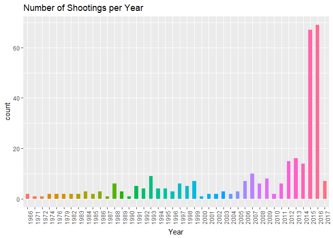

```r
library(RCurl)
library(lubridate)
library(gridExtra)
library(ggplot2)
library(dplyr)
library(formattable)
library(scales)
```


```r
url <- getURL('https://raw.githubusercontent.com/frankwwu/R-Knots/master/US%20Mass%20Shootings/Mass%20Shootings%20Dataset%20Ver%202.csv')
shoot <- read.csv(text = url) 
```


```r
shoot %>% mutate_if(is.factor, as.character) -> shoot
names(shoot) <- sub(" ", ".", names(shoot))
shoot$Month <- factor(month(as.Date(shoot$Date, format = "%m/%d/%Y")))
shoot$Year <- factor(year(as.Date(shoot$Date, format = "%m/%d/%Y")))
str(shoot)
```

```
## 'data.frame':	320 obs. of  15 variables:
##  $ S.                  : int  1 2 3 4 5 6 7 8 9 10 ...
##  $ Title               : chr  "Las Vegas Strip mass shooting" "San Francisco UPS shooting" "Pennsylvania supermarket shooting" "Florida awning manufacturer shooting" ...
##  $ Location            : chr  "Las Vegas, NV" "San Francisco, CA" "Tunkhannock, PA" "Orlando, Florida" ...
##  $ Date                : chr  "10/1/2017" "6/14/2017" "6/7/2017" "6/5/2017" ...
##  $ Summary             : chr  "" "Jimmy Lam, 38, fatally shot three coworkers and wounded two others inside a UPS facility in San Francisco. Lam "| __truncated__ "Randy Stair, a 24-year-old worker at Weis grocery fatally shot three of his fellow employees. He reportedly fir"| __truncated__ "John Robert Neumann, Jr., 45, a former employee of manufacturer Fiamma Inc. fatally shot five workers at the co"| __truncated__ ...
##  $ Fatalities          : int  58 3 3 5 3 3 5 5 3 5 ...
##  $ Injured             : int  527 2 0 0 0 0 6 0 3 11 ...
##  $ Total.victims       : int  585 5 3 5 3 3 11 5 6 16 ...
##  $ Mental.Health.Issues: chr  "Unclear" "Yes" "Unclear" "Unclear" ...
##  $ Race                : chr  "White" "Asian" "White" "" ...
##  $ Gender              : chr  "M" "M" "M" "M" ...
##  $ Latitude            : num  36.2 NA NA NA NA ...
##  $ Longitude           : num  -115 NA NA NA NA ...
##  $ Month               : Factor w/ 12 levels "1","2","3","4",..: 10 6 6 6 5 4 1 9 7 7 ...
##  $ Year                : Factor w/ 42 levels "1966","1971",..: 42 42 42 42 42 42 42 41 41 41 ...
```

```r
shoot[shoot$Mental.Health.Issues=="Unclear",]$Mental.Health.Issues<-"Unknown"
shoot[shoot$Mental.Health.Issues=="unknown",]$Mental.Health.Issues<-"Unknown"
```

## ## Number of Shootings per Year


```r
ggplot(shoot, aes(x = Year)) + 
  geom_bar(aes(fill = Year), width = 0.5) +
  labs(title="Number of Shootings per Year") + 
  theme(legend.position="none", axis.text.x=element_text(angle=90))
```

<!-- -->

## Number of Shootings with Mental Health Issues per Year


```r
ggplot(shoot, aes(x = Year), groupName='Mental.Health.Issues') + 
  geom_bar(aes(fill = Mental.Health.Issues), width = 0.5) +
  labs(title="Number of Shootings with Mental Health Issues per Year") + 
  theme(axis.text.x=element_text(angle=90)) +
  scale_fill_manual (values=c("#0275D2", "#00E699", "#FB008A")) +
  theme(legend.position="bottom")
```

<!-- -->

## Number of Shootings with Mental Health Issues per Month


```r
ggplot(shoot, aes(x = Month), groupName='Mental.Health.Issues') + 
  geom_bar(aes(fill = Mental.Health.Issues), width = 0.5) +
  labs(title="Number of Shootings with Mental Health Issues per Month") +
  scale_fill_manual (values=c("#0275D2", "#00E699", "#FB008A")) +
  theme(legend.position="bottom")
```

<!-- -->


## Top 10 Fatalities Shootings


```r
top10Fatalities <- shoot %>% filter(rank(desc(Fatalities)) <= 10)
top10Fatalities <- top10Fatalities[order(-top10Fatalities$Fatalities),]
formattable(top10Fatalities[ c("Location", "Date", "Fatalities", "Injured", "Total.victims", "Mental.Health.Issues")], list(
  Fatalities = color_bar("coral"),
  Injured = color_bar("springgreen"),
  Total.victims = color_bar("violet"),
  Mental.Health.Issues = formatter("span", style = x ~ ifelse(x == "Yes", style(color = "red", font.weight = "bold"), NA))))
```


<table class="table table-condensed">
 <thead>
  <tr>
   <th style="text-align:left;">   </th>
   <th style="text-align:right;"> Location </th>
   <th style="text-align:right;"> Date </th>
   <th style="text-align:right;"> Fatalities </th>
   <th style="text-align:right;"> Injured </th>
   <th style="text-align:right;"> Total.victims </th>
   <th style="text-align:right;"> Mental.Health.Issues </th>
  </tr>
 </thead>
<tbody>
  <tr>
   <td style="text-align:left;"> 1 </td>
   <td style="text-align:right;"> Las Vegas, NV </td>
   <td style="text-align:right;"> 10/1/2017 </td>
   <td style="text-align:right;"> <span style="display: inline-block; direction: rtl; border-radius: 4px; padding-right: 2px; background-color: coral; width: 100.00%">58</span> </td>
   <td style="text-align:right;"> <span style="display: inline-block; direction: rtl; border-radius: 4px; padding-right: 2px; background-color: springgreen; width: 100.00%">527</span> </td>
   <td style="text-align:right;"> <span style="display: inline-block; direction: rtl; border-radius: 4px; padding-right: 2px; background-color: violet; width: 100.00%">585</span> </td>
   <td style="text-align:right;"> <span>Unknown</span> </td>
  </tr>
  <tr>
   <td style="text-align:left;"> 2 </td>
   <td style="text-align:right;"> Orlando, Florida </td>
   <td style="text-align:right;"> 6/12/2016 </td>
   <td style="text-align:right;"> <span style="display: inline-block; direction: rtl; border-radius: 4px; padding-right: 2px; background-color: coral; width: 84.48%">49</span> </td>
   <td style="text-align:right;"> <span style="display: inline-block; direction: rtl; border-radius: 4px; padding-right: 2px; background-color: springgreen; width: 10.06%">53</span> </td>
   <td style="text-align:right;"> <span style="display: inline-block; direction: rtl; border-radius: 4px; padding-right: 2px; background-color: violet; width: 17.44%">102</span> </td>
   <td style="text-align:right;"> <span>Unknown</span> </td>
  </tr>
  <tr>
   <td style="text-align:left;"> 5 </td>
   <td style="text-align:right;"> Blacksburg, Virginia </td>
   <td style="text-align:right;"> 4/16/2007 </td>
   <td style="text-align:right;"> <span style="display: inline-block; direction: rtl; border-radius: 4px; padding-right: 2px; background-color: coral; width: 55.17%">32</span> </td>
   <td style="text-align:right;"> <span style="display: inline-block; direction: rtl; border-radius: 4px; padding-right: 2px; background-color: springgreen; width: 4.36%">23</span> </td>
   <td style="text-align:right;"> <span style="display: inline-block; direction: rtl; border-radius: 4px; padding-right: 2px; background-color: violet; width: 9.40%">55</span> </td>
   <td style="text-align:right;"> <span style="color: red; font-weight: bold">Yes    </span> </td>
  </tr>
  <tr>
   <td style="text-align:left;"> 4 </td>
   <td style="text-align:right;"> Newtown, Connecticut </td>
   <td style="text-align:right;"> 12/14/2012 </td>
   <td style="text-align:right;"> <span style="display: inline-block; direction: rtl; border-radius: 4px; padding-right: 2px; background-color: coral; width: 48.28%">28</span> </td>
   <td style="text-align:right;"> <span style="display: inline-block; direction: rtl; border-radius: 4px; padding-right: 2px; background-color: springgreen; width: 0.38%">2</span> </td>
   <td style="text-align:right;"> <span style="display: inline-block; direction: rtl; border-radius: 4px; padding-right: 2px; background-color: violet; width: 4.96%">29</span> </td>
   <td style="text-align:right;"> <span style="color: red; font-weight: bold">Yes    </span> </td>
  </tr>
  <tr>
   <td style="text-align:left;"> 7 </td>
   <td style="text-align:right;"> Killeen, Texas </td>
   <td style="text-align:right;"> 10/16/1991 </td>
   <td style="text-align:right;"> <span style="display: inline-block; direction: rtl; border-radius: 4px; padding-right: 2px; background-color: coral; width: 41.38%">24</span> </td>
   <td style="text-align:right;"> <span style="display: inline-block; direction: rtl; border-radius: 4px; padding-right: 2px; background-color: springgreen; width: 3.80%">20</span> </td>
   <td style="text-align:right;"> <span style="display: inline-block; direction: rtl; border-radius: 4px; padding-right: 2px; background-color: violet; width: 7.35%">43</span> </td>
   <td style="text-align:right;"> <span style="color: red; font-weight: bold">Yes    </span> </td>
  </tr>
  <tr>
   <td style="text-align:left;"> 9 </td>
   <td style="text-align:right;"> San Ysidro, California </td>
   <td style="text-align:right;"> 7/18/1984 </td>
   <td style="text-align:right;"> <span style="display: inline-block; direction: rtl; border-radius: 4px; padding-right: 2px; background-color: coral; width: 37.93%">22</span> </td>
   <td style="text-align:right;"> <span style="display: inline-block; direction: rtl; border-radius: 4px; padding-right: 2px; background-color: springgreen; width: 3.61%">19</span> </td>
   <td style="text-align:right;"> <span style="display: inline-block; direction: rtl; border-radius: 4px; padding-right: 2px; background-color: violet; width: 6.84%">40</span> </td>
   <td style="text-align:right;"> <span style="color: red; font-weight: bold">Yes    </span> </td>
  </tr>
  <tr>
   <td style="text-align:left;"> 10 </td>
   <td style="text-align:right;"> Austin, Texas </td>
   <td style="text-align:right;"> 8/1/1966 </td>
   <td style="text-align:right;"> <span style="display: inline-block; direction: rtl; border-radius: 4px; padding-right: 2px; background-color: coral; width: 29.31%">17</span> </td>
   <td style="text-align:right;"> <span style="display: inline-block; direction: rtl; border-radius: 4px; padding-right: 2px; background-color: springgreen; width: 6.07%">32</span> </td>
   <td style="text-align:right;"> <span style="display: inline-block; direction: rtl; border-radius: 4px; padding-right: 2px; background-color: violet; width: 8.21%">48</span> </td>
   <td style="text-align:right;"> <span style="color: red; font-weight: bold">Yes    </span> </td>
  </tr>
  <tr>
   <td style="text-align:left;"> 3 </td>
   <td style="text-align:right;"> San Bernardino, California </td>
   <td style="text-align:right;"> 12/2/2015 </td>
   <td style="text-align:right;"> <span style="display: inline-block; direction: rtl; border-radius: 4px; padding-right: 2px; background-color: coral; width: 27.59%">16</span> </td>
   <td style="text-align:right;"> <span style="display: inline-block; direction: rtl; border-radius: 4px; padding-right: 2px; background-color: springgreen; width: 3.98%">21</span> </td>
   <td style="text-align:right;"> <span style="display: inline-block; direction: rtl; border-radius: 4px; padding-right: 2px; background-color: violet; width: 5.98%">35</span> </td>
   <td style="text-align:right;"> <span>Unknown</span> </td>
  </tr>
  <tr>
   <td style="text-align:left;"> 6 </td>
   <td style="text-align:right;"> Littleton, Colorado </td>
   <td style="text-align:right;"> 4/20/1999 </td>
   <td style="text-align:right;"> <span style="display: inline-block; direction: rtl; border-radius: 4px; padding-right: 2px; background-color: coral; width: 25.86%">15</span> </td>
   <td style="text-align:right;"> <span style="display: inline-block; direction: rtl; border-radius: 4px; padding-right: 2px; background-color: springgreen; width: 4.55%">24</span> </td>
   <td style="text-align:right;"> <span style="display: inline-block; direction: rtl; border-radius: 4px; padding-right: 2px; background-color: violet; width: 6.32%">37</span> </td>
   <td style="text-align:right;"> <span style="color: red; font-weight: bold">Yes    </span> </td>
  </tr>
  <tr>
   <td style="text-align:left;"> 8 </td>
   <td style="text-align:right;"> Edmond, Oklahoma </td>
   <td style="text-align:right;"> 8/20/1986 </td>
   <td style="text-align:right;"> <span style="display: inline-block; direction: rtl; border-radius: 4px; padding-right: 2px; background-color: coral; width: 25.86%">15</span> </td>
   <td style="text-align:right;"> <span style="display: inline-block; direction: rtl; border-radius: 4px; padding-right: 2px; background-color: springgreen; width: 1.14%">6</span> </td>
   <td style="text-align:right;"> <span style="display: inline-block; direction: rtl; border-radius: 4px; padding-right: 2px; background-color: violet; width: 3.42%">20</span> </td>
   <td style="text-align:right;"> <span style="color: red; font-weight: bold">Yes    </span> </td>
  </tr>
</tbody>
</table>


## Top 10 Victims Shootings


```r
top10Total.victims <- shoot %>% filter(rank(desc(Total.victims)) <= 10)
top10Total.victims <- top10Total.victims[order(-top10Total.victims$Total.victim),]
formattable(top10Total.victims[ c("Location", "Date", "Fatalities", "Injured", "Total.victims", "Mental.Health.Issues")], list(
  Fatalities = color_bar("coral"),
  Injured = color_bar("springgreen"),
  Total.victims = color_bar("violet"),
  Mental.Health.Issues = formatter("span", style = x ~ ifelse(x == "Yes", style(color = "red", font.weight = "bold"), NA))))
```


<table class="table table-condensed">
 <thead>
  <tr>
   <th style="text-align:left;">   </th>
   <th style="text-align:right;"> Location </th>
   <th style="text-align:right;"> Date </th>
   <th style="text-align:right;"> Fatalities </th>
   <th style="text-align:right;"> Injured </th>
   <th style="text-align:right;"> Total.victims </th>
   <th style="text-align:right;"> Mental.Health.Issues </th>
  </tr>
 </thead>
<tbody>
  <tr>
   <td style="text-align:left;"> 1 </td>
   <td style="text-align:right;"> Las Vegas, NV </td>
   <td style="text-align:right;"> 10/1/2017 </td>
   <td style="text-align:right;"> <span style="display: inline-block; direction: rtl; border-radius: 4px; padding-right: 2px; background-color: coral; width: 100.00%">58</span> </td>
   <td style="text-align:right;"> <span style="display: inline-block; direction: rtl; border-radius: 4px; padding-right: 2px; background-color: springgreen; width: 100.00%">527</span> </td>
   <td style="text-align:right;"> <span style="display: inline-block; direction: rtl; border-radius: 4px; padding-right: 2px; background-color: violet; width: 100.00%">585</span> </td>
   <td style="text-align:right;"> <span>Unknown</span> </td>
  </tr>
  <tr>
   <td style="text-align:left;"> 2 </td>
   <td style="text-align:right;"> Orlando, Florida </td>
   <td style="text-align:right;"> 6/12/2016 </td>
   <td style="text-align:right;"> <span style="display: inline-block; direction: rtl; border-radius: 4px; padding-right: 2px; background-color: coral; width: 84.48%">49</span> </td>
   <td style="text-align:right;"> <span style="display: inline-block; direction: rtl; border-radius: 4px; padding-right: 2px; background-color: springgreen; width: 10.06%">53</span> </td>
   <td style="text-align:right;"> <span style="display: inline-block; direction: rtl; border-radius: 4px; padding-right: 2px; background-color: violet; width: 17.44%">102</span> </td>
   <td style="text-align:right;"> <span>Unknown</span> </td>
  </tr>
  <tr>
   <td style="text-align:left;"> 3 </td>
   <td style="text-align:right;"> Aurora, Colorado </td>
   <td style="text-align:right;"> 7/20/2012 </td>
   <td style="text-align:right;"> <span style="display: inline-block; direction: rtl; border-radius: 4px; padding-right: 2px; background-color: coral; width: 20.69%">12</span> </td>
   <td style="text-align:right;"> <span style="display: inline-block; direction: rtl; border-radius: 4px; padding-right: 2px; background-color: springgreen; width: 13.28%">70</span> </td>
   <td style="text-align:right;"> <span style="display: inline-block; direction: rtl; border-radius: 4px; padding-right: 2px; background-color: violet; width: 14.02%">82</span> </td>
   <td style="text-align:right;"> <span style="color: red; font-weight: bold">Yes    </span> </td>
  </tr>
  <tr>
   <td style="text-align:left;"> 5 </td>
   <td style="text-align:right;"> Blacksburg, Virginia </td>
   <td style="text-align:right;"> 4/16/2007 </td>
   <td style="text-align:right;"> <span style="display: inline-block; direction: rtl; border-radius: 4px; padding-right: 2px; background-color: coral; width: 55.17%">32</span> </td>
   <td style="text-align:right;"> <span style="display: inline-block; direction: rtl; border-radius: 4px; padding-right: 2px; background-color: springgreen; width: 4.36%">23</span> </td>
   <td style="text-align:right;"> <span style="display: inline-block; direction: rtl; border-radius: 4px; padding-right: 2px; background-color: violet; width: 9.40%">55</span> </td>
   <td style="text-align:right;"> <span style="color: red; font-weight: bold">Yes    </span> </td>
  </tr>
  <tr>
   <td style="text-align:left;"> 9 </td>
   <td style="text-align:right;"> Austin, Texas </td>
   <td style="text-align:right;"> 8/1/1966 </td>
   <td style="text-align:right;"> <span style="display: inline-block; direction: rtl; border-radius: 4px; padding-right: 2px; background-color: coral; width: 29.31%">17</span> </td>
   <td style="text-align:right;"> <span style="display: inline-block; direction: rtl; border-radius: 4px; padding-right: 2px; background-color: springgreen; width: 6.07%">32</span> </td>
   <td style="text-align:right;"> <span style="display: inline-block; direction: rtl; border-radius: 4px; padding-right: 2px; background-color: violet; width: 8.21%">48</span> </td>
   <td style="text-align:right;"> <span style="color: red; font-weight: bold">Yes    </span> </td>
  </tr>
  <tr>
   <td style="text-align:left;"> 4 </td>
   <td style="text-align:right;"> Fort Hood, Texas </td>
   <td style="text-align:right;"> 11/5/2009 </td>
   <td style="text-align:right;"> <span style="display: inline-block; direction: rtl; border-radius: 4px; padding-right: 2px; background-color: coral; width: 22.41%">13</span> </td>
   <td style="text-align:right;"> <span style="display: inline-block; direction: rtl; border-radius: 4px; padding-right: 2px; background-color: springgreen; width: 6.07%">32</span> </td>
   <td style="text-align:right;"> <span style="display: inline-block; direction: rtl; border-radius: 4px; padding-right: 2px; background-color: violet; width: 7.69%">45</span> </td>
   <td style="text-align:right;"> <span style="color: red; font-weight: bold">Yes    </span> </td>
  </tr>
  <tr>
   <td style="text-align:left;"> 7 </td>
   <td style="text-align:right;"> Killeen, Texas </td>
   <td style="text-align:right;"> 10/16/1991 </td>
   <td style="text-align:right;"> <span style="display: inline-block; direction: rtl; border-radius: 4px; padding-right: 2px; background-color: coral; width: 41.38%">24</span> </td>
   <td style="text-align:right;"> <span style="display: inline-block; direction: rtl; border-radius: 4px; padding-right: 2px; background-color: springgreen; width: 3.80%">20</span> </td>
   <td style="text-align:right;"> <span style="display: inline-block; direction: rtl; border-radius: 4px; padding-right: 2px; background-color: violet; width: 7.35%">43</span> </td>
   <td style="text-align:right;"> <span style="color: red; font-weight: bold">Yes    </span> </td>
  </tr>
  <tr>
   <td style="text-align:left;"> 8 </td>
   <td style="text-align:right;"> San Ysidro, California </td>
   <td style="text-align:right;"> 7/18/1984 </td>
   <td style="text-align:right;"> <span style="display: inline-block; direction: rtl; border-radius: 4px; padding-right: 2px; background-color: coral; width: 37.93%">22</span> </td>
   <td style="text-align:right;"> <span style="display: inline-block; direction: rtl; border-radius: 4px; padding-right: 2px; background-color: springgreen; width: 3.61%">19</span> </td>
   <td style="text-align:right;"> <span style="display: inline-block; direction: rtl; border-radius: 4px; padding-right: 2px; background-color: violet; width: 6.84%">40</span> </td>
   <td style="text-align:right;"> <span style="color: red; font-weight: bold">Yes    </span> </td>
  </tr>
  <tr>
   <td style="text-align:left;"> 6 </td>
   <td style="text-align:right;"> Littleton, Colorado </td>
   <td style="text-align:right;"> 4/20/1999 </td>
   <td style="text-align:right;"> <span style="display: inline-block; direction: rtl; border-radius: 4px; padding-right: 2px; background-color: coral; width: 25.86%">15</span> </td>
   <td style="text-align:right;"> <span style="display: inline-block; direction: rtl; border-radius: 4px; padding-right: 2px; background-color: springgreen; width: 4.55%">24</span> </td>
   <td style="text-align:right;"> <span style="display: inline-block; direction: rtl; border-radius: 4px; padding-right: 2px; background-color: violet; width: 6.32%">37</span> </td>
   <td style="text-align:right;"> <span style="color: red; font-weight: bold">Yes    </span> </td>
  </tr>
</tbody>
</table>


