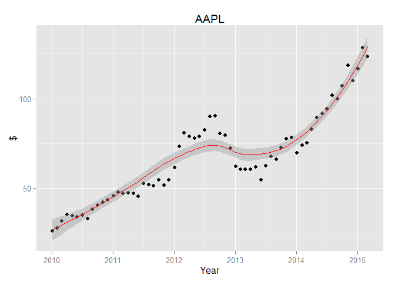

    library(ggplot2)
    uri <- "http://ichart.finance.yahoo.com/table.csv?s=AAPL&a=0&b=2&c=2010&d=0&e=2&f=2020&g=m"
    df <- read.csv(uri)

    #convert the 'Date' from a string to a Date type
    df$Date <- as.Date(df$Date, "%Y-%m-%d")

    fit <- lm(df$Date ~ df$Adj.Close, data = df)

    ggplot(fit$model, aes_string(x = names(fit$model)[1], y = names(fit$model)[2])) +
      geom_point() + 
      labs(x="Year",y="$") + 
      ggtitle("AAPL") +
      stat_smooth(method = "loess", col = "red")

