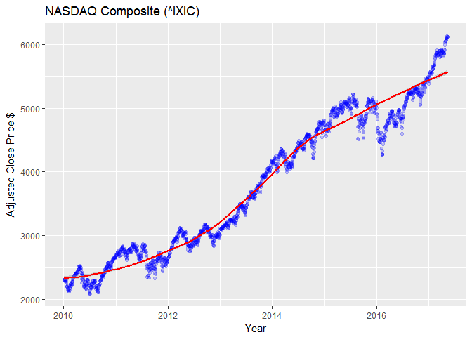
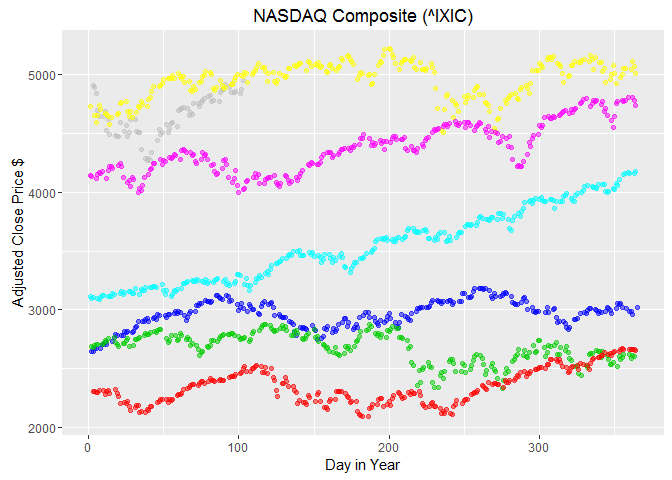

# Yahoo Quote


```r
library(lubridate)
library(ggplot2)
```


```r
uri <- "http://ichart.finance.yahoo.com/table.csv?s=^ixic&a=0&b=2&c=2010&d=0&e=2&f=2020&g=d"
df <- read.csv(uri)

head(df)
```

```
##         Date    Open    High     Low   Close     Volume Adj.Close
## 1 2016-04-13 4904.79 4951.91 4903.60 4947.42 1936450000   4947.42
## 2 2016-04-12 4838.82 4879.60 4808.91 4872.09 1759280000   4872.09
## 3 2016-04-11 4873.39 4897.55 4833.40 4833.40 1545540000   4833.40
## 4 2016-04-08 4883.99 4892.60 4835.36 4850.69 1588830000   4850.69
## 5 2016-04-07 4893.57 4901.49 4831.49 4848.37 1908940000   4848.37
## 6 2016-04-06 4849.58 4921.51 4849.28 4920.72 1761770000   4920.72
```

```r
#convert the 'Date' from a string to a Date type
df$Date <- as.Date(df$Date, "%Y-%m-%d")

fit <- lm(df$Date ~ df$Adj.Close, data = df)

ggplot(fit$model, aes_string(x = names(fit$model)[1], y = names(fit$model)[2])) +
  geom_point(color = 'blue', alpha = 0.2) + 
  labs(x="Year",y="Adjusted Close Price $") + 
  ggtitle("NASDAQ Composite (^IXIC)") +
  stat_smooth(method = "loess", col = "red")
```



```r
df$Year <- year(df$Date)
ggplot(data=df, aes(x=as.POSIXlt(Date, format="%d-%m-%Y")$yday, y=Adj.Close)) +
  geom_point(color = df$Year, alpha = 0.5) + 
  labs(x="Day in Year",y="Adjusted Close Price $") + 
  ggtitle("NASDAQ Composite (^IXIC)")
```


