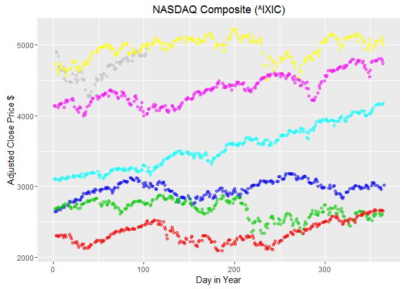

# Yahoo Quote


```r
library(lubridate)
library(ggplot2)
```


```r
uri <- "http://ichart.finance.yahoo.com/table.csv?s=^ixic&a=0&b=2&c=2010&d=0&e=2&f=2020&g=d"
df <- read.csv(uri)

head(df)
```

```
##         Date    Open    High     Low   Close     Volume Adj.Close
## 1 2017-05-12 6119.27 6122.84 6105.42 6121.23 1740960000   6121.23
## 2 2017-05-11 6110.05 6120.20 6075.68 6115.96 1950910000   6115.96
## 3 2017-05-10 6121.64 6131.64 6103.87 6129.14 2108000000   6129.14
## 4 2017-05-09 6111.82 6133.00 6107.59 6120.59 1997490000   6120.59
## 5 2017-05-08 6100.66 6106.12 6083.06 6102.66 1909710000   6102.66
## 6 2017-05-05 6091.69 6100.76 6067.16 6100.76 1899570000   6100.76
```

```r
#convert the 'Date' from a string to a Date type
df$Date <- as.Date(df$Date, "%Y-%m-%d")

fit <- lm(df$Date ~ df$Adj.Close, data = df)

ggplot(fit$model, aes_string(x = names(fit$model)[1], y = names(fit$model)[2])) +
  geom_point(color = 'blue', alpha = 0.2) + 
  labs(x="Year",y="Adjusted Close Price $") + 
  ggtitle("NASDAQ Composite (^IXIC)") +
  stat_smooth(method = "loess", col = "red")
```

<!-- -->

```r
df$Year <- year(df$Date)
ggplot(data=df, aes(x=as.POSIXlt(Date, format="%d-%m-%Y")$yday, y=Adj.Close)) +
  geom_point(color = df$Year, alpha = 0.5) + 
  labs(x="Day in Year",y="Adjusted Close Price $") + 
  ggtitle("NASDAQ Composite (^IXIC)")
```

<!-- -->
